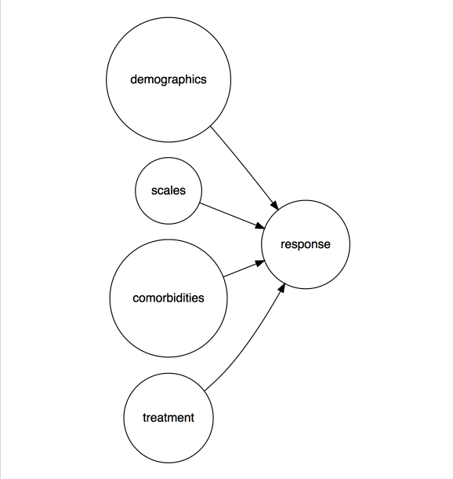

```{r setup, include=FALSE}

library(mosaic)
library(readr)
#library(stringr)
#library(ggvis)
#library(pander)
#library(purrr)
library(broom)
library(psych)
library(caret)
#library(ggstance)
library(knitr)
library(gridExtra)
library(tibble)
#library(corrplot)
library(GGally)
#library(plotly)
library(tidyr)
#library(gridExtra)
#library(DiagrammeR)
library(DT)
library(dplyr)
library(ggplot2)


knitr::opts_chunk$set(echo = FALSE, cache = TRUE, warning = FALSE, message = FALSE)


# define paths
path_data <- "~/Documents/OneDrive/Forschung/Online_Behavior_Therapy/raw_data"
path_file_data <- "~/Documents/OneDrive/Forschung/Online_Behavior_Therapy/raw_data/BiPOCD_raw_data.csv"
path_code <- "~/Documents/OneDrive/Forschung/Online_Behavior_Therapy/R_code"
path_figs <- "~/Documents/OneDrive/Forschung/Online_Behavior_Therapy/figs"
path_obj <- "~/Documents/OneDrive/Forschung/Online_Behavior_Therapy/data_objects"

# load data
data <- read_csv(path_file_data)


# constants
red1 <- "#880011"

```


```{r prep_data}


# some important sub data sets

search_string <- "sum"
data %>% 
  select(matches("sum")) -> data_sumscores


data %>% 
  mutate(responder_3m_f = factor(responder_3m)) -> data

data$responder_3m_f <- relevel(data$responder_3m_f, ref = "1")


data_sumscores$responder_3m_f <- data$responder_3m_f
data_sumscores$CYBOCS_3m <- data$CYBOCS_3m


data %>%
  nearZeroVar(., saveMetrics = TRUE) %>%
  tibble::rownames_to_column() %>%
  filter(nzv == TRUE) -> data_nzv

nzv_vars <- data_nzv$rowname


data %>%
  select(Depression:GAD, responder_3m, responder_3m_f) %>%
  select(-one_of(nzv_vars)) %>%
  na.omit -> data_comorb


data %>%
  select_if(negate(is.numeric)) -> data_numeric

```


```{r funs, cache = FALSE}


gg_geom <- function(name, dat, geom = geom_density, flip = FALSE, ...) {
  p <- ggplot(dat, aes_string(x = name)) + geom() + ggtitle(name)
  if (flip == TRUE) p <- p + coord_flip() 
  return(p)
}  


add_na_col <- function(x){
  mutate(x, na = 0)
}

has_n_col <- function(x, n = 6){
  return(ncol(x) == n)
}


tally_OR <- function(x, data = data_comorb){
  tab <- mosaic::tally(x ~ responder_3m_f, data = data_comorb)
  oddsRatio(tab)
}


tally_RR <- function(x, data = data_comorb){
  tab <- mosaic::tally(x ~ responder_3m_f, data = data_comorb)
  relrisk(tab)
}

tally_fun <- function(x, data = data_comorb, fun = fun){
  tab <- mosaic::tally(x ~ responder_3m_f, data = data_comorb)
  fun(tab)
}


```


# First glimpse

```{r}
datatable(data)
```


# Overviews
## Summaries of quantitative variables

```{r datatable_quant_vars}


data %>%
  select_if(is.numeric)  %>%
  lapply(., function(x) tidy(summary(x))) %>%   # compute tidy summary of each var
  map_if(., has_n_col, add_na_col) %>%   # add na-col if missing
  do.call(rbind, .) -> sum_num  # bind list elements into df

datatable(sum_num)

```


## Histograms of quantitative variables

```{r histograms_numeric, cache = TRUE, fig.height = 100}
data %>%
  select_if(is.numeric) %>%
  gather(key = variable, value = value) %>%
  ggplot(aes(x = value)) +
  geom_histogram() +
  facet_wrap(~variable, scales = "free", ncol = 4)


```


## Histogram of non-numeric variables

```{r nonnum_hist, cache = TRUE, fig.height = 3}

lapply(names(data_numeric), function(x) gg_geom(x, data_numeric, geom_bar, flip = TRUE))
```


## Check for (near) zero variance (nz/nzv) variables

Predictors without (much) variance do not add to the model. Better exclude them, at least know them.

```{r check_nzv}
# data %>%
#   select(-ID) %>%
#   nearZeroVar(., saveMetrics = TRUE) 

datatable(data_nzv)

```


___

The variables with near zero variance are `r nzv_vars`.

___


## Check for highly correlated variables
Highly correlated (>.90) do not provide more information, better exclude them.

```{r check_highcorr}

data %>%
  select_if(is.numeric) %>%
  cor -> data_cor

highCorr <- sum(abs(data_cor[upper.tri(data_cor)]) > .90)
highCorr
```

No variables are highly correlated (>.90) in this dataset.


## Missing values

```{r check_NA}
sum_num %>%
  select(na) %>%
  rownames_to_column %>%
  filter(na != 0) %>% 
  ggplot(aes(x  = rowname, y = na, label = na)) + 
    geom_bar(stat = "identity") +
    coord_flip() +
    ggtitle("Number of missing values per variable") 

```


## Checking Scale quality

Scale quality involves aspects as intercorrelation of items of a scale, internal consisteny, score distribution, and the like. Let's see.


### Univariate distributions of sum scores

Let's check the distribution for the sum scores variables (which are: `r names(data_sumscores)`.

```{r sum_scores, fig.height = 2}
data_sumscores %>% select_if(is.numeric) %>% na.omit -> dummy
lapply(names(dummy), function(x) gg_geom(x, dummy, geom_density))
```

### Correlation of comorbidity


If one suffers from one comorbidity, does he/she suffer (in general) from other comorbidities too? NZV variables are excluded.

```{r corrplot_comorb, cache = TRUE, fig.height = 6}


data %>%
select(Depression:GAD) %>%
select(-one_of(nzv_vars)) %>%
cor -> cor_comorb

corrplot(cor_comorb)


```


We should do this more stringently, but let's start with a brief look to the items of `ChOCI`, to see whether they are correlated (as they should be, at least for common subscale-items). Those are quite a few.

```{r corrplot_ChOCI, fig.height = 20, out.height = 20, cache = TRUE}

data %>%
  dplyr::select(dplyr::contains("ChOCI")) %>%
  select(-one_of(nzv_vars)) %>%
  cor %>%
  corrplot

```


### ChOCI R C


```{r, warning = FALSE}
search_string <- "ChOCI_R_C"
search_string2 <- "sum"

data %>%
  dplyr::select(dplyr::matches(search_string), -dplyr::matches(search_string2)) -> ChOCI_items

print(psych::alpha(data.frame(ChOCI_items), check.keys = TRUE))

```


___

One item was **negatively** correlated with the scale (`ChOCI_R_C_26_PRE-`). It should be checked.

___


### ChOCI R P


```{r, warning = FALSE}
search_string <- "ChOCI_R_P"
search_string2 <- "sum"

data %>%
  dplyr::select(dplyr::matches(search_string), -dplyr::matches(search_string2)) -> ChOCI_items_2

print(psych::alpha(data.frame(ChOCI_items_2), check.keys = TRUE))

```


### CYBOCS


```{r}
search_string <- "CYBOCS"
search_string2 <- "sum"
data %>%
  dplyr::select(dplyr::matches(search_string), -matches(search_string2)) -> cybocs_items

print(psych::alpha(data.frame(cybocs_items), check.keys = TRUE))

```

___

Alpha is at borderline (low). `CYBOCS_3m` appears to misfit. Maybe it is  a dependent variable??? That would explain the result.

___

### EWSASC


```{r}
search_string <- "EWSASC"
search_string2 <- "sum"

data %>%
  dplyr::select(EWSASC_schoolandwork_PRE:EWSASC_family_PRE) -> EWSASC_items

psych::alpha(data.frame(EWSASC_items))

```

Good.

### SCAS


```{r}
search_string <- "SCAS"
search_string2 <- "sum"

data %>%
  dplyr::select(matches(search_string), -matches(search_string2)) -> SCAS_items
  psych::alpha(data.frame(SCAS_items))

```


### CDI

```{r}
search_string <- "CDI"
search_string2 <- "sum"

data %>%
  dplyr::select(matches(search_string), -matches(search_string2)) -> CDI_items
  psych::alpha(data.frame(CDI_items))

```


### FAS


```{r}
search_string <- "FAS"
search_string2 <- "sum"

data %>%
  dplyr::select(matches(search_string), -matches(search_string2)) -> FAS_items
  psych::alpha(data.frame(FAS_items))

```


### EWSAP


```{r}
search_string <- "EWSASP"
search_string2 <- "sum"

data %>%
  dplyr::select(matches(search_string), -matches(search_string2)) -> EWSASP_items
  psych::alpha(data.frame(EWSASP_items))

```


# Bivariate assocations

## Assocations of ChOCI sum scores and treatment response

```{r ggpairs_ChOCI, fig.height = 15, cache = TRUE}
data %>% 
  dplyr::select(dplyr::matches("ChOCI_._._sum"), responder_3m) %>% 
  na.omit() %>% 
  mutate(responder_3m = factor(responder_3m)) %>% 
  ggpairs(mapping = aes(color = responder_3m))
```


## Associations with treatment response

### Comorbidity as predictors


```{r OR_RR}

comorb_OR <-
  lapply(select(data_comorb, -responder_3m),
         function(x) tally_OR(x))

comorb_RR <-
  lapply(select(data_comorb, - responder_3m),
         function(x) tally_RR(x))


OR_comorb_df <- data_frame(ID = 1:8)
OR_comorb_df$names_comorb <- names(data_comorb)[-8]
OR_comorb_df$OR_comorb <- unlist(lapply(comorb_OR, function(x) round(x, 2)))

RR_comorb_df <- data_frame(ID = 1:8)
RR_comorb_df$names_comorb <- names(data_comorb)[-8]
RR_comorb_df$RR_comorb <- unlist(lapply(comorb_RR, function(x) round(x, 2)))
```

The (non-nzv) comorbities are: `r names(data_comorb)[-8]`. The Odds ratios of the comorbities with the outcome variable are: `r lapply(comorb_OR, function(x) round(x, 2))`. The odds are computed in favor of treatment success.

### Odds Ratio comorbidity

```{r}
datatable(OR_comorb_df)
```


### Relative Risks Comorbidity

The relative risks of the comorbities with the outcome variable are: `r sort(unlist(lapply(comorb_RR, function(x) round(x, 2))))`. Relativs Risks are also computed in favor of success (so, they depict rather relative protectino probabilities).


```{r}
datatable(RR_comorb_df)
```


### OR/RR plots

```{r OR_RR_plots}

# relative risks:
comorb_RR_df <- data_frame(comorb_diag = names(comorb_RR),
                           RelRisk = unlist(comorb_RR))


comorb_RR_df %>%
  ggplot(aes(x = reorder(comorb_diag, RelRisk), y = RelRisk)) + geom_point() +
  coord_flip() +
  ggtitle("Relative Risks of comorbity diagnoses") 


# odds ratios:
comorb_OR_df <- data_frame(comorb_diag = names(comorb_OR),
                           OR = unlist(comorb_OR))

comorb_OR_df %>%
  ggplot(aes(x = reorder(comorb_diag, OR), y = OR)) + geom_point() +
  coord_flip() +
  ggtitle("Odds Ratio of comorbity diagnoses") 
```


### Contingency tables for comorbidity with outcome (dichotomous)
Let's plot the assocation of the comorbitity with the outcome var `responder_3m`. To that end, let's tabulate the the 2x2 matrices (contingency matrices) for each comorbidity (yes/no) vs. responder (yes/no). For convenience, proportions (%) are depicted.

```{r mosaicplot_comorb}

for (i in seq_along(names(data_comorb))){
  my_tab <- prop.table(table(data_comorb[[i]], data_comorb$responder_3m_f))
  my_tab <- round(my_tab, 2)
  comorb <- names(data_comorb)[i]
  print(comorb)
  print(my_tab)
  mosaicplot(my_tab, ylab = comorb, xlab = "responder_3m_F")
}

```


### Overall number of responders


```{r plotly1}


data %>%
  ggplot(aes(x = responder_3m_f)) + geom_bar() +
  geom_text(stat = "count", aes(label = ..count..), vjust = -1) 


```


### Number of responders per comorbidity

Let's divide that up for each comorbidity, and plot it:

```{r responder_comorb}
data %>%
  select(Depression:GAD, responder_3m_f) %>%
  gather(key = comorb, value = comorb_status, -responder_3m_f) %>% 
  group_by(comorb, responder_3m_f, comorb_status) %>% 
  summarise(count = n()) %>% 
  ggplot(aes(x = comorb, y = count, fill = factor(comorb_status))) + geom_bar(stat = "identity") +
  facet_wrap(~responder_3m_f) +
  coord_flip() +
  ggtitle("Break up of responder (yes=1/no=0) by comorbidity") +
  theme(legend.position = "bottom")

```

___

Some differences in the joint distribution of comorbidities and response appear.

Quite a few NAs.

___


Let's look at it from some other perspective, different code, and plot it again, and see what happens:

```{r responder_cormorb2}

data %>%
  select(Depression:GAD, responder_3m) %>%
  transform(responder_3m = factor(responder_3m)) %>%
  gather(key = comorb, value = comorb_status, -responder_3m) %>%
  group_by(comorb, comorb_status, responder_3m) %>%
  summarise(n = n()) %>%
  ggplot(aes(x = responder_3m, fill = factor(comorb_status), y = n)) + geom_bar(stat = "identity") +
  facet_wrap(~comorb) +
  coord_flip() +
  theme(legend.position = "bottom")
```


And what it about if we eyeball the plain number? The table shows the frequencies for treatment success/failure  as a contigency of comorbidity.

```{r responder_comorb_numbers}
data %>%
  select(Depression:GAD, responder_3m) %>%
  transform(responder_3m = factor(responder_3m)) %>%
  gather(key, value, -responder_3m) %>%
  group_by(key, value, responder_3m) %>%
  summarise(n = n()) %>%
  kable
```


### First order correlations of sumscores with outcome

Let's see which predictor variables (of the sum scores) correlate most strongly with the outcome.

```{r}
data_sumscores %>% 
  select_if(is.numeric) %>% 
  na.omit %>% 
  cor() %>% 
  tidy %>% 
  transmute(Predictor = .rownames,
           CYBOCS_3m = round(CYBOCS_3m, 2)) %>% 
  arrange(desc(CYBOCS_3m, 2)) %>% 
  kable

```


Ok, that's quite a range in strength of assocation.


Let's visualize the correlations of the sumscores (of the psychometric scales) with the outcome variable.

```{r ggpairs_sumscores, cache = TRUE, fig.height = 12, fig.width = 12}


ppcor <- ggpairs(na.omit(data_sumscores), 
                 axisLabels='internal', 
                 columns = 1:11, 
                 color = "responder_3m_f",
                 upper = list(continuous = wrap("cor")), 
                 lower = list(
                   combo = "facetdensity",
                   mapping = ggplot2::aes(color = responder_3m_f)))

ppcor + theme_grey(base_size = 3)
```


# Most important variables (narrow data set)

## Type of most important variables

Let's focus on the most important variables, to make life easier.

That should be all sum scores. Let's look for them:

```{r}

search_string <- "sum"
data %>%
  dplyr::select(matches(search_string)) %>%
  do(tidy(names(.))) -> names_sumscores

```

Ok, the variables are `r names_sumscores$x`. In total, `r nrow(names_sumscores)` variables.

We can probably safely ignore `ID`. We should include basic and demographic variables:

```{r}
data %>%
  dplyr::select(group:OCD_treatm_exp, responder_3m, CYBOCS_3m) %>%
  do(tidy(names(.))) -> names_basic
```

Which gives us `r names_basic$x`, another `r nrow(names_basic)` variables.

Of particular interest are of course `responder_3m`, `CYBOCS_3m` (outcomes) and `group` (experimental factor).

Next, let's name the comorbidities.

```{r}
data %>%
select(Depression:GAD) %>%
do(tidy(names(.))) -> names_comorb
```

These are `r names_comorb$x`.

In total, 3 sets of variables then: basic variables (including outcome and experimental variables), sum scores of psychometric battery, and comorbidity.

```{r}
vars_short <- unname(unlist(c(names_basic, names_sumscores, names_comorb)))
```

In total, `r length(vars_short)` Variables: `r vars_short`.


## Coarse model

Vague defined, the model can be described as consisting of these predictors: demographics, psychometric scales, treatment (group), comorbities. The outcome is treatment response.

```{r}
# 

```


```{r}
grViz("
digraph test {

# a 'graph' statement
graph [overlap = true,
rankdir = LR,
fontsize = 10]

# several 'node' statements
node [shape = circle,
fontname = Helvetica]
demographics; scales; comorbidities; response


# several 'edge' statements
demographics -> response
scales -> response
comorbidities -> response

}
")

 #coarse_model
```


## Missing values and sum scores
When tallying up sum scores, missing values cause problems. Assume 10 items to summed up. What if I have not responded to 9 items? If you count "zero" for the missing values, you will dramatically underestimate my true score. I wonder how the sum scores have been built here.


### ChOCI scale (self-rated comorbidity)

The most items appear in the `ChOCI` scale. So let's look there first.


```{r}
search_string <- "ChOCI"
data %>%
  select(matches(search_string)) %>%
  summarise_all(funs(sum(is.na(.)))) %>%
  gather(item, n_na) %>%
  datatable

```


Ok, good, no missings. Have they been replaced somehow? Where the participants forced to give some answer? This might be of interest for gauging the psychometric quality of the scale.


### CYBOCS OCD symptoms


```{r}
search_string <- "CYBOCS"
data %>%
  select(matches(search_string)) %>%
  summarise_all(funs(sum(is.na(.)))) %>%
  gather(item, n_na) %>%
  kable
```


Hm, here we find some missing values. So what was done to prevent bias here? We should follow up on that.


### EWSASC (functioning)

Same procedure...

```{r}
search_string <- "EWSASC"
data %>%
  select(matches(search_string)) %>%
  summarise_all(funs(sum(is.na(.)))) %>%
  gather(item, n_na) %>%
  kable

```

Ok, no NA's.


### SCAS (Anxiety)

```{r}
search_string <- "SCAS"
data %>%
select(matches(search_string)) %>%
summarise_all(funs(sum(is.na(.)))) %>%
gather(item, n_na) %>%
kable

```

No NA's.


### CDI (Depression)


```{r}
search_string <- "CDI"
data %>%
  select(matches(search_string)) %>%
  summarise_all(funs(sum(is.na(.)))) %>%
  gather(item, n_na) %>%
  kable
```

No NA's.


### FAS (family accomodation)

```{r}

search_string <- "FAS"
data %>%
select(matches(search_string)) %>%
summarise_all(funs(sum(is.na(.)))) %>%
gather(item, n_na) %>%
kable
```

No NA's.

### EWSASP (functioning, 2nd scale)

```{r}


search_string <- "EWSASP"
data %>%
  select(matches(search_string)) %>%
  summarise_all(funs(sum(is.na(.)))) %>%
  gather(item, n_na) %>%
  kable
```

No NA's.


### SCAS (Anxiety)


```{r}


search_string <- "SCAS"
data %>%
select(matches(search_string)) %>%
summarise_all(funs(sum(is.na(.)))) %>%
gather(item, n_na) %>%
kable
```


No NA's.


# Interocular Trauma Test

## Outcome: responder_3m

Before applying some sophisticated (aka esoteric) models, let's perform the _intraocular trauma test_ for the data: let's see whether the effect is so crisp that it hits us right between the eyes. That is., is there an association between group and response?


Because for the fun of it (and because the question if of particular interest), let's plot from different point of views.

Stapled bars:
```{r trauma_test_1}

data %>%
  select(group, responder_3m) %>%
  mutate(responder_3m = factor(responder_3m)) %>%
  group_by(group, responder_3m) %>%
  summarise(n = n()) %>%
  ggplot(aes(x = group, y = n, fill = responder_3m)) + geom_bar(stat = "identity") 

#(ggplotly(p1, session = "knitr"))

```


facetted bars:
```{r trauma_fig2}
data %>%
  select(group, responder_3m) %>%
  mutate(responder_3m = factor(responder_3m)) %>%
  group_by(group, responder_3m) %>%
  summarise(n = n()) %>%
  ggplot(aes(x = group, y = n)) + geom_bar(stat = "identity")  +
  facet_wrap(~responder_3m) 

# (ggplotly(p2))

```


proportion bars (stapled):
```{r trauma_fig3}

data %>%
  select(group, responder_3m) %>%
  mutate(responder_3m = factor(responder_3m)) %>%
  group_by(group, responder_3m) %>%
  summarise(n = n()) %>%
  ggplot(aes(x = group, y = n, fill = responder_3m)) + geom_bar(stat = "identity", position = "fill") 


```


Hm, it appears as if the experimental group was less successful than the control group. That result might hit us between the eyes... But one would certainly hope for something the other way round.

The bare numbers:

```{r}
data %>%
select(group, responder_3m) %>%
mutate(responder_3m = factor(responder_3m)) %>%
group_by(group, responder_3m) %>%
summarise(n = n()) %>%
kable
```


## Outcome: CYBOCS_3m

```{r trauma_test_2}

data %>%
  dplyr::select(group, CYBOCS_3m) %>%
  na.omit() %>%
  ggplot(aes(x = group, y = CYBOCS_3m))  +
  geom_boxplot() +
  geom_jitter(width = .1) +
  stat_summary(fun.y = "mean", geom = "point", size = 6, color = "red") 


data %>%
  dplyr::select(group, CYBOCS_3m) %>%
  na.omit() %>%
  ggplot(aes(fill = group, x = CYBOCS_3m, color = group))  +
  geom_density(alpha = .5)


```


For this outcome, it seems as if there was some (slight?) advantage for the treatment group. However, the overlap is substantial.

Here come the bare figures:

```{r}
data %>%
dplyr::select(group, CYBOCS_3m, -one_of(nzv_vars)) %>%
na.omit() %>%
group_by(group) %>%
summarise(group_mean = mean(CYBOCS_3m),
group_md = median(CYBOCS_3m),
group_sd = sd(CYBOCS_3m),
group_IQR = IQR(CYBOCS_3m)) %>%
kable
```


