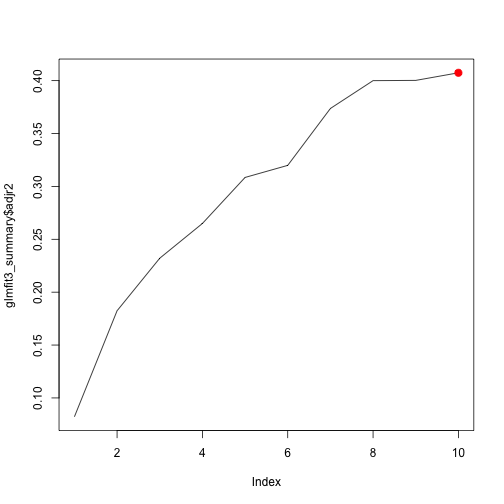
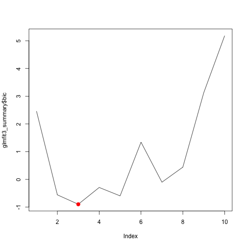
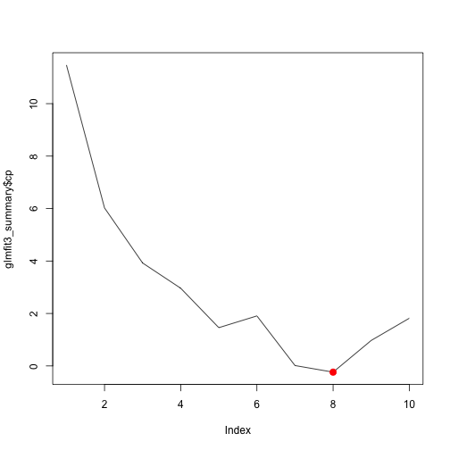

# Modeling BiPOCD


Project Directory is:

```
## [1] "/Users/sebastiansauer/Documents/OneDrive/Forschung/Online_Behavior_Therapy"
```


# classification (dichotomous)

As we have two outcomes, one dichotomous and one metric, we can both do classification and regression. Let's look at classification first.


Before I forget: we need to exclude the metric outcome variable `CYBOCS_3m`.


```
## CYBOCS_3m has been excluded from the data set
```

Numer of columns in `data_class`: 34.


```
## Class of DV:
##  Factor w/ 2 levels "0","1": 1 2 2 2 2 2 1 1 2 1 ...
## NULL
##  Factor w/ 2 levels "0","1": 1 2 2 2 2 1 1 1 1 2 ...
## NULL
##  Factor w/ 2 levels "0","1": 2 2 1 2 2 1 1 1 1 1
## NULL
## CYBOCS_3m is NOT in test sample
## done
```


## LM

Let's fit a linear logistic model. The model showed some problems with factor variables that have sparsely populated levels. Additionally, the ratio of variables to observations is not really nice. We probably will not arrive anywhere with this model.


```
## 
## Call:
## NULL
## 
## Deviance Residuals: 
##        Min          1Q      Median          3Q         Max  
## -6.433e-06  -3.649e-06  -2.110e-08   3.688e-06   6.682e-06  
## 
## Coefficients:
##                          Estimate Std. Error z value Pr(>|z|)
## (Intercept)            -1.745e+02  2.487e+06       0        1
## CYBOCS_pre_OBS          1.532e+01  6.914e+04       0        1
## CYBOCS_pre_COMP         1.015e-01  8.972e+04       0        1
## CYBOCS_pre_insight      1.738e+00  1.795e+05       0        1
## CYBOCS_pre_avoid        2.970e+00  2.466e+05       0        1
## ChOCI_R_C_sumsym_PRE   -6.577e+00  5.293e+04       0        1
## ChOCI_R_C_sumimp_PRE    5.829e+00  3.053e+04       0        1
## EWSASC_sum_PRE          5.494e-02  3.372e+04       0        1
## SCAS_S_C_sum_PRE        8.156e+00  1.021e+05       0        1
## CDI_S_sum_PRE          -6.676e+00  5.791e+04       0        1
## ChOCI_R_P_sumsym_PRE   -6.049e+00  1.320e+05       0        1
## ChOCI_R_P_sumimp_PRE   -6.591e-01  2.380e+04       0        1
## FAS_PR_sum_PRE         -4.923e+00  9.085e+04       0        1
## EWSASP_sum_PRE          5.441e-01  9.163e+04       0        1
## SCAS_S_P_sum_PRE        6.559e+00  5.903e+04       0        1
## Depression             -4.764e+02  1.012e+07       0        1
## PanicDisorder           1.224e+02  4.966e+06       0        1
## SocialPhob              1.406e+02  2.859e+06       0        1
## SpecificPhob           -2.531e+02  3.336e+06       0        1
## TourettesTics           2.150e+01  1.988e+06       0        1
## ADHD                    1.639e+01  9.842e+05       0        1
## GAD                     4.197e+01  1.378e+06       0        1
## numberdiagnos           2.603e+01  6.831e+05       0        1
## sexgirl                -3.927e+01  1.197e+06       0        1
## age                     1.051e+01  2.287e+05       0        1
## `contactSelf-referral` -4.887e+01  1.574e+06       0        1
## distance                3.502e-01  4.506e+03       0        1
## medication_yesno        5.936e+01  8.197e+05       0        1
## CGI_S_pre              -6.987e+01  1.012e+06       0        1
## checking               -4.608e+01  5.744e+05       0        1
## obsessions             -5.722e+01  7.011e+05       0        1
## contamination           7.702e+01  9.206e+05       0        1
## symmetry                1.215e+02  5.815e+05       0        1
## ID                     -5.026e-01  9.651e+03       0        1
## 
## (Dispersion parameter for binomial family taken to be 1)
## 
##     Null deviance: 5.6227e+01  on 40  degrees of freedom
## Residual deviance: 6.7156e-10  on  7  degrees of freedom
## AIC: 68
## 
## Number of Fisher Scoring iterations: 25
```

```
## Generalized Linear Model 
## 
## 46 samples
## 33 predictors
##  2 classes: '0', '1' 
## 
## No pre-processing
## Resampling: Cross-Validated (10 fold, repeated 5 times) 
## Summary of sample sizes: 37, 37, 37, 38, 37, 36, ... 
## Resampling results:
## 
##   Accuracy   Kappa      
##   0.4693333  -0.06667865
## 
## 
```

```
## Cross-Validated (10 fold, repeated 5 times) Confusion Matrix 
## 
## (entries are percentual average cell counts across resamples)
##  
##           Reference
## Prediction    0    1
##          0 28.3 24.4
##          1 27.8 19.5
##                            
##  Accuracy (average) : 0.478
```


Classification rate was ...bad...? But now look at the variable importance. Note: 

> Linear Models: the absolute value of the t–statistic for each model parameter is used. 

(From caret help `varimp`.)


|rowname              |   Overall|
|:--------------------|---------:|
|CYBOCS_pre_OBS       | 0.0002215|
|symmetry             | 0.0002090|
|ChOCI_R_C_sumimp_PRE | 0.0001909|
|ChOCI_R_C_sumsym_PRE | 0.0001243|
|CDI_S_sum_PRE        | 0.0001153|

Only top-5 shown.

Let's look at McFadden's pseudo R^2. Note that we here too have to fit the model using the train sample, but judge perfomance on the test sample. 


```r
glmfit1 <- glm(responder_3m_f ~ ., 
               data = train_sample,
               family = "binomial",
               control = list(maxit = 50))
```

```
## Warning: glm.fit: fitted probabilities numerically 0 or 1 occurred
```

```r
pR2(glmfit1)
```

```
##           llh       llhNull            G2      McFadden          r2ML 
## -1.235350e-10 -3.118557e+01  6.237114e+01  1.000000e+00  7.815607e-01 
##          r2CU 
##  1.000000e+00
```

Here, the algorithm tells us that we ran into problems; it may well be that we have too many predictors. MacFadden's R^2 is 1; appears too good to be true.


Although not undebated among statisticians, let's try a stepwise regression instead (Gelman detests it, but Hastie/Tibshirani seem to be ok with it)

## Stepwise LM


```
## Start:  AIC=64
## .outcome ~ CYBOCS_pre_OBS + CYBOCS_pre_COMP + CYBOCS_pre_insight + 
##     CYBOCS_pre_avoid + ChOCI_R_C_sumsym_PRE + ChOCI_R_C_sumimp_PRE + 
##     EWSASC_sum_PRE + SCAS_S_C_sum_PRE + CDI_S_sum_PRE + ChOCI_R_P_sumsym_PRE + 
##     ChOCI_R_P_sumimp_PRE + FAS_PR_sum_PRE + EWSASP_sum_PRE + 
##     SCAS_S_P_sum_PRE + Depression + PanicDisorder + SocialPhob + 
##     SpecificPhob + TourettesTics + ADHD + GAD + numberdiagnos + 
##     sexgirl + age + `contactSelf-referral` + distance + medication_yesno + 
##     CGI_S_pre + checking + obsessions + contamination + symmetry
## 
## 
## Step:  AIC=64
## .outcome ~ CYBOCS_pre_OBS + CYBOCS_pre_COMP + CYBOCS_pre_insight + 
##     CYBOCS_pre_avoid + ChOCI_R_C_sumsym_PRE + ChOCI_R_C_sumimp_PRE + 
##     EWSASC_sum_PRE + SCAS_S_C_sum_PRE + CDI_S_sum_PRE + ChOCI_R_P_sumsym_PRE + 
##     ChOCI_R_P_sumimp_PRE + FAS_PR_sum_PRE + EWSASP_sum_PRE + 
##     SCAS_S_P_sum_PRE + Depression + SocialPhob + SpecificPhob + 
##     TourettesTics + ADHD + GAD + numberdiagnos + sexgirl + age + 
##     `contactSelf-referral` + distance + medication_yesno + CGI_S_pre + 
##     checking + obsessions + contamination + symmetry
## 
##                          Df   Deviance AIC
## - sexgirl                 1 5.0257e-10  62
## - CYBOCS_pre_avoid        1 5.0332e-10  62
## - EWSASP_sum_PRE          1 5.0349e-10  62
## - Depression              1 5.0350e-10  62
## - SpecificPhob            1 5.0358e-10  62
## - CYBOCS_pre_OBS          1 5.0373e-10  62
## - ChOCI_R_P_sumsym_PRE    1 5.0375e-10  62
## - ChOCI_R_P_sumimp_PRE    1 5.0407e-10  62
## - age                     1 5.0410e-10  62
## - CYBOCS_pre_insight      1 5.0417e-10  62
## - `contactSelf-referral`  1 5.0474e-10  62
## - medication_yesno        1 5.0491e-10  62
## - checking                1 5.0590e-10  62
## - ChOCI_R_C_sumimp_PRE    1 5.0594e-10  62
## - obsessions              1 5.0612e-10  62
## - TourettesTics           1 5.0618e-10  62
## - numberdiagnos           1 5.0656e-10  62
## - CGI_S_pre               1 5.0716e-10  62
## - SCAS_S_C_sum_PRE        1 5.0743e-10  62
## - FAS_PR_sum_PRE          1 5.0899e-10  62
## - SCAS_S_P_sum_PRE        1 5.0981e-10  62
## - CYBOCS_pre_COMP         1 5.1533e-10  62
## - distance                1 5.1682e-10  62
## - SocialPhob              1 5.1803e-10  62
## - contamination           1 5.2634e-10  62
## - EWSASC_sum_PRE          1 5.3394e-10  62
## - ADHD                    1 5.4482e-10  62
## - ChOCI_R_C_sumsym_PRE    1 5.5477e-10  62
## - GAD                     1 5.5809e-10  62
## - CDI_S_sum_PRE           1 5.9261e-10  62
## - symmetry                1 6.1835e-10  62
## <none>                      5.0007e-10  64
## 
## Step:  AIC=62
## .outcome ~ CYBOCS_pre_OBS + CYBOCS_pre_COMP + CYBOCS_pre_insight + 
##     CYBOCS_pre_avoid + ChOCI_R_C_sumsym_PRE + ChOCI_R_C_sumimp_PRE + 
##     EWSASC_sum_PRE + SCAS_S_C_sum_PRE + CDI_S_sum_PRE + ChOCI_R_P_sumsym_PRE + 
##     ChOCI_R_P_sumimp_PRE + FAS_PR_sum_PRE + EWSASP_sum_PRE + 
##     SCAS_S_P_sum_PRE + Depression + SocialPhob + SpecificPhob + 
##     TourettesTics + ADHD + GAD + numberdiagnos + age + `contactSelf-referral` + 
##     distance + medication_yesno + CGI_S_pre + checking + obsessions + 
##     contamination + symmetry
## 
##                          Df   Deviance AIC
## - CYBOCS_pre_OBS          1 5.0657e-10  60
## - Depression              1 5.0777e-10  60
## - SpecificPhob            1 5.0782e-10  60
## - ChOCI_R_C_sumimp_PRE    1 5.1090e-10  60
## - TourettesTics           1 5.1327e-10  60
## - checking                1 5.1363e-10  60
## - age                     1 5.1441e-10  60
## - obsessions              1 5.1487e-10  60
## - EWSASP_sum_PRE          1 5.1543e-10  60
## - medication_yesno        1 5.1650e-10  60
## - `contactSelf-referral`  1 5.1657e-10  60
## - CYBOCS_pre_avoid        1 5.1947e-10  60
## - ChOCI_R_P_sumimp_PRE    1 5.2401e-10  60
## - numberdiagnos           1 5.2450e-10  60
## - CYBOCS_pre_insight      1 5.2719e-10  60
## - SCAS_S_P_sum_PRE        1 5.2875e-10  60
## - ChOCI_R_P_sumsym_PRE    1 5.2907e-10  60
## - SCAS_S_C_sum_PRE        1 5.4478e-10  60
## - CYBOCS_pre_COMP         1 5.4516e-10  60
## - contamination           1 5.4705e-10  60
## - ADHD                    1 5.6068e-10  60
## - FAS_PR_sum_PRE          1 5.6222e-10  60
## - EWSASC_sum_PRE          1 5.7089e-10  60
## - GAD                     1 5.7523e-10  60
## - CGI_S_pre               1 5.9490e-10  60
## - SocialPhob              1 5.9504e-10  60
## - ChOCI_R_C_sumsym_PRE    1 5.9612e-10  60
## - CDI_S_sum_PRE           1 6.0841e-10  60
## - distance                1 6.2405e-10  60
## - symmetry                1 6.5756e-10  60
## <none>                      5.0257e-10  62
## 
## Step:  AIC=60
## .outcome ~ CYBOCS_pre_COMP + CYBOCS_pre_insight + CYBOCS_pre_avoid + 
##     ChOCI_R_C_sumsym_PRE + ChOCI_R_C_sumimp_PRE + EWSASC_sum_PRE + 
##     SCAS_S_C_sum_PRE + CDI_S_sum_PRE + ChOCI_R_P_sumsym_PRE + 
##     ChOCI_R_P_sumimp_PRE + FAS_PR_sum_PRE + EWSASP_sum_PRE + 
##     SCAS_S_P_sum_PRE + Depression + SocialPhob + SpecificPhob + 
##     TourettesTics + ADHD + GAD + numberdiagnos + age + `contactSelf-referral` + 
##     distance + medication_yesno + CGI_S_pre + checking + obsessions + 
##     contamination + symmetry
## 
##                          Df   Deviance AIC
## - Depression              1 5.1000e-10  58
## - SpecificPhob            1 5.1057e-10  58
## - ChOCI_R_C_sumimp_PRE    1 5.1136e-10  58
## - age                     1 5.1422e-10  58
## - TourettesTics           1 5.1481e-10  58
## - EWSASP_sum_PRE          1 5.1596e-10  58
## - obsessions              1 5.1679e-10  58
## - medication_yesno        1 5.1700e-10  58
## - `contactSelf-referral`  1 5.1742e-10  58
## - checking                1 5.1895e-10  58
## - CYBOCS_pre_avoid        1 5.2244e-10  58
## - ChOCI_R_P_sumimp_PRE    1 5.2430e-10  58
## - numberdiagnos           1 5.2764e-10  58
## - CYBOCS_pre_insight      1 5.2995e-10  58
## - SCAS_S_P_sum_PRE        1 5.3095e-10  58
## - ChOCI_R_P_sumsym_PRE    1 5.3294e-10  58
## - SCAS_S_C_sum_PRE        1 5.4629e-10  58
## - contamination           1 5.4843e-10  58
## - CYBOCS_pre_COMP         1 5.5475e-10  58
## - ADHD                    1 5.6688e-10  58
## - FAS_PR_sum_PRE          1 5.8111e-10  58
## - GAD                     1 5.8594e-10  58
## - EWSASC_sum_PRE          1 5.8791e-10  58
## - CGI_S_pre               1 5.9413e-10  58
## - SocialPhob              1 6.0428e-10  58
## - ChOCI_R_C_sumsym_PRE    1 6.2945e-10  58
## - CDI_S_sum_PRE           1 6.5432e-10  58
## - distance                1 6.5777e-10  58
## - symmetry                1 6.6125e-10  58
## <none>                      5.0657e-10  60
## 
## Step:  AIC=58
## .outcome ~ CYBOCS_pre_COMP + CYBOCS_pre_insight + CYBOCS_pre_avoid + 
##     ChOCI_R_C_sumsym_PRE + ChOCI_R_C_sumimp_PRE + EWSASC_sum_PRE + 
##     SCAS_S_C_sum_PRE + CDI_S_sum_PRE + ChOCI_R_P_sumsym_PRE + 
##     ChOCI_R_P_sumimp_PRE + FAS_PR_sum_PRE + EWSASP_sum_PRE + 
##     SCAS_S_P_sum_PRE + SocialPhob + SpecificPhob + TourettesTics + 
##     ADHD + GAD + numberdiagnos + age + `contactSelf-referral` + 
##     distance + medication_yesno + CGI_S_pre + checking + obsessions + 
##     contamination + symmetry
## 
##                          Df   Deviance AIC
## - ChOCI_R_C_sumimp_PRE    1 5.1649e-10  56
## - EWSASP_sum_PRE          1 5.1798e-10  56
## - TourettesTics           1 5.2034e-10  56
## - medication_yesno        1 5.2054e-10  56
## - checking                1 5.2186e-10  56
## - obsessions              1 5.2192e-10  56
## - `contactSelf-referral`  1 5.2386e-10  56
## - ChOCI_R_P_sumimp_PRE    1 5.2623e-10  56
## - CYBOCS_pre_avoid        1 5.2659e-10  56
## - age                     1 5.2715e-10  56
## - SCAS_S_P_sum_PRE        1 5.3221e-10  56
## - ChOCI_R_P_sumsym_PRE    1 5.3256e-10  56
## - CYBOCS_pre_insight      1 5.3337e-10  56
## - SpecificPhob            1 5.3494e-10  56
## - numberdiagnos           1 5.4255e-10  56
## - contamination           1 5.5078e-10  56
## - CYBOCS_pre_COMP         1 5.6004e-10  56
## - FAS_PR_sum_PRE          1 5.8954e-10  56
## - SCAS_S_C_sum_PRE        1 6.0541e-10  56
## - SocialPhob              1 6.1558e-10  56
## - CGI_S_pre               1 6.2090e-10  56
## - ADHD                    1 6.3216e-10  56
## - EWSASC_sum_PRE          1 6.4122e-10  56
## - ChOCI_R_C_sumsym_PRE    1 6.4946e-10  56
## - distance                1 6.5758e-10  56
## - CDI_S_sum_PRE           1 6.5763e-10  56
## - GAD                     1 6.7271e-10  56
## - symmetry                1 6.7733e-10  56
## <none>                      5.1000e-10  58
## 
## Step:  AIC=56
## .outcome ~ CYBOCS_pre_COMP + CYBOCS_pre_insight + CYBOCS_pre_avoid + 
##     ChOCI_R_C_sumsym_PRE + EWSASC_sum_PRE + SCAS_S_C_sum_PRE + 
##     CDI_S_sum_PRE + ChOCI_R_P_sumsym_PRE + ChOCI_R_P_sumimp_PRE + 
##     FAS_PR_sum_PRE + EWSASP_sum_PRE + SCAS_S_P_sum_PRE + SocialPhob + 
##     SpecificPhob + TourettesTics + ADHD + GAD + numberdiagnos + 
##     age + `contactSelf-referral` + distance + medication_yesno + 
##     CGI_S_pre + checking + obsessions + contamination + symmetry
## 
##                          Df   Deviance AIC
## - EWSASP_sum_PRE          1 5.2168e-10  54
## - TourettesTics           1 5.2591e-10  54
## - CYBOCS_pre_avoid        1 5.2979e-10  54
## - checking                1 5.3016e-10  54
## - age                     1 5.3076e-10  54
## - SCAS_S_P_sum_PRE        1 5.3183e-10  54
## - SpecificPhob            1 5.3631e-10  54
## - `contactSelf-referral`  1 5.3680e-10  54
## - obsessions              1 5.3837e-10  54
## - medication_yesno        1 5.3900e-10  54
## - ChOCI_R_P_sumsym_PRE    1 5.4035e-10  54
## - CYBOCS_pre_insight      1 5.4175e-10  54
## - contamination           1 5.5862e-10  54
## - numberdiagnos           1 5.5870e-10  54
## - ChOCI_R_P_sumimp_PRE    1 5.6303e-10  54
## - FAS_PR_sum_PRE          1 5.9480e-10  54
## - SCAS_S_C_sum_PRE        1 6.0850e-10  54
## - SocialPhob              1 6.1695e-10  54
## - CGI_S_pre               1 6.3039e-10  54
## - CYBOCS_pre_COMP         1 6.4144e-10  54
## - distance                1 6.5936e-10  54
## - CDI_S_sum_PRE           1 6.8667e-10  54
## - EWSASC_sum_PRE          1 7.0849e-10  54
## - ADHD                    1 7.0998e-10  54
## - GAD                     1 7.1024e-10  54
## - ChOCI_R_C_sumsym_PRE    1 7.4990e-10  54
## - symmetry                1 7.6662e-10  54
## <none>                      5.1649e-10  56
## 
## Step:  AIC=54
## .outcome ~ CYBOCS_pre_COMP + CYBOCS_pre_insight + CYBOCS_pre_avoid + 
##     ChOCI_R_C_sumsym_PRE + EWSASC_sum_PRE + SCAS_S_C_sum_PRE + 
##     CDI_S_sum_PRE + ChOCI_R_P_sumsym_PRE + ChOCI_R_P_sumimp_PRE + 
##     FAS_PR_sum_PRE + SCAS_S_P_sum_PRE + SocialPhob + SpecificPhob + 
##     TourettesTics + ADHD + GAD + numberdiagnos + age + `contactSelf-referral` + 
##     distance + medication_yesno + CGI_S_pre + checking + obsessions + 
##     contamination + symmetry
## 
##                          Df   Deviance AIC
## - checking                1 5.3347e-10  52
## - CYBOCS_pre_avoid        1 5.3624e-10  52
## - age                     1 5.3636e-10  52
## - obsessions              1 5.3939e-10  52
## - `contactSelf-referral`  1 5.3994e-10  52
## - medication_yesno        1 5.4015e-10  52
## - TourettesTics           1 5.4077e-10  52
## - SCAS_S_P_sum_PRE        1 5.5653e-10  52
## - SpecificPhob            1 5.6398e-10  52
## - CYBOCS_pre_insight      1 5.6439e-10  52
## - ChOCI_R_P_sumimp_PRE    1 5.6607e-10  52
## - ChOCI_R_P_sumsym_PRE    1 5.8726e-10  52
## - contamination           1 5.9445e-10  52
## - numberdiagnos           1 6.1345e-10  52
## - SCAS_S_C_sum_PRE        1 6.1951e-10  52
## - CGI_S_pre               1 6.5681e-10  52
## - CYBOCS_pre_COMP         1 6.8655e-10  52
## - CDI_S_sum_PRE           1 6.9333e-10  52
## - SocialPhob              1 7.1337e-10  52
## - EWSASC_sum_PRE          1 7.5151e-10  52
## - distance                1 7.7247e-10  52
## - ChOCI_R_C_sumsym_PRE    1 7.8083e-10  52
## - FAS_PR_sum_PRE          1 8.0574e-10  52
## - GAD                     1 8.2172e-10  52
## - ADHD                    1 8.7864e-10  52
## - symmetry                1 9.1075e-10  52
## <none>                      5.2168e-10  54
## 
## Step:  AIC=52
## .outcome ~ CYBOCS_pre_COMP + CYBOCS_pre_insight + CYBOCS_pre_avoid + 
##     ChOCI_R_C_sumsym_PRE + EWSASC_sum_PRE + SCAS_S_C_sum_PRE + 
##     CDI_S_sum_PRE + ChOCI_R_P_sumsym_PRE + ChOCI_R_P_sumimp_PRE + 
##     FAS_PR_sum_PRE + SCAS_S_P_sum_PRE + SocialPhob + SpecificPhob + 
##     TourettesTics + ADHD + GAD + numberdiagnos + age + `contactSelf-referral` + 
##     distance + medication_yesno + CGI_S_pre + obsessions + contamination + 
##     symmetry
## 
##                          Df   Deviance AIC
## - age                     1 5.4965e-10  50
## - TourettesTics           1 5.5148e-10  50
## - CYBOCS_pre_avoid        1 5.5162e-10  50
## - obsessions              1 5.5740e-10  50
## - `contactSelf-referral`  1 5.6175e-10  50
## - SCAS_S_P_sum_PRE        1 5.7400e-10  50
## - CYBOCS_pre_insight      1 5.7687e-10  50
## - SpecificPhob            1 5.7876e-10  50
## - ChOCI_R_P_sumimp_PRE    1 5.8883e-10  50
## - medication_yesno        1 5.9115e-10  50
## - ChOCI_R_P_sumsym_PRE    1 5.9795e-10  50
## - numberdiagnos           1 6.1784e-10  50
## - contamination           1 6.2021e-10  50
## - SCAS_S_C_sum_PRE        1 6.4931e-10  50
## - CGI_S_pre               1 6.9448e-10  50
## - CDI_S_sum_PRE           1 7.2498e-10  50
## - SocialPhob              1 7.6064e-10  50
## - EWSASC_sum_PRE          1 7.6446e-10  50
## - CYBOCS_pre_COMP         1 7.7999e-10  50
## - distance                1 7.8182e-10  50
## - ChOCI_R_C_sumsym_PRE    1 8.0418e-10  50
## - FAS_PR_sum_PRE          1 8.4232e-10  50
## - GAD                     1 8.4401e-10  50
## - ADHD                    1 8.8704e-10  50
## - symmetry                1 9.5991e-10  50
## <none>                      5.3347e-10  52
## 
## Step:  AIC=50
## .outcome ~ CYBOCS_pre_COMP + CYBOCS_pre_insight + CYBOCS_pre_avoid + 
##     ChOCI_R_C_sumsym_PRE + EWSASC_sum_PRE + SCAS_S_C_sum_PRE + 
##     CDI_S_sum_PRE + ChOCI_R_P_sumsym_PRE + ChOCI_R_P_sumimp_PRE + 
##     FAS_PR_sum_PRE + SCAS_S_P_sum_PRE + SocialPhob + SpecificPhob + 
##     TourettesTics + ADHD + GAD + numberdiagnos + `contactSelf-referral` + 
##     distance + medication_yesno + CGI_S_pre + obsessions + contamination + 
##     symmetry
## 
##                          Df   Deviance AIC
## - TourettesTics           1 5.6293e-10  48
## - CYBOCS_pre_avoid        1 5.6432e-10  48
## - obsessions              1 5.6521e-10  48
## - `contactSelf-referral`  1 5.7158e-10  48
## - SCAS_S_P_sum_PRE        1 5.7849e-10  48
## - ChOCI_R_P_sumimp_PRE    1 5.9042e-10  48
## - SpecificPhob            1 5.9225e-10  48
## - CYBOCS_pre_insight      1 6.0090e-10  48
## - medication_yesno        1 6.0399e-10  48
## - ChOCI_R_P_sumsym_PRE    1 6.1133e-10  48
## - numberdiagnos           1 6.6181e-10  48
## - SCAS_S_C_sum_PRE        1 6.6590e-10  48
## - CGI_S_pre               1 6.9714e-10  48
## - contamination           1 7.7349e-10  48
## - CDI_S_sum_PRE           1 7.7566e-10  48
## - CYBOCS_pre_COMP         1 7.9310e-10  48
## - SocialPhob              1 8.5195e-10  48
## - EWSASC_sum_PRE          1 8.8626e-10  48
## - ADHD                    1 8.9562e-10  48
## - ChOCI_R_C_sumsym_PRE    1 9.5454e-10  48
## - GAD                     1 9.9801e-10  48
## - FAS_PR_sum_PRE          1 1.0430e-09  48
## - distance                1 1.1558e-09  48
## - symmetry                1 1.5563e-09  48
## <none>                      5.4965e-10  50
## 
## Step:  AIC=48
## .outcome ~ CYBOCS_pre_COMP + CYBOCS_pre_insight + CYBOCS_pre_avoid + 
##     ChOCI_R_C_sumsym_PRE + EWSASC_sum_PRE + SCAS_S_C_sum_PRE + 
##     CDI_S_sum_PRE + ChOCI_R_P_sumsym_PRE + ChOCI_R_P_sumimp_PRE + 
##     FAS_PR_sum_PRE + SCAS_S_P_sum_PRE + SocialPhob + SpecificPhob + 
##     ADHD + GAD + numberdiagnos + `contactSelf-referral` + distance + 
##     medication_yesno + CGI_S_pre + obsessions + contamination + 
##     symmetry
## 
##                          Df   Deviance AIC
## - CYBOCS_pre_avoid        1 5.7126e-10  46
## - `contactSelf-referral`  1 5.7987e-10  46
## - obsessions              1 5.8001e-10  46
## - SCAS_S_P_sum_PRE        1 5.8565e-10  46
## - SpecificPhob            1 5.9574e-10  46
## - CYBOCS_pre_insight      1 6.0999e-10  46
## - ChOCI_R_P_sumimp_PRE    1 6.1056e-10  46
## - medication_yesno        1 6.1093e-10  46
## - ChOCI_R_P_sumsym_PRE    1 6.3504e-10  46
## - numberdiagnos           1 6.7943e-10  46
## - SCAS_S_C_sum_PRE        1 6.8378e-10  46
## - CGI_S_pre               1 7.5345e-10  46
## - contamination           1 7.7185e-10  46
## - CDI_S_sum_PRE           1 7.8655e-10  46
## - SocialPhob              1 8.6157e-10  46
## - CYBOCS_pre_COMP         1 8.6227e-10  46
## - EWSASC_sum_PRE          1 9.1346e-10  46
## - ChOCI_R_C_sumsym_PRE    1 9.7051e-10  46
## - ADHD                    1 1.0247e-09  46
## - GAD                     1 1.0327e-09  46
## - FAS_PR_sum_PRE          1 1.0776e-09  46
## - distance                1 1.2268e-09  46
## - symmetry                1 1.7035e-09  46
## <none>                      5.6293e-10  48
## 
## Step:  AIC=46
## .outcome ~ CYBOCS_pre_COMP + CYBOCS_pre_insight + ChOCI_R_C_sumsym_PRE + 
##     EWSASC_sum_PRE + SCAS_S_C_sum_PRE + CDI_S_sum_PRE + ChOCI_R_P_sumsym_PRE + 
##     ChOCI_R_P_sumimp_PRE + FAS_PR_sum_PRE + SCAS_S_P_sum_PRE + 
##     SocialPhob + SpecificPhob + ADHD + GAD + numberdiagnos + 
##     `contactSelf-referral` + distance + medication_yesno + CGI_S_pre + 
##     obsessions + contamination + symmetry
## 
##                          Df   Deviance AIC
## - `contactSelf-referral`  1 5.8871e-10  44
## - obsessions              1 5.9531e-10  44
## - SCAS_S_P_sum_PRE        1 5.9986e-10  44
## - SpecificPhob            1 6.0605e-10  44
## - medication_yesno        1 6.2191e-10  44
## - CYBOCS_pre_insight      1 6.4118e-10  44
## - ChOCI_R_P_sumsym_PRE    1 6.5324e-10  44
## - SCAS_S_C_sum_PRE        1 6.9068e-10  44
## - ChOCI_R_P_sumimp_PRE    1 7.0511e-10  44
## - numberdiagnos           1 7.3976e-10  44
## - contamination           1 7.8109e-10  44
## - EWSASC_sum_PRE          1 9.1366e-10  44
## - SocialPhob              1 9.3945e-10  44
## - CDI_S_sum_PRE           1 9.4584e-10  44
## - CYBOCS_pre_COMP         1 9.8819e-10  44
## - ADHD                    1 1.0522e-09  44
## - ChOCI_R_C_sumsym_PRE    1 1.0865e-09  44
## - FAS_PR_sum_PRE          1 1.1665e-09  44
## - CGI_S_pre               1 1.2496e-09  44
## - GAD                     1 1.4363e-09  44
## - distance                1 1.7209e-09  44
## - symmetry                1 1.7267e-09  44
## <none>                      5.7126e-10  46
## 
## Step:  AIC=44
## .outcome ~ CYBOCS_pre_COMP + CYBOCS_pre_insight + ChOCI_R_C_sumsym_PRE + 
##     EWSASC_sum_PRE + SCAS_S_C_sum_PRE + CDI_S_sum_PRE + ChOCI_R_P_sumsym_PRE + 
##     ChOCI_R_P_sumimp_PRE + FAS_PR_sum_PRE + SCAS_S_P_sum_PRE + 
##     SocialPhob + SpecificPhob + ADHD + GAD + numberdiagnos + 
##     distance + medication_yesno + CGI_S_pre + obsessions + contamination + 
##     symmetry
## 
##                        Df   Deviance AIC
## - obsessions            1 6.1319e-10  42
## - SCAS_S_P_sum_PRE      1 6.1351e-10  42
## - SpecificPhob          1 6.2347e-10  42
## - medication_yesno      1 6.2991e-10  42
## - CYBOCS_pre_insight    1 6.5083e-10  42
## - ChOCI_R_P_sumsym_PRE  1 6.7319e-10  42
## - ChOCI_R_P_sumimp_PRE  1 7.0822e-10  42
## - numberdiagnos         1 7.4824e-10  42
## - SCAS_S_C_sum_PRE      1 7.8566e-10  42
## - contamination         1 7.9550e-10  42
## - EWSASC_sum_PRE        1 9.2349e-10  42
## - CDI_S_sum_PRE         1 9.4119e-10  42
## - SocialPhob            1 9.5286e-10  42
## - CYBOCS_pre_COMP       1 9.9359e-10  42
## - ADHD                  1 1.0609e-09  42
## - ChOCI_R_C_sumsym_PRE  1 1.0893e-09  42
## - FAS_PR_sum_PRE        1 1.1803e-09  42
## - GAD                   1 1.4302e-09  42
## - CGI_S_pre             1 1.5242e-09  42
## - distance              1 1.7189e-09  42
## - symmetry              1 1.7476e-09  42
## <none>                    5.8871e-10  44
## 
## Step:  AIC=42
## .outcome ~ CYBOCS_pre_COMP + CYBOCS_pre_insight + ChOCI_R_C_sumsym_PRE + 
##     EWSASC_sum_PRE + SCAS_S_C_sum_PRE + CDI_S_sum_PRE + ChOCI_R_P_sumsym_PRE + 
##     ChOCI_R_P_sumimp_PRE + FAS_PR_sum_PRE + SCAS_S_P_sum_PRE + 
##     SocialPhob + SpecificPhob + ADHD + GAD + numberdiagnos + 
##     distance + medication_yesno + CGI_S_pre + contamination + 
##     symmetry
## 
##                        Df   Deviance AIC
## - SCAS_S_P_sum_PRE      1 6.3686e-10  40
## - SpecificPhob          1 6.5040e-10  40
## - medication_yesno      1 6.6185e-10  40
## - CYBOCS_pre_insight    1 6.6604e-10  40
## - ChOCI_R_P_sumimp_PRE  1 7.1353e-10  40
## - ChOCI_R_P_sumsym_PRE  1 7.1451e-10  40
## - numberdiagnos         1 7.6879e-10  40
## - SCAS_S_C_sum_PRE      1 8.0393e-10  40
## - contamination         1 8.3343e-10  40
## - CDI_S_sum_PRE         1 9.4927e-10  40
## - SocialPhob            1 9.8943e-10  40
## - EWSASC_sum_PRE        1 9.9101e-10  40
## - CYBOCS_pre_COMP       1 1.0357e-09  40
## - ADHD                  1 1.0966e-09  40
## - ChOCI_R_C_sumsym_PRE  1 1.1839e-09  40
## - FAS_PR_sum_PRE        1 1.2190e-09  40
## - GAD                   1 1.5357e-09  40
## - CGI_S_pre             1 1.5846e-09  40
## - symmetry              1 1.9171e-09  40
## - distance              1 2.0227e-09  40
## <none>                    6.1319e-10  42
## 
## Step:  AIC=40
## .outcome ~ CYBOCS_pre_COMP + CYBOCS_pre_insight + ChOCI_R_C_sumsym_PRE + 
##     EWSASC_sum_PRE + SCAS_S_C_sum_PRE + CDI_S_sum_PRE + ChOCI_R_P_sumsym_PRE + 
##     ChOCI_R_P_sumimp_PRE + FAS_PR_sum_PRE + SocialPhob + SpecificPhob + 
##     ADHD + GAD + numberdiagnos + distance + medication_yesno + 
##     CGI_S_pre + contamination + symmetry
## 
##                        Df   Deviance AIC
## - SpecificPhob          1 6.6640e-10  38
## - CYBOCS_pre_insight    1 6.8360e-10  38
## - medication_yesno      1 6.8640e-10  38
## - ChOCI_R_P_sumsym_PRE  1 7.5340e-10  38
## - ChOCI_R_P_sumimp_PRE  1 8.2240e-10  38
## - numberdiagnos         1 8.2650e-10  38
## - contamination         1 8.8770e-10  38
## - SCAS_S_C_sum_PRE      1 8.9700e-10  38
## - SocialPhob            1 1.0392e-09  38
## - CYBOCS_pre_COMP       1 1.0933e-09  38
## - CDI_S_sum_PRE         1 1.1537e-09  38
## - EWSASC_sum_PRE        1 1.1666e-09  38
## - ChOCI_R_C_sumsym_PRE  1 1.2224e-09  38
## - ADHD                  1 1.2387e-09  38
## - FAS_PR_sum_PRE        1 1.3438e-09  38
## - CGI_S_pre             1 1.6930e-09  38
## - GAD                   1 1.8634e-09  38
## - distance              1 2.0892e-09  38
## - symmetry              1 4.8572e-09  38
## <none>                    6.3690e-10  40
## 
## Step:  AIC=38
## .outcome ~ CYBOCS_pre_COMP + CYBOCS_pre_insight + ChOCI_R_C_sumsym_PRE + 
##     EWSASC_sum_PRE + SCAS_S_C_sum_PRE + CDI_S_sum_PRE + ChOCI_R_P_sumsym_PRE + 
##     ChOCI_R_P_sumimp_PRE + FAS_PR_sum_PRE + SocialPhob + ADHD + 
##     GAD + numberdiagnos + distance + medication_yesno + CGI_S_pre + 
##     contamination + symmetry
## 
##                        Df   Deviance AIC
## - medication_yesno      1 6.8940e-10  36
## - CYBOCS_pre_insight    1 7.1290e-10  36
## - ChOCI_R_P_sumsym_PRE  1 7.7630e-10  36
## - ChOCI_R_P_sumimp_PRE  1 8.8670e-10  36
## - SCAS_S_C_sum_PRE      1 9.0290e-10  36
## - numberdiagnos         1 9.2470e-10  36
## - contamination         1 9.3100e-10  36
## - SocialPhob            1 1.0887e-09  36
## - CYBOCS_pre_COMP       1 1.1683e-09  36
## - CDI_S_sum_PRE         1 1.1707e-09  36
## - EWSASC_sum_PRE        1 1.1894e-09  36
## - ChOCI_R_C_sumsym_PRE  1 1.2220e-09  36
## - ADHD                  1 1.3134e-09  36
## - FAS_PR_sum_PRE        1 1.3594e-09  36
## - CGI_S_pre             1 1.7315e-09  36
## - distance              1 2.1226e-09  36
## - GAD                   1 2.2338e-09  36
## - symmetry              1 4.4359e-09  36
## <none>                    6.6640e-10  38
## 
## Step:  AIC=36
## .outcome ~ CYBOCS_pre_COMP + CYBOCS_pre_insight + ChOCI_R_C_sumsym_PRE + 
##     EWSASC_sum_PRE + SCAS_S_C_sum_PRE + CDI_S_sum_PRE + ChOCI_R_P_sumsym_PRE + 
##     ChOCI_R_P_sumimp_PRE + FAS_PR_sum_PRE + SocialPhob + ADHD + 
##     GAD + numberdiagnos + distance + CGI_S_pre + contamination + 
##     symmetry
## 
##                        Df   Deviance AIC
## - CYBOCS_pre_insight    1 7.2110e-10  34
## - ChOCI_R_P_sumsym_PRE  1 7.8700e-10  34
## - SCAS_S_C_sum_PRE      1 9.0950e-10  34
## - ChOCI_R_P_sumimp_PRE  1 9.2780e-10  34
## - numberdiagnos         1 9.8330e-10  34
## - contamination         1 1.0161e-09  34
## - CYBOCS_pre_COMP       1 1.1731e-09  34
## - SocialPhob            1 1.1896e-09  34
## - CDI_S_sum_PRE         1 1.1986e-09  34
## - EWSASC_sum_PRE        1 1.2305e-09  34
## - ChOCI_R_C_sumsym_PRE  1 1.2406e-09  34
## - ADHD                  1 1.3244e-09  34
## - CGI_S_pre             1 1.7138e-09  34
## - FAS_PR_sum_PRE        1 2.0533e-09  34
## - distance              1 2.2366e-09  34
## - GAD                   1 2.2673e-09  34
## - symmetry              1 4.7918e-09  34
## <none>                    6.8940e-10  36
## 
## Step:  AIC=34
## .outcome ~ CYBOCS_pre_COMP + ChOCI_R_C_sumsym_PRE + EWSASC_sum_PRE + 
##     SCAS_S_C_sum_PRE + CDI_S_sum_PRE + ChOCI_R_P_sumsym_PRE + 
##     ChOCI_R_P_sumimp_PRE + FAS_PR_sum_PRE + SocialPhob + ADHD + 
##     GAD + numberdiagnos + distance + CGI_S_pre + contamination + 
##     symmetry
## 
##                        Df Deviance   AIC
## - SCAS_S_C_sum_PRE      1     0.00 32.00
## - ChOCI_R_P_sumimp_PRE  1     0.00 32.00
## - ChOCI_R_P_sumsym_PRE  1     0.00 32.00
## - numberdiagnos         1     0.00 32.00
## - contamination         1     0.00 32.00
## - SocialPhob            1     0.00 32.00
## - ChOCI_R_C_sumsym_PRE  1     0.00 32.00
## - CDI_S_sum_PRE         1     0.00 32.00
## - EWSASC_sum_PRE        1     0.00 32.00
## - ADHD                  1     0.00 32.00
## - CYBOCS_pre_COMP       1     0.00 32.00
## - FAS_PR_sum_PRE        1     0.00 32.00
## - GAD                   1     0.00 32.00
## - CGI_S_pre             1     0.00 32.00
## - distance              1     0.00 32.00
## <none>                        0.00 34.00
## - symmetry              1    14.93 46.93
## 
## Step:  AIC=32
## .outcome ~ CYBOCS_pre_COMP + ChOCI_R_C_sumsym_PRE + EWSASC_sum_PRE + 
##     CDI_S_sum_PRE + ChOCI_R_P_sumsym_PRE + ChOCI_R_P_sumimp_PRE + 
##     FAS_PR_sum_PRE + SocialPhob + ADHD + GAD + numberdiagnos + 
##     distance + CGI_S_pre + contamination + symmetry
## 
##                        Df Deviance    AIC
## - contamination         1    0.000 30.000
## - ChOCI_R_P_sumimp_PRE  1    0.000 30.000
## - numberdiagnos         1    0.000 30.000
## - ADHD                  1    0.000 30.000
## - CDI_S_sum_PRE         1    0.000 30.000
## - SocialPhob            1    0.000 30.000
## - ChOCI_R_C_sumsym_PRE  1    0.000 30.000
## - ChOCI_R_P_sumsym_PRE  1    0.000 30.000
## - EWSASC_sum_PRE        1    0.000 30.000
## - CYBOCS_pre_COMP       1    0.000 30.000
## - FAS_PR_sum_PRE        1    0.000 30.000
## - distance              1    0.000 30.000
## - GAD                   1    0.000 30.000
## - CGI_S_pre             1    0.000 30.000
## <none>                       0.000 32.000
## - symmetry              1   16.419 46.419
## 
## Step:  AIC=30
## .outcome ~ CYBOCS_pre_COMP + ChOCI_R_C_sumsym_PRE + EWSASC_sum_PRE + 
##     CDI_S_sum_PRE + ChOCI_R_P_sumsym_PRE + ChOCI_R_P_sumimp_PRE + 
##     FAS_PR_sum_PRE + SocialPhob + ADHD + GAD + numberdiagnos + 
##     distance + CGI_S_pre + symmetry
## 
##                        Df Deviance    AIC
## - numberdiagnos         1     0.00  28.00
## - ChOCI_R_P_sumimp_PRE  1     0.00  28.00
## - ChOCI_R_P_sumsym_PRE  1     0.00  28.00
## - SocialPhob            1     0.00  28.00
## - ChOCI_R_C_sumsym_PRE  1     0.00  28.00
## - EWSASC_sum_PRE        1     0.00  28.00
## - ADHD                  1     0.00  28.00
## - FAS_PR_sum_PRE        1     0.00  28.00
## - CDI_S_sum_PRE         1     0.00  28.00
## - CYBOCS_pre_COMP       1     0.00  28.00
## - distance              1     0.03  28.03
## <none>                        0.00  30.00
## - CGI_S_pre             1    17.71  45.71
## - symmetry              1    19.14  47.14
## - GAD                   1   432.52 460.52
## 
## Step:  AIC=28
## .outcome ~ CYBOCS_pre_COMP + ChOCI_R_C_sumsym_PRE + EWSASC_sum_PRE + 
##     CDI_S_sum_PRE + ChOCI_R_P_sumsym_PRE + ChOCI_R_P_sumimp_PRE + 
##     FAS_PR_sum_PRE + SocialPhob + ADHD + GAD + distance + CGI_S_pre + 
##     symmetry
## 
##                        Df Deviance    AIC
## - ChOCI_R_C_sumsym_PRE  1     0.00  26.00
## - EWSASC_sum_PRE        1     0.00  26.00
## - ChOCI_R_P_sumimp_PRE  1     0.00  26.00
## - SocialPhob            1     0.00  26.00
## - FAS_PR_sum_PRE        1     0.00  26.00
## - ChOCI_R_P_sumsym_PRE  1     0.00  26.00
## - CDI_S_sum_PRE         1     0.00  26.00
## - ADHD                  1     0.00  26.00
## - CYBOCS_pre_COMP       1     0.00  26.00
## <none>                        0.00  28.00
## - GAD                   1    18.06  44.06
## - symmetry              1    20.87  46.87
## - CGI_S_pre             1    24.31  50.31
## - distance              1   360.44 386.44
## 
## Step:  AIC=26
## .outcome ~ CYBOCS_pre_COMP + EWSASC_sum_PRE + CDI_S_sum_PRE + 
##     ChOCI_R_P_sumsym_PRE + ChOCI_R_P_sumimp_PRE + FAS_PR_sum_PRE + 
##     SocialPhob + ADHD + GAD + distance + CGI_S_pre + symmetry
## 
##                        Df Deviance    AIC
## - EWSASC_sum_PRE        1    0.000 24.000
## - ChOCI_R_P_sumimp_PRE  1    0.000 24.000
## - SocialPhob            1    0.000 24.000
## - CDI_S_sum_PRE         1    0.000 24.000
## - FAS_PR_sum_PRE        1    0.000 24.000
## - ADHD                  1    0.000 24.000
## <none>                       0.000 26.000
## - distance              1   14.047 38.048
## - ChOCI_R_P_sumsym_PRE  1   14.366 38.366
## - CYBOCS_pre_COMP       1   17.795 41.795
## - GAD                   1   19.857 43.857
## - symmetry              1   20.872 44.872
## - CGI_S_pre             1   25.093 49.093
## 
## Step:  AIC=24
## .outcome ~ CYBOCS_pre_COMP + CDI_S_sum_PRE + ChOCI_R_P_sumsym_PRE + 
##     ChOCI_R_P_sumimp_PRE + FAS_PR_sum_PRE + SocialPhob + ADHD + 
##     GAD + distance + CGI_S_pre + symmetry
## 
##                        Df Deviance    AIC
## - ChOCI_R_P_sumimp_PRE  1    0.000 22.000
## - ADHD                  1    0.000 22.000
## - CDI_S_sum_PRE         1    0.000 22.000
## - FAS_PR_sum_PRE        1    0.000 22.000
## - SocialPhob            1    0.000 22.000
## <none>                       0.000 24.000
## - distance              1   15.679 37.679
## - ChOCI_R_P_sumsym_PRE  1   17.666 39.666
## - GAD                   1   19.868 41.868
## - CYBOCS_pre_COMP       1   20.343 42.343
## - symmetry              1   22.467 44.467
## - CGI_S_pre             1   25.099 47.099
## 
## Step:  AIC=22
## .outcome ~ CYBOCS_pre_COMP + CDI_S_sum_PRE + ChOCI_R_P_sumsym_PRE + 
##     FAS_PR_sum_PRE + SocialPhob + ADHD + GAD + distance + CGI_S_pre + 
##     symmetry
## 
##                        Df Deviance    AIC
## - ADHD                  1    0.000 20.000
## <none>                       0.000 22.000
## - CDI_S_sum_PRE         1   11.253 31.253
## - SocialPhob            1   15.057 35.057
## - distance              1   18.070 38.070
## - FAS_PR_sum_PRE        1   18.310 38.310
## - ChOCI_R_P_sumsym_PRE  1   18.591 38.591
## - CYBOCS_pre_COMP       1   21.295 41.295
## - GAD                   1   22.971 42.970
## - CGI_S_pre             1   25.757 45.757
## - symmetry              1   26.447 46.447
## 
## Step:  AIC=20
## .outcome ~ CYBOCS_pre_COMP + CDI_S_sum_PRE + ChOCI_R_P_sumsym_PRE + 
##     FAS_PR_sum_PRE + SocialPhob + GAD + distance + CGI_S_pre + 
##     symmetry
## 
##                        Df Deviance    AIC
## <none>                       0.000 20.000
## - CDI_S_sum_PRE         1   16.765 34.765
## - ChOCI_R_P_sumsym_PRE  1   18.610 36.610
## - distance              1   19.536 37.536
## - SocialPhob            1   20.058 38.058
## - FAS_PR_sum_PRE        1   20.884 38.884
## - CYBOCS_pre_COMP       1   21.302 39.302
## - GAD                   1   23.650 41.650
## - CGI_S_pre             1   25.847 43.847
## - symmetry              1   29.283 47.283
## Start:  AIC=66
## .outcome ~ CYBOCS_pre_OBS + CYBOCS_pre_COMP + CYBOCS_pre_insight + 
##     CYBOCS_pre_avoid + ChOCI_R_C_sumsym_PRE + ChOCI_R_C_sumimp_PRE + 
##     EWSASC_sum_PRE + SCAS_S_C_sum_PRE + CDI_S_sum_PRE + ChOCI_R_P_sumsym_PRE + 
##     ChOCI_R_P_sumimp_PRE + FAS_PR_sum_PRE + EWSASP_sum_PRE + 
##     SCAS_S_P_sum_PRE + Depression + PanicDisorder + SocialPhob + 
##     SpecificPhob + TourettesTics + ADHD + GAD + numberdiagnos + 
##     sexgirl + age + `contactSelf-referral` + distance + medication_yesno + 
##     CGI_S_pre + checking + obsessions + contamination + symmetry
## 
##                          Df   Deviance AIC
## - age                     1 3.0986e-10  64
## - SCAS_S_C_sum_PRE        1 3.1007e-10  64
## - `contactSelf-referral`  1 3.1037e-10  64
## - GAD                     1 3.1128e-10  64
## - ChOCI_R_C_sumsym_PRE    1 3.1260e-10  64
## - TourettesTics           1 3.1416e-10  64
## - CGI_S_pre               1 3.1533e-10  64
## - numberdiagnos           1 3.1637e-10  64
## - checking                1 3.2100e-10  64
## - CDI_S_sum_PRE           1 3.2356e-10  64
## - CYBOCS_pre_avoid        1 3.3103e-10  64
## - EWSASP_sum_PRE          1 3.3420e-10  64
## - sexgirl                 1 3.3902e-10  64
## - CYBOCS_pre_OBS          1 3.4640e-10  64
## - ADHD                    1 3.4655e-10  64
## - obsessions              1 3.5638e-10  64
## - SCAS_S_P_sum_PRE        1 3.6180e-10  64
## - EWSASC_sum_PRE          1 3.7341e-10  64
## - ChOCI_R_P_sumimp_PRE    1 3.8082e-10  64
## - ChOCI_R_P_sumsym_PRE    1 3.8167e-10  64
## - PanicDisorder           1 3.9540e-10  64
## - ChOCI_R_C_sumimp_PRE    1 3.9821e-10  64
## - Depression              1 3.9876e-10  64
## - SpecificPhob            1 3.9937e-10  64
## - CYBOCS_pre_COMP         1 4.0222e-10  64
## - medication_yesno        1 4.0476e-10  64
## - SocialPhob              1 4.0612e-10  64
## - CYBOCS_pre_insight      1 4.3606e-10  64
## - distance                1 4.3840e-10  64
## - FAS_PR_sum_PRE          1 4.7756e-10  64
## - symmetry                1 4.9033e-10  64
## - contamination           1 5.7145e-10  64
## <none>                      3.0763e-10  66
## 
## Step:  AIC=64
## .outcome ~ CYBOCS_pre_OBS + CYBOCS_pre_COMP + CYBOCS_pre_insight + 
##     CYBOCS_pre_avoid + ChOCI_R_C_sumsym_PRE + ChOCI_R_C_sumimp_PRE + 
##     EWSASC_sum_PRE + SCAS_S_C_sum_PRE + CDI_S_sum_PRE + ChOCI_R_P_sumsym_PRE + 
##     ChOCI_R_P_sumimp_PRE + FAS_PR_sum_PRE + EWSASP_sum_PRE + 
##     SCAS_S_P_sum_PRE + Depression + PanicDisorder + SocialPhob + 
##     SpecificPhob + TourettesTics + ADHD + GAD + numberdiagnos + 
##     sexgirl + `contactSelf-referral` + distance + medication_yesno + 
##     CGI_S_pre + checking + obsessions + contamination + symmetry
## 
##                          Df   Deviance AIC
## - SCAS_S_C_sum_PRE        1 3.1145e-10  62
## - `contactSelf-referral`  1 3.1217e-10  62
## - GAD                     1 3.1381e-10  62
## - CGI_S_pre               1 3.1648e-10  62
## - ChOCI_R_C_sumsym_PRE    1 3.1668e-10  62
## - TourettesTics           1 3.1930e-10  62
## - numberdiagnos           1 3.1960e-10  62
## - CDI_S_sum_PRE           1 3.2606e-10  62
## - checking                1 3.3049e-10  62
## - CYBOCS_pre_avoid        1 3.4505e-10  62
## - CYBOCS_pre_OBS          1 3.4740e-10  62
## - sexgirl                 1 3.5250e-10  62
## - ADHD                    1 3.5458e-10  62
## - obsessions              1 3.7299e-10  62
## - EWSASC_sum_PRE          1 3.7869e-10  62
## - ChOCI_R_P_sumimp_PRE    1 3.8366e-10  62
## - EWSASP_sum_PRE          1 3.8403e-10  62
## - SCAS_S_P_sum_PRE        1 3.8617e-10  62
## - ChOCI_R_C_sumimp_PRE    1 4.1548e-10  62
## - CYBOCS_pre_COMP         1 4.2712e-10  62
## - CYBOCS_pre_insight      1 4.3958e-10  62
## - PanicDisorder           1 4.8728e-10  62
## - ChOCI_R_P_sumsym_PRE    1 4.9510e-10  62
## - medication_yesno        1 5.0014e-10  62
## - SocialPhob              1 5.2217e-10  62
## - Depression              1 5.7799e-10  62
## - distance                1 5.7828e-10  62
## - SpecificPhob            1 5.8077e-10  62
## - symmetry                1 5.8098e-10  62
## - FAS_PR_sum_PRE          1 5.9781e-10  62
## - contamination           1 6.6100e-10  62
## <none>                      3.0986e-10  64
## 
## Step:  AIC=62
## .outcome ~ CYBOCS_pre_OBS + CYBOCS_pre_COMP + CYBOCS_pre_insight + 
##     CYBOCS_pre_avoid + ChOCI_R_C_sumsym_PRE + ChOCI_R_C_sumimp_PRE + 
##     EWSASC_sum_PRE + CDI_S_sum_PRE + ChOCI_R_P_sumsym_PRE + ChOCI_R_P_sumimp_PRE + 
##     FAS_PR_sum_PRE + EWSASP_sum_PRE + SCAS_S_P_sum_PRE + Depression + 
##     PanicDisorder + SocialPhob + SpecificPhob + TourettesTics + 
##     ADHD + GAD + numberdiagnos + sexgirl + `contactSelf-referral` + 
##     distance + medication_yesno + CGI_S_pre + checking + obsessions + 
##     contamination + symmetry
## 
##                          Df   Deviance AIC
## - `contactSelf-referral`  1 3.1250e-10  60
## - GAD                     1 3.1513e-10  60
## - CDI_S_sum_PRE           1 3.2718e-10  60
## - CGI_S_pre               1 3.3029e-10  60
## - numberdiagnos           1 3.3057e-10  60
## - ChOCI_R_C_sumsym_PRE    1 3.3270e-10  60
## - TourettesTics           1 3.3479e-10  60
## - CYBOCS_pre_OBS          1 3.5460e-10  60
## - checking                1 3.6772e-10  60
## - CYBOCS_pre_avoid        1 3.8621e-10  60
## - EWSASP_sum_PRE          1 3.8622e-10  60
## - ChOCI_R_P_sumimp_PRE    1 3.9265e-10  60
## - ADHD                    1 4.0222e-10  60
## - sexgirl                 1 4.0512e-10  60
## - SCAS_S_P_sum_PRE        1 4.2464e-10  60
## - ChOCI_R_C_sumimp_PRE    1 4.2743e-10  60
## - CYBOCS_pre_insight      1 4.4600e-10  60
## - obsessions              1 4.5672e-10  60
## - CYBOCS_pre_COMP         1 4.6172e-10  60
## - ChOCI_R_P_sumsym_PRE    1 5.0174e-10  60
## - PanicDisorder           1 5.0194e-10  60
## - EWSASC_sum_PRE          1 5.0300e-10  60
## - SocialPhob              1 5.2788e-10  60
## - medication_yesno        1 5.3616e-10  60
## - Depression              1 5.9469e-10  60
## - distance                1 6.0908e-10  60
## - SpecificPhob            1 6.1039e-10  60
## - FAS_PR_sum_PRE          1 6.1764e-10  60
## - contamination           1 6.6729e-10  60
## - symmetry                1 8.8508e-10  60
## <none>                      3.1145e-10  62
## 
## Step:  AIC=60
## .outcome ~ CYBOCS_pre_OBS + CYBOCS_pre_COMP + CYBOCS_pre_insight + 
##     CYBOCS_pre_avoid + ChOCI_R_C_sumsym_PRE + ChOCI_R_C_sumimp_PRE + 
##     EWSASC_sum_PRE + CDI_S_sum_PRE + ChOCI_R_P_sumsym_PRE + ChOCI_R_P_sumimp_PRE + 
##     FAS_PR_sum_PRE + EWSASP_sum_PRE + SCAS_S_P_sum_PRE + Depression + 
##     PanicDisorder + SocialPhob + SpecificPhob + TourettesTics + 
##     ADHD + GAD + numberdiagnos + sexgirl + distance + medication_yesno + 
##     CGI_S_pre + checking + obsessions + contamination + symmetry
## 
##                        Df   Deviance AIC
## - GAD                   1 3.1532e-10  58
## - CDI_S_sum_PRE         1 3.2714e-10  58
## - CGI_S_pre             1 3.3437e-10  58
## - numberdiagnos         1 3.3636e-10  58
## - ChOCI_R_C_sumsym_PRE  1 3.3689e-10  58
## - TourettesTics         1 3.4465e-10  58
## - CYBOCS_pre_OBS        1 3.7092e-10  58
## - checking              1 3.7677e-10  58
## - EWSASP_sum_PRE        1 3.9527e-10  58
## - ChOCI_R_P_sumimp_PRE  1 3.9640e-10  58
## - CYBOCS_pre_avoid      1 3.9764e-10  58
## - sexgirl               1 4.0658e-10  58
## - ADHD                  1 4.2014e-10  58
## - ChOCI_R_C_sumimp_PRE  1 4.4211e-10  58
## - SCAS_S_P_sum_PRE      1 4.4571e-10  58
## - CYBOCS_pre_insight    1 4.6019e-10  58
## - CYBOCS_pre_COMP       1 4.6698e-10  58
## - obsessions            1 5.0355e-10  58
## - ChOCI_R_P_sumsym_PRE  1 5.0521e-10  58
## - SocialPhob            1 5.3149e-10  58
## - PanicDisorder         1 5.3632e-10  58
## - medication_yesno      1 5.4686e-10  58
## - EWSASC_sum_PRE        1 5.5902e-10  58
## - Depression            1 6.0571e-10  58
## - SpecificPhob          1 6.1988e-10  58
## - distance              1 6.2384e-10  58
## - FAS_PR_sum_PRE        1 6.2638e-10  58
## - contamination         1 6.7957e-10  58
## - symmetry              1 9.4006e-10  58
## <none>                    3.1250e-10  60
## 
## Step:  AIC=58
## .outcome ~ CYBOCS_pre_OBS + CYBOCS_pre_COMP + CYBOCS_pre_insight + 
##     CYBOCS_pre_avoid + ChOCI_R_C_sumsym_PRE + ChOCI_R_C_sumimp_PRE + 
##     EWSASC_sum_PRE + CDI_S_sum_PRE + ChOCI_R_P_sumsym_PRE + ChOCI_R_P_sumimp_PRE + 
##     FAS_PR_sum_PRE + EWSASP_sum_PRE + SCAS_S_P_sum_PRE + Depression + 
##     PanicDisorder + SocialPhob + SpecificPhob + TourettesTics + 
##     ADHD + numberdiagnos + sexgirl + distance + medication_yesno + 
##     CGI_S_pre + checking + obsessions + contamination + symmetry
## 
##                        Df   Deviance AIC
## - CDI_S_sum_PRE         1 3.3021e-10  56
## - numberdiagnos         1 3.4094e-10  56
## - ChOCI_R_C_sumsym_PRE  1 3.4670e-10  56
## - CGI_S_pre             1 3.5027e-10  56
## - TourettesTics         1 3.5058e-10  56
## - checking              1 3.7836e-10  56
## - CYBOCS_pre_OBS        1 3.7888e-10  56
## - EWSASP_sum_PRE        1 4.0003e-10  56
## - ChOCI_R_P_sumimp_PRE  1 4.0203e-10  56
## - CYBOCS_pre_avoid      1 4.0219e-10  56
## - sexgirl               1 4.1368e-10  56
## - ADHD                  1 4.5811e-10  56
## - SCAS_S_P_sum_PRE      1 4.5924e-10  56
## - ChOCI_R_C_sumimp_PRE  1 4.6209e-10  56
## - CYBOCS_pre_insight    1 4.8565e-10  56
## - CYBOCS_pre_COMP       1 4.8680e-10  56
## - obsessions            1 5.0659e-10  56
## - ChOCI_R_P_sumsym_PRE  1 5.2386e-10  56
## - medication_yesno      1 5.4953e-10  56
## - PanicDisorder         1 5.5822e-10  56
## - SocialPhob            1 5.6519e-10  56
## - EWSASC_sum_PRE        1 6.0681e-10  56
## - Depression            1 6.1252e-10  56
## - distance              1 6.6106e-10  56
## - SpecificPhob          1 6.6925e-10  56
## - FAS_PR_sum_PRE        1 7.0973e-10  56
## - contamination         1 7.9051e-10  56
## - symmetry              1 9.7828e-10  56
## <none>                    3.1532e-10  58
## 
## Step:  AIC=56
## .outcome ~ CYBOCS_pre_OBS + CYBOCS_pre_COMP + CYBOCS_pre_insight + 
##     CYBOCS_pre_avoid + ChOCI_R_C_sumsym_PRE + ChOCI_R_C_sumimp_PRE + 
##     EWSASC_sum_PRE + ChOCI_R_P_sumsym_PRE + ChOCI_R_P_sumimp_PRE + 
##     FAS_PR_sum_PRE + EWSASP_sum_PRE + SCAS_S_P_sum_PRE + Depression + 
##     PanicDisorder + SocialPhob + SpecificPhob + TourettesTics + 
##     ADHD + numberdiagnos + sexgirl + distance + medication_yesno + 
##     CGI_S_pre + checking + obsessions + contamination + symmetry
## 
##                        Df   Deviance AIC
## - numberdiagnos         1 3.4761e-10  54
## - TourettesTics         1 3.5373e-10  54
## - CGI_S_pre             1 3.5707e-10  54
## - checking              1 3.8380e-10  54
## - ChOCI_R_C_sumsym_PRE  1 3.9311e-10  54
## - ChOCI_R_P_sumimp_PRE  1 4.0487e-10  54
## - CYBOCS_pre_avoid      1 4.1070e-10  54
## - ChOCI_R_C_sumimp_PRE  1 4.6169e-10  54
## - ADHD                  1 4.6406e-10  54
## - sexgirl               1 4.8542e-10  54
## - EWSASP_sum_PRE        1 4.8709e-10  54
## - CYBOCS_pre_insight    1 4.9207e-10  54
## - CYBOCS_pre_OBS        1 5.5572e-10  54
## - CYBOCS_pre_COMP       1 5.8043e-10  54
## - SCAS_S_P_sum_PRE      1 5.9866e-10  54
## - SocialPhob            1 6.0983e-10  54
## - medication_yesno      1 6.1774e-10  54
## - EWSASC_sum_PRE        1 6.5093e-10  54
## - SpecificPhob          1 6.8033e-10  54
## - ChOCI_R_P_sumsym_PRE  1 6.9332e-10  54
## - obsessions            1 7.1733e-10  54
## - Depression            1 7.2889e-10  54
## - PanicDisorder         1 7.4004e-10  54
## - FAS_PR_sum_PRE        1 1.1892e-09  54
## - distance              1 1.4813e-09  54
## - contamination         1 1.5670e-09  54
## - symmetry              1 1.5700e-09  54
## <none>                    3.3021e-10  56
## 
## Step:  AIC=54
## .outcome ~ CYBOCS_pre_OBS + CYBOCS_pre_COMP + CYBOCS_pre_insight + 
##     CYBOCS_pre_avoid + ChOCI_R_C_sumsym_PRE + ChOCI_R_C_sumimp_PRE + 
##     EWSASC_sum_PRE + ChOCI_R_P_sumsym_PRE + ChOCI_R_P_sumimp_PRE + 
##     FAS_PR_sum_PRE + EWSASP_sum_PRE + SCAS_S_P_sum_PRE + Depression + 
##     PanicDisorder + SocialPhob + SpecificPhob + TourettesTics + 
##     ADHD + sexgirl + distance + medication_yesno + CGI_S_pre + 
##     checking + obsessions + contamination + symmetry
## 
##                        Df   Deviance AIC
## - TourettesTics         1 3.6121e-10  52
## - CGI_S_pre             1 3.6227e-10  52
## - checking              1 3.8996e-10  52
## - ChOCI_R_C_sumsym_PRE  1 4.0229e-10  52
## - ChOCI_R_P_sumimp_PRE  1 4.3093e-10  52
## - CYBOCS_pre_avoid      1 4.5092e-10  52
## - ChOCI_R_C_sumimp_PRE  1 4.6375e-10  52
## - ADHD                  1 4.6643e-10  52
## - sexgirl               1 4.8642e-10  52
## - CYBOCS_pre_insight    1 4.9358e-10  52
## - EWSASP_sum_PRE        1 4.9862e-10  52
## - CYBOCS_pre_OBS        1 6.1369e-10  52
## - SCAS_S_P_sum_PRE      1 6.3283e-10  52
## - EWSASC_sum_PRE        1 6.7251e-10  52
## - SocialPhob            1 6.7450e-10  52
## - medication_yesno      1 6.8392e-10  52
## - ChOCI_R_P_sumsym_PRE  1 7.1018e-10  52
## - obsessions            1 7.2502e-10  52
## - CYBOCS_pre_COMP       1 7.3226e-10  52
## - Depression            1 7.3326e-10  52
## - SpecificPhob          1 7.9143e-10  52
## - PanicDisorder         1 7.9937e-10  52
## - FAS_PR_sum_PRE        1 1.2454e-09  52
## - contamination         1 1.5695e-09  52
## - distance              1 1.7091e-09  52
## - symmetry              1 2.3693e-09  52
## <none>                    3.4761e-10  54
## 
## Step:  AIC=52
## .outcome ~ CYBOCS_pre_OBS + CYBOCS_pre_COMP + CYBOCS_pre_insight + 
##     CYBOCS_pre_avoid + ChOCI_R_C_sumsym_PRE + ChOCI_R_C_sumimp_PRE + 
##     EWSASC_sum_PRE + ChOCI_R_P_sumsym_PRE + ChOCI_R_P_sumimp_PRE + 
##     FAS_PR_sum_PRE + EWSASP_sum_PRE + SCAS_S_P_sum_PRE + Depression + 
##     PanicDisorder + SocialPhob + SpecificPhob + ADHD + sexgirl + 
##     distance + medication_yesno + CGI_S_pre + checking + obsessions + 
##     contamination + symmetry
## 
##                        Df   Deviance AIC
## - CGI_S_pre             1 3.7865e-10  50
## - checking              1 4.0368e-10  50
## - ChOCI_R_C_sumsym_PRE  1 4.0909e-10  50
## - ChOCI_R_P_sumimp_PRE  1 4.3503e-10  50
## - CYBOCS_pre_avoid      1 4.7245e-10  50
## - ADHD                  1 4.8492e-10  50
## - sexgirl               1 4.8667e-10  50
## - CYBOCS_pre_insight    1 4.9634e-10  50
## - ChOCI_R_C_sumimp_PRE  1 5.1153e-10  50
## - EWSASP_sum_PRE        1 5.2815e-10  50
## - EWSASC_sum_PRE        1 6.8471e-10  50
## - medication_yesno      1 6.8565e-10  50
## - SocialPhob            1 6.9171e-10  50
## - ChOCI_R_P_sumsym_PRE  1 7.2604e-10  50
## - Depression            1 7.5015e-10  50
## - CYBOCS_pre_COMP       1 7.5048e-10  50
## - CYBOCS_pre_OBS        1 7.5324e-10  50
## - PanicDisorder         1 8.0011e-10  50
## - SpecificPhob          1 8.1501e-10  50
## - SCAS_S_P_sum_PRE      1 9.7850e-10  50
## - FAS_PR_sum_PRE        1 1.2689e-09  50
## - obsessions            1 1.3162e-09  50
## - distance              1 1.7211e-09  50
## - contamination         1 1.8658e-09  50
## - symmetry              1 2.9991e-09  50
## <none>                    3.6121e-10  52
## 
## Step:  AIC=50
## .outcome ~ CYBOCS_pre_OBS + CYBOCS_pre_COMP + CYBOCS_pre_insight + 
##     CYBOCS_pre_avoid + ChOCI_R_C_sumsym_PRE + ChOCI_R_C_sumimp_PRE + 
##     EWSASC_sum_PRE + ChOCI_R_P_sumsym_PRE + ChOCI_R_P_sumimp_PRE + 
##     FAS_PR_sum_PRE + EWSASP_sum_PRE + SCAS_S_P_sum_PRE + Depression + 
##     PanicDisorder + SocialPhob + SpecificPhob + ADHD + sexgirl + 
##     distance + medication_yesno + checking + obsessions + contamination + 
##     symmetry
## 
##                        Df   Deviance AIC
## - ChOCI_R_C_sumsym_PRE  1 4.3460e-10  48
## - ChOCI_R_P_sumimp_PRE  1 4.7020e-10  48
## - checking              1 4.7300e-10  48
## - CYBOCS_pre_insight    1 4.9780e-10  48
## - sexgirl               1 5.0200e-10  48
## - CYBOCS_pre_avoid      1 5.0530e-10  48
## - ChOCI_R_C_sumimp_PRE  1 5.1210e-10  48
## - EWSASP_sum_PRE        1 5.3740e-10  48
## - ADHD                  1 6.7190e-10  48
## - EWSASC_sum_PRE        1 6.8650e-10  48
## - medication_yesno      1 6.8670e-10  48
## - SocialPhob            1 6.9260e-10  48
## - ChOCI_R_P_sumsym_PRE  1 7.3620e-10  48
## - Depression            1 7.5380e-10  48
## - CYBOCS_pre_OBS        1 8.2180e-10  48
## - PanicDisorder         1 8.2740e-10  48
## - SpecificPhob          1 8.3400e-10  48
## - CYBOCS_pre_COMP       1 8.9950e-10  48
## - SCAS_S_P_sum_PRE      1 1.0485e-09  48
## - FAS_PR_sum_PRE        1 1.2621e-09  48
## - obsessions            1 1.3711e-09  48
## - distance              1 1.6324e-09  48
## - contamination         1 2.6800e-09  48
## - symmetry              1 3.8275e-09  48
## <none>                    3.7870e-10  50
## 
## Step:  AIC=48
## .outcome ~ CYBOCS_pre_OBS + CYBOCS_pre_COMP + CYBOCS_pre_insight + 
##     CYBOCS_pre_avoid + ChOCI_R_C_sumimp_PRE + EWSASC_sum_PRE + 
##     ChOCI_R_P_sumsym_PRE + ChOCI_R_P_sumimp_PRE + FAS_PR_sum_PRE + 
##     EWSASP_sum_PRE + SCAS_S_P_sum_PRE + Depression + PanicDisorder + 
##     SocialPhob + SpecificPhob + ADHD + sexgirl + distance + medication_yesno + 
##     checking + obsessions + contamination + symmetry
## 
##                        Df   Deviance AIC
## - checking              1 5.0310e-10  46
## - CYBOCS_pre_insight    1 5.0990e-10  46
## - ChOCI_R_P_sumimp_PRE  1 5.1810e-10  46
## - EWSASP_sum_PRE        1 5.4360e-10  46
## - sexgirl               1 5.6730e-10  46
## - ADHD                  1 6.8880e-10  46
## - SocialPhob            1 7.0770e-10  46
## - EWSASC_sum_PRE        1 7.2630e-10  46
## - ChOCI_R_P_sumsym_PRE  1 7.3670e-10  46
## - CYBOCS_pre_avoid      1 7.5590e-10  46
## - medication_yesno      1 7.5830e-10  46
## - Depression            1 7.6010e-10  46
## - PanicDisorder         1 8.3390e-10  46
## - SpecificPhob          1 8.4350e-10  46
## - ChOCI_R_C_sumimp_PRE  1 8.6610e-10  46
## - CYBOCS_pre_OBS        1 9.1590e-10  46
## - CYBOCS_pre_COMP       1 1.1737e-09  46
## - FAS_PR_sum_PRE        1 1.2648e-09  46
## - SCAS_S_P_sum_PRE      1 1.3145e-09  46
## - obsessions            1 1.4157e-09  46
## - distance              1 1.8307e-09  46
## - contamination         1 2.0797e-09  46
## - symmetry              1 5.6403e-09  46
## <none>                    4.3460e-10  48
## 
## Step:  AIC=46
## .outcome ~ CYBOCS_pre_OBS + CYBOCS_pre_COMP + CYBOCS_pre_insight + 
##     CYBOCS_pre_avoid + ChOCI_R_C_sumimp_PRE + EWSASC_sum_PRE + 
##     ChOCI_R_P_sumsym_PRE + ChOCI_R_P_sumimp_PRE + FAS_PR_sum_PRE + 
##     EWSASP_sum_PRE + SCAS_S_P_sum_PRE + Depression + PanicDisorder + 
##     SocialPhob + SpecificPhob + ADHD + sexgirl + distance + medication_yesno + 
##     obsessions + contamination + symmetry
## 
##                        Df   Deviance AIC
## - CYBOCS_pre_insight    1 5.2470e-10  44
## - sexgirl               1 5.9980e-10  44
## - ChOCI_R_P_sumimp_PRE  1 6.1620e-10  44
## - EWSASP_sum_PRE        1 6.3580e-10  44
## - ADHD                  1 7.0050e-10  44
## - SocialPhob            1 8.0750e-10  44
## - EWSASC_sum_PRE        1 8.1100e-10  44
## - ChOCI_R_P_sumsym_PRE  1 8.2380e-10  44
## - Depression            1 8.3670e-10  44
## - CYBOCS_pre_avoid      1 8.4320e-10  44
## - PanicDisorder         1 8.4980e-10  44
## - ChOCI_R_C_sumimp_PRE  1 9.0180e-10  44
## - SpecificPhob          1 9.3680e-10  44
## - CYBOCS_pre_OBS        1 9.6690e-10  44
## - medication_yesno      1 1.0284e-09  44
## - FAS_PR_sum_PRE        1 1.3389e-09  44
## - SCAS_S_P_sum_PRE      1 1.6169e-09  44
## - obsessions            1 1.8555e-09  44
## - distance              1 2.0074e-09  44
## - contamination         1 2.3903e-09  44
## - CYBOCS_pre_COMP       1 2.4917e-09  44
## - symmetry              1 1.1814e-08  44
## <none>                    5.0310e-10  46
## 
## Step:  AIC=44
## .outcome ~ CYBOCS_pre_OBS + CYBOCS_pre_COMP + CYBOCS_pre_avoid + 
##     ChOCI_R_C_sumimp_PRE + EWSASC_sum_PRE + ChOCI_R_P_sumsym_PRE + 
##     ChOCI_R_P_sumimp_PRE + FAS_PR_sum_PRE + EWSASP_sum_PRE + 
##     SCAS_S_P_sum_PRE + Depression + PanicDisorder + SocialPhob + 
##     SpecificPhob + ADHD + sexgirl + distance + medication_yesno + 
##     obsessions + contamination + symmetry
## 
##                        Df   Deviance AIC
## - sexgirl               1 6.0020e-10  42
## - ChOCI_R_P_sumimp_PRE  1 6.2060e-10  42
## - EWSASP_sum_PRE        1 6.4270e-10  42
## - ADHD                  1 7.8390e-10  42
## - SocialPhob            1 8.1620e-10  42
## - EWSASC_sum_PRE        1 8.1820e-10  42
## - ChOCI_R_P_sumsym_PRE  1 8.3370e-10  42
## - Depression            1 8.5350e-10  42
## - PanicDisorder         1 8.6680e-10  42
## - CYBOCS_pre_avoid      1 8.9150e-10  42
## - ChOCI_R_C_sumimp_PRE  1 9.2800e-10  42
## - SpecificPhob          1 9.4870e-10  42
## - medication_yesno      1 1.0191e-09  42
## - FAS_PR_sum_PRE        1 1.3910e-09  42
## - SCAS_S_P_sum_PRE      1 1.6372e-09  42
## - obsessions            1 1.9257e-09  42
## - distance              1 2.0379e-09  42
## - CYBOCS_pre_OBS        1 2.5547e-09  42
## - contamination         1 2.8693e-09  42
## - CYBOCS_pre_COMP       1 3.2576e-09  42
## - symmetry              1 1.5669e-08  42
## <none>                    5.2470e-10  44
## 
## Step:  AIC=42
## .outcome ~ CYBOCS_pre_OBS + CYBOCS_pre_COMP + CYBOCS_pre_avoid + 
##     ChOCI_R_C_sumimp_PRE + EWSASC_sum_PRE + ChOCI_R_P_sumsym_PRE + 
##     ChOCI_R_P_sumimp_PRE + FAS_PR_sum_PRE + EWSASP_sum_PRE + 
##     SCAS_S_P_sum_PRE + Depression + PanicDisorder + SocialPhob + 
##     SpecificPhob + ADHD + distance + medication_yesno + obsessions + 
##     contamination + symmetry
## 
##                        Df Deviance    AIC
## - ChOCI_R_P_sumimp_PRE  1    0.000 40.000
## - EWSASP_sum_PRE        1    0.000 40.000
## - ADHD                  1    0.000 40.000
## - SocialPhob            1    0.000 40.000
## - Depression            1    0.000 40.000
## - EWSASC_sum_PRE        1    0.000 40.000
## - CYBOCS_pre_avoid      1    0.000 40.000
## - SpecificPhob          1    0.000 40.000
## - PanicDisorder         1    0.000 40.000
## - ChOCI_R_C_sumimp_PRE  1    0.000 40.000
## - medication_yesno      1    0.000 40.000
## - ChOCI_R_P_sumsym_PRE  1    0.000 40.000
## - obsessions            1    0.000 40.000
## - FAS_PR_sum_PRE        1    0.000 40.000
## - CYBOCS_pre_COMP       1    0.000 40.000
## - distance              1    0.000 40.000
## - CYBOCS_pre_OBS        1    0.000 40.000
## - SCAS_S_P_sum_PRE      1    0.000 40.000
## <none>                       0.000 42.000
## - contamination         1   17.868 57.868
## - symmetry              1   20.025 60.025
## 
## Step:  AIC=40
## .outcome ~ CYBOCS_pre_OBS + CYBOCS_pre_COMP + CYBOCS_pre_avoid + 
##     ChOCI_R_C_sumimp_PRE + EWSASC_sum_PRE + ChOCI_R_P_sumsym_PRE + 
##     FAS_PR_sum_PRE + EWSASP_sum_PRE + SCAS_S_P_sum_PRE + Depression + 
##     PanicDisorder + SocialPhob + SpecificPhob + ADHD + distance + 
##     medication_yesno + obsessions + contamination + symmetry
## 
##                        Df Deviance    AIC
## - EWSASP_sum_PRE        1     0.00  38.00
## - ADHD                  1     0.00  38.00
## - SocialPhob            1     0.00  38.00
## - EWSASC_sum_PRE        1     0.00  38.00
## - CYBOCS_pre_avoid      1     0.00  38.00
## - Depression            1     0.00  38.00
## - PanicDisorder         1     0.00  38.00
## - SpecificPhob          1     0.00  38.00
## - ChOCI_R_P_sumsym_PRE  1     0.00  38.00
## - ChOCI_R_C_sumimp_PRE  1     0.00  38.00
## - medication_yesno      1     0.00  38.00
## - obsessions            1     0.00  38.00
## - distance              1     0.00  38.00
## - CYBOCS_pre_COMP       1     0.00  38.00
## - FAS_PR_sum_PRE        1     0.00  38.00
## <none>                        0.00  40.00
## - contamination         1    18.84  56.84
## - symmetry              1    22.43  60.43
## - CYBOCS_pre_OBS        1   360.44 398.44
## - SCAS_S_P_sum_PRE      1   360.44 398.44
## 
## Step:  AIC=38
## .outcome ~ CYBOCS_pre_OBS + CYBOCS_pre_COMP + CYBOCS_pre_avoid + 
##     ChOCI_R_C_sumimp_PRE + EWSASC_sum_PRE + ChOCI_R_P_sumsym_PRE + 
##     FAS_PR_sum_PRE + SCAS_S_P_sum_PRE + Depression + PanicDisorder + 
##     SocialPhob + SpecificPhob + ADHD + distance + medication_yesno + 
##     obsessions + contamination + symmetry
## 
##                        Df Deviance    AIC
## - ADHD                  1    0.000 36.000
## - SocialPhob            1    0.000 36.000
## - EWSASC_sum_PRE        1    0.000 36.000
## - CYBOCS_pre_avoid      1    0.000 36.000
## - Depression            1    0.000 36.000
## - PanicDisorder         1    0.000 36.000
## - SpecificPhob          1    0.000 36.000
## - medication_yesno      1    0.000 36.000
## - ChOCI_R_P_sumsym_PRE  1    0.000 36.000
## - ChOCI_R_C_sumimp_PRE  1    0.000 36.000
## - obsessions            1    0.000 36.000
## - distance              1    0.000 36.000
## - CYBOCS_pre_COMP       1    0.000 36.000
## <none>                       0.000 38.000
## - CYBOCS_pre_OBS        1   10.549 46.549
## - SCAS_S_P_sum_PRE      1   16.992 52.992
## - contamination         1   19.248 55.248
## - FAS_PR_sum_PRE        1   21.614 57.614
## - symmetry              1   22.445 58.445
## 
## Step:  AIC=36
## .outcome ~ CYBOCS_pre_OBS + CYBOCS_pre_COMP + CYBOCS_pre_avoid + 
##     ChOCI_R_C_sumimp_PRE + EWSASC_sum_PRE + ChOCI_R_P_sumsym_PRE + 
##     FAS_PR_sum_PRE + SCAS_S_P_sum_PRE + Depression + PanicDisorder + 
##     SocialPhob + SpecificPhob + distance + medication_yesno + 
##     obsessions + contamination + symmetry
## 
##                        Df Deviance    AIC
## - EWSASC_sum_PRE        1    0.000 34.000
## - SocialPhob            1    0.000 34.000
## - medication_yesno      1    0.000 34.000
## - Depression            1    0.000 34.000
## - SpecificPhob          1    0.000 34.000
## - CYBOCS_pre_avoid      1    0.000 34.000
## - PanicDisorder         1    0.000 34.000
## - ChOCI_R_C_sumimp_PRE  1    0.000 34.000
## - ChOCI_R_P_sumsym_PRE  1    0.000 34.000
## - obsessions            1    0.000 34.000
## - CYBOCS_pre_COMP       1    0.000 34.000
## - distance              1    0.000 34.000
## <none>                       0.000 36.000
## - CYBOCS_pre_OBS        1   11.740 45.740
## - SCAS_S_P_sum_PRE      1   17.065 51.065
## - contamination         1   20.073 54.073
## - FAS_PR_sum_PRE        1   22.617 56.617
## - symmetry              1   22.849 56.848
## 
## Step:  AIC=34
## .outcome ~ CYBOCS_pre_OBS + CYBOCS_pre_COMP + CYBOCS_pre_avoid + 
##     ChOCI_R_C_sumimp_PRE + ChOCI_R_P_sumsym_PRE + FAS_PR_sum_PRE + 
##     SCAS_S_P_sum_PRE + Depression + PanicDisorder + SocialPhob + 
##     SpecificPhob + distance + medication_yesno + obsessions + 
##     contamination + symmetry
## 
##                        Df Deviance    AIC
## - SocialPhob            1    0.000 32.000
## - medication_yesno      1    0.000 32.000
## - Depression            1    0.000 32.000
## - PanicDisorder         1    0.000 32.000
## - SpecificPhob          1    0.000 32.000
## - ChOCI_R_C_sumimp_PRE  1    0.000 32.000
## - CYBOCS_pre_avoid      1    0.000 32.000
## - ChOCI_R_P_sumsym_PRE  1    0.000 32.000
## - distance              1    0.000 32.000
## - CYBOCS_pre_COMP       1    0.000 32.000
## - obsessions            1    0.000 32.000
## <none>                       0.000 34.000
## - CYBOCS_pre_OBS        1   12.597 44.597
## - SCAS_S_P_sum_PRE      1   18.463 50.463
## - contamination         1   20.196 52.196
## - symmetry              1   22.855 54.855
## - FAS_PR_sum_PRE        1   25.199 57.199
## 
## Step:  AIC=32
## .outcome ~ CYBOCS_pre_OBS + CYBOCS_pre_COMP + CYBOCS_pre_avoid + 
##     ChOCI_R_C_sumimp_PRE + ChOCI_R_P_sumsym_PRE + FAS_PR_sum_PRE + 
##     SCAS_S_P_sum_PRE + Depression + PanicDisorder + SpecificPhob + 
##     distance + medication_yesno + obsessions + contamination + 
##     symmetry
## 
##                        Df Deviance    AIC
## - medication_yesno      1    0.000 30.000
## - Depression            1    0.000 30.000
## - PanicDisorder         1    0.000 30.000
## - SpecificPhob          1    0.000 30.000
## - ChOCI_R_C_sumimp_PRE  1    0.000 30.000
## - CYBOCS_pre_avoid      1    0.000 30.000
## - ChOCI_R_P_sumsym_PRE  1    0.000 30.000
## - distance              1    0.000 30.000
## - CYBOCS_pre_COMP       1    0.000 30.000
## - obsessions            1    0.000 30.000
## <none>                       0.000 32.000
## - CYBOCS_pre_OBS        1   12.597 42.597
## - SCAS_S_P_sum_PRE      1   18.467 48.467
## - contamination         1   20.375 50.375
## - symmetry              1   23.000 53.000
## - FAS_PR_sum_PRE        1   25.833 55.833
## 
## Step:  AIC=30
## .outcome ~ CYBOCS_pre_OBS + CYBOCS_pre_COMP + CYBOCS_pre_avoid + 
##     ChOCI_R_C_sumimp_PRE + ChOCI_R_P_sumsym_PRE + FAS_PR_sum_PRE + 
##     SCAS_S_P_sum_PRE + Depression + PanicDisorder + SpecificPhob + 
##     distance + obsessions + contamination + symmetry
## 
##                        Df Deviance    AIC
## - Depression            1    0.000 28.000
## - SpecificPhob          1    0.000 28.000
## - PanicDisorder         1    0.000 28.000
## - ChOCI_R_C_sumimp_PRE  1    0.000 28.000
## - ChOCI_R_P_sumsym_PRE  1    0.000 28.000
## - CYBOCS_pre_avoid      1    0.000 28.000
## - CYBOCS_pre_COMP       1    0.000 28.000
## - distance              1    0.000 28.000
## - obsessions            1    0.000 28.000
## <none>                       0.000 30.000
## - CYBOCS_pre_OBS        1   13.409 41.409
## - SCAS_S_P_sum_PRE      1   18.569 46.569
## - contamination         1   20.745 48.745
## - symmetry              1   23.207 51.207
## - FAS_PR_sum_PRE        1   28.313 56.313
## 
## Step:  AIC=28
## .outcome ~ CYBOCS_pre_OBS + CYBOCS_pre_COMP + CYBOCS_pre_avoid + 
##     ChOCI_R_C_sumimp_PRE + ChOCI_R_P_sumsym_PRE + FAS_PR_sum_PRE + 
##     SCAS_S_P_sum_PRE + PanicDisorder + SpecificPhob + distance + 
##     obsessions + contamination + symmetry
## 
##                        Df Deviance    AIC
## - SpecificPhob          1     0.00  26.00
## - PanicDisorder         1     0.00  26.00
## - ChOCI_R_C_sumimp_PRE  1     0.00  26.00
## - ChOCI_R_P_sumsym_PRE  1     0.00  26.00
## - CYBOCS_pre_avoid      1     0.00  26.00
## - CYBOCS_pre_COMP       1     0.00  26.00
## - distance              1     0.00  26.00
## <none>                        0.00  28.00
## - CYBOCS_pre_OBS        1    13.41  39.41
## - SCAS_S_P_sum_PRE      1    18.57  44.57
## - contamination         1    20.74  46.74
## - symmetry              1    23.21  49.21
## - FAS_PR_sum_PRE        1    28.31  54.31
## - obsessions            1   360.44 386.44
## 
## Step:  AIC=26
## .outcome ~ CYBOCS_pre_OBS + CYBOCS_pre_COMP + CYBOCS_pre_avoid + 
##     ChOCI_R_C_sumimp_PRE + ChOCI_R_P_sumsym_PRE + FAS_PR_sum_PRE + 
##     SCAS_S_P_sum_PRE + PanicDisorder + distance + obsessions + 
##     contamination + symmetry
## 
##                        Df Deviance    AIC
## - PanicDisorder         1    0.000 24.000
## - ChOCI_R_C_sumimp_PRE  1    0.000 24.000
## - ChOCI_R_P_sumsym_PRE  1    0.000 24.000
## - CYBOCS_pre_avoid      1    0.000 24.000
## - CYBOCS_pre_COMP       1    0.000 24.000
## - distance              1    0.000 24.000
## - obsessions            1    0.000 24.000
## <none>                       0.000 26.000
## - CYBOCS_pre_OBS        1   13.678 37.678
## - SCAS_S_P_sum_PRE      1   19.207 43.207
## - contamination         1   21.922 45.922
## - symmetry              1   25.415 49.415
## - FAS_PR_sum_PRE        1   29.723 53.723
## 
## Step:  AIC=24
## .outcome ~ CYBOCS_pre_OBS + CYBOCS_pre_COMP + CYBOCS_pre_avoid + 
##     ChOCI_R_C_sumimp_PRE + ChOCI_R_P_sumsym_PRE + FAS_PR_sum_PRE + 
##     SCAS_S_P_sum_PRE + distance + obsessions + contamination + 
##     symmetry
## 
##                        Df Deviance    AIC
## - ChOCI_R_C_sumimp_PRE  1    0.000 22.000
## - ChOCI_R_P_sumsym_PRE  1    0.000 22.000
## - CYBOCS_pre_COMP       1    0.000 22.000
## - distance              1    0.000 22.000
## - CYBOCS_pre_avoid      1    0.000 22.000
## - obsessions            1    0.000 22.000
## <none>                       0.000 24.000
## - CYBOCS_pre_OBS        1   20.484 42.484
## - SCAS_S_P_sum_PRE      1   20.790 42.790
## - contamination         1   22.682 44.682
## - symmetry              1   28.568 50.568
## - FAS_PR_sum_PRE        1   31.627 53.627
## 
## Step:  AIC=22
## .outcome ~ CYBOCS_pre_OBS + CYBOCS_pre_COMP + CYBOCS_pre_avoid + 
##     ChOCI_R_P_sumsym_PRE + FAS_PR_sum_PRE + SCAS_S_P_sum_PRE + 
##     distance + obsessions + contamination + symmetry
## 
##                        Df Deviance    AIC
## - CYBOCS_pre_COMP       1    0.000 20.000
## - ChOCI_R_P_sumsym_PRE  1    0.000 20.000
## <none>                       0.000 22.000
## - obsessions            1   10.526 30.526
## - CYBOCS_pre_avoid      1   16.456 36.456
## - distance              1   16.781 36.781
## - SCAS_S_P_sum_PRE      1   21.774 41.774
## - contamination         1   22.743 42.743
## - CYBOCS_pre_OBS        1   28.509 48.509
## - symmetry              1   28.586 48.586
## - FAS_PR_sum_PRE        1   31.765 51.765
## 
## Step:  AIC=20
## .outcome ~ CYBOCS_pre_OBS + CYBOCS_pre_avoid + ChOCI_R_P_sumsym_PRE + 
##     FAS_PR_sum_PRE + SCAS_S_P_sum_PRE + distance + obsessions + 
##     contamination + symmetry
## 
##                        Df Deviance    AIC
## <none>                       0.000 20.000
## - obsessions            1   17.517 35.517
## - distance              1   18.650 36.650
## - ChOCI_R_P_sumsym_PRE  1   19.690 37.690
## - CYBOCS_pre_avoid      1   20.832 38.832
## - contamination         1   23.194 41.194
## - SCAS_S_P_sum_PRE      1   23.792 41.792
## - CYBOCS_pre_OBS        1   29.105 47.105
## - symmetry              1   29.382 47.382
## - FAS_PR_sum_PRE        1   34.390 52.390
## Start:  AIC=66
## .outcome ~ CYBOCS_pre_OBS + CYBOCS_pre_COMP + CYBOCS_pre_insight + 
##     CYBOCS_pre_avoid + ChOCI_R_C_sumsym_PRE + ChOCI_R_C_sumimp_PRE + 
##     EWSASC_sum_PRE + SCAS_S_C_sum_PRE + CDI_S_sum_PRE + ChOCI_R_P_sumsym_PRE + 
##     ChOCI_R_P_sumimp_PRE + FAS_PR_sum_PRE + EWSASP_sum_PRE + 
##     SCAS_S_P_sum_PRE + Depression + PanicDisorder + SocialPhob + 
##     SpecificPhob + TourettesTics + ADHD + GAD + numberdiagnos + 
##     sexgirl + age + `contactSelf-referral` + distance + medication_yesno + 
##     CGI_S_pre + checking + obsessions + contamination + symmetry
## 
##                          Df   Deviance AIC
## - CYBOCS_pre_COMP         1 5.6648e-10  64
## - ChOCI_R_P_sumimp_PRE    1 5.6748e-10  64
## - medication_yesno        1 5.7175e-10  64
## - CYBOCS_pre_avoid        1 5.7225e-10  64
## - SCAS_S_C_sum_PRE        1 5.7703e-10  64
## - checking                1 5.7898e-10  64
## - EWSASC_sum_PRE          1 5.7918e-10  64
## - TourettesTics           1 5.8057e-10  64
## - `contactSelf-referral`  1 5.8085e-10  64
## - CYBOCS_pre_insight      1 5.8267e-10  64
## - numberdiagnos           1 5.8332e-10  64
## - ADHD                    1 5.8414e-10  64
## - SocialPhob              1 5.8423e-10  64
## - sexgirl                 1 5.8520e-10  64
## - Depression              1 5.8547e-10  64
## - SpecificPhob            1 5.8620e-10  64
## - PanicDisorder           1 5.8642e-10  64
## - obsessions              1 5.8773e-10  64
## - EWSASP_sum_PRE          1 5.8795e-10  64
## - CGI_S_pre               1 5.8812e-10  64
## - GAD                     1 5.9020e-10  64
## - age                     1 5.9171e-10  64
## - ChOCI_R_P_sumsym_PRE    1 5.9468e-10  64
## - ChOCI_R_C_sumimp_PRE    1 6.0493e-10  64
## - FAS_PR_sum_PRE          1 6.0604e-10  64
## - SCAS_S_P_sum_PRE        1 6.1195e-10  64
## - contamination           1 6.1337e-10  64
## - distance                1 6.1386e-10  64
## - ChOCI_R_C_sumsym_PRE    1 6.1955e-10  64
## - CYBOCS_pre_OBS          1 6.3255e-10  64
## - CDI_S_sum_PRE           1 6.3439e-10  64
## - symmetry                1 6.8418e-10  64
## <none>                      5.5992e-10  66
## 
## Step:  AIC=64
## .outcome ~ CYBOCS_pre_OBS + CYBOCS_pre_insight + CYBOCS_pre_avoid + 
##     ChOCI_R_C_sumsym_PRE + ChOCI_R_C_sumimp_PRE + EWSASC_sum_PRE + 
##     SCAS_S_C_sum_PRE + CDI_S_sum_PRE + ChOCI_R_P_sumsym_PRE + 
##     ChOCI_R_P_sumimp_PRE + FAS_PR_sum_PRE + EWSASP_sum_PRE + 
##     SCAS_S_P_sum_PRE + Depression + PanicDisorder + SocialPhob + 
##     SpecificPhob + TourettesTics + ADHD + GAD + numberdiagnos + 
##     sexgirl + age + `contactSelf-referral` + distance + medication_yesno + 
##     CGI_S_pre + checking + obsessions + contamination + symmetry
## 
##                          Df   Deviance AIC
## - CYBOCS_pre_avoid        1 5.7281e-10  62
## - medication_yesno        1 5.7304e-10  62
## - ChOCI_R_P_sumimp_PRE    1 5.7469e-10  62
## - checking                1 5.7985e-10  62
## - `contactSelf-referral`  1 5.8088e-10  62
## - TourettesTics           1 5.8335e-10  62
## - EWSASC_sum_PRE          1 5.8336e-10  62
## - numberdiagnos           1 5.8352e-10  62
## - ADHD                    1 5.8472e-10  62
## - SocialPhob              1 5.8525e-10  62
## - SCAS_S_C_sum_PRE        1 5.8532e-10  62
## - Depression              1 5.8679e-10  62
## - PanicDisorder           1 5.8708e-10  62
## - CYBOCS_pre_insight      1 5.8759e-10  62
## - SpecificPhob            1 5.8772e-10  62
## - EWSASP_sum_PRE          1 5.8992e-10  62
## - obsessions              1 5.9076e-10  62
## - sexgirl                 1 5.9101e-10  62
## - CGI_S_pre               1 5.9313e-10  62
## - age                     1 5.9467e-10  62
## - GAD                     1 5.9543e-10  62
## - ChOCI_R_P_sumsym_PRE    1 5.9642e-10  62
## - FAS_PR_sum_PRE          1 6.0730e-10  62
## - distance                1 6.1539e-10  62
## - SCAS_S_P_sum_PRE        1 6.1564e-10  62
## - contamination           1 6.1623e-10  62
## - ChOCI_R_C_sumimp_PRE    1 6.2447e-10  62
## - ChOCI_R_C_sumsym_PRE    1 6.2900e-10  62
## - CYBOCS_pre_OBS          1 6.3905e-10  62
## - CDI_S_sum_PRE           1 6.4761e-10  62
## - symmetry                1 6.8998e-10  62
## <none>                      5.6648e-10  64
## 
## Step:  AIC=62
## .outcome ~ CYBOCS_pre_OBS + CYBOCS_pre_insight + ChOCI_R_C_sumsym_PRE + 
##     ChOCI_R_C_sumimp_PRE + EWSASC_sum_PRE + SCAS_S_C_sum_PRE + 
##     CDI_S_sum_PRE + ChOCI_R_P_sumsym_PRE + ChOCI_R_P_sumimp_PRE + 
##     FAS_PR_sum_PRE + EWSASP_sum_PRE + SCAS_S_P_sum_PRE + Depression + 
##     PanicDisorder + SocialPhob + SpecificPhob + TourettesTics + 
##     ADHD + GAD + numberdiagnos + sexgirl + age + `contactSelf-referral` + 
##     distance + medication_yesno + CGI_S_pre + checking + obsessions + 
##     contamination + symmetry
## 
##                          Df   Deviance AIC
## - medication_yesno        1 5.7879e-10  60
## - ChOCI_R_P_sumimp_PRE    1 5.8489e-10  60
## - `contactSelf-referral`  1 5.9203e-10  60
## - EWSASP_sum_PRE          1 5.9239e-10  60
## - numberdiagnos           1 5.9422e-10  60
## - sexgirl                 1 5.9517e-10  60
## - checking                1 5.9633e-10  60
## - EWSASC_sum_PRE          1 5.9712e-10  60
## - ADHD                    1 5.9725e-10  60
## - TourettesTics           1 5.9734e-10  60
## - Depression              1 5.9829e-10  60
## - SpecificPhob            1 6.0011e-10  60
## - PanicDisorder           1 6.0012e-10  60
## - ChOCI_R_P_sumsym_PRE    1 6.0113e-10  60
## - CYBOCS_pre_insight      1 6.0143e-10  60
## - SCAS_S_C_sum_PRE        1 6.0404e-10  60
## - age                     1 6.0526e-10  60
## - SocialPhob              1 6.0537e-10  60
## - FAS_PR_sum_PRE          1 6.1284e-10  60
## - obsessions              1 6.2542e-10  60
## - contamination           1 6.2629e-10  60
## - CGI_S_pre               1 6.3683e-10  60
## - ChOCI_R_C_sumsym_PRE    1 6.4933e-10  60
## - distance                1 6.5991e-10  60
## - SCAS_S_P_sum_PRE        1 6.7420e-10  60
## - GAD                     1 6.7448e-10  60
## - ChOCI_R_C_sumimp_PRE    1 7.4067e-10  60
## - CYBOCS_pre_OBS          1 8.0278e-10  60
## - CDI_S_sum_PRE           1 8.0693e-10  60
## - symmetry                1 9.2180e-10  60
## <none>                      5.7281e-10  62
## 
## Step:  AIC=60
## .outcome ~ CYBOCS_pre_OBS + CYBOCS_pre_insight + ChOCI_R_C_sumsym_PRE + 
##     ChOCI_R_C_sumimp_PRE + EWSASC_sum_PRE + SCAS_S_C_sum_PRE + 
##     CDI_S_sum_PRE + ChOCI_R_P_sumsym_PRE + ChOCI_R_P_sumimp_PRE + 
##     FAS_PR_sum_PRE + EWSASP_sum_PRE + SCAS_S_P_sum_PRE + Depression + 
##     PanicDisorder + SocialPhob + SpecificPhob + TourettesTics + 
##     ADHD + GAD + numberdiagnos + sexgirl + age + `contactSelf-referral` + 
##     distance + CGI_S_pre + checking + obsessions + contamination + 
##     symmetry
## 
##                          Df   Deviance AIC
## - ChOCI_R_P_sumimp_PRE    1 5.8910e-10  58
## - `contactSelf-referral`  1 5.9550e-10  58
## - numberdiagnos           1 5.9588e-10  58
## - ADHD                    1 6.0009e-10  58
## - CYBOCS_pre_insight      1 6.0015e-10  58
## - EWSASP_sum_PRE          1 6.0198e-10  58
## - TourettesTics           1 6.0289e-10  58
## - SCAS_S_C_sum_PRE        1 6.0325e-10  58
## - EWSASC_sum_PRE          1 6.0467e-10  58
## - checking                1 6.0563e-10  58
## - sexgirl                 1 6.1017e-10  58
## - SpecificPhob            1 6.1132e-10  58
## - PanicDisorder           1 6.1908e-10  58
## - age                     1 6.1914e-10  58
## - ChOCI_R_P_sumsym_PRE    1 6.2733e-10  58
## - Depression              1 6.2888e-10  58
## - SocialPhob              1 6.3148e-10  58
## - FAS_PR_sum_PRE          1 6.5070e-10  58
## - ChOCI_R_C_sumsym_PRE    1 6.5238e-10  58
## - obsessions              1 6.6205e-10  58
## - contamination           1 6.6879e-10  58
## - CGI_S_pre               1 6.8107e-10  58
## - distance                1 6.8295e-10  58
## - GAD                     1 6.8409e-10  58
## - ChOCI_R_C_sumimp_PRE    1 7.4358e-10  58
## - SCAS_S_P_sum_PRE        1 7.7500e-10  58
## - CYBOCS_pre_OBS          1 8.0812e-10  58
## - CDI_S_sum_PRE           1 8.8188e-10  58
## - symmetry                1 1.4449e-09  58
## <none>                      5.7879e-10  60
## 
## Step:  AIC=58
## .outcome ~ CYBOCS_pre_OBS + CYBOCS_pre_insight + ChOCI_R_C_sumsym_PRE + 
##     ChOCI_R_C_sumimp_PRE + EWSASC_sum_PRE + SCAS_S_C_sum_PRE + 
##     CDI_S_sum_PRE + ChOCI_R_P_sumsym_PRE + FAS_PR_sum_PRE + EWSASP_sum_PRE + 
##     SCAS_S_P_sum_PRE + Depression + PanicDisorder + SocialPhob + 
##     SpecificPhob + TourettesTics + ADHD + GAD + numberdiagnos + 
##     sexgirl + age + `contactSelf-referral` + distance + CGI_S_pre + 
##     checking + obsessions + contamination + symmetry
## 
##                          Df   Deviance AIC
## - EWSASP_sum_PRE          1 5.9997e-10  56
## - numberdiagnos           1 6.0070e-10  56
## - `contactSelf-referral`  1 6.0286e-10  56
## - SCAS_S_C_sum_PRE        1 6.0418e-10  56
## - CYBOCS_pre_insight      1 6.0699e-10  56
## - ADHD                    1 6.0907e-10  56
## - TourettesTics           1 6.0928e-10  56
## - EWSASC_sum_PRE          1 6.1417e-10  56
## - sexgirl                 1 6.1856e-10  56
## - checking                1 6.1966e-10  56
## - age                     1 6.3491e-10  56
## - SpecificPhob            1 6.4288e-10  56
## - ChOCI_R_P_sumsym_PRE    1 6.5806e-10  56
## - PanicDisorder           1 6.6086e-10  56
## - Depression              1 6.8206e-10  56
## - ChOCI_R_C_sumsym_PRE    1 6.8919e-10  56
## - FAS_PR_sum_PRE          1 6.9394e-10  56
## - SocialPhob              1 6.9591e-10  56
## - obsessions              1 7.3578e-10  56
## - contamination           1 7.4524e-10  56
## - GAD                     1 7.5399e-10  56
## - distance                1 7.8070e-10  56
## - CYBOCS_pre_OBS          1 8.1088e-10  56
## - ChOCI_R_C_sumimp_PRE    1 8.1151e-10  56
## - CGI_S_pre               1 8.6426e-10  56
## - SCAS_S_P_sum_PRE        1 8.8364e-10  56
## - CDI_S_sum_PRE           1 8.9091e-10  56
## - symmetry                1 1.6843e-09  56
## <none>                      5.8910e-10  58
## 
## Step:  AIC=56
## .outcome ~ CYBOCS_pre_OBS + CYBOCS_pre_insight + ChOCI_R_C_sumsym_PRE + 
##     ChOCI_R_C_sumimp_PRE + EWSASC_sum_PRE + SCAS_S_C_sum_PRE + 
##     CDI_S_sum_PRE + ChOCI_R_P_sumsym_PRE + FAS_PR_sum_PRE + SCAS_S_P_sum_PRE + 
##     Depression + PanicDisorder + SocialPhob + SpecificPhob + 
##     TourettesTics + ADHD + GAD + numberdiagnos + sexgirl + age + 
##     `contactSelf-referral` + distance + CGI_S_pre + checking + 
##     obsessions + contamination + symmetry
## 
##                          Df   Deviance AIC
## - SCAS_S_C_sum_PRE        1 6.1207e-10  54
## - numberdiagnos           1 6.1225e-10  54
## - CYBOCS_pre_insight      1 6.1624e-10  54
## - TourettesTics           1 6.1631e-10  54
## - `contactSelf-referral`  1 6.1833e-10  54
## - sexgirl                 1 6.2501e-10  54
## - EWSASC_sum_PRE          1 6.2735e-10  54
## - ADHD                    1 6.3213e-10  54
## - checking                1 6.5098e-10  54
## - SpecificPhob            1 6.5656e-10  54
## - age                     1 6.7324e-10  54
## - PanicDisorder           1 6.8828e-10  54
## - ChOCI_R_C_sumsym_PRE    1 7.0034e-10  54
## - Depression              1 7.1130e-10  54
## - SocialPhob              1 7.1578e-10  54
## - ChOCI_R_P_sumsym_PRE    1 7.6573e-10  54
## - GAD                     1 7.6950e-10  54
## - obsessions              1 7.7390e-10  54
## - ChOCI_R_C_sumimp_PRE    1 8.5362e-10  54
## - CGI_S_pre               1 8.8296e-10  54
## - contamination           1 8.9944e-10  54
## - CDI_S_sum_PRE           1 9.2407e-10  54
## - SCAS_S_P_sum_PRE        1 9.3043e-10  54
## - CYBOCS_pre_OBS          1 9.3320e-10  54
## - distance                1 1.0210e-09  54
## - FAS_PR_sum_PRE          1 1.1884e-09  54
## - symmetry                1 2.3006e-09  54
## <none>                      5.9997e-10  56
## 
## Step:  AIC=54
## .outcome ~ CYBOCS_pre_OBS + CYBOCS_pre_insight + ChOCI_R_C_sumsym_PRE + 
##     ChOCI_R_C_sumimp_PRE + EWSASC_sum_PRE + CDI_S_sum_PRE + ChOCI_R_P_sumsym_PRE + 
##     FAS_PR_sum_PRE + SCAS_S_P_sum_PRE + Depression + PanicDisorder + 
##     SocialPhob + SpecificPhob + TourettesTics + ADHD + GAD + 
##     numberdiagnos + sexgirl + age + `contactSelf-referral` + 
##     distance + CGI_S_pre + checking + obsessions + contamination + 
##     symmetry
## 
##                          Df   Deviance AIC
## - sexgirl                 1 6.1680e-10  52
## - numberdiagnos           1 6.2490e-10  52
## - TourettesTics           1 6.2600e-10  52
## - ADHD                    1 6.3930e-10  52
## - `contactSelf-referral`  1 6.4210e-10  52
## - EWSASC_sum_PRE          1 6.4500e-10  52
## - CYBOCS_pre_insight      1 6.4570e-10  52
## - checking                1 6.5820e-10  52
## - age                     1 6.8970e-10  52
## - SpecificPhob            1 7.0070e-10  52
## - Depression              1 7.1330e-10  52
## - PanicDisorder           1 7.2020e-10  52
## - SocialPhob              1 7.2080e-10  52
## - GAD                     1 8.0770e-10  52
## - ChOCI_R_P_sumsym_PRE    1 8.0870e-10  52
## - obsessions              1 8.1530e-10  52
## - ChOCI_R_C_sumsym_PRE    1 8.4500e-10  52
## - ChOCI_R_C_sumimp_PRE    1 8.5000e-10  52
## - contamination           1 9.2970e-10  52
## - CGI_S_pre               1 9.4930e-10  52
## - SCAS_S_P_sum_PRE        1 9.5710e-10  52
## - CDI_S_sum_PRE           1 9.7590e-10  52
## - CYBOCS_pre_OBS          1 1.0054e-09  52
## - distance                1 1.0364e-09  52
## - FAS_PR_sum_PRE          1 1.1894e-09  52
## - symmetry                1 5.5575e-09  52
## <none>                      6.1210e-10  54
## 
## Step:  AIC=52
## .outcome ~ CYBOCS_pre_OBS + CYBOCS_pre_insight + ChOCI_R_C_sumsym_PRE + 
##     ChOCI_R_C_sumimp_PRE + EWSASC_sum_PRE + CDI_S_sum_PRE + ChOCI_R_P_sumsym_PRE + 
##     FAS_PR_sum_PRE + SCAS_S_P_sum_PRE + Depression + PanicDisorder + 
##     SocialPhob + SpecificPhob + TourettesTics + ADHD + GAD + 
##     numberdiagnos + age + `contactSelf-referral` + distance + 
##     CGI_S_pre + checking + obsessions + contamination + symmetry
## 
##                          Df   Deviance AIC
## - numberdiagnos           1 6.3120e-10  50
## - TourettesTics           1 6.3390e-10  50
## - ADHD                    1 6.4510e-10  50
## - `contactSelf-referral`  1 6.4880e-10  50
## - EWSASC_sum_PRE          1 6.5120e-10  50
## - CYBOCS_pre_insight      1 6.5570e-10  50
## - checking                1 6.9530e-10  50
## - age                     1 7.0640e-10  50
## - SpecificPhob            1 7.2090e-10  50
## - PanicDisorder           1 7.2510e-10  50
## - Depression              1 7.2560e-10  50
## - SocialPhob              1 7.3900e-10  50
## - GAD                     1 8.1820e-10  50
## - ChOCI_R_P_sumsym_PRE    1 8.5410e-10  50
## - obsessions              1 8.6540e-10  50
## - ChOCI_R_C_sumsym_PRE    1 9.3820e-10  50
## - CYBOCS_pre_OBS          1 1.0179e-09  50
## - SCAS_S_P_sum_PRE        1 1.0273e-09  50
## - distance                1 1.0302e-09  50
## - CDI_S_sum_PRE           1 1.0570e-09  50
## - ChOCI_R_C_sumimp_PRE    1 1.0811e-09  50
## - CGI_S_pre               1 1.1242e-09  50
## - contamination           1 1.3105e-09  50
## - FAS_PR_sum_PRE          1 1.8798e-09  50
## - symmetry                1 5.7051e-09  50
## <none>                      6.1680e-10  52
## 
## Step:  AIC=50
## .outcome ~ CYBOCS_pre_OBS + CYBOCS_pre_insight + ChOCI_R_C_sumsym_PRE + 
##     ChOCI_R_C_sumimp_PRE + EWSASC_sum_PRE + CDI_S_sum_PRE + ChOCI_R_P_sumsym_PRE + 
##     FAS_PR_sum_PRE + SCAS_S_P_sum_PRE + Depression + PanicDisorder + 
##     SocialPhob + SpecificPhob + TourettesTics + ADHD + GAD + 
##     age + `contactSelf-referral` + distance + CGI_S_pre + checking + 
##     obsessions + contamination + symmetry
## 
##                          Df   Deviance AIC
## - TourettesTics           1 6.3440e-10  48
## - CYBOCS_pre_insight      1 6.6080e-10  48
## - EWSASC_sum_PRE          1 6.6150e-10  48
## - ADHD                    1 6.7040e-10  48
## - `contactSelf-referral`  1 6.8740e-10  48
## - checking                1 7.1800e-10  48
## - age                     1 7.2720e-10  48
## - Depression              1 7.3760e-10  48
## - SocialPhob              1 7.7500e-10  48
## - SpecificPhob            1 8.0860e-10  48
## - PanicDisorder           1 8.5330e-10  48
## - ChOCI_R_P_sumsym_PRE    1 8.8940e-10  48
## - obsessions              1 8.9350e-10  48
## - ChOCI_R_C_sumsym_PRE    1 9.5550e-10  48
## - SCAS_S_P_sum_PRE        1 1.0418e-09  48
## - CYBOCS_pre_OBS          1 1.0553e-09  48
## - CDI_S_sum_PRE           1 1.1070e-09  48
## - CGI_S_pre               1 1.1560e-09  48
## - ChOCI_R_C_sumimp_PRE    1 1.1642e-09  48
## - contamination           1 1.4105e-09  48
## - GAD                     1 1.7345e-09  48
## - distance                1 1.8415e-09  48
## - FAS_PR_sum_PRE          1 3.1078e-09  48
## - symmetry                1 5.7996e-09  48
## <none>                      6.3120e-10  50
## 
## Step:  AIC=48
## .outcome ~ CYBOCS_pre_OBS + CYBOCS_pre_insight + ChOCI_R_C_sumsym_PRE + 
##     ChOCI_R_C_sumimp_PRE + EWSASC_sum_PRE + CDI_S_sum_PRE + ChOCI_R_P_sumsym_PRE + 
##     FAS_PR_sum_PRE + SCAS_S_P_sum_PRE + Depression + PanicDisorder + 
##     SocialPhob + SpecificPhob + ADHD + GAD + age + `contactSelf-referral` + 
##     distance + CGI_S_pre + checking + obsessions + contamination + 
##     symmetry
## 
##                          Df   Deviance AIC
## - CYBOCS_pre_insight      1 6.6260e-10  46
## - ADHD                    1 6.7560e-10  46
## - EWSASC_sum_PRE          1 6.8890e-10  46
## - `contactSelf-referral`  1 6.9100e-10  46
## - checking                1 7.2770e-10  46
## - age                     1 7.3450e-10  46
## - Depression              1 7.4100e-10  46
## - SocialPhob              1 7.8080e-10  46
## - SpecificPhob            1 8.1440e-10  46
## - PanicDisorder           1 8.5640e-10  46
## - ChOCI_R_P_sumsym_PRE    1 8.9080e-10  46
## - obsessions              1 9.5530e-10  46
## - ChOCI_R_C_sumsym_PRE    1 9.5970e-10  46
## - CYBOCS_pre_OBS          1 1.0897e-09  46
## - SCAS_S_P_sum_PRE        1 1.1172e-09  46
## - CDI_S_sum_PRE           1 1.1198e-09  46
## - CGI_S_pre               1 1.2962e-09  46
## - ChOCI_R_C_sumimp_PRE    1 1.3489e-09  46
## - contamination           1 1.5830e-09  46
## - distance                1 1.9126e-09  46
## - GAD                     1 2.0954e-09  46
## - FAS_PR_sum_PRE          1 4.3725e-09  46
## - symmetry                1 6.3628e-09  46
## <none>                      6.3440e-10  48
## 
## Step:  AIC=46
## .outcome ~ CYBOCS_pre_OBS + ChOCI_R_C_sumsym_PRE + ChOCI_R_C_sumimp_PRE + 
##     EWSASC_sum_PRE + CDI_S_sum_PRE + ChOCI_R_P_sumsym_PRE + FAS_PR_sum_PRE + 
##     SCAS_S_P_sum_PRE + Depression + PanicDisorder + SocialPhob + 
##     SpecificPhob + ADHD + GAD + age + `contactSelf-referral` + 
##     distance + CGI_S_pre + checking + obsessions + contamination + 
##     symmetry
## 
##                          Df   Deviance AIC
## - ADHD                    1 7.0750e-10  44
## - EWSASC_sum_PRE          1 7.1800e-10  44
## - `contactSelf-referral`  1 7.1850e-10  44
## - Depression              1 7.7590e-10  44
## - age                     1 7.9500e-10  44
## - checking                1 8.1560e-10  44
## - SocialPhob              1 8.2190e-10  44
## - PanicDisorder           1 8.7070e-10  44
## - SpecificPhob            1 8.7380e-10  44
## - ChOCI_R_P_sumsym_PRE    1 9.7190e-10  44
## - obsessions              1 1.0584e-09  44
## - ChOCI_R_C_sumsym_PRE    1 1.0669e-09  44
## - CYBOCS_pre_OBS          1 1.1007e-09  44
## - CGI_S_pre               1 1.3049e-09  44
## - CDI_S_sum_PRE           1 1.3883e-09  44
## - ChOCI_R_C_sumimp_PRE    1 1.5183e-09  44
## - contamination           1 1.6110e-09  44
## - distance                1 1.9959e-09  44
## - SCAS_S_P_sum_PRE        1 2.1348e-09  44
## - GAD                     1 3.4719e-09  44
## - FAS_PR_sum_PRE          1 4.3687e-09  44
## - symmetry                1 1.4463e-08  44
## <none>                      6.6260e-10  46
## 
## Step:  AIC=44
## .outcome ~ CYBOCS_pre_OBS + ChOCI_R_C_sumsym_PRE + ChOCI_R_C_sumimp_PRE + 
##     EWSASC_sum_PRE + CDI_S_sum_PRE + ChOCI_R_P_sumsym_PRE + FAS_PR_sum_PRE + 
##     SCAS_S_P_sum_PRE + Depression + PanicDisorder + SocialPhob + 
##     SpecificPhob + GAD + age + `contactSelf-referral` + distance + 
##     CGI_S_pre + checking + obsessions + contamination + symmetry
## 
##                          Df   Deviance AIC
## - `contactSelf-referral`  1 7.2100e-10  42
## - EWSASC_sum_PRE          1 7.9510e-10  42
## - checking                1 8.3650e-10  42
## - Depression              1 8.5500e-10  42
## - age                     1 8.6260e-10  42
## - SocialPhob              1 9.0200e-10  42
## - PanicDisorder           1 9.0720e-10  42
## - SpecificPhob            1 9.1250e-10  42
## - obsessions              1 1.1004e-09  42
## - ChOCI_R_P_sumsym_PRE    1 1.1392e-09  42
## - ChOCI_R_C_sumsym_PRE    1 1.2052e-09  42
## - CYBOCS_pre_OBS          1 1.3716e-09  42
## - CDI_S_sum_PRE           1 1.4997e-09  42
## - ChOCI_R_C_sumimp_PRE    1 1.5718e-09  42
## - contamination           1 1.6762e-09  42
## - CGI_S_pre               1 1.6813e-09  42
## - distance                1 2.0233e-09  42
## - SCAS_S_P_sum_PRE        1 2.3033e-09  42
## - GAD                     1 3.4929e-09  42
## - FAS_PR_sum_PRE          1 6.0444e-09  42
## - symmetry                1 1.5678e-08  42
## <none>                      7.0750e-10  44
## 
## Step:  AIC=42
## .outcome ~ CYBOCS_pre_OBS + ChOCI_R_C_sumsym_PRE + ChOCI_R_C_sumimp_PRE + 
##     EWSASC_sum_PRE + CDI_S_sum_PRE + ChOCI_R_P_sumsym_PRE + FAS_PR_sum_PRE + 
##     SCAS_S_P_sum_PRE + Depression + PanicDisorder + SocialPhob + 
##     SpecificPhob + GAD + age + distance + CGI_S_pre + checking + 
##     obsessions + contamination + symmetry
## 
##                        Df   Deviance AIC
## - EWSASC_sum_PRE        1 7.9760e-10  40
## - Depression            1 8.6210e-10  40
## - age                   1 8.6910e-10  40
## - checking              1 8.7780e-10  40
## - SocialPhob            1 9.0670e-10  40
## - PanicDisorder         1 9.1010e-10  40
## - SpecificPhob          1 9.2790e-10  40
## - obsessions            1 1.1080e-09  40
## - ChOCI_R_C_sumsym_PRE  1 1.2070e-09  40
## - ChOCI_R_P_sumsym_PRE  1 1.4144e-09  40
## - CDI_S_sum_PRE         1 1.5096e-09  40
## - ChOCI_R_C_sumimp_PRE  1 1.6202e-09  40
## - contamination         1 1.6766e-09  40
## - CGI_S_pre             1 1.6942e-09  40
## - CYBOCS_pre_OBS        1 1.7196e-09  40
## - distance              1 2.0927e-09  40
## - SCAS_S_P_sum_PRE      1 2.3117e-09  40
## - GAD                   1 3.4899e-09  40
## - FAS_PR_sum_PRE        1 6.0694e-09  40
## - symmetry              1 1.6243e-08  40
## <none>                    7.2100e-10  42
## 
## Step:  AIC=40
## .outcome ~ CYBOCS_pre_OBS + ChOCI_R_C_sumsym_PRE + ChOCI_R_C_sumimp_PRE + 
##     CDI_S_sum_PRE + ChOCI_R_P_sumsym_PRE + FAS_PR_sum_PRE + SCAS_S_P_sum_PRE + 
##     Depression + PanicDisorder + SocialPhob + SpecificPhob + 
##     GAD + age + distance + CGI_S_pre + checking + obsessions + 
##     contamination + symmetry
## 
##                        Df Deviance    AIC
## - age                   1    0.000 38.000
## - checking              1    0.000 38.000
## - Depression            1    0.000 38.000
## - SocialPhob            1    0.000 38.000
## - SpecificPhob          1    0.000 38.000
## - PanicDisorder         1    0.000 38.000
## - obsessions            1    0.000 38.000
## - CDI_S_sum_PRE         1    0.000 38.000
## - ChOCI_R_P_sumsym_PRE  1    0.000 38.000
## - ChOCI_R_C_sumsym_PRE  1    0.000 38.000
## - ChOCI_R_C_sumimp_PRE  1    0.000 38.000
## - CYBOCS_pre_OBS        1    0.000 38.000
## - CGI_S_pre             1    0.000 38.000
## - contamination         1    0.000 38.000
## - distance              1    0.000 38.000
## - SCAS_S_P_sum_PRE      1    0.000 38.000
## - GAD                   1    0.000 38.000
## - FAS_PR_sum_PRE        1    0.000 38.000
## <none>                       0.000 40.000
## - symmetry              1   18.953 56.953
## 
## Step:  AIC=38
## .outcome ~ CYBOCS_pre_OBS + ChOCI_R_C_sumsym_PRE + ChOCI_R_C_sumimp_PRE + 
##     CDI_S_sum_PRE + ChOCI_R_P_sumsym_PRE + FAS_PR_sum_PRE + SCAS_S_P_sum_PRE + 
##     Depression + PanicDisorder + SocialPhob + SpecificPhob + 
##     GAD + distance + CGI_S_pre + checking + obsessions + contamination + 
##     symmetry
## 
##                        Df Deviance    AIC
## - checking              1    0.000 36.000
## - Depression            1    0.000 36.000
## - SocialPhob            1    0.000 36.000
## - PanicDisorder         1    0.000 36.000
## - SpecificPhob          1    0.000 36.000
## - obsessions            1    0.000 36.000
## - ChOCI_R_P_sumsym_PRE  1    0.000 36.000
## - ChOCI_R_C_sumsym_PRE  1    0.000 36.000
## - CDI_S_sum_PRE         1    0.000 36.000
## - CYBOCS_pre_OBS        1    0.000 36.000
## - CGI_S_pre             1    0.000 36.000
## - distance              1    0.000 36.000
## - SCAS_S_P_sum_PRE      1    0.000 36.000
## - contamination         1    0.000 36.000
## - ChOCI_R_C_sumimp_PRE  1    0.000 36.000
## - GAD                   1    0.000 36.000
## - FAS_PR_sum_PRE        1    0.000 36.000
## <none>                       0.000 38.000
## - symmetry              1   19.261 55.261
## 
## Step:  AIC=36
## .outcome ~ CYBOCS_pre_OBS + ChOCI_R_C_sumsym_PRE + ChOCI_R_C_sumimp_PRE + 
##     CDI_S_sum_PRE + ChOCI_R_P_sumsym_PRE + FAS_PR_sum_PRE + SCAS_S_P_sum_PRE + 
##     Depression + PanicDisorder + SocialPhob + SpecificPhob + 
##     GAD + distance + CGI_S_pre + obsessions + contamination + 
##     symmetry
## 
##                        Df Deviance    AIC
## - Depression            1    0.000  34.00
## - SpecificPhob          1    0.000  34.00
## - SocialPhob            1    0.000  34.00
## - PanicDisorder         1    0.000  34.00
## - obsessions            1    0.000  34.00
## - CDI_S_sum_PRE         1    0.000  34.00
## - ChOCI_R_P_sumsym_PRE  1    0.000  34.00
## - CGI_S_pre             1    0.000  34.00
## - CYBOCS_pre_OBS        1    0.000  34.00
## - ChOCI_R_C_sumsym_PRE  1    0.000  34.00
## - SCAS_S_P_sum_PRE      1    0.000  34.00
## - contamination         1    0.000  34.00
## - ChOCI_R_C_sumimp_PRE  1    0.000  34.00
## - distance              1    0.000  34.00
## - GAD                   1    0.000  34.00
## <none>                       0.000  36.00
## - symmetry              1   21.137  55.14
## - FAS_PR_sum_PRE        1  288.349 322.35
## 
## Step:  AIC=34
## .outcome ~ CYBOCS_pre_OBS + ChOCI_R_C_sumsym_PRE + ChOCI_R_C_sumimp_PRE + 
##     CDI_S_sum_PRE + ChOCI_R_P_sumsym_PRE + FAS_PR_sum_PRE + SCAS_S_P_sum_PRE + 
##     PanicDisorder + SocialPhob + SpecificPhob + GAD + distance + 
##     CGI_S_pre + obsessions + contamination + symmetry
## 
##                        Df Deviance    AIC
## - SpecificPhob          1    0.000  32.00
## - SocialPhob            1    0.000  32.00
## - PanicDisorder         1    0.000  32.00
## - obsessions            1    0.000  32.00
## - ChOCI_R_P_sumsym_PRE  1    0.000  32.00
## - CDI_S_sum_PRE         1    0.000  32.00
## - ChOCI_R_C_sumsym_PRE  1    0.000  32.00
## - CGI_S_pre             1    0.000  32.00
## - CYBOCS_pre_OBS        1    0.000  32.00
## - SCAS_S_P_sum_PRE      1    0.000  32.00
## - contamination         1    0.000  32.00
## - distance              1    0.000  32.00
## - ChOCI_R_C_sumimp_PRE  1    0.000  32.00
## - GAD                   1    0.000  32.00
## <none>                       0.000  34.00
## - symmetry              1   21.137  53.14
## - FAS_PR_sum_PRE        1  288.349 320.35
## 
## Step:  AIC=32
## .outcome ~ CYBOCS_pre_OBS + ChOCI_R_C_sumsym_PRE + ChOCI_R_C_sumimp_PRE + 
##     CDI_S_sum_PRE + ChOCI_R_P_sumsym_PRE + FAS_PR_sum_PRE + SCAS_S_P_sum_PRE + 
##     PanicDisorder + SocialPhob + GAD + distance + CGI_S_pre + 
##     obsessions + contamination + symmetry
## 
##                        Df Deviance    AIC
## - SocialPhob            1    0.000  30.00
## - PanicDisorder         1    0.000  30.00
## - obsessions            1    0.000  30.00
## - ChOCI_R_P_sumsym_PRE  1    0.000  30.00
## - CDI_S_sum_PRE         1    0.000  30.00
## - CYBOCS_pre_OBS        1    0.000  30.00
## - CGI_S_pre             1    0.000  30.00
## - SCAS_S_P_sum_PRE      1    0.000  30.00
## - ChOCI_R_C_sumsym_PRE  1    0.000  30.00
## - contamination         1    0.000  30.00
## - distance              1    0.000  30.00
## - GAD                   1    0.000  30.00
## - ChOCI_R_C_sumimp_PRE  1    0.000  30.00
## <none>                       0.000  32.00
## - symmetry              1   24.936  54.94
## - FAS_PR_sum_PRE        1  288.349 318.35
## 
## Step:  AIC=30
## .outcome ~ CYBOCS_pre_OBS + ChOCI_R_C_sumsym_PRE + ChOCI_R_C_sumimp_PRE + 
##     CDI_S_sum_PRE + ChOCI_R_P_sumsym_PRE + FAS_PR_sum_PRE + SCAS_S_P_sum_PRE + 
##     PanicDisorder + GAD + distance + CGI_S_pre + obsessions + 
##     contamination + symmetry
## 
##                        Df Deviance     AIC
## - PanicDisorder         1    0.000  28.000
## - ChOCI_R_P_sumsym_PRE  1    0.000  28.000
## - CDI_S_sum_PRE         1    0.000  28.000
## - obsessions            1    0.000  28.000
## - CGI_S_pre             1    0.000  28.000
## - ChOCI_R_C_sumsym_PRE  1    0.000  28.000
## - SCAS_S_P_sum_PRE      1    0.000  28.000
## - CYBOCS_pre_OBS        1    0.000  28.000
## - distance              1    0.000  28.000
## - ChOCI_R_C_sumimp_PRE  1    0.000  28.000
## - GAD                   1    0.000  28.000
## - FAS_PR_sum_PRE        1    0.000  28.000
## <none>                       0.000  30.000
## - symmetry              1   25.711  53.711
## - contamination         1  216.262 244.262
## 
## Step:  AIC=28
## .outcome ~ CYBOCS_pre_OBS + ChOCI_R_C_sumsym_PRE + ChOCI_R_C_sumimp_PRE + 
##     CDI_S_sum_PRE + ChOCI_R_P_sumsym_PRE + FAS_PR_sum_PRE + SCAS_S_P_sum_PRE + 
##     GAD + distance + CGI_S_pre + obsessions + contamination + 
##     symmetry
## 
##                        Df Deviance    AIC
## - ChOCI_R_P_sumsym_PRE  1    0.000 26.000
## - obsessions            1    0.000 26.000
## - CDI_S_sum_PRE         1    0.000 26.000
## - ChOCI_R_C_sumsym_PRE  1    0.000 26.000
## - SCAS_S_P_sum_PRE      1    0.000 26.000
## - CGI_S_pre             1    0.000 26.000
## - distance              1    0.000 26.000
## - GAD                   1    0.000 26.000
## - contamination         1    0.000 26.000
## - ChOCI_R_C_sumimp_PRE  1    0.000 26.000
## - CYBOCS_pre_OBS        1    0.000 26.000
## <none>                       0.000 28.000
## - FAS_PR_sum_PRE        1   11.812 37.812
## - symmetry              1   28.588 54.588
## 
## Step:  AIC=26
## .outcome ~ CYBOCS_pre_OBS + ChOCI_R_C_sumsym_PRE + ChOCI_R_C_sumimp_PRE + 
##     CDI_S_sum_PRE + FAS_PR_sum_PRE + SCAS_S_P_sum_PRE + GAD + 
##     distance + CGI_S_pre + obsessions + contamination + symmetry
## 
##                        Df Deviance    AIC
## - GAD                   1     0.00  24.00
## - obsessions            1     0.00  24.00
## - distance              1     0.00  24.00
## - CDI_S_sum_PRE         1     0.00  24.00
## - SCAS_S_P_sum_PRE      1     0.00  24.00
## - ChOCI_R_C_sumsym_PRE  1     0.00  24.00
## <none>                        0.00  26.00
## - FAS_PR_sum_PRE        1    14.15  38.15
## - ChOCI_R_C_sumimp_PRE  1    16.04  40.04
## - CYBOCS_pre_OBS        1    20.68  44.68
## - CGI_S_pre             1    24.59  48.59
## - symmetry              1    29.72  53.72
## - contamination         1   432.52 456.52
## 
## Step:  AIC=24
## .outcome ~ CYBOCS_pre_OBS + ChOCI_R_C_sumsym_PRE + ChOCI_R_C_sumimp_PRE + 
##     CDI_S_sum_PRE + FAS_PR_sum_PRE + SCAS_S_P_sum_PRE + distance + 
##     CGI_S_pre + obsessions + contamination + symmetry
## 
##                        Df Deviance    AIC
## - distance              1    0.000 22.000
## - CDI_S_sum_PRE         1    0.000 22.000
## <none>                       0.000 24.000
## - contamination         1   13.632 35.632
## - SCAS_S_P_sum_PRE      1   16.803 38.803
## - ChOCI_R_C_sumimp_PRE  1   18.447 40.447
## - obsessions            1   21.138 43.138
## - ChOCI_R_C_sumsym_PRE  1   21.305 43.305
## - FAS_PR_sum_PRE        1   25.798 47.798
## - CYBOCS_pre_OBS        1   27.727 49.727
## - CGI_S_pre             1   29.295 51.295
## - symmetry              1   29.994 51.994
## 
## Step:  AIC=22
## .outcome ~ CYBOCS_pre_OBS + ChOCI_R_C_sumsym_PRE + ChOCI_R_C_sumimp_PRE + 
##     CDI_S_sum_PRE + FAS_PR_sum_PRE + SCAS_S_P_sum_PRE + CGI_S_pre + 
##     obsessions + contamination + symmetry
## 
##                        Df Deviance    AIC
## <none>                       0.000 22.000
## - contamination         1   14.474 34.474
## - SCAS_S_P_sum_PRE      1   21.241 41.241
## - CDI_S_sum_PRE         1   21.893 41.893
## - ChOCI_R_C_sumsym_PRE  1   24.221 44.221
## - ChOCI_R_C_sumimp_PRE  1   24.731 44.731
## - obsessions            1   25.945 45.945
## - FAS_PR_sum_PRE        1   26.421 46.421
## - symmetry              1   31.324 51.324
## - CYBOCS_pre_OBS        1   32.706 52.706
## - CGI_S_pre             1   34.843 54.843
## Start:  AIC=66
## .outcome ~ CYBOCS_pre_OBS + CYBOCS_pre_COMP + CYBOCS_pre_insight + 
##     CYBOCS_pre_avoid + ChOCI_R_C_sumsym_PRE + ChOCI_R_C_sumimp_PRE + 
##     EWSASC_sum_PRE + SCAS_S_C_sum_PRE + CDI_S_sum_PRE + ChOCI_R_P_sumsym_PRE + 
##     ChOCI_R_P_sumimp_PRE + FAS_PR_sum_PRE + EWSASP_sum_PRE + 
##     SCAS_S_P_sum_PRE + Depression + PanicDisorder + SocialPhob + 
##     SpecificPhob + TourettesTics + ADHD + GAD + numberdiagnos + 
##     sexgirl + age + `contactSelf-referral` + distance + medication_yesno + 
##     CGI_S_pre + checking + obsessions + contamination + symmetry
## 
##                          Df   Deviance AIC
## - TourettesTics           1 4.7387e-10  64
## - EWSASP_sum_PRE          1 4.7495e-10  64
## - sexgirl                 1 4.7555e-10  64
## - PanicDisorder           1 4.7626e-10  64
## - SCAS_S_C_sum_PRE        1 4.7669e-10  64
## - CYBOCS_pre_avoid        1 4.7713e-10  64
## - ADHD                    1 4.7744e-10  64
## - age                     1 4.7798e-10  64
## - GAD                     1 4.7819e-10  64
## - CDI_S_sum_PRE           1 4.7820e-10  64
## - Depression              1 4.7883e-10  64
## - ChOCI_R_P_sumsym_PRE    1 4.7957e-10  64
## - CYBOCS_pre_insight      1 4.8090e-10  64
## - SocialPhob              1 4.8109e-10  64
## - numberdiagnos           1 4.8331e-10  64
## - CGI_S_pre               1 4.8401e-10  64
## - distance                1 4.8443e-10  64
## - EWSASC_sum_PRE          1 4.8560e-10  64
## - `contactSelf-referral`  1 4.8564e-10  64
## - SpecificPhob            1 4.8817e-10  64
## - FAS_PR_sum_PRE          1 4.8834e-10  64
## - medication_yesno        1 4.9417e-10  64
## - ChOCI_R_P_sumimp_PRE    1 4.9433e-10  64
## - ChOCI_R_C_sumsym_PRE    1 4.9720e-10  64
## - checking                1 5.0070e-10  64
## - obsessions              1 5.0641e-10  64
## - CYBOCS_pre_COMP         1 5.0693e-10  64
## - contamination           1 5.1128e-10  64
## - SCAS_S_P_sum_PRE        1 5.4503e-10  64
## - ChOCI_R_C_sumimp_PRE    1 5.5553e-10  64
## - symmetry                1 7.2200e-10  64
## - CYBOCS_pre_OBS          1 7.4308e-10  64
## <none>                      4.7506e-10  66
## 
## Step:  AIC=64
## .outcome ~ CYBOCS_pre_OBS + CYBOCS_pre_COMP + CYBOCS_pre_insight + 
##     CYBOCS_pre_avoid + ChOCI_R_C_sumsym_PRE + ChOCI_R_C_sumimp_PRE + 
##     EWSASC_sum_PRE + SCAS_S_C_sum_PRE + CDI_S_sum_PRE + ChOCI_R_P_sumsym_PRE + 
##     ChOCI_R_P_sumimp_PRE + FAS_PR_sum_PRE + EWSASP_sum_PRE + 
##     SCAS_S_P_sum_PRE + Depression + PanicDisorder + SocialPhob + 
##     SpecificPhob + ADHD + GAD + numberdiagnos + sexgirl + age + 
##     `contactSelf-referral` + distance + medication_yesno + CGI_S_pre + 
##     checking + obsessions + contamination + symmetry
## 
##                          Df   Deviance AIC
## - CYBOCS_pre_avoid        1 4.7840e-10  62
## - CDI_S_sum_PRE           1 4.7906e-10  62
## - ADHD                    1 4.8175e-10  62
## - CYBOCS_pre_insight      1 4.8256e-10  62
## - EWSASP_sum_PRE          1 4.8318e-10  62
## - sexgirl                 1 4.8412e-10  62
## - EWSASC_sum_PRE          1 4.8528e-10  62
## - SCAS_S_C_sum_PRE        1 4.8636e-10  62
## - numberdiagnos           1 4.8671e-10  62
## - GAD                     1 4.8706e-10  62
## - age                     1 4.8905e-10  62
## - `contactSelf-referral`  1 4.9285e-10  62
## - ChOCI_R_P_sumimp_PRE    1 4.9427e-10  62
## - Depression              1 5.0462e-10  62
## - PanicDisorder           1 5.0559e-10  62
## - distance                1 5.0679e-10  62
## - CYBOCS_pre_COMP         1 5.1158e-10  62
## - SpecificPhob            1 5.1342e-10  62
## - ChOCI_R_P_sumsym_PRE    1 5.1351e-10  62
## - medication_yesno        1 5.2459e-10  62
## - ChOCI_R_C_sumsym_PRE    1 5.3044e-10  62
## - CGI_S_pre               1 5.3155e-10  62
## - FAS_PR_sum_PRE          1 5.4140e-10  62
## - SocialPhob              1 5.4338e-10  62
## - checking                1 5.7403e-10  62
## - ChOCI_R_C_sumimp_PRE    1 5.7826e-10  62
## - contamination           1 5.9183e-10  62
## - obsessions              1 6.0150e-10  62
## - SCAS_S_P_sum_PRE        1 6.3824e-10  62
## - CYBOCS_pre_OBS          1 8.0126e-10  62
## - symmetry                1 9.2714e-10  62
## <none>                      4.7387e-10  64
## 
## Step:  AIC=62
## .outcome ~ CYBOCS_pre_OBS + CYBOCS_pre_COMP + CYBOCS_pre_insight + 
##     ChOCI_R_C_sumsym_PRE + ChOCI_R_C_sumimp_PRE + EWSASC_sum_PRE + 
##     SCAS_S_C_sum_PRE + CDI_S_sum_PRE + ChOCI_R_P_sumsym_PRE + 
##     ChOCI_R_P_sumimp_PRE + FAS_PR_sum_PRE + EWSASP_sum_PRE + 
##     SCAS_S_P_sum_PRE + Depression + PanicDisorder + SocialPhob + 
##     SpecificPhob + ADHD + GAD + numberdiagnos + sexgirl + age + 
##     `contactSelf-referral` + distance + medication_yesno + CGI_S_pre + 
##     checking + obsessions + contamination + symmetry
## 
##                          Df   Deviance AIC
## - contamination           1 2.0000e-14  60
## - ADHD                    1 4.8699e-10  60
## - CDI_S_sum_PRE           1 4.8806e-10  60
## - CYBOCS_pre_insight      1 4.8892e-10  60
## - sexgirl                 1 4.8953e-10  60
## - EWSASC_sum_PRE          1 4.9054e-10  60
## - SCAS_S_C_sum_PRE        1 4.9129e-10  60
## - numberdiagnos           1 4.9166e-10  60
## - GAD                     1 4.9216e-10  60
## - EWSASP_sum_PRE          1 4.9625e-10  60
## - ChOCI_R_P_sumimp_PRE    1 4.9782e-10  60
## - `contactSelf-referral`  1 4.9840e-10  60
## - age                     1 4.9900e-10  60
## - PanicDisorder           1 5.0980e-10  60
## - CYBOCS_pre_COMP         1 5.1294e-10  60
## - Depression              1 5.1345e-10  60
## - distance                1 5.1486e-10  60
## - ChOCI_R_P_sumsym_PRE    1 5.1828e-10  60
## - SpecificPhob            1 5.2245e-10  60
## - CGI_S_pre               1 5.2986e-10  60
## - medication_yesno        1 5.3301e-10  60
## - FAS_PR_sum_PRE          1 5.4093e-10  60
## - ChOCI_R_C_sumsym_PRE    1 5.5043e-10  60
## - SocialPhob              1 5.5484e-10  60
## - checking                1 5.7778e-10  60
## - obsessions              1 6.3274e-10  60
## - SCAS_S_P_sum_PRE        1 6.4530e-10  60
## - ChOCI_R_C_sumimp_PRE    1 7.5056e-10  60
## - CYBOCS_pre_OBS          1 7.8390e-10  60
## - symmetry                1 9.7001e-10  60
## <none>                      4.7840e-10  62
## 
## Step:  AIC=60
## .outcome ~ CYBOCS_pre_OBS + CYBOCS_pre_COMP + CYBOCS_pre_insight + 
##     ChOCI_R_C_sumsym_PRE + ChOCI_R_C_sumimp_PRE + EWSASC_sum_PRE + 
##     SCAS_S_C_sum_PRE + CDI_S_sum_PRE + ChOCI_R_P_sumsym_PRE + 
##     ChOCI_R_P_sumimp_PRE + FAS_PR_sum_PRE + EWSASP_sum_PRE + 
##     SCAS_S_P_sum_PRE + Depression + PanicDisorder + SocialPhob + 
##     SpecificPhob + ADHD + GAD + numberdiagnos + sexgirl + age + 
##     `contactSelf-referral` + distance + medication_yesno + CGI_S_pre + 
##     checking + obsessions + symmetry
## 
##                          Df Deviance    AIC
## - medication_yesno        1     0.00  58.00
## - EWSASC_sum_PRE          1     0.00  58.00
## - CYBOCS_pre_insight      1     0.00  58.00
## - distance                1     0.00  58.00
## - SCAS_S_C_sum_PRE        1     0.00  58.00
## - PanicDisorder           1     0.00  58.00
## - `contactSelf-referral`  1     0.00  58.00
## - CYBOCS_pre_COMP         1     0.00  58.00
## - CGI_S_pre               1     0.00  58.00
## - ChOCI_R_C_sumsym_PRE    1     0.00  58.00
## - SocialPhob              1     0.00  58.00
## - checking                1     0.00  58.00
## - age                     1     0.00  58.00
## - numberdiagnos           1     0.00  58.00
## - sexgirl                 1     0.00  58.00
## - SpecificPhob            1     0.00  58.00
## - FAS_PR_sum_PRE          1     0.00  58.00
## - SCAS_S_P_sum_PRE        1     0.00  58.00
## - Depression              1     0.00  58.00
## - ADHD                    1     0.00  58.00
## - ChOCI_R_P_sumsym_PRE    1     0.00  58.00
## - CDI_S_sum_PRE           1     0.00  58.00
## - ChOCI_R_P_sumimp_PRE    1     0.00  58.00
## - ChOCI_R_C_sumimp_PRE    1     0.00  58.00
## - EWSASP_sum_PRE          1     0.00  58.00
## - CYBOCS_pre_OBS          1     0.00  58.00
## - symmetry                1     0.00  58.00
## - GAD                     1     0.00  58.00
## <none>                          0.00  60.00
## - obsessions              1   144.18 202.18
## 
## Step:  AIC=58
## .outcome ~ CYBOCS_pre_OBS + CYBOCS_pre_COMP + CYBOCS_pre_insight + 
##     ChOCI_R_C_sumsym_PRE + ChOCI_R_C_sumimp_PRE + EWSASC_sum_PRE + 
##     SCAS_S_C_sum_PRE + CDI_S_sum_PRE + ChOCI_R_P_sumsym_PRE + 
##     ChOCI_R_P_sumimp_PRE + FAS_PR_sum_PRE + EWSASP_sum_PRE + 
##     SCAS_S_P_sum_PRE + Depression + PanicDisorder + SocialPhob + 
##     SpecificPhob + ADHD + GAD + numberdiagnos + sexgirl + age + 
##     `contactSelf-referral` + distance + CGI_S_pre + checking + 
##     obsessions + symmetry
## 
##                          Df   Deviance AIC
## - EWSASC_sum_PRE          1 6.0612e-10  56
## - CYBOCS_pre_insight      1 6.0678e-10  56
## - distance                1 6.0726e-10  56
## - PanicDisorder           1 6.1223e-10  56
## - SCAS_S_C_sum_PRE        1 6.1382e-10  56
## - `contactSelf-referral`  1 6.1598e-10  56
## - CYBOCS_pre_COMP         1 6.1894e-10  56
## - CGI_S_pre               1 6.2358e-10  56
## - ChOCI_R_C_sumsym_PRE    1 6.3744e-10  56
## - SocialPhob              1 6.3897e-10  56
## - checking                1 6.5027e-10  56
## - numberdiagnos           1 6.5875e-10  56
## - obsessions              1 6.7133e-10  56
## - age                     1 6.7307e-10  56
## - sexgirl                 1 6.7331e-10  56
## - SCAS_S_P_sum_PRE        1 6.7964e-10  56
## - SpecificPhob            1 6.8530e-10  56
## - ADHD                    1 6.9181e-10  56
## - ChOCI_R_P_sumsym_PRE    1 6.9198e-10  56
## - CDI_S_sum_PRE           1 6.9890e-10  56
## - Depression              1 7.0074e-10  56
## - FAS_PR_sum_PRE          1 7.0199e-10  56
## - EWSASP_sum_PRE          1 8.1929e-10  56
## - ChOCI_R_C_sumimp_PRE    1 8.2993e-10  56
## - CYBOCS_pre_OBS          1 9.9649e-10  56
## - ChOCI_R_P_sumimp_PRE    1 1.0391e-09  56
## - symmetry                1 1.1207e-09  56
## - GAD                     1 1.5826e-09  56
## <none>                      6.0508e-10  58
## 
## Step:  AIC=56
## .outcome ~ CYBOCS_pre_OBS + CYBOCS_pre_COMP + CYBOCS_pre_insight + 
##     ChOCI_R_C_sumsym_PRE + ChOCI_R_C_sumimp_PRE + SCAS_S_C_sum_PRE + 
##     CDI_S_sum_PRE + ChOCI_R_P_sumsym_PRE + ChOCI_R_P_sumimp_PRE + 
##     FAS_PR_sum_PRE + EWSASP_sum_PRE + SCAS_S_P_sum_PRE + Depression + 
##     PanicDisorder + SocialPhob + SpecificPhob + ADHD + GAD + 
##     numberdiagnos + sexgirl + age + `contactSelf-referral` + 
##     distance + CGI_S_pre + checking + obsessions + symmetry
## 
##                          Df   Deviance AIC
## - CYBOCS_pre_insight      1 6.0922e-10  54
## - distance                1 6.1085e-10  54
## - PanicDisorder           1 6.1239e-10  54
## - SCAS_S_C_sum_PRE        1 6.1706e-10  54
## - `contactSelf-referral`  1 6.2064e-10  54
## - CYBOCS_pre_COMP         1 6.2273e-10  54
## - CGI_S_pre               1 6.3183e-10  54
## - SocialPhob              1 6.5524e-10  54
## - ChOCI_R_C_sumsym_PRE    1 6.5686e-10  54
## - age                     1 6.7411e-10  54
## - obsessions              1 6.7508e-10  54
## - ChOCI_R_P_sumsym_PRE    1 6.9026e-10  54
## - SCAS_S_P_sum_PRE        1 6.9094e-10  54
## - Depression              1 7.0179e-10  54
## - FAS_PR_sum_PRE          1 7.0354e-10  54
## - ADHD                    1 7.0947e-10  54
## - SpecificPhob            1 7.1090e-10  54
## - sexgirl                 1 7.1500e-10  54
## - checking                1 7.1622e-10  54
## - numberdiagnos           1 7.2139e-10  54
## - ChOCI_R_P_sumimp_PRE    1 7.3483e-10  54
## - EWSASP_sum_PRE          1 8.2403e-10  54
## - CDI_S_sum_PRE           1 8.2756e-10  54
## - ChOCI_R_C_sumimp_PRE    1 8.3305e-10  54
## - GAD                     1 9.0056e-10  54
## - CYBOCS_pre_OBS          1 1.0445e-09  54
## - symmetry                1 2.2726e-09  54
## <none>                      6.0612e-10  56
## 
## Step:  AIC=54
## .outcome ~ CYBOCS_pre_OBS + CYBOCS_pre_COMP + ChOCI_R_C_sumsym_PRE + 
##     ChOCI_R_C_sumimp_PRE + SCAS_S_C_sum_PRE + CDI_S_sum_PRE + 
##     ChOCI_R_P_sumsym_PRE + ChOCI_R_P_sumimp_PRE + FAS_PR_sum_PRE + 
##     EWSASP_sum_PRE + SCAS_S_P_sum_PRE + Depression + PanicDisorder + 
##     SocialPhob + SpecificPhob + ADHD + GAD + numberdiagnos + 
##     sexgirl + age + `contactSelf-referral` + distance + CGI_S_pre + 
##     checking + obsessions + symmetry
## 
##                          Df   Deviance AIC
## - distance                1 6.1730e-10  52
## - SCAS_S_C_sum_PRE        1 6.2420e-10  52
## - CYBOCS_pre_COMP         1 6.2510e-10  52
## - `contactSelf-referral`  1 6.2600e-10  52
## - PanicDisorder           1 6.2900e-10  52
## - CGI_S_pre               1 6.4920e-10  52
## - ChOCI_R_C_sumsym_PRE    1 6.5800e-10  52
## - SocialPhob              1 6.6140e-10  52
## - obsessions              1 6.8440e-10  52
## - ChOCI_R_P_sumsym_PRE    1 6.9460e-10  52
## - Depression              1 7.1610e-10  52
## - checking                1 7.2440e-10  52
## - SpecificPhob            1 7.2630e-10  52
## - numberdiagnos           1 7.2970e-10  52
## - SCAS_S_P_sum_PRE        1 7.3630e-10  52
## - FAS_PR_sum_PRE          1 7.3650e-10  52
## - sexgirl                 1 7.3700e-10  52
## - ChOCI_R_P_sumimp_PRE    1 7.4300e-10  52
## - age                     1 7.5410e-10  52
## - ADHD                    1 8.1130e-10  52
## - CDI_S_sum_PRE           1 8.2890e-10  52
## - EWSASP_sum_PRE          1 8.4020e-10  52
## - ChOCI_R_C_sumimp_PRE    1 9.5370e-10  52
## - GAD                     1 9.6830e-10  52
## - CYBOCS_pre_OBS          1 1.2271e-09  52
## - symmetry                1 7.7736e-09  52
## <none>                      6.0920e-10  54
## 
## Step:  AIC=52
## .outcome ~ CYBOCS_pre_OBS + CYBOCS_pre_COMP + ChOCI_R_C_sumsym_PRE + 
##     ChOCI_R_C_sumimp_PRE + SCAS_S_C_sum_PRE + CDI_S_sum_PRE + 
##     ChOCI_R_P_sumsym_PRE + ChOCI_R_P_sumimp_PRE + FAS_PR_sum_PRE + 
##     EWSASP_sum_PRE + SCAS_S_P_sum_PRE + Depression + PanicDisorder + 
##     SocialPhob + SpecificPhob + ADHD + GAD + numberdiagnos + 
##     sexgirl + age + `contactSelf-referral` + CGI_S_pre + checking + 
##     obsessions + symmetry
## 
##                          Df   Deviance AIC
## - PanicDisorder           1 6.3260e-10  50
## - CYBOCS_pre_COMP         1 6.3450e-10  50
## - SCAS_S_C_sum_PRE        1 6.3920e-10  50
## - `contactSelf-referral`  1 6.4790e-10  50
## - CGI_S_pre               1 6.6980e-10  50
## - ChOCI_R_C_sumsym_PRE    1 6.8240e-10  50
## - ChOCI_R_P_sumsym_PRE    1 6.9600e-10  50
## - SocialPhob              1 7.1020e-10  50
## - obsessions              1 7.1100e-10  50
## - numberdiagnos           1 7.3460e-10  50
## - SCAS_S_P_sum_PRE        1 7.3640e-10  50
## - sexgirl                 1 7.3880e-10  50
## - ChOCI_R_P_sumimp_PRE    1 7.4440e-10  50
## - checking                1 7.5240e-10  50
## - FAS_PR_sum_PRE          1 7.6290e-10  50
## - Depression              1 7.8120e-10  50
## - age                     1 7.9060e-10  50
## - SpecificPhob            1 8.1630e-10  50
## - ADHD                    1 8.5750e-10  50
## - EWSASP_sum_PRE          1 9.2030e-10  50
## - CDI_S_sum_PRE           1 9.3570e-10  50
## - GAD                     1 9.6930e-10  50
## - ChOCI_R_C_sumimp_PRE    1 1.0008e-09  50
## - CYBOCS_pre_OBS          1 1.3862e-09  50
## - symmetry                1 7.7759e-09  50
## <none>                      6.1730e-10  52
## 
## Step:  AIC=50
## .outcome ~ CYBOCS_pre_OBS + CYBOCS_pre_COMP + ChOCI_R_C_sumsym_PRE + 
##     ChOCI_R_C_sumimp_PRE + SCAS_S_C_sum_PRE + CDI_S_sum_PRE + 
##     ChOCI_R_P_sumsym_PRE + ChOCI_R_P_sumimp_PRE + FAS_PR_sum_PRE + 
##     EWSASP_sum_PRE + SCAS_S_P_sum_PRE + Depression + SocialPhob + 
##     SpecificPhob + ADHD + GAD + numberdiagnos + sexgirl + age + 
##     `contactSelf-referral` + CGI_S_pre + checking + obsessions + 
##     symmetry
## 
##                          Df   Deviance AIC
## - SCAS_S_C_sum_PRE        1 6.4100e-10  48
## - CYBOCS_pre_COMP         1 6.4750e-10  48
## - `contactSelf-referral`  1 6.4780e-10  48
## - CGI_S_pre               1 6.8750e-10  48
## - ChOCI_R_P_sumsym_PRE    1 6.9310e-10  48
## - ChOCI_R_C_sumsym_PRE    1 6.9740e-10  48
## - obsessions              1 7.1400e-10  48
## - SocialPhob              1 7.1980e-10  48
## - ChOCI_R_P_sumimp_PRE    1 7.4660e-10  48
## - checking                1 7.5310e-10  48
## - sexgirl                 1 7.6730e-10  48
## - FAS_PR_sum_PRE          1 7.9030e-10  48
## - age                     1 7.9270e-10  48
## - SCAS_S_P_sum_PRE        1 7.9610e-10  48
## - numberdiagnos           1 7.9900e-10  48
## - SpecificPhob            1 8.6480e-10  48
## - ADHD                    1 8.8530e-10  48
## - Depression              1 9.2210e-10  48
## - CDI_S_sum_PRE           1 9.5240e-10  48
## - EWSASP_sum_PRE          1 9.7080e-10  48
## - ChOCI_R_C_sumimp_PRE    1 1.0048e-09  48
## - GAD                     1 1.0492e-09  48
## - CYBOCS_pre_OBS          1 1.4599e-09  48
## - symmetry                1 9.2673e-09  48
## <none>                      6.3260e-10  50
## 
## Step:  AIC=48
## .outcome ~ CYBOCS_pre_OBS + CYBOCS_pre_COMP + ChOCI_R_C_sumsym_PRE + 
##     ChOCI_R_C_sumimp_PRE + CDI_S_sum_PRE + ChOCI_R_P_sumsym_PRE + 
##     ChOCI_R_P_sumimp_PRE + FAS_PR_sum_PRE + EWSASP_sum_PRE + 
##     SCAS_S_P_sum_PRE + Depression + SocialPhob + SpecificPhob + 
##     ADHD + GAD + numberdiagnos + sexgirl + age + `contactSelf-referral` + 
##     CGI_S_pre + checking + obsessions + symmetry
## 
##                          Df   Deviance AIC
## - CYBOCS_pre_COMP         1 6.5020e-10  46
## - `contactSelf-referral`  1 6.5420e-10  46
## - CGI_S_pre               1 7.1120e-10  46
## - ChOCI_R_P_sumsym_PRE    1 7.1260e-10  46
## - obsessions              1 7.2230e-10  46
## - SocialPhob              1 7.4580e-10  46
## - ChOCI_R_P_sumimp_PRE    1 7.7140e-10  46
## - checking                1 7.9120e-10  46
## - age                     1 8.0130e-10  46
## - ChOCI_R_C_sumsym_PRE    1 8.0440e-10  46
## - SCAS_S_P_sum_PRE        1 8.2880e-10  46
## - numberdiagnos           1 8.6400e-10  46
## - FAS_PR_sum_PRE          1 8.6680e-10  46
## - SpecificPhob            1 9.0140e-10  46
## - ADHD                    1 9.5200e-10  46
## - sexgirl                 1 1.0403e-09  46
## - Depression              1 1.0482e-09  46
## - EWSASP_sum_PRE          1 1.0536e-09  46
## - GAD                     1 1.0697e-09  46
## - CDI_S_sum_PRE           1 1.1548e-09  46
## - ChOCI_R_C_sumimp_PRE    1 1.2751e-09  46
## - CYBOCS_pre_OBS          1 1.5522e-09  46
## - symmetry                1 1.1281e-08  46
## <none>                      6.4100e-10  48
## 
## Step:  AIC=46
## .outcome ~ CYBOCS_pre_OBS + ChOCI_R_C_sumsym_PRE + ChOCI_R_C_sumimp_PRE + 
##     CDI_S_sum_PRE + ChOCI_R_P_sumsym_PRE + ChOCI_R_P_sumimp_PRE + 
##     FAS_PR_sum_PRE + EWSASP_sum_PRE + SCAS_S_P_sum_PRE + Depression + 
##     SocialPhob + SpecificPhob + ADHD + GAD + numberdiagnos + 
##     sexgirl + age + `contactSelf-referral` + CGI_S_pre + checking + 
##     obsessions + symmetry
## 
##                          Df   Deviance AIC
## - `contactSelf-referral`  1 6.6890e-10  44
## - obsessions              1 7.3730e-10  44
## - SocialPhob              1 7.4530e-10  44
## - ChOCI_R_P_sumsym_PRE    1 7.5280e-10  44
## - age                     1 8.1240e-10  44
## - checking                1 8.1690e-10  44
## - ChOCI_R_C_sumsym_PRE    1 8.3570e-10  44
## - numberdiagnos           1 8.6760e-10  44
## - ChOCI_R_P_sumimp_PRE    1 8.7510e-10  44
## - CGI_S_pre               1 9.0380e-10  44
## - FAS_PR_sum_PRE          1 9.2150e-10  44
## - ADHD                    1 9.4330e-10  44
## - SCAS_S_P_sum_PRE        1 9.5180e-10  44
## - SpecificPhob            1 1.0356e-09  44
## - sexgirl                 1 1.0493e-09  44
## - GAD                     1 1.0764e-09  44
## - EWSASP_sum_PRE          1 1.2832e-09  44
## - ChOCI_R_C_sumimp_PRE    1 1.3314e-09  44
## - Depression              1 1.3648e-09  44
## - CDI_S_sum_PRE           1 1.4139e-09  44
## - CYBOCS_pre_OBS          1 1.5630e-09  44
## - symmetry                1 1.6044e-08  44
## <none>                      6.5020e-10  46
## 
## Step:  AIC=44
## .outcome ~ CYBOCS_pre_OBS + ChOCI_R_C_sumsym_PRE + ChOCI_R_C_sumimp_PRE + 
##     CDI_S_sum_PRE + ChOCI_R_P_sumsym_PRE + ChOCI_R_P_sumimp_PRE + 
##     FAS_PR_sum_PRE + EWSASP_sum_PRE + SCAS_S_P_sum_PRE + Depression + 
##     SocialPhob + SpecificPhob + ADHD + GAD + numberdiagnos + 
##     sexgirl + age + CGI_S_pre + checking + obsessions + symmetry
## 
##                        Df   Deviance AIC
## - obsessions            1 7.5540e-10  42
## - SocialPhob            1 7.6250e-10  42
## - ChOCI_R_P_sumsym_PRE  1 7.8380e-10  42
## - checking              1 8.4040e-10  42
## - age                   1 8.4630e-10  42
## - ChOCI_R_C_sumsym_PRE  1 8.5960e-10  42
## - ChOCI_R_P_sumimp_PRE  1 8.8940e-10  42
## - CGI_S_pre             1 9.3940e-10  42
## - FAS_PR_sum_PRE        1 9.4630e-10  42
## - numberdiagnos         1 9.4810e-10  42
## - SCAS_S_P_sum_PRE      1 9.7930e-10  42
## - ADHD                  1 1.0549e-09  42
## - SpecificPhob          1 1.0778e-09  42
## - GAD                   1 1.1105e-09  42
## - sexgirl               1 1.1115e-09  42
## - EWSASP_sum_PRE        1 1.3511e-09  42
## - ChOCI_R_C_sumimp_PRE  1 1.4059e-09  42
## - CDI_S_sum_PRE         1 1.4419e-09  42
## - Depression            1 1.4776e-09  42
## - CYBOCS_pre_OBS        1 2.0011e-09  42
## - symmetry              1 1.8287e-08  42
## <none>                    6.6890e-10  44
## 
## Step:  AIC=42
## .outcome ~ CYBOCS_pre_OBS + ChOCI_R_C_sumsym_PRE + ChOCI_R_C_sumimp_PRE + 
##     CDI_S_sum_PRE + ChOCI_R_P_sumsym_PRE + ChOCI_R_P_sumimp_PRE + 
##     FAS_PR_sum_PRE + EWSASP_sum_PRE + SCAS_S_P_sum_PRE + Depression + 
##     SocialPhob + SpecificPhob + ADHD + GAD + numberdiagnos + 
##     sexgirl + age + CGI_S_pre + checking + symmetry
## 
##                        Df   Deviance AIC
## - SocialPhob            1 8.3950e-10  40
## - checking              1 8.4620e-10  40
## - age                   1 9.6030e-10  40
## - SCAS_S_P_sum_PRE      1 9.8390e-10  40
## - numberdiagnos         1 1.0020e-09  40
## - FAS_PR_sum_PRE        1 1.0326e-09  40
## - ChOCI_R_P_sumsym_PRE  1 1.0395e-09  40
## - CGI_S_pre             1 1.0444e-09  40
## - sexgirl               1 1.1097e-09  40
## - ChOCI_R_P_sumimp_PRE  1 1.1153e-09  40
## - ADHD                  1 1.1309e-09  40
## - ChOCI_R_C_sumsym_PRE  1 1.1666e-09  40
## - GAD                   1 1.3754e-09  40
## - CDI_S_sum_PRE         1 1.4866e-09  40
## - EWSASP_sum_PRE        1 1.6396e-09  40
## - Depression            1 1.6706e-09  40
## - SpecificPhob          1 1.7083e-09  40
## - CYBOCS_pre_OBS        1 2.0667e-09  40
## - ChOCI_R_C_sumimp_PRE  1 2.9420e-09  40
## - symmetry              1 1.9616e-08  40
## <none>                    7.5540e-10  42
## 
## Step:  AIC=40
## .outcome ~ CYBOCS_pre_OBS + ChOCI_R_C_sumsym_PRE + ChOCI_R_C_sumimp_PRE + 
##     CDI_S_sum_PRE + ChOCI_R_P_sumsym_PRE + ChOCI_R_P_sumimp_PRE + 
##     FAS_PR_sum_PRE + EWSASP_sum_PRE + SCAS_S_P_sum_PRE + Depression + 
##     SpecificPhob + ADHD + GAD + numberdiagnos + sexgirl + age + 
##     CGI_S_pre + checking + symmetry
## 
##                        Df   Deviance AIC
## - checking              1 8.7690e-10  38
## - SCAS_S_P_sum_PRE      1 9.9390e-10  38
## - age                   1 1.0051e-09  38
## - numberdiagnos         1 1.0186e-09  38
## - CGI_S_pre             1 1.0587e-09  38
## - FAS_PR_sum_PRE        1 1.0808e-09  38
## - ChOCI_R_P_sumsym_PRE  1 1.1023e-09  38
## - ChOCI_R_C_sumsym_PRE  1 1.1847e-09  38
## - ADHD                  1 1.2005e-09  38
## - ChOCI_R_P_sumimp_PRE  1 1.4270e-09  38
## - CDI_S_sum_PRE         1 1.5123e-09  38
## - sexgirl               1 1.5318e-09  38
## - EWSASP_sum_PRE        1 1.6958e-09  38
## - SpecificPhob          1 1.7823e-09  38
## - Depression            1 2.1515e-09  38
## - CYBOCS_pre_OBS        1 2.6029e-09  38
## - GAD                   1 2.8462e-09  38
## - ChOCI_R_C_sumimp_PRE  1 3.0936e-09  38
## - symmetry              1 2.9527e-08  38
## <none>                    8.3950e-10  40
## 
## Step:  AIC=38
## .outcome ~ CYBOCS_pre_OBS + ChOCI_R_C_sumsym_PRE + ChOCI_R_C_sumimp_PRE + 
##     CDI_S_sum_PRE + ChOCI_R_P_sumsym_PRE + ChOCI_R_P_sumimp_PRE + 
##     FAS_PR_sum_PRE + EWSASP_sum_PRE + SCAS_S_P_sum_PRE + Depression + 
##     SpecificPhob + ADHD + GAD + numberdiagnos + sexgirl + age + 
##     CGI_S_pre + symmetry
## 
##                        Df   Deviance AIC
## - SCAS_S_P_sum_PRE      1 1.0000e-09  36
## - age                   1 1.1050e-09  36
## - numberdiagnos         1 1.1320e-09  36
## - CGI_S_pre             1 1.2010e-09  36
## - ADHD                  1 1.2630e-09  36
## - FAS_PR_sum_PRE        1 1.3030e-09  36
## - ChOCI_R_P_sumsym_PRE  1 1.4250e-09  36
## - ChOCI_R_C_sumsym_PRE  1 1.4640e-09  36
## - sexgirl               1 1.8550e-09  36
## - SpecificPhob          1 1.9610e-09  36
## - ChOCI_R_P_sumimp_PRE  1 2.0410e-09  36
## - CDI_S_sum_PRE         1 2.0890e-09  36
## - CYBOCS_pre_OBS        1 2.8460e-09  36
## - EWSASP_sum_PRE        1 2.9890e-09  36
## - ChOCI_R_C_sumimp_PRE  1 3.1440e-09  36
## - GAD                   1 3.1760e-09  36
## - Depression            1 4.6380e-09  36
## - symmetry              1 4.8854e-08  36
## <none>                    8.7700e-10  38
## 
## Step:  AIC=36
## .outcome ~ CYBOCS_pre_OBS + ChOCI_R_C_sumsym_PRE + ChOCI_R_C_sumimp_PRE + 
##     CDI_S_sum_PRE + ChOCI_R_P_sumsym_PRE + ChOCI_R_P_sumimp_PRE + 
##     FAS_PR_sum_PRE + EWSASP_sum_PRE + Depression + SpecificPhob + 
##     ADHD + GAD + numberdiagnos + sexgirl + age + CGI_S_pre + 
##     symmetry
## 
##                        Df   Deviance AIC
## - age                   1 1.1200e-09  34
## - numberdiagnos         1 1.2100e-09  34
## - ChOCI_R_P_sumsym_PRE  1 1.4200e-09  34
## - FAS_PR_sum_PRE        1 1.4200e-09  34
## - ChOCI_R_C_sumsym_PRE  1 1.4800e-09  34
## - ADHD                  1 1.4900e-09  34
## - CGI_S_pre             1 1.5100e-09  34
## - ChOCI_R_P_sumimp_PRE  1 2.0800e-09  34
## - CDI_S_sum_PRE         1 2.1100e-09  34
## - sexgirl               1 2.4400e-09  34
## - SpecificPhob          1 2.6800e-09  34
## - EWSASP_sum_PRE        1 2.9700e-09  34
## - GAD                   1 3.9500e-09  34
## - ChOCI_R_C_sumimp_PRE  1 4.7900e-09  34
## - Depression            1 7.9200e-09  34
## - CYBOCS_pre_OBS        1 1.4850e-08  34
## - symmetry              1 3.8003e-07  34
## <none>                    1.0000e-09  36
## 
## Step:  AIC=34
## .outcome ~ CYBOCS_pre_OBS + ChOCI_R_C_sumsym_PRE + ChOCI_R_C_sumimp_PRE + 
##     CDI_S_sum_PRE + ChOCI_R_P_sumsym_PRE + ChOCI_R_P_sumimp_PRE + 
##     FAS_PR_sum_PRE + EWSASP_sum_PRE + Depression + SpecificPhob + 
##     ADHD + GAD + numberdiagnos + sexgirl + CGI_S_pre + symmetry
## 
##                        Df Deviance    AIC
## - ChOCI_R_C_sumsym_PRE  1     0.00  32.00
## - ChOCI_R_P_sumsym_PRE  1     0.00  32.00
## - FAS_PR_sum_PRE        1     0.00  32.00
## - numberdiagnos         1     0.00  32.00
## - CDI_S_sum_PRE         1     0.00  32.00
## - CGI_S_pre             1     0.00  32.00
## - ChOCI_R_P_sumimp_PRE  1     0.00  32.00
## - ADHD                  1     0.00  32.00
## - sexgirl               1     0.00  32.00
## - EWSASP_sum_PRE        1     0.00  32.00
## - SpecificPhob          1     0.00  32.00
## - ChOCI_R_C_sumimp_PRE  1     0.00  32.00
## - GAD                   1     0.00  32.00
## - Depression            1     0.00  32.00
## <none>                        0.00  34.00
## - symmetry              1    24.65  56.65
## - CYBOCS_pre_OBS        1   360.44 392.44
## 
## Step:  AIC=32
## .outcome ~ CYBOCS_pre_OBS + ChOCI_R_C_sumimp_PRE + CDI_S_sum_PRE + 
##     ChOCI_R_P_sumsym_PRE + ChOCI_R_P_sumimp_PRE + FAS_PR_sum_PRE + 
##     EWSASP_sum_PRE + Depression + SpecificPhob + ADHD + GAD + 
##     numberdiagnos + sexgirl + CGI_S_pre + symmetry
## 
##                        Df Deviance    AIC
## - ChOCI_R_P_sumsym_PRE  1    0.000 30.000
## - numberdiagnos         1    0.000 30.000
## - FAS_PR_sum_PRE        1    0.000 30.000
## - EWSASP_sum_PRE        1    0.000 30.000
## - ADHD                  1    0.000 30.000
## - SpecificPhob          1    0.000 30.000
## - ChOCI_R_P_sumimp_PRE  1    0.000 30.000
## - ChOCI_R_C_sumimp_PRE  1    0.000 30.000
## - CGI_S_pre             1    0.000 30.000
## - CDI_S_sum_PRE         1    0.000 30.000
## - GAD                   1    0.000 30.000
## - Depression            1    0.000 30.000
## - sexgirl               1    0.000 30.000
## <none>                       0.000 32.000
## - CYBOCS_pre_OBS        1   17.087 47.087
## - symmetry              1   24.738 54.738
## 
## Step:  AIC=30
## .outcome ~ CYBOCS_pre_OBS + ChOCI_R_C_sumimp_PRE + CDI_S_sum_PRE + 
##     ChOCI_R_P_sumimp_PRE + FAS_PR_sum_PRE + EWSASP_sum_PRE + 
##     Depression + SpecificPhob + ADHD + GAD + numberdiagnos + 
##     sexgirl + CGI_S_pre + symmetry
## 
##                        Df Deviance    AIC
## - numberdiagnos         1    0.000  28.00
## - FAS_PR_sum_PRE        1    0.000  28.00
## - ADHD                  1    0.000  28.00
## - ChOCI_R_C_sumimp_PRE  1    0.000  28.00
## - SpecificPhob          1    0.000  28.00
## - EWSASP_sum_PRE        1    0.000  28.00
## - CGI_S_pre             1    0.000  28.00
## - CDI_S_sum_PRE         1    0.000  28.00
## - Depression            1    0.000  28.00
## - ChOCI_R_P_sumimp_PRE  1    0.000  28.00
## - GAD                   1    0.000  28.00
## <none>                       0.000  30.00
## - CYBOCS_pre_OBS        1   17.754  45.75
## - symmetry              1   24.865  52.86
## - sexgirl               1  288.349 316.35
## 
## Step:  AIC=28
## .outcome ~ CYBOCS_pre_OBS + ChOCI_R_C_sumimp_PRE + CDI_S_sum_PRE + 
##     ChOCI_R_P_sumimp_PRE + FAS_PR_sum_PRE + EWSASP_sum_PRE + 
##     Depression + SpecificPhob + ADHD + GAD + sexgirl + CGI_S_pre + 
##     symmetry
## 
##                        Df Deviance    AIC
## - FAS_PR_sum_PRE        1   0.0000 26.000
## - EWSASP_sum_PRE        1   0.0000 26.000
## - ChOCI_R_C_sumimp_PRE  1   0.0000 26.000
## - ADHD                  1   0.0000 26.000
## - ChOCI_R_P_sumimp_PRE  1   0.0000 26.000
## - GAD                   1   0.0000 26.000
## - CDI_S_sum_PRE         1   0.0000 26.000
## - SpecificPhob          1   0.0000 26.000
## <none>                      0.0000 28.000
## - sexgirl               1   9.0679 35.068
## - CGI_S_pre             1  10.6447 36.645
## - CYBOCS_pre_OBS        1  17.8790 43.879
## - Depression            1  19.5682 45.568
## - symmetry              1  24.9200 50.920
## 
## Step:  AIC=26
## .outcome ~ CYBOCS_pre_OBS + ChOCI_R_C_sumimp_PRE + CDI_S_sum_PRE + 
##     ChOCI_R_P_sumimp_PRE + EWSASP_sum_PRE + Depression + SpecificPhob + 
##     ADHD + GAD + sexgirl + CGI_S_pre + symmetry
## 
##                        Df Deviance    AIC
## - EWSASP_sum_PRE        1   0.0000 24.000
## - ADHD                  1   0.0000 24.000
## - ChOCI_R_P_sumimp_PRE  1   0.0000 24.000
## - GAD                   1   0.0000 24.000
## <none>                      0.0000 26.000
## - SpecificPhob          1   8.5345 32.534
## - CDI_S_sum_PRE         1   8.9059 32.906
## - ChOCI_R_C_sumimp_PRE  1   9.8373 33.837
## - sexgirl               1  10.1311 34.131
## - CGI_S_pre             1  11.6713 35.671
## - CYBOCS_pre_OBS        1  17.8798 41.880
## - Depression            1  19.8684 43.868
## - symmetry              1  25.0429 49.043
## 
## Step:  AIC=24
## .outcome ~ CYBOCS_pre_OBS + ChOCI_R_C_sumimp_PRE + CDI_S_sum_PRE + 
##     ChOCI_R_P_sumimp_PRE + Depression + SpecificPhob + ADHD + 
##     GAD + sexgirl + CGI_S_pre + symmetry
## 
##                        Df Deviance    AIC
## - ADHD                  1   0.0000 22.000
## <none>                      0.0000 24.000
## - SpecificPhob          1   9.1683 31.168
## - ChOCI_R_P_sumimp_PRE  1  11.4417 33.442
## - CGI_S_pre             1  11.6815 33.682
## - ChOCI_R_C_sumimp_PRE  1  13.1272 35.127
## - GAD                   1  16.8062 38.806
## - sexgirl               1  18.6688 40.669
## - CYBOCS_pre_OBS        1  19.4395 41.440
## - Depression            1  20.5694 42.569
## - CDI_S_sum_PRE         1  23.7149 45.715
## - symmetry              1  25.5635 47.563
## 
## Step:  AIC=22
## .outcome ~ CYBOCS_pre_OBS + ChOCI_R_C_sumimp_PRE + CDI_S_sum_PRE + 
##     ChOCI_R_P_sumimp_PRE + Depression + SpecificPhob + GAD + 
##     sexgirl + CGI_S_pre + symmetry
## 
##                        Df Deviance    AIC
## <none>                      0.0000 22.000
## - SpecificPhob          1   9.1832 29.183
## - ChOCI_R_P_sumimp_PRE  1  13.0983 33.098
## - CGI_S_pre             1  13.2922 33.292
## - ChOCI_R_C_sumimp_PRE  1  13.5799 33.580
## - GAD                   1  18.0198 38.020
## - CYBOCS_pre_OBS        1  19.4791 39.479
## - sexgirl               1  19.5540 39.554
## - Depression            1  21.1884 41.188
## - CDI_S_sum_PRE         1  24.0894 44.089
## - symmetry              1  26.7630 46.763
## Start:  AIC=66
## .outcome ~ CYBOCS_pre_OBS + CYBOCS_pre_COMP + CYBOCS_pre_insight + 
##     CYBOCS_pre_avoid + ChOCI_R_C_sumsym_PRE + ChOCI_R_C_sumimp_PRE + 
##     EWSASC_sum_PRE + SCAS_S_C_sum_PRE + CDI_S_sum_PRE + ChOCI_R_P_sumsym_PRE + 
##     ChOCI_R_P_sumimp_PRE + FAS_PR_sum_PRE + EWSASP_sum_PRE + 
##     SCAS_S_P_sum_PRE + Depression + PanicDisorder + SocialPhob + 
##     SpecificPhob + TourettesTics + ADHD + GAD + numberdiagnos + 
##     sexgirl + age + `contactSelf-referral` + distance + medication_yesno + 
##     CGI_S_pre + checking + obsessions + contamination + symmetry
## 
##                          Df   Deviance AIC
## - numberdiagnos           1 4.3063e-10  64
## - `contactSelf-referral`  1 4.3327e-10  64
## - GAD                     1 4.3330e-10  64
## - EWSASC_sum_PRE          1 4.3442e-10  64
## - PanicDisorder           1 4.4042e-10  64
## - TourettesTics           1 4.4177e-10  64
## - CDI_S_sum_PRE           1 4.4211e-10  64
## - sexgirl                 1 4.4295e-10  64
## - ADHD                    1 4.4321e-10  64
## - SocialPhob              1 4.4749e-10  64
## - EWSASP_sum_PRE          1 4.4983e-10  64
## - CYBOCS_pre_COMP         1 4.5230e-10  64
## - ChOCI_R_P_sumsym_PRE    1 4.5917e-10  64
## - Depression              1 4.5935e-10  64
## - CGI_S_pre               1 4.6382e-10  64
## - ChOCI_R_C_sumimp_PRE    1 4.6403e-10  64
## - SpecificPhob            1 4.7576e-10  64
## - obsessions              1 4.7761e-10  64
## - SCAS_S_C_sum_PRE        1 4.8099e-10  64
## - FAS_PR_sum_PRE          1 4.8460e-10  64
## - CYBOCS_pre_avoid        1 4.8520e-10  64
## - ChOCI_R_P_sumimp_PRE    1 4.8787e-10  64
## - distance                1 4.9132e-10  64
## - age                     1 5.0090e-10  64
## - medication_yesno        1 5.0631e-10  64
## - CYBOCS_pre_insight      1 5.0649e-10  64
## - contamination           1 5.2639e-10  64
## - ChOCI_R_C_sumsym_PRE    1 5.4056e-10  64
## - SCAS_S_P_sum_PRE        1 5.5025e-10  64
## - checking                1 5.5238e-10  64
## - CYBOCS_pre_OBS          1 6.7927e-10  64
## - symmetry                1 7.0937e-10  64
## <none>                      4.3129e-10  66
## 
## Step:  AIC=64
## .outcome ~ CYBOCS_pre_OBS + CYBOCS_pre_COMP + CYBOCS_pre_insight + 
##     CYBOCS_pre_avoid + ChOCI_R_C_sumsym_PRE + ChOCI_R_C_sumimp_PRE + 
##     EWSASC_sum_PRE + SCAS_S_C_sum_PRE + CDI_S_sum_PRE + ChOCI_R_P_sumsym_PRE + 
##     ChOCI_R_P_sumimp_PRE + FAS_PR_sum_PRE + EWSASP_sum_PRE + 
##     SCAS_S_P_sum_PRE + Depression + PanicDisorder + SocialPhob + 
##     SpecificPhob + TourettesTics + ADHD + GAD + sexgirl + age + 
##     `contactSelf-referral` + distance + medication_yesno + CGI_S_pre + 
##     checking + obsessions + contamination + symmetry
## 
##                          Df   Deviance AIC
## - `contactSelf-referral`  1 4.3747e-10  62
## - EWSASC_sum_PRE          1 4.3927e-10  62
## - GAD                     1 4.3959e-10  62
## - CDI_S_sum_PRE           1 4.4780e-10  62
## - sexgirl                 1 4.5739e-10  62
## - CYBOCS_pre_COMP         1 4.5741e-10  62
## - PanicDisorder           1 4.5878e-10  62
## - EWSASP_sum_PRE          1 4.6439e-10  62
## - ChOCI_R_C_sumimp_PRE    1 4.6765e-10  62
## - TourettesTics           1 4.7462e-10  62
## - Depression              1 4.7855e-10  62
## - ChOCI_R_P_sumsym_PRE    1 4.8112e-10  62
## - ADHD                    1 4.8577e-10  62
## - CYBOCS_pre_avoid        1 4.8667e-10  62
## - CGI_S_pre               1 4.8846e-10  62
## - SpecificPhob            1 4.8900e-10  62
## - ChOCI_R_P_sumimp_PRE    1 4.9135e-10  62
## - SocialPhob              1 4.9568e-10  62
## - FAS_PR_sum_PRE          1 5.0336e-10  62
## - SCAS_S_C_sum_PRE        1 5.1379e-10  62
## - distance                1 5.1487e-10  62
## - obsessions              1 5.1681e-10  62
## - age                     1 5.1925e-10  62
## - CYBOCS_pre_insight      1 5.2349e-10  62
## - medication_yesno        1 5.2761e-10  62
## - ChOCI_R_C_sumsym_PRE    1 5.6225e-10  62
## - contamination           1 5.7403e-10  62
## - SCAS_S_P_sum_PRE        1 6.2642e-10  62
## - checking                1 6.3624e-10  62
## - symmetry                1 8.3047e-10  62
## - CYBOCS_pre_OBS          1 8.3357e-10  62
## <none>                      4.3063e-10  64
## 
## Step:  AIC=62
## .outcome ~ CYBOCS_pre_OBS + CYBOCS_pre_COMP + CYBOCS_pre_insight + 
##     CYBOCS_pre_avoid + ChOCI_R_C_sumsym_PRE + ChOCI_R_C_sumimp_PRE + 
##     EWSASC_sum_PRE + SCAS_S_C_sum_PRE + CDI_S_sum_PRE + ChOCI_R_P_sumsym_PRE + 
##     ChOCI_R_P_sumimp_PRE + FAS_PR_sum_PRE + EWSASP_sum_PRE + 
##     SCAS_S_P_sum_PRE + Depression + PanicDisorder + SocialPhob + 
##     SpecificPhob + TourettesTics + ADHD + GAD + sexgirl + age + 
##     distance + medication_yesno + CGI_S_pre + checking + obsessions + 
##     contamination + symmetry
## 
##                        Df   Deviance AIC
## - GAD                   1 4.0000e-10  60
## - EWSASC_sum_PRE        1 4.0000e-10  60
## - CDI_S_sum_PRE         1 5.0000e-10  60
## - CYBOCS_pre_COMP       1 5.0000e-10  60
## - sexgirl               1 5.0000e-10  60
## - EWSASP_sum_PRE        1 5.0000e-10  60
## - PanicDisorder         1 5.0000e-10  60
## - ChOCI_R_C_sumimp_PRE  1 5.0000e-10  60
## - CYBOCS_pre_avoid      1 5.0000e-10  60
## - ChOCI_R_P_sumsym_PRE  1 5.0000e-10  60
## - TourettesTics         1 5.0000e-10  60
## - ChOCI_R_P_sumimp_PRE  1 5.0000e-10  60
## - Depression            1 5.0000e-10  60
## - ADHD                  1 5.0000e-10  60
## - CYBOCS_pre_insight    1 5.0000e-10  60
## - FAS_PR_sum_PRE        1 5.0000e-10  60
## - SocialPhob            1 5.0000e-10  60
## - CGI_S_pre             1 6.0000e-10  60
## - SpecificPhob          1 6.0000e-10  60
## - SCAS_S_C_sum_PRE      1 6.0000e-10  60
## - ChOCI_R_C_sumsym_PRE  1 6.0000e-10  60
## - distance              1 6.0000e-10  60
## - medication_yesno      1 6.0000e-10  60
## - contamination         1 6.0000e-10  60
## - obsessions            1 7.0000e-10  60
## - SCAS_S_P_sum_PRE      1 7.0000e-10  60
## - checking              1 7.0000e-10  60
## - CYBOCS_pre_OBS        1 9.0000e-10  60
## - symmetry              1 1.1000e-09  60
## - age                   1 8.0629e-06  60
## <none>                    4.0000e-10  62
## 
## Step:  AIC=60
## .outcome ~ CYBOCS_pre_OBS + CYBOCS_pre_COMP + CYBOCS_pre_insight + 
##     CYBOCS_pre_avoid + ChOCI_R_C_sumsym_PRE + ChOCI_R_C_sumimp_PRE + 
##     EWSASC_sum_PRE + SCAS_S_C_sum_PRE + CDI_S_sum_PRE + ChOCI_R_P_sumsym_PRE + 
##     ChOCI_R_P_sumimp_PRE + FAS_PR_sum_PRE + EWSASP_sum_PRE + 
##     SCAS_S_P_sum_PRE + Depression + PanicDisorder + SocialPhob + 
##     SpecificPhob + TourettesTics + ADHD + sexgirl + age + distance + 
##     medication_yesno + CGI_S_pre + checking + obsessions + contamination + 
##     symmetry
## 
##                        Df   Deviance AIC
## - EWSASC_sum_PRE        1 4.4935e-10  58
## - CYBOCS_pre_COMP       1 4.7095e-10  58
## - CDI_S_sum_PRE         1 4.7188e-10  58
## - sexgirl               1 4.7440e-10  58
## - ChOCI_R_C_sumimp_PRE  1 4.8284e-10  58
## - PanicDisorder         1 4.8375e-10  58
## - EWSASP_sum_PRE        1 4.9281e-10  58
## - TourettesTics         1 5.0439e-10  58
## - ChOCI_R_P_sumsym_PRE  1 5.2859e-10  58
## - ADHD                  1 5.3376e-10  58
## - Depression            1 5.3648e-10  58
## - CGI_S_pre             1 5.5501e-10  58
## - CYBOCS_pre_avoid      1 5.5762e-10  58
## - SocialPhob            1 5.6170e-10  58
## - ChOCI_R_C_sumsym_PRE  1 5.6697e-10  58
## - SpecificPhob          1 5.9289e-10  58
## - ChOCI_R_P_sumimp_PRE  1 5.9982e-10  58
## - SCAS_S_C_sum_PRE      1 6.0128e-10  58
## - FAS_PR_sum_PRE        1 6.0168e-10  58
## - distance              1 6.1774e-10  58
## - CYBOCS_pre_insight    1 6.2118e-10  58
## - medication_yesno      1 6.5424e-10  58
## - age                   1 6.5883e-10  58
## - contamination         1 7.1694e-10  58
## - obsessions            1 7.6425e-10  58
## - checking              1 7.8048e-10  58
## - SCAS_S_P_sum_PRE      1 8.4212e-10  58
## - CYBOCS_pre_OBS        1 1.0178e-09  58
## - symmetry              1 1.2127e-09  58
## <none>                    4.4110e-10  60
## 
## Step:  AIC=58
## .outcome ~ CYBOCS_pre_OBS + CYBOCS_pre_COMP + CYBOCS_pre_insight + 
##     CYBOCS_pre_avoid + ChOCI_R_C_sumsym_PRE + ChOCI_R_C_sumimp_PRE + 
##     SCAS_S_C_sum_PRE + CDI_S_sum_PRE + ChOCI_R_P_sumsym_PRE + 
##     ChOCI_R_P_sumimp_PRE + FAS_PR_sum_PRE + EWSASP_sum_PRE + 
##     SCAS_S_P_sum_PRE + Depression + PanicDisorder + SocialPhob + 
##     SpecificPhob + TourettesTics + ADHD + sexgirl + age + distance + 
##     medication_yesno + CGI_S_pre + checking + obsessions + contamination + 
##     symmetry
## 
##                        Df   Deviance AIC
## - sexgirl               1 4.7744e-10  56
## - CDI_S_sum_PRE         1 4.8073e-10  56
## - PanicDisorder         1 4.8616e-10  56
## - EWSASP_sum_PRE        1 4.9726e-10  56
## - ChOCI_R_C_sumimp_PRE  1 4.9967e-10  56
## - CYBOCS_pre_COMP       1 5.0122e-10  56
## - TourettesTics         1 5.1718e-10  56
## - ChOCI_R_P_sumsym_PRE  1 5.4024e-10  56
## - Depression            1 5.4114e-10  56
## - ADHD                  1 5.4645e-10  56
## - CGI_S_pre             1 5.5914e-10  56
## - SocialPhob            1 5.6512e-10  56
## - ChOCI_R_P_sumimp_PRE  1 6.0244e-10  56
## - SpecificPhob          1 6.0456e-10  56
## - ChOCI_R_C_sumsym_PRE  1 6.0720e-10  56
## - FAS_PR_sum_PRE        1 6.1969e-10  56
## - SCAS_S_C_sum_PRE      1 6.1990e-10  56
## - distance              1 6.2345e-10  56
## - CYBOCS_pre_avoid      1 6.2916e-10  56
## - CYBOCS_pre_insight    1 6.5637e-10  56
## - medication_yesno      1 6.6961e-10  56
## - age                   1 6.7406e-10  56
## - contamination         1 7.6675e-10  56
## - checking              1 7.8982e-10  56
## - obsessions            1 8.1708e-10  56
## - SCAS_S_P_sum_PRE      1 1.0137e-09  56
## - CYBOCS_pre_OBS        1 1.0744e-09  56
## - symmetry              1 1.4589e-09  56
## <none>                    4.4935e-10  58
## 
## Step:  AIC=56
## .outcome ~ CYBOCS_pre_OBS + CYBOCS_pre_COMP + CYBOCS_pre_insight + 
##     CYBOCS_pre_avoid + ChOCI_R_C_sumsym_PRE + ChOCI_R_C_sumimp_PRE + 
##     SCAS_S_C_sum_PRE + CDI_S_sum_PRE + ChOCI_R_P_sumsym_PRE + 
##     ChOCI_R_P_sumimp_PRE + FAS_PR_sum_PRE + EWSASP_sum_PRE + 
##     SCAS_S_P_sum_PRE + Depression + PanicDisorder + SocialPhob + 
##     SpecificPhob + TourettesTics + ADHD + age + distance + medication_yesno + 
##     CGI_S_pre + checking + obsessions + contamination + symmetry
## 
##                        Df   Deviance AIC
## - PanicDisorder         1 4.8921e-10  54
## - EWSASP_sum_PRE        1 5.0455e-10  54
## - ChOCI_R_C_sumimp_PRE  1 5.1215e-10  54
## - TourettesTics         1 5.1884e-10  54
## - CYBOCS_pre_COMP       1 5.1993e-10  54
## - ChOCI_R_P_sumsym_PRE  1 5.4146e-10  54
## - ADHD                  1 5.4673e-10  54
## - Depression            1 5.5100e-10  54
## - SocialPhob            1 5.7197e-10  54
## - CGI_S_pre             1 5.9947e-10  54
## - ChOCI_R_P_sumimp_PRE  1 6.2569e-10  54
## - CDI_S_sum_PRE         1 6.2983e-10  54
## - SpecificPhob          1 6.3613e-10  54
## - distance              1 6.4213e-10  54
## - CYBOCS_pre_avoid      1 6.4819e-10  54
## - ChOCI_R_C_sumsym_PRE  1 6.5101e-10  54
## - CYBOCS_pre_insight    1 6.6795e-10  54
## - FAS_PR_sum_PRE        1 6.7381e-10  54
## - medication_yesno      1 6.7955e-10  54
## - SCAS_S_C_sum_PRE      1 6.8816e-10  54
## - age                   1 6.9793e-10  54
## - checking              1 8.0650e-10  54
## - obsessions            1 8.2186e-10  54
## - SCAS_S_P_sum_PRE      1 1.0234e-09  54
## - contamination         1 1.0331e-09  54
## - CYBOCS_pre_OBS        1 1.0949e-09  54
## - symmetry              1 1.7133e-09  54
## <none>                    4.7744e-10  56
## 
## Step:  AIC=54
## .outcome ~ CYBOCS_pre_OBS + CYBOCS_pre_COMP + CYBOCS_pre_insight + 
##     CYBOCS_pre_avoid + ChOCI_R_C_sumsym_PRE + ChOCI_R_C_sumimp_PRE + 
##     SCAS_S_C_sum_PRE + CDI_S_sum_PRE + ChOCI_R_P_sumsym_PRE + 
##     ChOCI_R_P_sumimp_PRE + FAS_PR_sum_PRE + EWSASP_sum_PRE + 
##     SCAS_S_P_sum_PRE + Depression + SocialPhob + SpecificPhob + 
##     TourettesTics + ADHD + age + distance + medication_yesno + 
##     CGI_S_pre + checking + obsessions + contamination + symmetry
## 
##                        Df   Deviance AIC
## - EWSASP_sum_PRE        1 5.1676e-10  52
## - TourettesTics         1 5.2630e-10  52
## - ADHD                  1 5.5243e-10  52
## - CYBOCS_pre_COMP       1 5.7044e-10  52
## - ChOCI_R_P_sumsym_PRE  1 5.7080e-10  52
## - SocialPhob            1 5.8213e-10  52
## - CGI_S_pre             1 6.0758e-10  52
## - Depression            1 6.1155e-10  52
## - ChOCI_R_C_sumimp_PRE  1 6.4740e-10  52
## - CDI_S_sum_PRE         1 6.6669e-10  52
## - CYBOCS_pre_insight    1 6.7067e-10  52
## - medication_yesno      1 6.7996e-10  52
## - ChOCI_R_P_sumimp_PRE  1 6.9463e-10  52
## - SCAS_S_C_sum_PRE      1 7.0373e-10  52
## - SpecificPhob          1 7.0909e-10  52
## - age                   1 7.3820e-10  52
## - distance              1 7.5407e-10  52
## - CYBOCS_pre_avoid      1 7.7271e-10  52
## - FAS_PR_sum_PRE        1 8.0280e-10  52
## - checking              1 8.1025e-10  52
## - obsessions            1 8.2891e-10  52
## - ChOCI_R_C_sumsym_PRE  1 1.0235e-09  52
## - SCAS_S_P_sum_PRE      1 1.0878e-09  52
## - CYBOCS_pre_OBS        1 1.1334e-09  52
## - contamination         1 1.1874e-09  52
## - symmetry              1 1.7090e-09  52
## <none>                    4.8921e-10  54
## 
## Step:  AIC=52
## .outcome ~ CYBOCS_pre_OBS + CYBOCS_pre_COMP + CYBOCS_pre_insight + 
##     CYBOCS_pre_avoid + ChOCI_R_C_sumsym_PRE + ChOCI_R_C_sumimp_PRE + 
##     SCAS_S_C_sum_PRE + CDI_S_sum_PRE + ChOCI_R_P_sumsym_PRE + 
##     ChOCI_R_P_sumimp_PRE + FAS_PR_sum_PRE + SCAS_S_P_sum_PRE + 
##     Depression + SocialPhob + SpecificPhob + TourettesTics + 
##     ADHD + age + distance + medication_yesno + CGI_S_pre + checking + 
##     obsessions + contamination + symmetry
## 
##                        Df   Deviance AIC
## - TourettesTics         1 5.2912e-10  50
## - ADHD                  1 5.5563e-10  50
## - SocialPhob            1 5.9306e-10  50
## - CGI_S_pre             1 6.2861e-10  50
## - ChOCI_R_P_sumsym_PRE  1 6.3608e-10  50
## - CYBOCS_pre_COMP       1 6.3973e-10  50
## - Depression            1 6.4100e-10  50
## - CDI_S_sum_PRE         1 6.7246e-10  50
## - medication_yesno      1 6.9101e-10  50
## - CYBOCS_pre_insight    1 6.9126e-10  50
## - SCAS_S_C_sum_PRE      1 7.4780e-10  50
## - ChOCI_R_P_sumimp_PRE  1 7.6207e-10  50
## - SpecificPhob          1 8.0340e-10  50
## - CYBOCS_pre_avoid      1 8.2298e-10  50
## - obsessions            1 8.4578e-10  50
## - ChOCI_R_C_sumimp_PRE  1 8.4702e-10  50
## - checking              1 8.7666e-10  50
## - FAS_PR_sum_PRE        1 1.0042e-09  50
## - age                   1 1.0049e-09  50
## - ChOCI_R_C_sumsym_PRE  1 1.0448e-09  50
## - CYBOCS_pre_OBS        1 1.1825e-09  50
## - SCAS_S_P_sum_PRE      1 1.2532e-09  50
## - contamination         1 1.2723e-09  50
## - distance              1 1.4736e-09  50
## - symmetry              1 1.7708e-09  50
## <none>                    5.1676e-10  52
## 
## Step:  AIC=50
## .outcome ~ CYBOCS_pre_OBS + CYBOCS_pre_COMP + CYBOCS_pre_insight + 
##     CYBOCS_pre_avoid + ChOCI_R_C_sumsym_PRE + ChOCI_R_C_sumimp_PRE + 
##     SCAS_S_C_sum_PRE + CDI_S_sum_PRE + ChOCI_R_P_sumsym_PRE + 
##     ChOCI_R_P_sumimp_PRE + FAS_PR_sum_PRE + SCAS_S_P_sum_PRE + 
##     Depression + SocialPhob + SpecificPhob + ADHD + age + distance + 
##     medication_yesno + CGI_S_pre + checking + obsessions + contamination + 
##     symmetry
## 
##                        Df   Deviance AIC
## - ADHD                  1 5.7280e-10  48
## - SocialPhob            1 6.3009e-10  48
## - CYBOCS_pre_COMP       1 6.4387e-10  48
## - Depression            1 6.4897e-10  48
## - CGI_S_pre             1 6.5058e-10  48
## - ChOCI_R_P_sumsym_PRE  1 6.5807e-10  48
## - CYBOCS_pre_insight    1 6.9297e-10  48
## - medication_yesno      1 6.9810e-10  48
## - CDI_S_sum_PRE         1 7.1455e-10  48
## - SCAS_S_C_sum_PRE      1 7.5751e-10  48
## - ChOCI_R_P_sumimp_PRE  1 7.6950e-10  48
## - SpecificPhob          1 8.0854e-10  48
## - obsessions            1 8.5007e-10  48
## - checking              1 9.0182e-10  48
## - age                   1 1.0069e-09  48
## - ChOCI_R_C_sumimp_PRE  1 1.0268e-09  48
## - ChOCI_R_C_sumsym_PRE  1 1.0545e-09  48
## - CYBOCS_pre_avoid      1 1.0773e-09  48
## - contamination         1 1.2741e-09  48
## - CYBOCS_pre_OBS        1 1.2829e-09  48
## - SCAS_S_P_sum_PRE      1 1.3267e-09  48
## - distance              1 1.4755e-09  48
## - FAS_PR_sum_PRE        1 1.4914e-09  48
## - symmetry              1 2.1502e-09  48
## <none>                    5.2912e-10  50
## 
## Step:  AIC=48
## .outcome ~ CYBOCS_pre_OBS + CYBOCS_pre_COMP + CYBOCS_pre_insight + 
##     CYBOCS_pre_avoid + ChOCI_R_C_sumsym_PRE + ChOCI_R_C_sumimp_PRE + 
##     SCAS_S_C_sum_PRE + CDI_S_sum_PRE + ChOCI_R_P_sumsym_PRE + 
##     ChOCI_R_P_sumimp_PRE + FAS_PR_sum_PRE + SCAS_S_P_sum_PRE + 
##     Depression + SocialPhob + SpecificPhob + age + distance + 
##     medication_yesno + CGI_S_pre + checking + obsessions + contamination + 
##     symmetry
## 
##                        Df   Deviance AIC
## - CGI_S_pre             1 6.5630e-10  46
## - ChOCI_R_P_sumsym_PRE  1 6.6520e-10  46
## - SocialPhob            1 7.1300e-10  46
## - Depression            1 7.1850e-10  46
## - SCAS_S_C_sum_PRE      1 7.8620e-10  46
## - CDI_S_sum_PRE         1 7.9210e-10  46
## - ChOCI_R_P_sumimp_PRE  1 8.1660e-10  46
## - SpecificPhob          1 8.7760e-10  46
## - medication_yesno      1 9.2700e-10  46
## - checking              1 1.0084e-09  46
## - age                   1 1.0163e-09  46
## - ChOCI_R_C_sumimp_PRE  1 1.0693e-09  46
## - CYBOCS_pre_insight    1 1.0716e-09  46
## - CYBOCS_pre_avoid      1 1.0923e-09  46
## - ChOCI_R_C_sumsym_PRE  1 1.1290e-09  46
## - CYBOCS_pre_COMP       1 1.1448e-09  46
## - CYBOCS_pre_OBS        1 1.3746e-09  46
## - obsessions            1 1.3922e-09  46
## - FAS_PR_sum_PRE        1 1.5898e-09  46
## - distance              1 1.6328e-09  46
## - contamination         1 1.6837e-09  46
## - SCAS_S_P_sum_PRE      1 1.7227e-09  46
## - symmetry              1 4.8071e-09  46
## <none>                    5.7280e-10  48
## 
## Step:  AIC=46
## .outcome ~ CYBOCS_pre_OBS + CYBOCS_pre_COMP + CYBOCS_pre_insight + 
##     CYBOCS_pre_avoid + ChOCI_R_C_sumsym_PRE + ChOCI_R_C_sumimp_PRE + 
##     SCAS_S_C_sum_PRE + CDI_S_sum_PRE + ChOCI_R_P_sumsym_PRE + 
##     ChOCI_R_P_sumimp_PRE + FAS_PR_sum_PRE + SCAS_S_P_sum_PRE + 
##     Depression + SocialPhob + SpecificPhob + age + distance + 
##     medication_yesno + checking + obsessions + contamination + 
##     symmetry
## 
##                        Df   Deviance AIC
## - ChOCI_R_P_sumsym_PRE  1 7.7140e-10  44
## - SocialPhob            1 7.7390e-10  44
## - Depression            1 7.9180e-10  44
## - ChOCI_R_P_sumimp_PRE  1 9.0010e-10  44
## - CDI_S_sum_PRE         1 9.1380e-10  44
## - medication_yesno      1 9.3340e-10  44
## - SCAS_S_C_sum_PRE      1 9.3870e-10  44
## - SpecificPhob          1 1.0077e-09  44
## - checking              1 1.0143e-09  44
## - age                   1 1.1019e-09  44
## - ChOCI_R_C_sumimp_PRE  1 1.2295e-09  44
## - CYBOCS_pre_insight    1 1.2524e-09  44
## - CYBOCS_pre_COMP       1 1.2913e-09  44
## - obsessions            1 1.3699e-09  44
## - CYBOCS_pre_OBS        1 1.4027e-09  44
## - SCAS_S_P_sum_PRE      1 1.8726e-09  44
## - ChOCI_R_C_sumsym_PRE  1 1.9335e-09  44
## - contamination         1 2.5066e-09  44
## - CYBOCS_pre_avoid      1 2.7989e-09  44
## - distance              1 3.2101e-09  44
## - FAS_PR_sum_PRE        1 3.4335e-09  44
## - symmetry              1 2.8609e-08  44
## <none>                    6.5630e-10  46
## 
## Step:  AIC=44
## .outcome ~ CYBOCS_pre_OBS + CYBOCS_pre_COMP + CYBOCS_pre_insight + 
##     CYBOCS_pre_avoid + ChOCI_R_C_sumsym_PRE + ChOCI_R_C_sumimp_PRE + 
##     SCAS_S_C_sum_PRE + CDI_S_sum_PRE + ChOCI_R_P_sumimp_PRE + 
##     FAS_PR_sum_PRE + SCAS_S_P_sum_PRE + Depression + SocialPhob + 
##     SpecificPhob + age + distance + medication_yesno + checking + 
##     obsessions + contamination + symmetry
## 
##                        Df Deviance    AIC
## - Depression            1    0.000 42.000
## - ChOCI_R_P_sumimp_PRE  1    0.000 42.000
## - CDI_S_sum_PRE         1    0.000 42.000
## - SocialPhob            1    0.000 42.000
## - SCAS_S_C_sum_PRE      1    0.000 42.000
## - checking              1    0.000 42.000
## - SpecificPhob          1    0.000 42.000
## - age                   1    0.000 42.000
## - medication_yesno      1    0.000 42.000
## - obsessions            1    0.000 42.000
## - CYBOCS_pre_insight    1    0.000 42.000
## - CYBOCS_pre_COMP       1    0.000 42.000
## - ChOCI_R_C_sumimp_PRE  1    0.000 42.000
## - SCAS_S_P_sum_PRE      1    0.000 42.000
## - CYBOCS_pre_OBS        1    0.000 42.000
## - contamination         1    0.000 42.000
## - distance              1    0.000 42.000
## - FAS_PR_sum_PRE        1    0.000 42.000
## - CYBOCS_pre_avoid      1    0.000 42.000
## - ChOCI_R_C_sumsym_PRE  1    0.000 42.000
## <none>                       0.000 44.000
## - symmetry              1   20.447 62.447
## 
## Step:  AIC=42
## .outcome ~ CYBOCS_pre_OBS + CYBOCS_pre_COMP + CYBOCS_pre_insight + 
##     CYBOCS_pre_avoid + ChOCI_R_C_sumsym_PRE + ChOCI_R_C_sumimp_PRE + 
##     SCAS_S_C_sum_PRE + CDI_S_sum_PRE + ChOCI_R_P_sumimp_PRE + 
##     FAS_PR_sum_PRE + SCAS_S_P_sum_PRE + SocialPhob + SpecificPhob + 
##     age + distance + medication_yesno + checking + obsessions + 
##     contamination + symmetry
## 
##                        Df Deviance    AIC
## - SocialPhob            1    0.000 40.000
## - CDI_S_sum_PRE         1    0.000 40.000
## - ChOCI_R_P_sumimp_PRE  1    0.000 40.000
## - SCAS_S_C_sum_PRE      1    0.000 40.000
## - checking              1    0.000 40.000
## - SpecificPhob          1    0.000 40.000
## - age                   1    0.000 40.000
## - medication_yesno      1    0.000 40.000
## - CYBOCS_pre_insight    1    0.000 40.000
## - obsessions            1    0.000 40.000
## - SCAS_S_P_sum_PRE      1    0.000 40.000
## - ChOCI_R_C_sumimp_PRE  1    0.000 40.000
## - CYBOCS_pre_COMP       1    0.000 40.000
## - CYBOCS_pre_OBS        1    0.000 40.000
## - contamination         1    0.000 40.000
## - distance              1    0.000 40.000
## - FAS_PR_sum_PRE        1    0.000 40.000
## - CYBOCS_pre_avoid      1    0.000 40.000
## - ChOCI_R_C_sumsym_PRE  1    0.000 40.000
## <none>                       0.000 42.000
## - symmetry              1   21.266 61.266
## 
## Step:  AIC=40
## .outcome ~ CYBOCS_pre_OBS + CYBOCS_pre_COMP + CYBOCS_pre_insight + 
##     CYBOCS_pre_avoid + ChOCI_R_C_sumsym_PRE + ChOCI_R_C_sumimp_PRE + 
##     SCAS_S_C_sum_PRE + CDI_S_sum_PRE + ChOCI_R_P_sumimp_PRE + 
##     FAS_PR_sum_PRE + SCAS_S_P_sum_PRE + SpecificPhob + age + 
##     distance + medication_yesno + checking + obsessions + contamination + 
##     symmetry
## 
##                        Df Deviance   AIC
## - CDI_S_sum_PRE         1     0.00 38.00
## - SCAS_S_C_sum_PRE      1     0.00 38.00
## - ChOCI_R_P_sumimp_PRE  1     0.00 38.00
## - checking              1     0.00 38.00
## - SpecificPhob          1     0.00 38.00
## - medication_yesno      1     0.00 38.00
## - age                   1     0.00 38.00
## - CYBOCS_pre_insight    1     0.00 38.00
## - obsessions            1     0.00 38.00
## - SCAS_S_P_sum_PRE      1     0.00 38.00
## - ChOCI_R_C_sumimp_PRE  1     0.00 38.00
## - CYBOCS_pre_COMP       1     0.00 38.00
## - distance              1     0.00 38.00
## - CYBOCS_pre_OBS        1     0.00 38.00
## - contamination         1     0.00 38.00
## - FAS_PR_sum_PRE        1     0.00 38.00
## - CYBOCS_pre_avoid      1     0.00 38.00
## - ChOCI_R_C_sumsym_PRE  1     0.00 38.00
## <none>                        0.00 40.00
## - symmetry              1    21.77 59.77
## 
## Step:  AIC=38
## .outcome ~ CYBOCS_pre_OBS + CYBOCS_pre_COMP + CYBOCS_pre_insight + 
##     CYBOCS_pre_avoid + ChOCI_R_C_sumsym_PRE + ChOCI_R_C_sumimp_PRE + 
##     SCAS_S_C_sum_PRE + ChOCI_R_P_sumimp_PRE + FAS_PR_sum_PRE + 
##     SCAS_S_P_sum_PRE + SpecificPhob + age + distance + medication_yesno + 
##     checking + obsessions + contamination + symmetry
## 
##                        Df Deviance    AIC
## - ChOCI_R_P_sumimp_PRE  1     0.00  36.00
## - SCAS_S_C_sum_PRE      1     0.00  36.00
## - SpecificPhob          1     0.00  36.00
## - age                   1     0.00  36.00
## - checking              1     0.00  36.00
## - CYBOCS_pre_insight    1     0.00  36.00
## - medication_yesno      1     0.00  36.00
## - obsessions            1     0.00  36.00
## - ChOCI_R_C_sumimp_PRE  1     0.00  36.00
## - SCAS_S_P_sum_PRE      1     0.00  36.00
## - distance              1     0.00  36.00
## - ChOCI_R_C_sumsym_PRE  1     0.00  36.00
## - CYBOCS_pre_OBS        1     0.00  36.00
## - CYBOCS_pre_avoid      1     0.00  36.00
## - CYBOCS_pre_COMP       1     0.00  36.00
## <none>                        0.00  38.00
## - FAS_PR_sum_PRE        1    17.90  53.90
## - symmetry              1    23.78  59.78
## - contamination         1   432.52 468.52
## 
## Step:  AIC=36
## .outcome ~ CYBOCS_pre_OBS + CYBOCS_pre_COMP + CYBOCS_pre_insight + 
##     CYBOCS_pre_avoid + ChOCI_R_C_sumsym_PRE + ChOCI_R_C_sumimp_PRE + 
##     SCAS_S_C_sum_PRE + FAS_PR_sum_PRE + SCAS_S_P_sum_PRE + SpecificPhob + 
##     age + distance + medication_yesno + checking + obsessions + 
##     contamination + symmetry
## 
##                        Df Deviance    AIC
## - SCAS_S_C_sum_PRE      1     0.00  34.00
## - SpecificPhob          1     0.00  34.00
## - age                   1     0.00  34.00
## - CYBOCS_pre_insight    1     0.00  34.00
## - checking              1     0.00  34.00
## - medication_yesno      1     0.00  34.00
## - obsessions            1     0.00  34.00
## - ChOCI_R_C_sumimp_PRE  1     0.00  34.00
## - SCAS_S_P_sum_PRE      1     0.00  34.00
## - distance              1     0.00  34.00
## - ChOCI_R_C_sumsym_PRE  1     0.00  34.00
## <none>                        0.00  36.00
## - CYBOCS_pre_avoid      1    14.38  48.38
## - CYBOCS_pre_COMP       1    16.31  50.31
## - symmetry              1    24.60  58.60
## - FAS_PR_sum_PRE        1    25.38  59.38
## - contamination         1   504.61 538.61
## - CYBOCS_pre_OBS        1   720.87 754.87
## 
## Step:  AIC=34
## .outcome ~ CYBOCS_pre_OBS + CYBOCS_pre_COMP + CYBOCS_pre_insight + 
##     CYBOCS_pre_avoid + ChOCI_R_C_sumsym_PRE + ChOCI_R_C_sumimp_PRE + 
##     FAS_PR_sum_PRE + SCAS_S_P_sum_PRE + SpecificPhob + age + 
##     distance + medication_yesno + checking + obsessions + contamination + 
##     symmetry
## 
##                        Df Deviance    AIC
## - age                   1    0.000 32.000
## - CYBOCS_pre_insight    1    0.000 32.000
## - checking              1    0.000 32.000
## - medication_yesno      1    0.000 32.000
## - SpecificPhob          1    0.000 32.000
## - obsessions            1    0.000 32.000
## - distance              1    0.000 32.000
## - SCAS_S_P_sum_PRE      1    0.000 32.000
## - CYBOCS_pre_OBS        1    0.000 32.000
## - ChOCI_R_C_sumsym_PRE  1    0.000 32.000
## - ChOCI_R_C_sumimp_PRE  1    0.000 32.000
## <none>                       0.000 34.000
## - contamination         1   13.708 45.708
## - CYBOCS_pre_avoid      1   14.745 46.745
## - CYBOCS_pre_COMP       1   16.536 48.536
## - symmetry              1   25.187 57.187
## - FAS_PR_sum_PRE        1   29.074 61.074
## 
## Step:  AIC=32
## .outcome ~ CYBOCS_pre_OBS + CYBOCS_pre_COMP + CYBOCS_pre_insight + 
##     CYBOCS_pre_avoid + ChOCI_R_C_sumsym_PRE + ChOCI_R_C_sumimp_PRE + 
##     FAS_PR_sum_PRE + SCAS_S_P_sum_PRE + SpecificPhob + distance + 
##     medication_yesno + checking + obsessions + contamination + 
##     symmetry
## 
##                        Df Deviance    AIC
## - SpecificPhob          1    0.000  30.00
## - medication_yesno      1    0.000  30.00
## - checking              1    0.000  30.00
## - CYBOCS_pre_insight    1    0.000  30.00
## - obsessions            1    0.000  30.00
## - SCAS_S_P_sum_PRE      1    0.000  30.00
## - distance              1    0.000  30.00
## <none>                       0.000  32.00
## - contamination         1   14.698  44.70
## - CYBOCS_pre_avoid      1   16.539  46.54
## - CYBOCS_pre_COMP       1   16.583  46.58
## - ChOCI_R_C_sumsym_PRE  1   18.452  48.45
## - CYBOCS_pre_OBS        1   21.021  51.02
## - symmetry              1   25.319  55.32
## - FAS_PR_sum_PRE        1   30.210  60.21
## - ChOCI_R_C_sumimp_PRE  1  288.349 318.35
## 
## Step:  AIC=30
## .outcome ~ CYBOCS_pre_OBS + CYBOCS_pre_COMP + CYBOCS_pre_insight + 
##     CYBOCS_pre_avoid + ChOCI_R_C_sumsym_PRE + ChOCI_R_C_sumimp_PRE + 
##     FAS_PR_sum_PRE + SCAS_S_P_sum_PRE + distance + medication_yesno + 
##     checking + obsessions + contamination + symmetry
## 
##                        Df Deviance    AIC
## - medication_yesno      1     0.00  28.00
## - checking              1     0.00  28.00
## - CYBOCS_pre_insight    1     0.00  28.00
## - obsessions            1     0.00  28.00
## - SCAS_S_P_sum_PRE      1     0.00  28.00
## - distance              1     0.00  28.00
## <none>                        0.00  30.00
## - contamination         1    16.06  44.06
## - CYBOCS_pre_COMP       1    16.58  44.58
## - CYBOCS_pre_avoid      1    18.70  46.70
## - ChOCI_R_C_sumsym_PRE  1    19.08  47.08
## - CYBOCS_pre_OBS        1    22.40  50.40
## - symmetry              1    27.75  55.75
## - FAS_PR_sum_PRE        1    32.00  60.00
## - ChOCI_R_C_sumimp_PRE  1   504.61 532.61
## 
## Step:  AIC=28
## .outcome ~ CYBOCS_pre_OBS + CYBOCS_pre_COMP + CYBOCS_pre_insight + 
##     CYBOCS_pre_avoid + ChOCI_R_C_sumsym_PRE + ChOCI_R_C_sumimp_PRE + 
##     FAS_PR_sum_PRE + SCAS_S_P_sum_PRE + distance + checking + 
##     obsessions + contamination + symmetry
## 
##                        Df Deviance    AIC
## - checking              1    0.000 26.000
## - CYBOCS_pre_insight    1    0.000 26.000
## - obsessions            1    0.000 26.000
## - SCAS_S_P_sum_PRE      1    0.000 26.000
## - distance              1    0.000 26.000
## <none>                       0.000 28.000
## - ChOCI_R_C_sumimp_PRE  1   15.134 41.134
## - CYBOCS_pre_COMP       1   18.336 44.336
## - CYBOCS_pre_avoid      1   18.803 44.803
## - ChOCI_R_C_sumsym_PRE  1   19.219 45.219
## - contamination         1   20.993 46.993
## - CYBOCS_pre_OBS        1   22.521 48.521
## - symmetry              1   28.852 54.852
## - FAS_PR_sum_PRE        1   33.337 59.337
## 
## Step:  AIC=26
## .outcome ~ CYBOCS_pre_OBS + CYBOCS_pre_COMP + CYBOCS_pre_insight + 
##     CYBOCS_pre_avoid + ChOCI_R_C_sumsym_PRE + ChOCI_R_C_sumimp_PRE + 
##     FAS_PR_sum_PRE + SCAS_S_P_sum_PRE + distance + obsessions + 
##     contamination + symmetry
## 
##                        Df Deviance    AIC
## - CYBOCS_pre_insight    1    0.000 24.000
## - obsessions            1    0.000 24.000
## - SCAS_S_P_sum_PRE      1    0.000 24.000
## <none>                       0.000 26.000
## - ChOCI_R_C_sumimp_PRE  1   15.545 39.545
## - distance              1   16.283 40.283
## - CYBOCS_pre_COMP       1   18.486 42.486
## - ChOCI_R_C_sumsym_PRE  1   19.416 43.416
## - CYBOCS_pre_avoid      1   19.996 43.996
## - contamination         1   21.092 45.092
## - CYBOCS_pre_OBS        1   22.703 46.703
## - symmetry              1   31.404 55.404
## - FAS_PR_sum_PRE        1   34.671 58.671
## 
## Step:  AIC=24
## .outcome ~ CYBOCS_pre_OBS + CYBOCS_pre_COMP + CYBOCS_pre_avoid + 
##     ChOCI_R_C_sumsym_PRE + ChOCI_R_C_sumimp_PRE + FAS_PR_sum_PRE + 
##     SCAS_S_P_sum_PRE + distance + obsessions + contamination + 
##     symmetry
## 
##                        Df Deviance    AIC
## - obsessions            1    0.000 22.000
## - SCAS_S_P_sum_PRE      1    0.000 22.000
## <none>                       0.000 24.000
## - ChOCI_R_C_sumimp_PRE  1   19.735 41.735
## - ChOCI_R_C_sumsym_PRE  1   20.173 42.173
## - CYBOCS_pre_COMP       1   20.523 42.523
## - distance              1   20.927 42.927
## - CYBOCS_pre_avoid      1   21.439 43.439
## - CYBOCS_pre_OBS        1   24.139 46.139
## - contamination         1   26.229 48.229
## - symmetry              1   31.404 53.404
## - FAS_PR_sum_PRE        1   36.790 58.790
## 
## Step:  AIC=22
## .outcome ~ CYBOCS_pre_OBS + CYBOCS_pre_COMP + CYBOCS_pre_avoid + 
##     ChOCI_R_C_sumsym_PRE + ChOCI_R_C_sumimp_PRE + FAS_PR_sum_PRE + 
##     SCAS_S_P_sum_PRE + distance + contamination + symmetry
## 
##                        Df Deviance    AIC
## <none>                       0.000 22.000
## - SCAS_S_P_sum_PRE      1   12.536 32.536
## - ChOCI_R_C_sumimp_PRE  1   21.301 41.301
## - CYBOCS_pre_COMP       1   22.545 42.545
## - ChOCI_R_C_sumsym_PRE  1   24.552 44.552
## - CYBOCS_pre_OBS        1   25.341 45.341
## - CYBOCS_pre_avoid      1   25.454 45.454
## - contamination         1   27.154 47.154
## - distance              1   27.447 47.447
## - symmetry              1   36.255 56.255
## - FAS_PR_sum_PRE        1   37.988 57.988
## Start:  AIC=66
## .outcome ~ CYBOCS_pre_OBS + CYBOCS_pre_COMP + CYBOCS_pre_insight + 
##     CYBOCS_pre_avoid + ChOCI_R_C_sumsym_PRE + ChOCI_R_C_sumimp_PRE + 
##     EWSASC_sum_PRE + SCAS_S_C_sum_PRE + CDI_S_sum_PRE + ChOCI_R_P_sumsym_PRE + 
##     ChOCI_R_P_sumimp_PRE + FAS_PR_sum_PRE + EWSASP_sum_PRE + 
##     SCAS_S_P_sum_PRE + Depression + PanicDisorder + SocialPhob + 
##     SpecificPhob + TourettesTics + ADHD + GAD + numberdiagnos + 
##     sexgirl + age + `contactSelf-referral` + distance + medication_yesno + 
##     CGI_S_pre + checking + obsessions + contamination + symmetry
## 
##                          Df   Deviance AIC
## - EWSASP_sum_PRE          1 4.9853e-10  64
## - TourettesTics           1 4.9899e-10  64
## - CYBOCS_pre_COMP         1 4.9900e-10  64
## - ChOCI_R_P_sumimp_PRE    1 5.0126e-10  64
## - age                     1 5.0241e-10  64
## - ADHD                    1 5.0565e-10  64
## - medication_yesno        1 5.0620e-10  64
## - sexgirl                 1 5.1027e-10  64
## - numberdiagnos           1 5.1086e-10  64
## - EWSASC_sum_PRE          1 5.1250e-10  64
## - PanicDisorder           1 5.1372e-10  64
## - CYBOCS_pre_avoid        1 5.1591e-10  64
## - ChOCI_R_P_sumsym_PRE    1 5.1682e-10  64
## - SCAS_S_C_sum_PRE        1 5.1861e-10  64
## - CYBOCS_pre_insight      1 5.2134e-10  64
## - Depression              1 5.2179e-10  64
## - FAS_PR_sum_PRE          1 5.2182e-10  64
## - `contactSelf-referral`  1 5.2964e-10  64
## - SocialPhob              1 5.3276e-10  64
## - ChOCI_R_C_sumsym_PRE    1 5.4120e-10  64
## - obsessions              1 5.4408e-10  64
## - distance                1 5.4423e-10  64
## - SpecificPhob            1 5.5066e-10  64
## - CGI_S_pre               1 5.5108e-10  64
## - contamination           1 5.5217e-10  64
## - GAD                     1 5.6639e-10  64
## - checking                1 5.7336e-10  64
## - CDI_S_sum_PRE           1 5.7551e-10  64
## - SCAS_S_P_sum_PRE        1 6.0469e-10  64
## - ChOCI_R_C_sumimp_PRE    1 6.8230e-10  64
## - CYBOCS_pre_OBS          1 7.1128e-10  64
## - symmetry                1 8.1823e-10  64
## <none>                      4.9738e-10  66
## 
## Step:  AIC=64
## .outcome ~ CYBOCS_pre_OBS + CYBOCS_pre_COMP + CYBOCS_pre_insight + 
##     CYBOCS_pre_avoid + ChOCI_R_C_sumsym_PRE + ChOCI_R_C_sumimp_PRE + 
##     EWSASC_sum_PRE + SCAS_S_C_sum_PRE + CDI_S_sum_PRE + ChOCI_R_P_sumsym_PRE + 
##     ChOCI_R_P_sumimp_PRE + FAS_PR_sum_PRE + SCAS_S_P_sum_PRE + 
##     Depression + PanicDisorder + SocialPhob + SpecificPhob + 
##     TourettesTics + ADHD + GAD + numberdiagnos + sexgirl + age + 
##     `contactSelf-referral` + distance + medication_yesno + CGI_S_pre + 
##     checking + obsessions + contamination + symmetry
## 
##                          Df   Deviance AIC
## - TourettesTics           1 5.0241e-10  62
## - CYBOCS_pre_COMP         1 5.0306e-10  62
## - ChOCI_R_P_sumimp_PRE    1 5.0363e-10  62
## - medication_yesno        1 5.1255e-10  62
## - EWSASC_sum_PRE          1 5.1340e-10  62
## - numberdiagnos           1 5.1531e-10  62
## - CYBOCS_pre_insight      1 5.2275e-10  62
## - ADHD                    1 5.2391e-10  62
## - CYBOCS_pre_avoid        1 5.2419e-10  62
## - age                     1 5.2651e-10  62
## - sexgirl                 1 5.3628e-10  62
## - `contactSelf-referral`  1 5.3991e-10  62
## - SCAS_S_C_sum_PRE        1 5.6151e-10  62
## - ChOCI_R_C_sumsym_PRE    1 5.6225e-10  62
## - PanicDisorder           1 5.9768e-10  62
## - CDI_S_sum_PRE           1 5.9920e-10  62
## - GAD                     1 6.0191e-10  62
## - SocialPhob              1 6.0919e-10  62
## - checking                1 6.5839e-10  62
## - Depression              1 6.6608e-10  62
## - contamination           1 6.7217e-10  62
## - ChOCI_R_C_sumimp_PRE    1 7.0189e-10  62
## - SpecificPhob            1 7.1370e-10  62
## - CYBOCS_pre_OBS          1 7.2493e-10  62
## - CGI_S_pre               1 7.3834e-10  62
## - obsessions              1 7.4267e-10  62
## - SCAS_S_P_sum_PRE        1 7.7178e-10  62
## - distance                1 7.7206e-10  62
## - FAS_PR_sum_PRE          1 7.8403e-10  62
## - ChOCI_R_P_sumsym_PRE    1 8.0615e-10  62
## - symmetry                1 1.2602e-09  62
## <none>                      4.9853e-10  64
## 
## Step:  AIC=62
## .outcome ~ CYBOCS_pre_OBS + CYBOCS_pre_COMP + CYBOCS_pre_insight + 
##     CYBOCS_pre_avoid + ChOCI_R_C_sumsym_PRE + ChOCI_R_C_sumimp_PRE + 
##     EWSASC_sum_PRE + SCAS_S_C_sum_PRE + CDI_S_sum_PRE + ChOCI_R_P_sumsym_PRE + 
##     ChOCI_R_P_sumimp_PRE + FAS_PR_sum_PRE + SCAS_S_P_sum_PRE + 
##     Depression + PanicDisorder + SocialPhob + SpecificPhob + 
##     ADHD + GAD + numberdiagnos + sexgirl + age + `contactSelf-referral` + 
##     distance + medication_yesno + CGI_S_pre + checking + obsessions + 
##     contamination + symmetry
## 
##                          Df   Deviance AIC
## - CYBOCS_pre_COMP         1 5.0704e-10  60
## - ChOCI_R_P_sumimp_PRE    1 5.0728e-10  60
## - medication_yesno        1 5.2369e-10  60
## - EWSASC_sum_PRE          1 5.2616e-10  60
## - CYBOCS_pre_insight      1 5.2953e-10  60
## - ADHD                    1 5.3531e-10  60
## - CYBOCS_pre_avoid        1 5.3740e-10  60
## - age                     1 5.4091e-10  60
## - `contactSelf-referral`  1 5.5551e-10  60
## - sexgirl                 1 5.6001e-10  60
## - numberdiagnos           1 5.6759e-10  60
## - SCAS_S_C_sum_PRE        1 5.7401e-10  60
## - ChOCI_R_C_sumsym_PRE    1 6.0983e-10  60
## - GAD                     1 6.1354e-10  60
## - CDI_S_sum_PRE           1 6.4686e-10  60
## - PanicDisorder           1 6.5471e-10  60
## - checking                1 6.6533e-10  60
## - SocialPhob              1 7.1521e-10  60
## - Depression              1 7.3130e-10  60
## - obsessions              1 7.5487e-10  60
## - CGI_S_pre               1 7.5897e-10  60
## - SpecificPhob            1 7.6013e-10  60
## - contamination           1 7.7640e-10  60
## - SCAS_S_P_sum_PRE        1 7.8236e-10  60
## - CYBOCS_pre_OBS          1 7.8251e-10  60
## - ChOCI_R_C_sumimp_PRE    1 7.9589e-10  60
## - distance                1 8.2362e-10  60
## - ChOCI_R_P_sumsym_PRE    1 8.3318e-10  60
## - FAS_PR_sum_PRE          1 8.4241e-10  60
## - symmetry                1 1.5356e-09  60
## <none>                      5.0241e-10  62
## 
## Step:  AIC=60
## .outcome ~ CYBOCS_pre_OBS + CYBOCS_pre_insight + CYBOCS_pre_avoid + 
##     ChOCI_R_C_sumsym_PRE + ChOCI_R_C_sumimp_PRE + EWSASC_sum_PRE + 
##     SCAS_S_C_sum_PRE + CDI_S_sum_PRE + ChOCI_R_P_sumsym_PRE + 
##     ChOCI_R_P_sumimp_PRE + FAS_PR_sum_PRE + SCAS_S_P_sum_PRE + 
##     Depression + PanicDisorder + SocialPhob + SpecificPhob + 
##     ADHD + GAD + numberdiagnos + sexgirl + age + `contactSelf-referral` + 
##     distance + medication_yesno + CGI_S_pre + checking + obsessions + 
##     contamination + symmetry
## 
##                          Df   Deviance AIC
## - ChOCI_R_P_sumimp_PRE    1 5.1070e-10  58
## - EWSASC_sum_PRE          1 5.3409e-10  58
## - medication_yesno        1 5.3550e-10  58
## - CYBOCS_pre_insight      1 5.3552e-10  58
## - CYBOCS_pre_avoid        1 5.4294e-10  58
## - age                     1 5.4435e-10  58
## - ADHD                    1 5.4509e-10  58
## - `contactSelf-referral`  1 5.5693e-10  58
## - sexgirl                 1 5.6400e-10  58
## - numberdiagnos           1 5.7795e-10  58
## - SCAS_S_C_sum_PRE        1 5.8285e-10  58
## - ChOCI_R_C_sumsym_PRE    1 6.1150e-10  58
## - GAD                     1 6.4770e-10  58
## - PanicDisorder           1 6.5768e-10  58
## - checking                1 6.7451e-10  58
## - CDI_S_sum_PRE           1 6.7618e-10  58
## - SocialPhob              1 7.2217e-10  58
## - Depression              1 7.3663e-10  58
## - SpecificPhob            1 7.5340e-10  58
## - SCAS_S_P_sum_PRE        1 7.8619e-10  58
## - obsessions              1 8.0375e-10  58
## - ChOCI_R_C_sumimp_PRE    1 8.1314e-10  58
## - CYBOCS_pre_OBS          1 8.1721e-10  58
## - contamination           1 8.3514e-10  58
## - distance                1 8.5257e-10  58
## - ChOCI_R_P_sumsym_PRE    1 8.5864e-10  58
## - FAS_PR_sum_PRE          1 9.4785e-10  58
## - CGI_S_pre               1 9.9652e-10  58
## - symmetry                1 1.8651e-09  58
## <none>                      5.0704e-10  60
## 
## Step:  AIC=58
## .outcome ~ CYBOCS_pre_OBS + CYBOCS_pre_insight + CYBOCS_pre_avoid + 
##     ChOCI_R_C_sumsym_PRE + ChOCI_R_C_sumimp_PRE + EWSASC_sum_PRE + 
##     SCAS_S_C_sum_PRE + CDI_S_sum_PRE + ChOCI_R_P_sumsym_PRE + 
##     FAS_PR_sum_PRE + SCAS_S_P_sum_PRE + Depression + PanicDisorder + 
##     SocialPhob + SpecificPhob + ADHD + GAD + numberdiagnos + 
##     sexgirl + age + `contactSelf-referral` + distance + medication_yesno + 
##     CGI_S_pre + checking + obsessions + contamination + symmetry
## 
##                          Df   Deviance AIC
## - medication_yesno        1 5.3731e-10  56
## - CYBOCS_pre_insight      1 5.4603e-10  56
## - age                     1 5.4661e-10  56
## - CYBOCS_pre_avoid        1 5.4909e-10  56
## - EWSASC_sum_PRE          1 5.5061e-10  56
## - ADHD                    1 5.5427e-10  56
## - `contactSelf-referral`  1 5.7166e-10  56
## - numberdiagnos           1 5.8967e-10  56
## - SCAS_S_C_sum_PRE        1 6.0203e-10  56
## - sexgirl                 1 6.1912e-10  56
## - ChOCI_R_C_sumsym_PRE    1 6.3565e-10  56
## - checking                1 6.7609e-10  56
## - CDI_S_sum_PRE           1 6.8412e-10  56
## - GAD                     1 6.9836e-10  56
## - PanicDisorder           1 7.4031e-10  56
## - SocialPhob              1 7.5377e-10  56
## - Depression              1 7.6997e-10  56
## - SpecificPhob            1 7.7347e-10  56
## - SCAS_S_P_sum_PRE        1 8.1068e-10  56
## - obsessions              1 8.2568e-10  56
## - ChOCI_R_P_sumsym_PRE    1 9.1337e-10  56
## - distance                1 9.1451e-10  56
## - ChOCI_R_C_sumimp_PRE    1 9.2464e-10  56
## - CYBOCS_pre_OBS          1 9.7847e-10  56
## - contamination           1 9.8023e-10  56
## - CGI_S_pre               1 1.0215e-09  56
## - FAS_PR_sum_PRE          1 1.0351e-09  56
## - symmetry                1 2.3160e-09  56
## <none>                      5.1070e-10  58
## 
## Step:  AIC=56
## .outcome ~ CYBOCS_pre_OBS + CYBOCS_pre_insight + CYBOCS_pre_avoid + 
##     ChOCI_R_C_sumsym_PRE + ChOCI_R_C_sumimp_PRE + EWSASC_sum_PRE + 
##     SCAS_S_C_sum_PRE + CDI_S_sum_PRE + ChOCI_R_P_sumsym_PRE + 
##     FAS_PR_sum_PRE + SCAS_S_P_sum_PRE + Depression + PanicDisorder + 
##     SocialPhob + SpecificPhob + ADHD + GAD + numberdiagnos + 
##     sexgirl + age + `contactSelf-referral` + distance + CGI_S_pre + 
##     checking + obsessions + contamination + symmetry
## 
##                          Df   Deviance AIC
## - age                     1 5.5257e-10  54
## - CYBOCS_pre_avoid        1 5.5820e-10  54
## - CYBOCS_pre_insight      1 5.6160e-10  54
## - EWSASC_sum_PRE          1 5.6327e-10  54
## - ADHD                    1 5.9763e-10  54
## - `contactSelf-referral`  1 6.0389e-10  54
## - numberdiagnos           1 6.0944e-10  54
## - SCAS_S_C_sum_PRE        1 6.3228e-10  54
## - sexgirl                 1 6.4088e-10  54
## - CDI_S_sum_PRE           1 6.9226e-10  54
## - checking                1 6.9710e-10  54
## - ChOCI_R_C_sumsym_PRE    1 7.1182e-10  54
## - GAD                     1 7.2770e-10  54
## - SocialPhob              1 7.6496e-10  54
## - PanicDisorder           1 7.6696e-10  54
## - Depression              1 7.6951e-10  54
## - SpecificPhob            1 7.7802e-10  54
## - SCAS_S_P_sum_PRE        1 8.1108e-10  54
## - obsessions              1 8.7315e-10  54
## - distance                1 9.4487e-10  54
## - ChOCI_R_C_sumimp_PRE    1 9.4669e-10  54
## - ChOCI_R_P_sumsym_PRE    1 9.5851e-10  54
## - contamination           1 9.8769e-10  54
## - CYBOCS_pre_OBS          1 1.0099e-09  54
## - CGI_S_pre               1 1.0411e-09  54
## - FAS_PR_sum_PRE          1 1.0929e-09  54
## - symmetry                1 2.3417e-09  54
## <none>                      5.3731e-10  56
## 
## Step:  AIC=54
## .outcome ~ CYBOCS_pre_OBS + CYBOCS_pre_insight + CYBOCS_pre_avoid + 
##     ChOCI_R_C_sumsym_PRE + ChOCI_R_C_sumimp_PRE + EWSASC_sum_PRE + 
##     SCAS_S_C_sum_PRE + CDI_S_sum_PRE + ChOCI_R_P_sumsym_PRE + 
##     FAS_PR_sum_PRE + SCAS_S_P_sum_PRE + Depression + PanicDisorder + 
##     SocialPhob + SpecificPhob + ADHD + GAD + numberdiagnos + 
##     sexgirl + `contactSelf-referral` + distance + CGI_S_pre + 
##     checking + obsessions + contamination + symmetry
## 
##                          Df   Deviance AIC
## - CYBOCS_pre_avoid        1 5.7390e-10  52
## - CYBOCS_pre_insight      1 5.8686e-10  52
## - EWSASC_sum_PRE          1 5.9069e-10  52
## - ADHD                    1 6.0231e-10  52
## - numberdiagnos           1 6.2292e-10  52
## - `contactSelf-referral`  1 6.4694e-10  52
## - sexgirl                 1 6.5144e-10  52
## - SCAS_S_C_sum_PRE        1 6.5490e-10  52
## - checking                1 6.9665e-10  52
## - ChOCI_R_C_sumsym_PRE    1 7.4035e-10  52
## - CDI_S_sum_PRE           1 7.4685e-10  52
## - PanicDisorder           1 7.7644e-10  52
## - GAD                     1 7.8143e-10  52
## - Depression              1 7.8357e-10  52
## - SpecificPhob            1 7.9048e-10  52
## - SocialPhob              1 7.9205e-10  52
## - SCAS_S_P_sum_PRE        1 8.1417e-10  52
## - obsessions              1 9.6598e-10  52
## - distance                1 9.6627e-10  52
## - ChOCI_R_P_sumsym_PRE    1 9.7555e-10  52
## - contamination           1 9.9615e-10  52
## - CGI_S_pre               1 1.0498e-09  52
## - ChOCI_R_C_sumimp_PRE    1 1.0755e-09  52
## - FAS_PR_sum_PRE          1 1.0973e-09  52
## - CYBOCS_pre_OBS          1 1.2715e-09  52
## - symmetry                1 2.7547e-09  52
## <none>                      5.5257e-10  54
## 
## Step:  AIC=52
## .outcome ~ CYBOCS_pre_OBS + CYBOCS_pre_insight + ChOCI_R_C_sumsym_PRE + 
##     ChOCI_R_C_sumimp_PRE + EWSASC_sum_PRE + SCAS_S_C_sum_PRE + 
##     CDI_S_sum_PRE + ChOCI_R_P_sumsym_PRE + FAS_PR_sum_PRE + SCAS_S_P_sum_PRE + 
##     Depression + PanicDisorder + SocialPhob + SpecificPhob + 
##     ADHD + GAD + numberdiagnos + sexgirl + `contactSelf-referral` + 
##     distance + CGI_S_pre + checking + obsessions + contamination + 
##     symmetry
## 
##                          Df   Deviance AIC
## - CYBOCS_pre_insight      1 5.9717e-10  50
## - EWSASC_sum_PRE          1 6.0155e-10  50
## - numberdiagnos           1 6.2500e-10  50
## - ADHD                    1 6.2532e-10  50
## - `contactSelf-referral`  1 6.6221e-10  50
## - SCAS_S_C_sum_PRE        1 6.6269e-10  50
## - sexgirl                 1 6.6585e-10  50
## - checking                1 7.0035e-10  50
## - ChOCI_R_C_sumsym_PRE    1 7.3975e-10  50
## - SpecificPhob            1 7.8553e-10  50
## - PanicDisorder           1 7.8753e-10  50
## - Depression              1 7.8772e-10  50
## - SocialPhob              1 7.9688e-10  50
## - CDI_S_sum_PRE           1 8.1991e-10  50
## - GAD                     1 8.5216e-10  50
## - SCAS_S_P_sum_PRE        1 9.0525e-10  50
## - ChOCI_R_P_sumsym_PRE    1 1.0029e-09  50
## - contamination           1 1.0410e-09  50
## - CGI_S_pre               1 1.0570e-09  50
## - obsessions              1 1.0876e-09  50
## - distance                1 1.0931e-09  50
## - ChOCI_R_C_sumimp_PRE    1 1.1133e-09  50
## - FAS_PR_sum_PRE          1 1.3120e-09  50
## - CYBOCS_pre_OBS          1 1.3406e-09  50
## - symmetry                1 2.9319e-09  50
## <none>                      5.7390e-10  52
## 
## Step:  AIC=50
## .outcome ~ CYBOCS_pre_OBS + ChOCI_R_C_sumsym_PRE + ChOCI_R_C_sumimp_PRE + 
##     EWSASC_sum_PRE + SCAS_S_C_sum_PRE + CDI_S_sum_PRE + ChOCI_R_P_sumsym_PRE + 
##     FAS_PR_sum_PRE + SCAS_S_P_sum_PRE + Depression + PanicDisorder + 
##     SocialPhob + SpecificPhob + ADHD + GAD + numberdiagnos + 
##     sexgirl + `contactSelf-referral` + distance + CGI_S_pre + 
##     checking + obsessions + contamination + symmetry
## 
##                          Df Deviance    AIC
## - ADHD                    1     0.00  48.00
## - numberdiagnos           1     0.00  48.00
## - EWSASC_sum_PRE          1     0.00  48.00
## - SCAS_S_C_sum_PRE        1     0.00  48.00
## - sexgirl                 1     0.00  48.00
## - `contactSelf-referral`  1     0.00  48.00
## - ChOCI_R_C_sumsym_PRE    1     0.00  48.00
## - PanicDisorder           1     0.00  48.00
## - Depression              1     0.00  48.00
## - CDI_S_sum_PRE           1     0.00  48.00
## - SocialPhob              1     0.00  48.00
## - SpecificPhob            1     0.00  48.00
## - checking                1     0.00  48.00
## - GAD                     1     0.00  48.00
## - ChOCI_R_P_sumsym_PRE    1     0.00  48.00
## - contamination           1     0.00  48.00
## - SCAS_S_P_sum_PRE        1     0.00  48.00
## - CGI_S_pre               1     0.00  48.00
## - obsessions              1     0.00  48.00
## - ChOCI_R_C_sumimp_PRE    1     0.00  48.00
## - distance                1     0.00  48.00
## - CYBOCS_pre_OBS          1     0.00  48.00
## - FAS_PR_sum_PRE          1     0.00  48.00
## <none>                          0.00  50.00
## - symmetry                1   360.44 408.44
## 
## Step:  AIC=48
## .outcome ~ CYBOCS_pre_OBS + ChOCI_R_C_sumsym_PRE + ChOCI_R_C_sumimp_PRE + 
##     EWSASC_sum_PRE + SCAS_S_C_sum_PRE + CDI_S_sum_PRE + ChOCI_R_P_sumsym_PRE + 
##     FAS_PR_sum_PRE + SCAS_S_P_sum_PRE + Depression + PanicDisorder + 
##     SocialPhob + SpecificPhob + GAD + numberdiagnos + sexgirl + 
##     `contactSelf-referral` + distance + CGI_S_pre + checking + 
##     obsessions + contamination + symmetry
## 
##                          Df   Deviance AIC
## - SCAS_S_C_sum_PRE        1 6.9250e-10  46
## - EWSASC_sum_PRE          1 7.1060e-10  46
## - sexgirl                 1 7.1850e-10  46
## - numberdiagnos           1 7.3090e-10  46
## - ChOCI_R_C_sumsym_PRE    1 7.9240e-10  46
## - `contactSelf-referral`  1 8.0200e-10  46
## - CDI_S_sum_PRE           1 8.3260e-10  46
## - PanicDisorder           1 8.3790e-10  46
## - SocialPhob              1 8.7030e-10  46
## - checking                1 8.7100e-10  46
## - Depression              1 8.8120e-10  46
## - SpecificPhob            1 9.5740e-10  46
## - GAD                     1 9.5810e-10  46
## - ChOCI_R_C_sumimp_PRE    1 1.1457e-09  46
## - ChOCI_R_P_sumsym_PRE    1 1.1500e-09  46
## - CGI_S_pre               1 1.1785e-09  46
## - obsessions              1 1.1805e-09  46
## - distance                1 1.1964e-09  46
## - contamination           1 1.2115e-09  46
## - SCAS_S_P_sum_PRE        1 1.3540e-09  46
## - FAS_PR_sum_PRE          1 1.4969e-09  46
## - CYBOCS_pre_OBS          1 1.5634e-09  46
## - symmetry                1 7.8898e-09  46
## <none>                      6.3500e-10  48
## 
## Step:  AIC=46
## .outcome ~ CYBOCS_pre_OBS + ChOCI_R_C_sumsym_PRE + ChOCI_R_C_sumimp_PRE + 
##     EWSASC_sum_PRE + CDI_S_sum_PRE + ChOCI_R_P_sumsym_PRE + FAS_PR_sum_PRE + 
##     SCAS_S_P_sum_PRE + Depression + PanicDisorder + SocialPhob + 
##     SpecificPhob + GAD + numberdiagnos + sexgirl + `contactSelf-referral` + 
##     distance + CGI_S_pre + checking + obsessions + contamination + 
##     symmetry
## 
##                          Df   Deviance AIC
## - sexgirl                 1 7.5100e-10  44
## - EWSASC_sum_PRE          1 7.5300e-10  44
## - numberdiagnos           1 7.7020e-10  44
## - ChOCI_R_C_sumsym_PRE    1 8.0860e-10  44
## - `contactSelf-referral`  1 8.1700e-10  44
## - CDI_S_sum_PRE           1 9.0090e-10  44
## - PanicDisorder           1 9.2200e-10  44
## - SocialPhob              1 9.2970e-10  44
## - Depression              1 9.3350e-10  44
## - checking                1 9.3580e-10  44
## - SpecificPhob            1 9.7690e-10  44
## - ChOCI_R_C_sumimp_PRE    1 1.1517e-09  44
## - ChOCI_R_P_sumsym_PRE    1 1.2035e-09  44
## - obsessions              1 1.2093e-09  44
## - contamination           1 1.3026e-09  44
## - CGI_S_pre               1 1.3968e-09  44
## - FAS_PR_sum_PRE          1 1.5034e-09  44
## - distance                1 1.6420e-09  44
## - SCAS_S_P_sum_PRE        1 1.7652e-09  44
## - CYBOCS_pre_OBS          1 1.8998e-09  44
## - GAD                     1 1.9751e-09  44
## - symmetry                1 9.5535e-09  44
## <none>                      6.9250e-10  46
## 
## Step:  AIC=44
## .outcome ~ CYBOCS_pre_OBS + ChOCI_R_C_sumsym_PRE + ChOCI_R_C_sumimp_PRE + 
##     EWSASC_sum_PRE + CDI_S_sum_PRE + ChOCI_R_P_sumsym_PRE + FAS_PR_sum_PRE + 
##     SCAS_S_P_sum_PRE + Depression + PanicDisorder + SocialPhob + 
##     SpecificPhob + GAD + numberdiagnos + `contactSelf-referral` + 
##     distance + CGI_S_pre + checking + obsessions + contamination + 
##     symmetry
## 
##                          Df   Deviance AIC
## - EWSASC_sum_PRE          1 7.6810e-10  42
## - numberdiagnos           1 7.7570e-10  42
## - ChOCI_R_C_sumsym_PRE    1 8.1020e-10  42
## - `contactSelf-referral`  1 8.7920e-10  42
## - checking                1 9.7490e-10  42
## - Depression              1 9.7900e-10  42
## - SocialPhob              1 9.8320e-10  42
## - PanicDisorder           1 9.8980e-10  42
## - SpecificPhob            1 1.0100e-09  42
## - CDI_S_sum_PRE           1 1.0559e-09  42
## - ChOCI_R_P_sumsym_PRE    1 1.3387e-09  42
## - obsessions              1 1.3888e-09  42
## - CGI_S_pre               1 1.5279e-09  42
## - CYBOCS_pre_OBS          1 1.9174e-09  42
## - ChOCI_R_C_sumimp_PRE    1 2.0823e-09  42
## - GAD                     1 2.0887e-09  42
## - distance                1 2.1751e-09  42
## - contamination           1 2.5390e-09  42
## - SCAS_S_P_sum_PRE        1 2.5485e-09  42
## - FAS_PR_sum_PRE          1 3.0042e-09  42
## - symmetry                1 1.1373e-08  42
## <none>                      7.5100e-10  44
## 
## Step:  AIC=42
## .outcome ~ CYBOCS_pre_OBS + ChOCI_R_C_sumsym_PRE + ChOCI_R_C_sumimp_PRE + 
##     CDI_S_sum_PRE + ChOCI_R_P_sumsym_PRE + FAS_PR_sum_PRE + SCAS_S_P_sum_PRE + 
##     Depression + PanicDisorder + SocialPhob + SpecificPhob + 
##     GAD + numberdiagnos + `contactSelf-referral` + distance + 
##     CGI_S_pre + checking + obsessions + contamination + symmetry
## 
##                          Df   Deviance AIC
## - numberdiagnos           1 8.3000e-10  40
## - `contactSelf-referral`  1 8.9000e-10  40
## - ChOCI_R_C_sumsym_PRE    1 1.0000e-09  40
## - Depression              1 1.0200e-09  40
## - PanicDisorder           1 1.0200e-09  40
## - checking                1 1.0200e-09  40
## - SocialPhob              1 1.0500e-09  40
## - SpecificPhob            1 1.0600e-09  40
## - CDI_S_sum_PRE           1 1.1200e-09  40
## - ChOCI_R_P_sumsym_PRE    1 1.6000e-09  40
## - obsessions              1 1.6400e-09  40
## - CGI_S_pre               1 1.6600e-09  40
## - CYBOCS_pre_OBS          1 1.9500e-09  40
## - GAD                     1 2.1000e-09  40
## - distance                1 2.1900e-09  40
## - ChOCI_R_C_sumimp_PRE    1 2.2400e-09  40
## - SCAS_S_P_sum_PRE        1 2.6100e-09  40
## - contamination           1 2.7300e-09  40
## - FAS_PR_sum_PRE          1 8.5500e-09  40
## - symmetry                1 5.7524e-07  40
## <none>                      7.7000e-10  42
## 
## Step:  AIC=40
## .outcome ~ CYBOCS_pre_OBS + ChOCI_R_C_sumsym_PRE + ChOCI_R_C_sumimp_PRE + 
##     CDI_S_sum_PRE + ChOCI_R_P_sumsym_PRE + FAS_PR_sum_PRE + SCAS_S_P_sum_PRE + 
##     Depression + PanicDisorder + SocialPhob + SpecificPhob + 
##     GAD + `contactSelf-referral` + distance + CGI_S_pre + checking + 
##     obsessions + contamination + symmetry
## 
##                          Df Deviance    AIC
## - `contactSelf-referral`  1    0.000 38.000
## - SpecificPhob            1    0.000 38.000
## - Depression              1    0.000 38.000
## - ChOCI_R_C_sumsym_PRE    1    0.000 38.000
## - SocialPhob              1    0.000 38.000
## - PanicDisorder           1    0.000 38.000
## - checking                1    0.000 38.000
## - obsessions              1    0.000 38.000
## - ChOCI_R_P_sumsym_PRE    1    0.000 38.000
## - CGI_S_pre               1    0.000 38.000
## - CDI_S_sum_PRE           1    0.000 38.000
## - CYBOCS_pre_OBS          1    0.000 38.000
## - distance                1    0.000 38.000
## - contamination           1    0.000 38.000
## - ChOCI_R_C_sumimp_PRE    1    0.000 38.000
## - SCAS_S_P_sum_PRE        1    0.000 38.000
## - GAD                     1    0.000 38.000
## - FAS_PR_sum_PRE          1    0.000 38.000
## <none>                         0.000 40.000
## - symmetry                1   18.235 56.235
## 
## Step:  AIC=38
## .outcome ~ CYBOCS_pre_OBS + ChOCI_R_C_sumsym_PRE + ChOCI_R_C_sumimp_PRE + 
##     CDI_S_sum_PRE + ChOCI_R_P_sumsym_PRE + FAS_PR_sum_PRE + SCAS_S_P_sum_PRE + 
##     Depression + PanicDisorder + SocialPhob + SpecificPhob + 
##     GAD + distance + CGI_S_pre + checking + obsessions + contamination + 
##     symmetry
## 
##                        Df Deviance    AIC
## - SpecificPhob          1    0.000 36.000
## - Depression            1    0.000 36.000
## - SocialPhob            1    0.000 36.000
## - PanicDisorder         1    0.000 36.000
## - ChOCI_R_C_sumsym_PRE  1    0.000 36.000
## - checking              1    0.000 36.000
## - ChOCI_R_P_sumsym_PRE  1    0.000 36.000
## - obsessions            1    0.000 36.000
## - CGI_S_pre             1    0.000 36.000
## - CYBOCS_pre_OBS        1    0.000 36.000
## - distance              1    0.000 36.000
## - CDI_S_sum_PRE         1    0.000 36.000
## - contamination         1    0.000 36.000
## - ChOCI_R_C_sumimp_PRE  1    0.000 36.000
## - SCAS_S_P_sum_PRE      1    0.000 36.000
## - GAD                   1    0.000 36.000
## - FAS_PR_sum_PRE        1    0.000 36.000
## <none>                       0.000 38.000
## - symmetry              1   18.235 54.235
## 
## Step:  AIC=36
## .outcome ~ CYBOCS_pre_OBS + ChOCI_R_C_sumsym_PRE + ChOCI_R_C_sumimp_PRE + 
##     CDI_S_sum_PRE + ChOCI_R_P_sumsym_PRE + FAS_PR_sum_PRE + SCAS_S_P_sum_PRE + 
##     Depression + PanicDisorder + SocialPhob + GAD + distance + 
##     CGI_S_pre + checking + obsessions + contamination + symmetry
## 
##                        Df Deviance    AIC
## - PanicDisorder         1    0.000 34.000
## - Depression            1    0.000 34.000
## - SocialPhob            1    0.000 34.000
## - ChOCI_R_C_sumsym_PRE  1    0.000 34.000
## - checking              1    0.000 34.000
## - obsessions            1    0.000 34.000
## - ChOCI_R_P_sumsym_PRE  1    0.000 34.000
## - CYBOCS_pre_OBS        1    0.000 34.000
## - CGI_S_pre             1    0.000 34.000
## - CDI_S_sum_PRE         1    0.000 34.000
## - distance              1    0.000 34.000
## - contamination         1    0.000 34.000
## - ChOCI_R_C_sumimp_PRE  1    0.000 34.000
## - SCAS_S_P_sum_PRE      1    0.000 34.000
## - GAD                   1    0.000 34.000
## - FAS_PR_sum_PRE        1    0.000 34.000
## <none>                       0.000 36.000
## - symmetry              1   20.849 54.849
## 
## Step:  AIC=34
## .outcome ~ CYBOCS_pre_OBS + ChOCI_R_C_sumsym_PRE + ChOCI_R_C_sumimp_PRE + 
##     CDI_S_sum_PRE + ChOCI_R_P_sumsym_PRE + FAS_PR_sum_PRE + SCAS_S_P_sum_PRE + 
##     Depression + SocialPhob + GAD + distance + CGI_S_pre + checking + 
##     obsessions + contamination + symmetry
## 
##                        Df Deviance    AIC
## - Depression            1     0.00  32.00
## - SocialPhob            1     0.00  32.00
## - ChOCI_R_C_sumsym_PRE  1     0.00  32.00
## - checking              1     0.00  32.00
## - ChOCI_R_P_sumsym_PRE  1     0.00  32.00
## - distance              1     0.00  32.00
## - CDI_S_sum_PRE         1     0.00  32.00
## - obsessions            1     0.00  32.00
## - CGI_S_pre             1     0.00  32.00
## - ChOCI_R_C_sumimp_PRE  1     0.00  32.00
## - SCAS_S_P_sum_PRE      1     0.00  32.00
## - contamination         1     0.00  32.00
## - FAS_PR_sum_PRE        1     0.00  32.00
## - GAD                   1     0.00  32.00
## <none>                        0.00  34.00
## - symmetry              1    25.66  57.66
## - CYBOCS_pre_OBS        1   432.52 464.52
## 
## Step:  AIC=32
## .outcome ~ CYBOCS_pre_OBS + ChOCI_R_C_sumsym_PRE + ChOCI_R_C_sumimp_PRE + 
##     CDI_S_sum_PRE + ChOCI_R_P_sumsym_PRE + FAS_PR_sum_PRE + SCAS_S_P_sum_PRE + 
##     SocialPhob + GAD + distance + CGI_S_pre + checking + obsessions + 
##     contamination + symmetry
## 
##                        Df Deviance    AIC
## - SocialPhob            1     0.00  30.00
## - ChOCI_R_C_sumsym_PRE  1     0.00  30.00
## - checking              1     0.00  30.00
## - ChOCI_R_P_sumsym_PRE  1     0.00  30.00
## - distance              1     0.00  30.00
## - CDI_S_sum_PRE         1     0.00  30.00
## - CGI_S_pre             1     0.00  30.00
## - obsessions            1     0.00  30.00
## - ChOCI_R_C_sumimp_PRE  1     0.00  30.00
## - contamination         1     0.00  30.00
## - SCAS_S_P_sum_PRE      1     0.00  30.00
## - FAS_PR_sum_PRE        1     0.00  30.00
## - GAD                   1     0.00  30.00
## <none>                        0.00  32.00
## - symmetry              1    26.26  56.26
## - CYBOCS_pre_OBS        1   504.61 534.61
## 
## Step:  AIC=30
## .outcome ~ CYBOCS_pre_OBS + ChOCI_R_C_sumsym_PRE + ChOCI_R_C_sumimp_PRE + 
##     CDI_S_sum_PRE + ChOCI_R_P_sumsym_PRE + FAS_PR_sum_PRE + SCAS_S_P_sum_PRE + 
##     GAD + distance + CGI_S_pre + checking + obsessions + contamination + 
##     symmetry
## 
##                        Df Deviance    AIC
## - ChOCI_R_C_sumsym_PRE  1     0.00  28.00
## - checking              1     0.00  28.00
## - ChOCI_R_P_sumsym_PRE  1     0.00  28.00
## - distance              1     0.00  28.00
## - CGI_S_pre             1     0.00  28.00
## - CDI_S_sum_PRE         1     0.00  28.00
## - obsessions            1     0.00  28.00
## - ChOCI_R_C_sumimp_PRE  1     0.00  28.00
## - contamination         1     0.00  28.00
## - SCAS_S_P_sum_PRE      1     0.00  28.00
## - GAD                   1     0.00  28.00
## - FAS_PR_sum_PRE        1     0.00  28.00
## <none>                        0.00  30.00
## - symmetry              1    26.58  54.58
## - CYBOCS_pre_OBS        1   360.44 388.44
## 
## Step:  AIC=28
## .outcome ~ CYBOCS_pre_OBS + ChOCI_R_C_sumimp_PRE + CDI_S_sum_PRE + 
##     ChOCI_R_P_sumsym_PRE + FAS_PR_sum_PRE + SCAS_S_P_sum_PRE + 
##     GAD + distance + CGI_S_pre + checking + obsessions + contamination + 
##     symmetry
## 
##                        Df Deviance    AIC
## - checking              1    0.000 26.000
## - CDI_S_sum_PRE         1    0.000 26.000
## - distance              1    0.000 26.000
## - ChOCI_R_C_sumimp_PRE  1    0.000 26.000
## - obsessions            1    0.000 26.000
## - CGI_S_pre             1    0.000 26.000
## - SCAS_S_P_sum_PRE      1    0.000 26.000
## - ChOCI_R_P_sumsym_PRE  1    0.000 26.000
## - contamination         1    0.000 26.000
## <none>                       0.000 28.000
## - FAS_PR_sum_PRE        1   14.876 40.876
## - GAD                   1   14.890 40.890
## - CYBOCS_pre_OBS        1   21.531 47.531
## - symmetry              1   27.524 53.524
## 
## Step:  AIC=26
## .outcome ~ CYBOCS_pre_OBS + ChOCI_R_C_sumimp_PRE + CDI_S_sum_PRE + 
##     ChOCI_R_P_sumsym_PRE + FAS_PR_sum_PRE + SCAS_S_P_sum_PRE + 
##     GAD + distance + CGI_S_pre + obsessions + contamination + 
##     symmetry
## 
##                        Df Deviance    AIC
## - CDI_S_sum_PRE         1     0.00  24.00
## - SCAS_S_P_sum_PRE      1     0.00  24.00
## - ChOCI_R_P_sumsym_PRE  1     0.00  24.00
## - distance              1     0.00  24.00
## - contamination         1     0.00  24.00
## <none>                        0.00  26.00
## - CGI_S_pre             1    12.02  36.02
## - GAD                   1    15.83  39.83
## - FAS_PR_sum_PRE        1    19.44  43.44
## - CYBOCS_pre_OBS        1    23.19  47.19
## - symmetry              1    30.09  54.09
## - obsessions            1   216.26 240.26
## - ChOCI_R_C_sumimp_PRE  1   360.44 384.44
## 
## Step:  AIC=24
## .outcome ~ CYBOCS_pre_OBS + ChOCI_R_C_sumimp_PRE + ChOCI_R_P_sumsym_PRE + 
##     FAS_PR_sum_PRE + SCAS_S_P_sum_PRE + GAD + distance + CGI_S_pre + 
##     obsessions + contamination + symmetry
## 
##                        Df Deviance    AIC
## <none>                       0.000 24.000
## - ChOCI_R_C_sumimp_PRE  1    9.935 31.935
## - SCAS_S_P_sum_PRE      1   12.222 34.222
## - obsessions            1   14.636 36.636
## - GAD                   1   17.179 39.179
## - CGI_S_pre             1   19.670 41.670
## - contamination         1   19.705 41.705
## - distance              1   21.038 43.038
## - ChOCI_R_P_sumsym_PRE  1   21.150 43.150
## - FAS_PR_sum_PRE        1   24.443 46.443
## - CYBOCS_pre_OBS        1   27.041 49.041
## - symmetry              1   32.349 54.349
## Start:  AIC=66
## .outcome ~ CYBOCS_pre_OBS + CYBOCS_pre_COMP + CYBOCS_pre_insight + 
##     CYBOCS_pre_avoid + ChOCI_R_C_sumsym_PRE + ChOCI_R_C_sumimp_PRE + 
##     EWSASC_sum_PRE + SCAS_S_C_sum_PRE + CDI_S_sum_PRE + ChOCI_R_P_sumsym_PRE + 
##     ChOCI_R_P_sumimp_PRE + FAS_PR_sum_PRE + EWSASP_sum_PRE + 
##     SCAS_S_P_sum_PRE + Depression + PanicDisorder + SocialPhob + 
##     SpecificPhob + TourettesTics + ADHD + GAD + numberdiagnos + 
##     sexgirl + age + `contactSelf-referral` + distance + medication_yesno + 
##     CGI_S_pre + checking + obsessions + contamination + symmetry
## 
##                          Df   Deviance AIC
## - EWSASC_sum_PRE          1 4.0003e-10  64
## - ChOCI_R_C_sumsym_PRE    1 4.0008e-10  64
## - TourettesTics           1 4.0036e-10  64
## - ADHD                    1 4.0036e-10  64
## - SocialPhob              1 4.0061e-10  64
## - obsessions              1 4.0066e-10  64
## - checking                1 4.0105e-10  64
## - PanicDisorder           1 4.0110e-10  64
## - CYBOCS_pre_avoid        1 4.0147e-10  64
## - ChOCI_R_P_sumsym_PRE    1 4.0224e-10  64
## - GAD                     1 4.0278e-10  64
## - contamination           1 4.0285e-10  64
## - medication_yesno        1 4.0360e-10  64
## - distance                1 4.0420e-10  64
## - SCAS_S_C_sum_PRE        1 4.0626e-10  64
## - numberdiagnos           1 4.0691e-10  64
## - CGI_S_pre               1 4.0695e-10  64
## - FAS_PR_sum_PRE          1 4.0914e-10  64
## - sexgirl                 1 4.0978e-10  64
## - SpecificPhob            1 4.1198e-10  64
## - Depression              1 4.1215e-10  64
## - CDI_S_sum_PRE           1 4.1576e-10  64
## - SCAS_S_P_sum_PRE        1 4.2165e-10  64
## - age                     1 4.2243e-10  64
## - CYBOCS_pre_OBS          1 4.2448e-10  64
## - ChOCI_R_P_sumimp_PRE    1 4.2539e-10  64
## - ChOCI_R_C_sumimp_PRE    1 4.2577e-10  64
## - `contactSelf-referral`  1 4.2792e-10  64
## - EWSASP_sum_PRE          1 4.3001e-10  64
## - CYBOCS_pre_COMP         1 4.3861e-10  64
## - CYBOCS_pre_insight      1 4.3984e-10  64
## - symmetry                1 4.5497e-10  64
## <none>                      3.9967e-10  66
## 
## Step:  AIC=64
## .outcome ~ CYBOCS_pre_OBS + CYBOCS_pre_COMP + CYBOCS_pre_insight + 
##     CYBOCS_pre_avoid + ChOCI_R_C_sumsym_PRE + ChOCI_R_C_sumimp_PRE + 
##     SCAS_S_C_sum_PRE + CDI_S_sum_PRE + ChOCI_R_P_sumsym_PRE + 
##     ChOCI_R_P_sumimp_PRE + FAS_PR_sum_PRE + EWSASP_sum_PRE + 
##     SCAS_S_P_sum_PRE + Depression + PanicDisorder + SocialPhob + 
##     SpecificPhob + TourettesTics + ADHD + GAD + numberdiagnos + 
##     sexgirl + age + `contactSelf-referral` + distance + medication_yesno + 
##     CGI_S_pre + checking + obsessions + contamination + symmetry
## 
##                          Df   Deviance AIC
## - ChOCI_R_C_sumsym_PRE    1 3.9939e-10  62
## - SocialPhob              1 4.0080e-10  62
## - obsessions              1 4.0111e-10  62
## - checking                1 4.0128e-10  62
## - TourettesTics           1 4.0143e-10  62
## - PanicDisorder           1 4.0216e-10  62
## - ChOCI_R_P_sumsym_PRE    1 4.0223e-10  62
## - CYBOCS_pre_avoid        1 4.0248e-10  62
## - ADHD                    1 4.0257e-10  62
## - GAD                     1 4.0291e-10  62
## - contamination           1 4.0372e-10  62
## - distance                1 4.0476e-10  62
## - medication_yesno        1 4.0537e-10  62
## - numberdiagnos           1 4.0863e-10  62
## - CGI_S_pre               1 4.1160e-10  62
## - SCAS_S_C_sum_PRE        1 4.1185e-10  62
## - sexgirl                 1 4.1355e-10  62
## - FAS_PR_sum_PRE          1 4.1441e-10  62
## - SpecificPhob            1 4.1616e-10  62
## - CDI_S_sum_PRE           1 4.1712e-10  62
## - Depression              1 4.1877e-10  62
## - ChOCI_R_C_sumimp_PRE    1 4.2939e-10  62
## - SCAS_S_P_sum_PRE        1 4.2976e-10  62
## - ChOCI_R_P_sumimp_PRE    1 4.3297e-10  62
## - CYBOCS_pre_OBS          1 4.3392e-10  62
## - age                     1 4.4517e-10  62
## - CYBOCS_pre_insight      1 4.4868e-10  62
## - EWSASP_sum_PRE          1 4.5194e-10  62
## - CYBOCS_pre_COMP         1 4.5546e-10  62
## - symmetry                1 4.5610e-10  62
## - `contactSelf-referral`  1 4.5894e-10  62
## <none>                      4.0003e-10  64
## 
## Step:  AIC=62
## .outcome ~ CYBOCS_pre_OBS + CYBOCS_pre_COMP + CYBOCS_pre_insight + 
##     CYBOCS_pre_avoid + ChOCI_R_C_sumimp_PRE + SCAS_S_C_sum_PRE + 
##     CDI_S_sum_PRE + ChOCI_R_P_sumsym_PRE + ChOCI_R_P_sumimp_PRE + 
##     FAS_PR_sum_PRE + EWSASP_sum_PRE + SCAS_S_P_sum_PRE + Depression + 
##     PanicDisorder + SocialPhob + SpecificPhob + TourettesTics + 
##     ADHD + GAD + numberdiagnos + sexgirl + age + `contactSelf-referral` + 
##     distance + medication_yesno + CGI_S_pre + checking + obsessions + 
##     contamination + symmetry
## 
##                          Df   Deviance AIC
## - SocialPhob              1 4.0224e-10  60
## - ChOCI_R_P_sumsym_PRE    1 4.0227e-10  60
## - TourettesTics           1 4.0238e-10  60
## - CYBOCS_pre_avoid        1 4.0258e-10  60
## - GAD                     1 4.0301e-10  60
## - checking                1 4.0322e-10  60
## - PanicDisorder           1 4.0412e-10  60
## - obsessions              1 4.0499e-10  60
## - ADHD                    1 4.0625e-10  60
## - medication_yesno        1 4.0664e-10  60
## - contamination           1 4.0745e-10  60
## - numberdiagnos           1 4.0939e-10  60
## - distance                1 4.1456e-10  60
## - CDI_S_sum_PRE           1 4.2595e-10  60
## - SCAS_S_P_sum_PRE        1 4.2955e-10  60
## - CGI_S_pre               1 4.3011e-10  60
## - sexgirl                 1 4.3239e-10  60
## - CYBOCS_pre_OBS          1 4.3459e-10  60
## - FAS_PR_sum_PRE          1 4.3654e-10  60
## - ChOCI_R_P_sumimp_PRE    1 4.4180e-10  60
## - SCAS_S_C_sum_PRE        1 4.5371e-10  60
## - ChOCI_R_C_sumimp_PRE    1 4.5844e-10  60
## - SpecificPhob            1 4.6053e-10  60
## - Depression              1 4.6352e-10  60
## - age                     1 4.6428e-10  60
## - CYBOCS_pre_insight      1 4.6941e-10  60
## - `contactSelf-referral`  1 4.7705e-10  60
## - EWSASP_sum_PRE          1 4.9311e-10  60
## - CYBOCS_pre_COMP         1 4.9878e-10  60
## - symmetry                1 5.3176e-10  60
## <none>                      3.9939e-10  62
## 
## Step:  AIC=60
## .outcome ~ CYBOCS_pre_OBS + CYBOCS_pre_COMP + CYBOCS_pre_insight + 
##     CYBOCS_pre_avoid + ChOCI_R_C_sumimp_PRE + SCAS_S_C_sum_PRE + 
##     CDI_S_sum_PRE + ChOCI_R_P_sumsym_PRE + ChOCI_R_P_sumimp_PRE + 
##     FAS_PR_sum_PRE + EWSASP_sum_PRE + SCAS_S_P_sum_PRE + Depression + 
##     PanicDisorder + SpecificPhob + TourettesTics + ADHD + GAD + 
##     numberdiagnos + sexgirl + age + `contactSelf-referral` + 
##     distance + medication_yesno + CGI_S_pre + checking + obsessions + 
##     contamination + symmetry
## 
##                          Df   Deviance AIC
## - TourettesTics           1 4.0283e-10  58
## - checking                1 4.0482e-10  58
## - obsessions              1 4.0677e-10  58
## - CYBOCS_pre_avoid        1 4.0831e-10  58
## - ChOCI_R_P_sumsym_PRE    1 4.0864e-10  58
## - GAD                     1 4.0970e-10  58
## - ADHD                    1 4.1015e-10  58
## - medication_yesno        1 4.1478e-10  58
## - contamination           1 4.1534e-10  58
## - PanicDisorder           1 4.1619e-10  58
## - distance                1 4.2497e-10  58
## - numberdiagnos           1 4.2941e-10  58
## - SCAS_S_P_sum_PRE        1 4.3499e-10  58
## - CGI_S_pre               1 4.4445e-10  58
## - CYBOCS_pre_OBS          1 4.4639e-10  58
## - CDI_S_sum_PRE           1 4.5342e-10  58
## - ChOCI_R_P_sumimp_PRE    1 4.5718e-10  58
## - SCAS_S_C_sum_PRE        1 4.6374e-10  58
## - ChOCI_R_C_sumimp_PRE    1 4.7280e-10  58
## - age                     1 4.7506e-10  58
## - CYBOCS_pre_insight      1 4.7575e-10  58
## - FAS_PR_sum_PRE          1 4.8434e-10  58
## - SpecificPhob            1 4.9349e-10  58
## - `contactSelf-referral`  1 5.0209e-10  58
## - CYBOCS_pre_COMP         1 5.0583e-10  58
## - sexgirl                 1 5.2623e-10  58
## - Depression              1 5.4083e-10  58
## - symmetry                1 5.4630e-10  58
## - EWSASP_sum_PRE          1 5.6357e-10  58
## <none>                      4.0224e-10  60
## 
## Step:  AIC=58
## .outcome ~ CYBOCS_pre_OBS + CYBOCS_pre_COMP + CYBOCS_pre_insight + 
##     CYBOCS_pre_avoid + ChOCI_R_C_sumimp_PRE + SCAS_S_C_sum_PRE + 
##     CDI_S_sum_PRE + ChOCI_R_P_sumsym_PRE + ChOCI_R_P_sumimp_PRE + 
##     FAS_PR_sum_PRE + EWSASP_sum_PRE + SCAS_S_P_sum_PRE + Depression + 
##     PanicDisorder + SpecificPhob + ADHD + GAD + numberdiagnos + 
##     sexgirl + age + `contactSelf-referral` + distance + medication_yesno + 
##     CGI_S_pre + checking + obsessions + contamination + symmetry
## 
##                          Df   Deviance AIC
## - checking                1 4.0989e-10  56
## - CYBOCS_pre_avoid        1 4.1201e-10  56
## - GAD                     1 4.1360e-10  56
## - ChOCI_R_P_sumsym_PRE    1 4.1404e-10  56
## - obsessions              1 4.1508e-10  56
## - ADHD                    1 4.1584e-10  56
## - contamination           1 4.1619e-10  56
## - PanicDisorder           1 4.1904e-10  56
## - distance                1 4.2614e-10  56
## - medication_yesno        1 4.2808e-10  56
## - numberdiagnos           1 4.3612e-10  56
## - SCAS_S_P_sum_PRE        1 4.4237e-10  56
## - CYBOCS_pre_OBS          1 4.5910e-10  56
## - CGI_S_pre               1 4.5949e-10  56
## - CDI_S_sum_PRE           1 4.6312e-10  56
## - ChOCI_R_P_sumimp_PRE    1 4.7743e-10  56
## - SCAS_S_C_sum_PRE        1 4.8234e-10  56
## - ChOCI_R_C_sumimp_PRE    1 4.8403e-10  56
## - FAS_PR_sum_PRE          1 4.9695e-10  56
## - age                     1 5.0261e-10  56
## - CYBOCS_pre_COMP         1 5.2277e-10  56
## - CYBOCS_pre_insight      1 5.2286e-10  56
## - sexgirl                 1 5.3407e-10  56
## - SpecificPhob            1 5.3957e-10  56
## - symmetry                1 5.4782e-10  56
## - EWSASP_sum_PRE          1 5.7026e-10  56
## - Depression              1 5.7048e-10  56
## - `contactSelf-referral`  1 5.7881e-10  56
## <none>                      4.0283e-10  58
## 
## Step:  AIC=56
## .outcome ~ CYBOCS_pre_OBS + CYBOCS_pre_COMP + CYBOCS_pre_insight + 
##     CYBOCS_pre_avoid + ChOCI_R_C_sumimp_PRE + SCAS_S_C_sum_PRE + 
##     CDI_S_sum_PRE + ChOCI_R_P_sumsym_PRE + ChOCI_R_P_sumimp_PRE + 
##     FAS_PR_sum_PRE + EWSASP_sum_PRE + SCAS_S_P_sum_PRE + Depression + 
##     PanicDisorder + SpecificPhob + ADHD + GAD + numberdiagnos + 
##     sexgirl + age + `contactSelf-referral` + distance + medication_yesno + 
##     CGI_S_pre + obsessions + contamination + symmetry
## 
##                          Df   Deviance AIC
## - ADHD                    1 4.1687e-10  54
## - CYBOCS_pre_avoid        1 4.1803e-10  54
## - ChOCI_R_P_sumsym_PRE    1 4.1944e-10  54
## - obsessions              1 4.1956e-10  54
## - GAD                     1 4.2002e-10  54
## - contamination           1 4.2070e-10  54
## - PanicDisorder           1 4.2256e-10  54
## - distance                1 4.2795e-10  54
## - medication_yesno        1 4.3394e-10  54
## - numberdiagnos           1 4.5510e-10  54
## - CGI_S_pre               1 4.6360e-10  54
## - SCAS_S_P_sum_PRE        1 4.6864e-10  54
## - CDI_S_sum_PRE           1 4.7967e-10  54
## - CYBOCS_pre_OBS          1 4.8481e-10  54
## - SCAS_S_C_sum_PRE        1 4.8487e-10  54
## - ChOCI_R_C_sumimp_PRE    1 4.8930e-10  54
## - FAS_PR_sum_PRE          1 5.0422e-10  54
## - age                     1 5.0747e-10  54
## - ChOCI_R_P_sumimp_PRE    1 5.0986e-10  54
## - CYBOCS_pre_insight      1 5.3214e-10  54
## - sexgirl                 1 5.4484e-10  54
## - SpecificPhob            1 5.4585e-10  54
## - symmetry                1 5.6968e-10  54
## - EWSASP_sum_PRE          1 5.8111e-10  54
## - CYBOCS_pre_COMP         1 5.8463e-10  54
## - Depression              1 5.9761e-10  54
## - `contactSelf-referral`  1 6.0728e-10  54
## <none>                      4.0989e-10  56
## 
## Step:  AIC=54
## .outcome ~ CYBOCS_pre_OBS + CYBOCS_pre_COMP + CYBOCS_pre_insight + 
##     CYBOCS_pre_avoid + ChOCI_R_C_sumimp_PRE + SCAS_S_C_sum_PRE + 
##     CDI_S_sum_PRE + ChOCI_R_P_sumsym_PRE + ChOCI_R_P_sumimp_PRE + 
##     FAS_PR_sum_PRE + EWSASP_sum_PRE + SCAS_S_P_sum_PRE + Depression + 
##     PanicDisorder + SpecificPhob + GAD + numberdiagnos + sexgirl + 
##     age + `contactSelf-referral` + distance + medication_yesno + 
##     CGI_S_pre + obsessions + contamination + symmetry
## 
##                          Df   Deviance AIC
## - obsessions              1 4.2129e-10  52
## - ChOCI_R_P_sumsym_PRE    1 4.2290e-10  52
## - CYBOCS_pre_avoid        1 4.2341e-10  52
## - contamination           1 4.2402e-10  52
## - PanicDisorder           1 4.2555e-10  52
## - GAD                     1 4.2747e-10  52
## - distance                1 4.3134e-10  52
## - medication_yesno        1 4.3581e-10  52
## - numberdiagnos           1 4.5899e-10  52
## - CGI_S_pre               1 4.6938e-10  52
## - CDI_S_sum_PRE           1 4.8135e-10  52
## - SCAS_S_P_sum_PRE        1 4.9442e-10  52
## - ChOCI_R_C_sumimp_PRE    1 4.9633e-10  52
## - CYBOCS_pre_OBS          1 4.9696e-10  52
## - SCAS_S_C_sum_PRE        1 4.9890e-10  52
## - FAS_PR_sum_PRE          1 5.0518e-10  52
## - ChOCI_R_P_sumimp_PRE    1 5.1417e-10  52
## - age                     1 5.4101e-10  52
## - sexgirl                 1 5.5006e-10  52
## - SpecificPhob            1 5.5046e-10  52
## - CYBOCS_pre_insight      1 5.5097e-10  52
## - Depression              1 5.9889e-10  52
## - EWSASP_sum_PRE          1 6.0208e-10  52
## - CYBOCS_pre_COMP         1 6.0582e-10  52
## - `contactSelf-referral`  1 6.2270e-10  52
## - symmetry                1 6.3049e-10  52
## <none>                      4.1687e-10  54
## 
## Step:  AIC=52
## .outcome ~ CYBOCS_pre_OBS + CYBOCS_pre_COMP + CYBOCS_pre_insight + 
##     CYBOCS_pre_avoid + ChOCI_R_C_sumimp_PRE + SCAS_S_C_sum_PRE + 
##     CDI_S_sum_PRE + ChOCI_R_P_sumsym_PRE + ChOCI_R_P_sumimp_PRE + 
##     FAS_PR_sum_PRE + EWSASP_sum_PRE + SCAS_S_P_sum_PRE + Depression + 
##     PanicDisorder + SpecificPhob + GAD + numberdiagnos + sexgirl + 
##     age + `contactSelf-referral` + distance + medication_yesno + 
##     CGI_S_pre + contamination + symmetry
## 
##                          Df   Deviance AIC
## - contamination           1 4.2910e-10  50
## - PanicDisorder           1 4.3040e-10  50
## - GAD                     1 4.3163e-10  50
## - CYBOCS_pre_avoid        1 4.3165e-10  50
## - ChOCI_R_P_sumsym_PRE    1 4.4894e-10  50
## - medication_yesno        1 4.4910e-10  50
## - distance                1 4.5149e-10  50
## - numberdiagnos           1 4.6600e-10  50
## - CDI_S_sum_PRE           1 4.9375e-10  50
## - CGI_S_pre               1 4.9795e-10  50
## - ChOCI_R_C_sumimp_PRE    1 4.9806e-10  50
## - SCAS_S_C_sum_PRE        1 5.0587e-10  50
## - ChOCI_R_P_sumimp_PRE    1 5.1607e-10  50
## - CYBOCS_pre_OBS          1 5.1884e-10  50
## - FAS_PR_sum_PRE          1 5.2588e-10  50
## - SCAS_S_P_sum_PRE        1 5.3647e-10  50
## - age                     1 5.4401e-10  50
## - SpecificPhob            1 5.5876e-10  50
## - CYBOCS_pre_insight      1 5.6235e-10  50
## - sexgirl                 1 5.6573e-10  50
## - Depression              1 6.0505e-10  50
## - CYBOCS_pre_COMP         1 6.2886e-10  50
## - EWSASP_sum_PRE          1 6.3478e-10  50
## - `contactSelf-referral`  1 7.1322e-10  50
## - symmetry                1 7.2113e-10  50
## <none>                      4.2129e-10  52
## 
## Step:  AIC=50
## .outcome ~ CYBOCS_pre_OBS + CYBOCS_pre_COMP + CYBOCS_pre_insight + 
##     CYBOCS_pre_avoid + ChOCI_R_C_sumimp_PRE + SCAS_S_C_sum_PRE + 
##     CDI_S_sum_PRE + ChOCI_R_P_sumsym_PRE + ChOCI_R_P_sumimp_PRE + 
##     FAS_PR_sum_PRE + EWSASP_sum_PRE + SCAS_S_P_sum_PRE + Depression + 
##     PanicDisorder + SpecificPhob + GAD + numberdiagnos + sexgirl + 
##     age + `contactSelf-referral` + distance + medication_yesno + 
##     CGI_S_pre + symmetry
## 
##                          Df   Deviance AIC
## - PanicDisorder           1 4.3043e-10  48
## - GAD                     1 4.4095e-10  48
## - CYBOCS_pre_avoid        1 4.5254e-10  48
## - distance                1 4.5296e-10  48
## - ChOCI_R_P_sumsym_PRE    1 4.7181e-10  48
## - numberdiagnos           1 4.8186e-10  48
## - medication_yesno        1 4.9309e-10  48
## - CDI_S_sum_PRE           1 4.9616e-10  48
## - CGI_S_pre               1 5.0606e-10  48
## - SCAS_S_C_sum_PRE        1 5.4044e-10  48
## - ChOCI_R_P_sumimp_PRE    1 5.4385e-10  48
## - age                     1 5.4886e-10  48
## - FAS_PR_sum_PRE          1 5.4906e-10  48
## - sexgirl                 1 5.6707e-10  48
## - CYBOCS_pre_insight      1 5.7407e-10  48
## - SpecificPhob            1 5.9060e-10  48
## - SCAS_S_P_sum_PRE        1 6.0316e-10  48
## - Depression              1 6.0581e-10  48
## - ChOCI_R_C_sumimp_PRE    1 6.1240e-10  48
## - CYBOCS_pre_OBS          1 6.3782e-10  48
## - EWSASP_sum_PRE          1 6.4801e-10  48
## - CYBOCS_pre_COMP         1 6.9781e-10  48
## - `contactSelf-referral`  1 7.1743e-10  48
## - symmetry                1 7.9856e-10  48
## <none>                      4.2910e-10  50
## 
## Step:  AIC=48
## .outcome ~ CYBOCS_pre_OBS + CYBOCS_pre_COMP + CYBOCS_pre_insight + 
##     CYBOCS_pre_avoid + ChOCI_R_C_sumimp_PRE + SCAS_S_C_sum_PRE + 
##     CDI_S_sum_PRE + ChOCI_R_P_sumsym_PRE + ChOCI_R_P_sumimp_PRE + 
##     FAS_PR_sum_PRE + EWSASP_sum_PRE + SCAS_S_P_sum_PRE + Depression + 
##     SpecificPhob + GAD + numberdiagnos + sexgirl + age + `contactSelf-referral` + 
##     distance + medication_yesno + CGI_S_pre + symmetry
## 
##                          Df   Deviance AIC
## - GAD                     1 4.4274e-10  46
## - CYBOCS_pre_avoid        1 4.6209e-10  46
## - distance                1 4.6417e-10  46
## - ChOCI_R_P_sumsym_PRE    1 4.7875e-10  46
## - numberdiagnos           1 4.8965e-10  46
## - CDI_S_sum_PRE           1 4.9766e-10  46
## - medication_yesno        1 5.0093e-10  46
## - CGI_S_pre               1 5.1045e-10  46
## - ChOCI_R_P_sumimp_PRE    1 5.5195e-10  46
## - SCAS_S_C_sum_PRE        1 5.6299e-10  46
## - FAS_PR_sum_PRE          1 5.6356e-10  46
## - sexgirl                 1 5.7213e-10  46
## - age                     1 5.7357e-10  46
## - CYBOCS_pre_insight      1 5.7779e-10  46
## - SpecificPhob            1 5.9927e-10  46
## - Depression              1 6.0827e-10  46
## - ChOCI_R_C_sumimp_PRE    1 6.2869e-10  46
## - SCAS_S_P_sum_PRE        1 6.3555e-10  46
## - CYBOCS_pre_OBS          1 6.5286e-10  46
## - EWSASP_sum_PRE          1 6.6774e-10  46
## - CYBOCS_pre_COMP         1 7.0640e-10  46
## - `contactSelf-referral`  1 7.2346e-10  46
## - symmetry                1 8.0601e-10  46
## <none>                      4.3043e-10  48
## 
## Step:  AIC=46
## .outcome ~ CYBOCS_pre_OBS + CYBOCS_pre_COMP + CYBOCS_pre_insight + 
##     CYBOCS_pre_avoid + ChOCI_R_C_sumimp_PRE + SCAS_S_C_sum_PRE + 
##     CDI_S_sum_PRE + ChOCI_R_P_sumsym_PRE + ChOCI_R_P_sumimp_PRE + 
##     FAS_PR_sum_PRE + EWSASP_sum_PRE + SCAS_S_P_sum_PRE + Depression + 
##     SpecificPhob + numberdiagnos + sexgirl + age + `contactSelf-referral` + 
##     distance + medication_yesno + CGI_S_pre + symmetry
## 
##                          Df   Deviance AIC
## - CYBOCS_pre_avoid        1 4.6694e-10  44
## - distance                1 4.8086e-10  44
## - numberdiagnos           1 4.9526e-10  44
## - ChOCI_R_P_sumsym_PRE    1 4.9616e-10  44
## - CDI_S_sum_PRE           1 5.0412e-10  44
## - medication_yesno        1 5.1016e-10  44
## - CGI_S_pre               1 5.2295e-10  44
## - SCAS_S_C_sum_PRE        1 5.6389e-10  44
## - FAS_PR_sum_PRE          1 5.7533e-10  44
## - sexgirl                 1 5.7704e-10  44
## - age                     1 5.7781e-10  44
## - ChOCI_R_P_sumimp_PRE    1 5.7945e-10  44
## - CYBOCS_pre_insight      1 5.9895e-10  44
## - SpecificPhob            1 6.0740e-10  44
## - Depression              1 6.1319e-10  44
## - ChOCI_R_C_sumimp_PRE    1 6.3104e-10  44
## - SCAS_S_P_sum_PRE        1 6.3634e-10  44
## - CYBOCS_pre_OBS          1 6.5604e-10  44
## - EWSASP_sum_PRE          1 6.7901e-10  44
## - CYBOCS_pre_COMP         1 7.1903e-10  44
## - `contactSelf-referral`  1 7.5091e-10  44
## - symmetry                1 8.2592e-10  44
## <none>                      4.4274e-10  46
## 
## Step:  AIC=44
## .outcome ~ CYBOCS_pre_OBS + CYBOCS_pre_COMP + CYBOCS_pre_insight + 
##     ChOCI_R_C_sumimp_PRE + SCAS_S_C_sum_PRE + CDI_S_sum_PRE + 
##     ChOCI_R_P_sumsym_PRE + ChOCI_R_P_sumimp_PRE + FAS_PR_sum_PRE + 
##     EWSASP_sum_PRE + SCAS_S_P_sum_PRE + Depression + SpecificPhob + 
##     numberdiagnos + sexgirl + age + `contactSelf-referral` + 
##     distance + medication_yesno + CGI_S_pre + symmetry
## 
##                          Df   Deviance AIC
## - numberdiagnos           1 5.0464e-10  42
## - CDI_S_sum_PRE           1 5.0939e-10  42
## - ChOCI_R_P_sumsym_PRE    1 5.1340e-10  42
## - medication_yesno        1 5.1934e-10  42
## - CGI_S_pre               1 5.2948e-10  42
## - distance                1 5.4642e-10  42
## - FAS_PR_sum_PRE          1 5.8368e-10  42
## - sexgirl                 1 5.8418e-10  42
## - SCAS_S_C_sum_PRE        1 5.9046e-10  42
## - age                     1 6.0282e-10  42
## - CYBOCS_pre_insight      1 6.2096e-10  42
## - ChOCI_R_C_sumimp_PRE    1 6.3743e-10  42
## - SCAS_S_P_sum_PRE        1 6.5224e-10  42
## - CYBOCS_pre_OBS          1 6.6645e-10  42
## - EWSASP_sum_PRE          1 7.1202e-10  42
## - SpecificPhob            1 7.3662e-10  42
## - `contactSelf-referral`  1 7.9980e-10  42
## - ChOCI_R_P_sumimp_PRE    1 8.3422e-10  42
## - symmetry                1 8.6570e-10  42
## - Depression              1 9.0467e-10  42
## - CYBOCS_pre_COMP         1 9.4558e-10  42
## <none>                      4.6694e-10  44
## 
## Step:  AIC=42
## .outcome ~ CYBOCS_pre_OBS + CYBOCS_pre_COMP + CYBOCS_pre_insight + 
##     ChOCI_R_C_sumimp_PRE + SCAS_S_C_sum_PRE + CDI_S_sum_PRE + 
##     ChOCI_R_P_sumsym_PRE + ChOCI_R_P_sumimp_PRE + FAS_PR_sum_PRE + 
##     EWSASP_sum_PRE + SCAS_S_P_sum_PRE + Depression + SpecificPhob + 
##     sexgirl + age + `contactSelf-referral` + distance + medication_yesno + 
##     CGI_S_pre + symmetry
## 
##                          Df   Deviance AIC
## - CDI_S_sum_PRE           1 5.3556e-10  40
## - CGI_S_pre               1 5.3723e-10  40
## - medication_yesno        1 5.5747e-10  40
## - sexgirl                 1 5.8791e-10  40
## - ChOCI_R_P_sumsym_PRE    1 5.9055e-10  40
## - FAS_PR_sum_PRE          1 6.0914e-10  40
## - SCAS_S_C_sum_PRE        1 6.4564e-10  40
## - CYBOCS_pre_insight      1 6.4781e-10  40
## - age                     1 6.5722e-10  40
## - distance                1 6.5990e-10  40
## - ChOCI_R_C_sumimp_PRE    1 7.0213e-10  40
## - SCAS_S_P_sum_PRE        1 7.0526e-10  40
## - CYBOCS_pre_OBS          1 7.1746e-10  40
## - EWSASP_sum_PRE          1 7.3700e-10  40
## - SpecificPhob            1 7.7282e-10  40
## - `contactSelf-referral`  1 8.2195e-10  40
## - ChOCI_R_P_sumimp_PRE    1 8.6617e-10  40
## - symmetry                1 8.9295e-10  40
## - CYBOCS_pre_COMP         1 1.0956e-09  40
## - Depression              1 1.2106e-09  40
## <none>                      5.0464e-10  42
## 
## Step:  AIC=40
## .outcome ~ CYBOCS_pre_OBS + CYBOCS_pre_COMP + CYBOCS_pre_insight + 
##     ChOCI_R_C_sumimp_PRE + SCAS_S_C_sum_PRE + ChOCI_R_P_sumsym_PRE + 
##     ChOCI_R_P_sumimp_PRE + FAS_PR_sum_PRE + EWSASP_sum_PRE + 
##     SCAS_S_P_sum_PRE + Depression + SpecificPhob + sexgirl + 
##     age + `contactSelf-referral` + distance + medication_yesno + 
##     CGI_S_pre + symmetry
## 
##                          Df   Deviance AIC
## - sexgirl                 1 5.8914e-10  38
## - medication_yesno        1 5.9294e-10  38
## - FAS_PR_sum_PRE          1 6.2172e-10  38
## - CGI_S_pre               1 6.5516e-10  38
## - ChOCI_R_P_sumsym_PRE    1 6.7577e-10  38
## - age                     1 6.8004e-10  38
## - ChOCI_R_C_sumimp_PRE    1 6.9738e-10  38
## - SCAS_S_C_sum_PRE        1 7.2230e-10  38
## - SCAS_S_P_sum_PRE        1 7.2315e-10  38
## - CYBOCS_pre_OBS          1 7.4230e-10  38
## - EWSASP_sum_PRE          1 7.6912e-10  38
## - SpecificPhob            1 8.1270e-10  38
## - distance                1 9.0079e-10  38
## - ChOCI_R_P_sumimp_PRE    1 9.3031e-10  38
## - CYBOCS_pre_insight      1 1.0106e-09  38
## - `contactSelf-referral`  1 1.0279e-09  38
## - CYBOCS_pre_COMP         1 1.1709e-09  38
## - Depression              1 1.2370e-09  38
## - symmetry                1 1.8230e-09  38
## <none>                      5.3556e-10  40
## 
## Step:  AIC=38
## .outcome ~ CYBOCS_pre_OBS + CYBOCS_pre_COMP + CYBOCS_pre_insight + 
##     ChOCI_R_C_sumimp_PRE + SCAS_S_C_sum_PRE + ChOCI_R_P_sumsym_PRE + 
##     ChOCI_R_P_sumimp_PRE + FAS_PR_sum_PRE + EWSASP_sum_PRE + 
##     SCAS_S_P_sum_PRE + Depression + SpecificPhob + age + `contactSelf-referral` + 
##     distance + medication_yesno + CGI_S_pre + symmetry
## 
##                          Df   Deviance AIC
## - medication_yesno        1 6.3520e-10  36
## - FAS_PR_sum_PRE          1 6.8598e-10  36
## - CGI_S_pre               1 6.8724e-10  36
## - SCAS_S_C_sum_PRE        1 7.5407e-10  36
## - SCAS_S_P_sum_PRE        1 7.9953e-10  36
## - CYBOCS_pre_OBS          1 8.0718e-10  36
## - ChOCI_R_C_sumimp_PRE    1 8.4348e-10  36
## - age                     1 8.4483e-10  36
## - EWSASP_sum_PRE          1 9.3950e-10  36
## - ChOCI_R_P_sumimp_PRE    1 9.7220e-10  36
## - SpecificPhob            1 1.0104e-09  36
## - distance                1 1.0765e-09  36
## - CYBOCS_pre_COMP         1 1.1702e-09  36
## - `contactSelf-referral`  1 1.2440e-09  36
## - ChOCI_R_P_sumsym_PRE    1 1.2847e-09  36
## - CYBOCS_pre_insight      1 1.2952e-09  36
## - Depression              1 1.4677e-09  36
## - symmetry                1 1.8706e-09  36
## <none>                      5.8914e-10  38
## 
## Step:  AIC=36
## .outcome ~ CYBOCS_pre_OBS + CYBOCS_pre_COMP + CYBOCS_pre_insight + 
##     ChOCI_R_C_sumimp_PRE + SCAS_S_C_sum_PRE + ChOCI_R_P_sumsym_PRE + 
##     ChOCI_R_P_sumimp_PRE + FAS_PR_sum_PRE + EWSASP_sum_PRE + 
##     SCAS_S_P_sum_PRE + Depression + SpecificPhob + age + `contactSelf-referral` + 
##     distance + CGI_S_pre + symmetry
## 
##                          Df   Deviance AIC
## - FAS_PR_sum_PRE          1 6.9522e-10  34
## - CGI_S_pre               1 7.3284e-10  34
## - SCAS_S_C_sum_PRE        1 7.9705e-10  34
## - CYBOCS_pre_OBS          1 8.2276e-10  34
## - SCAS_S_P_sum_PRE        1 8.5476e-10  34
## - age                     1 8.6900e-10  34
## - ChOCI_R_C_sumimp_PRE    1 9.1276e-10  34
## - EWSASP_sum_PRE          1 9.6636e-10  34
## - ChOCI_R_P_sumimp_PRE    1 1.0258e-09  34
## - CYBOCS_pre_COMP         1 1.2332e-09  34
## - `contactSelf-referral`  1 1.2752e-09  34
## - ChOCI_R_P_sumsym_PRE    1 1.3396e-09  34
## - distance                1 1.3447e-09  34
## - CYBOCS_pre_insight      1 1.3676e-09  34
## - SpecificPhob            1 1.5321e-09  34
## - symmetry                1 1.9958e-09  34
## - Depression              1 2.5320e-09  34
## <none>                      6.3520e-10  36
## 
## Step:  AIC=34
## .outcome ~ CYBOCS_pre_OBS + CYBOCS_pre_COMP + CYBOCS_pre_insight + 
##     ChOCI_R_C_sumimp_PRE + SCAS_S_C_sum_PRE + ChOCI_R_P_sumsym_PRE + 
##     ChOCI_R_P_sumimp_PRE + EWSASP_sum_PRE + SCAS_S_P_sum_PRE + 
##     Depression + SpecificPhob + age + `contactSelf-referral` + 
##     distance + CGI_S_pre + symmetry
## 
##                          Df   Deviance AIC
## - CGI_S_pre               1 8.1373e-10  32
## - CYBOCS_pre_OBS          1 8.3802e-10  32
## - age                     1 8.7347e-10  32
## - SCAS_S_C_sum_PRE        1 8.7400e-10  32
## - SCAS_S_P_sum_PRE        1 8.9713e-10  32
## - ChOCI_R_C_sumimp_PRE    1 9.9170e-10  32
## - ChOCI_R_P_sumimp_PRE    1 1.1104e-09  32
## - `contactSelf-referral`  1 1.2838e-09  32
## - CYBOCS_pre_insight      1 1.3747e-09  32
## - ChOCI_R_P_sumsym_PRE    1 1.5365e-09  32
## - CYBOCS_pre_COMP         1 1.5851e-09  32
## - SpecificPhob            1 1.6566e-09  32
## - symmetry                1 2.1627e-09  32
## - EWSASP_sum_PRE          1 2.1685e-09  32
## - Depression              1 2.5749e-09  32
## - distance                1 2.5972e-09  32
## <none>                      6.9522e-10  34
## 
## Step:  AIC=32
## .outcome ~ CYBOCS_pre_OBS + CYBOCS_pre_COMP + CYBOCS_pre_insight + 
##     ChOCI_R_C_sumimp_PRE + SCAS_S_C_sum_PRE + ChOCI_R_P_sumsym_PRE + 
##     ChOCI_R_P_sumimp_PRE + EWSASP_sum_PRE + SCAS_S_P_sum_PRE + 
##     Depression + SpecificPhob + age + `contactSelf-referral` + 
##     distance + symmetry
## 
##                          Df   Deviance AIC
## - SCAS_S_P_sum_PRE        1 9.1140e-10  30
## - SCAS_S_C_sum_PRE        1 9.2070e-10  30
## - age                     1 9.4220e-10  30
## - CYBOCS_pre_OBS          1 9.6220e-10  30
## - ChOCI_R_C_sumimp_PRE    1 1.2141e-09  30
## - ChOCI_R_P_sumimp_PRE    1 1.2751e-09  30
## - `contactSelf-referral`  1 1.2975e-09  30
## - CYBOCS_pre_insight      1 1.5240e-09  30
## - ChOCI_R_P_sumsym_PRE    1 1.6496e-09  30
## - CYBOCS_pre_COMP         1 1.6650e-09  30
## - SpecificPhob            1 1.9826e-09  30
## - symmetry                1 2.1669e-09  30
## - EWSASP_sum_PRE          1 2.1825e-09  30
## - Depression              1 2.6135e-09  30
## - distance                1 3.6693e-09  30
## <none>                      8.1370e-10  32
## 
## Step:  AIC=30
## .outcome ~ CYBOCS_pre_OBS + CYBOCS_pre_COMP + CYBOCS_pre_insight + 
##     ChOCI_R_C_sumimp_PRE + SCAS_S_C_sum_PRE + ChOCI_R_P_sumsym_PRE + 
##     ChOCI_R_P_sumimp_PRE + EWSASP_sum_PRE + Depression + SpecificPhob + 
##     age + `contactSelf-referral` + distance + symmetry
## 
##                          Df   Deviance AIC
## - SCAS_S_C_sum_PRE        1 9.2900e-10  28
## - CYBOCS_pre_OBS          1 9.7900e-10  28
## - age                     1 1.0950e-09  28
## - ChOCI_R_C_sumimp_PRE    1 1.2520e-09  28
## - `contactSelf-referral`  1 1.3110e-09  28
## - ChOCI_R_P_sumimp_PRE    1 1.3150e-09  28
## - CYBOCS_pre_insight      1 1.9210e-09  28
## - SpecificPhob            1 2.2530e-09  28
## - symmetry                1 2.6320e-09  28
## - EWSASP_sum_PRE          1 2.6750e-09  28
## - ChOCI_R_P_sumsym_PRE    1 3.9950e-09  28
## - Depression              1 3.9970e-09  28
## - CYBOCS_pre_COMP         1 4.1890e-09  28
## - distance                1 1.0616e-07  28
## <none>                      9.1100e-10  30
## 
## Step:  AIC=28
## .outcome ~ CYBOCS_pre_OBS + CYBOCS_pre_COMP + CYBOCS_pre_insight + 
##     ChOCI_R_C_sumimp_PRE + ChOCI_R_P_sumsym_PRE + ChOCI_R_P_sumimp_PRE + 
##     EWSASP_sum_PRE + Depression + SpecificPhob + age + `contactSelf-referral` + 
##     distance + symmetry
## 
##                          Df Deviance    AIC
## - CYBOCS_pre_OBS          1    0.000 26.000
## - age                     1    0.000 26.000
## - ChOCI_R_C_sumimp_PRE    1    0.000 26.000
## - ChOCI_R_P_sumimp_PRE    1    0.000 26.000
## - `contactSelf-referral`  1    0.000 26.000
## - CYBOCS_pre_insight      1    0.000 26.000
## - symmetry                1    0.000 26.000
## - EWSASP_sum_PRE          1    0.000 26.000
## - ChOCI_R_P_sumsym_PRE    1    0.000 26.000
## - CYBOCS_pre_COMP         1    0.000 26.000
## - Depression              1    0.000 26.000
## - SpecificPhob            1    0.000 26.000
## <none>                         0.000 28.000
## - distance                1   18.138 44.138
## 
## Step:  AIC=26
## .outcome ~ CYBOCS_pre_COMP + CYBOCS_pre_insight + ChOCI_R_C_sumimp_PRE + 
##     ChOCI_R_P_sumsym_PRE + ChOCI_R_P_sumimp_PRE + EWSASP_sum_PRE + 
##     Depression + SpecificPhob + age + `contactSelf-referral` + 
##     distance + symmetry
## 
##                          Df Deviance    AIC
## - age                     1    0.000 24.000
## - ChOCI_R_P_sumimp_PRE    1    0.000 24.000
## - ChOCI_R_C_sumimp_PRE    1    0.000 24.000
## - CYBOCS_pre_insight      1    0.000 24.000
## - `contactSelf-referral`  1    0.000 24.000
## - EWSASP_sum_PRE          1    0.000 24.000
## - symmetry                1    0.000 24.000
## - CYBOCS_pre_COMP         1    0.000 24.000
## - ChOCI_R_P_sumsym_PRE    1    0.000 24.000
## - Depression              1    0.000 24.000
## <none>                         0.000 26.000
## - SpecificPhob            1   12.435 36.435
## - distance                1   23.377 47.377
## 
## Step:  AIC=24
## .outcome ~ CYBOCS_pre_COMP + CYBOCS_pre_insight + ChOCI_R_C_sumimp_PRE + 
##     ChOCI_R_P_sumsym_PRE + ChOCI_R_P_sumimp_PRE + EWSASP_sum_PRE + 
##     Depression + SpecificPhob + `contactSelf-referral` + distance + 
##     symmetry
## 
##                          Df Deviance    AIC
## - ChOCI_R_P_sumimp_PRE    1    0.000 22.000
## - ChOCI_R_C_sumimp_PRE    1    0.000 22.000
## - `contactSelf-referral`  1    0.000 22.000
## - EWSASP_sum_PRE          1    0.000 22.000
## - CYBOCS_pre_insight      1    0.000 22.000
## - CYBOCS_pre_COMP         1    0.000 22.000
## - ChOCI_R_P_sumsym_PRE    1    0.000 22.000
## <none>                         0.000 24.000
## - symmetry                1   11.663 33.663
## - Depression              1   12.790 34.790
## - SpecificPhob            1   14.693 36.693
## - distance                1   23.817 45.817
## 
## Step:  AIC=22
## .outcome ~ CYBOCS_pre_COMP + CYBOCS_pre_insight + ChOCI_R_C_sumimp_PRE + 
##     ChOCI_R_P_sumsym_PRE + EWSASP_sum_PRE + Depression + SpecificPhob + 
##     `contactSelf-referral` + distance + symmetry
## 
##                          Df Deviance    AIC
## - ChOCI_R_C_sumimp_PRE    1    0.000 20.000
## - `contactSelf-referral`  1    0.000 20.000
## - CYBOCS_pre_COMP         1    0.000 20.000
## - CYBOCS_pre_insight      1    0.000 20.000
## <none>                         0.000 22.000
## - EWSASP_sum_PRE          1    8.128 28.128
## - ChOCI_R_P_sumsym_PRE    1   10.815 30.815
## - Depression              1   14.856 34.856
## - SpecificPhob            1   15.481 35.481
## - symmetry                1   18.903 38.903
## - distance                1   23.830 43.830
## 
## Step:  AIC=20
## .outcome ~ CYBOCS_pre_COMP + CYBOCS_pre_insight + ChOCI_R_P_sumsym_PRE + 
##     EWSASP_sum_PRE + Depression + SpecificPhob + `contactSelf-referral` + 
##     distance + symmetry
## 
##                          Df Deviance    AIC
## - CYBOCS_pre_COMP         1   0.0000 18.000
## - CYBOCS_pre_insight      1   0.0000 18.000
## <none>                        0.0000 20.000
## - `contactSelf-referral`  1   8.4236 26.424
## - EWSASP_sum_PRE          1   8.7158 26.716
## - ChOCI_R_P_sumsym_PRE    1  14.3657 32.366
## - symmetry                1  19.6131 37.613
## - Depression              1  22.7647 40.765
## - SpecificPhob            1  23.9121 41.912
## - distance                1  25.0444 43.044
## 
## Step:  AIC=18
## .outcome ~ CYBOCS_pre_insight + ChOCI_R_P_sumsym_PRE + EWSASP_sum_PRE + 
##     Depression + SpecificPhob + `contactSelf-referral` + distance + 
##     symmetry
## 
##                          Df Deviance    AIC
## <none>                        0.0000 18.000
## - `contactSelf-referral`  1   9.5671 25.567
## - CYBOCS_pre_insight      1  11.5784 27.578
## - EWSASP_sum_PRE          1  17.8255 33.826
## - ChOCI_R_P_sumsym_PRE    1  19.2179 35.218
## - symmetry                1  21.8751 37.875
## - Depression              1  22.8598 38.860
## - SpecificPhob            1  24.0986 40.099
## - distance                1  25.4409 41.441
## Start:  AIC=66
## .outcome ~ CYBOCS_pre_OBS + CYBOCS_pre_COMP + CYBOCS_pre_insight + 
##     CYBOCS_pre_avoid + ChOCI_R_C_sumsym_PRE + ChOCI_R_C_sumimp_PRE + 
##     EWSASC_sum_PRE + SCAS_S_C_sum_PRE + CDI_S_sum_PRE + ChOCI_R_P_sumsym_PRE + 
##     ChOCI_R_P_sumimp_PRE + FAS_PR_sum_PRE + EWSASP_sum_PRE + 
##     SCAS_S_P_sum_PRE + Depression + PanicDisorder + SocialPhob + 
##     SpecificPhob + TourettesTics + ADHD + GAD + numberdiagnos + 
##     sexgirl + age + `contactSelf-referral` + distance + medication_yesno + 
##     CGI_S_pre + checking + obsessions + contamination + symmetry
## 
##                          Df   Deviance AIC
## - CDI_S_sum_PRE           1 4.4685e-10  64
## - FAS_PR_sum_PRE          1 4.4737e-10  64
## - ChOCI_R_C_sumsym_PRE    1 4.4818e-10  64
## - SCAS_S_P_sum_PRE        1 4.4975e-10  64
## - ChOCI_R_C_sumimp_PRE    1 4.5033e-10  64
## - obsessions              1 4.5211e-10  64
## - symmetry                1 4.5224e-10  64
## - EWSASC_sum_PRE          1 4.5330e-10  64
## - numberdiagnos           1 4.5488e-10  64
## - contamination           1 4.5543e-10  64
## - distance                1 4.5627e-10  64
## - ADHD                    1 4.6723e-10  64
## - GAD                     1 4.7262e-10  64
## - medication_yesno        1 4.7391e-10  64
## - ChOCI_R_P_sumsym_PRE    1 4.7722e-10  64
## - checking                1 4.7739e-10  64
## - SocialPhob              1 4.7932e-10  64
## - SpecificPhob            1 4.7993e-10  64
## - SCAS_S_C_sum_PRE        1 4.8147e-10  64
## - PanicDisorder           1 4.8300e-10  64
## - TourettesTics           1 4.8365e-10  64
## - Depression              1 4.8693e-10  64
## - CGI_S_pre               1 4.9298e-10  64
## - EWSASP_sum_PRE          1 4.9554e-10  64
## - `contactSelf-referral`  1 5.0338e-10  64
## - sexgirl                 1 5.0592e-10  64
## - age                     1 5.0713e-10  64
## - ChOCI_R_P_sumimp_PRE    1 5.3527e-10  64
## - CYBOCS_pre_COMP         1 5.7070e-10  64
## - CYBOCS_pre_avoid        1 5.7413e-10  64
## - CYBOCS_pre_insight      1 5.7649e-10  64
## - CYBOCS_pre_OBS          1 5.9138e-10  64
## <none>                      4.4157e-10  66
## 
## Step:  AIC=64
## .outcome ~ CYBOCS_pre_OBS + CYBOCS_pre_COMP + CYBOCS_pre_insight + 
##     CYBOCS_pre_avoid + ChOCI_R_C_sumsym_PRE + ChOCI_R_C_sumimp_PRE + 
##     EWSASC_sum_PRE + SCAS_S_C_sum_PRE + ChOCI_R_P_sumsym_PRE + 
##     ChOCI_R_P_sumimp_PRE + FAS_PR_sum_PRE + EWSASP_sum_PRE + 
##     SCAS_S_P_sum_PRE + Depression + PanicDisorder + SocialPhob + 
##     SpecificPhob + TourettesTics + ADHD + GAD + numberdiagnos + 
##     sexgirl + age + `contactSelf-referral` + distance + medication_yesno + 
##     CGI_S_pre + checking + obsessions + contamination + symmetry
## 
##                          Df   Deviance AIC
## - CYBOCS_pre_avoid        1 2.0000e-14  62
## - FAS_PR_sum_PRE          1 4.5479e-10  62
## - ChOCI_R_C_sumsym_PRE    1 4.5508e-10  62
## - ChOCI_R_C_sumimp_PRE    1 4.5921e-10  62
## - contamination           1 4.6012e-10  62
## - EWSASC_sum_PRE          1 4.6042e-10  62
## - SCAS_S_P_sum_PRE        1 4.6060e-10  62
## - symmetry                1 4.6063e-10  62
## - distance                1 4.6150e-10  62
## - numberdiagnos           1 4.6242e-10  62
## - obsessions              1 4.6664e-10  62
## - ADHD                    1 4.7270e-10  62
## - GAD                     1 4.7938e-10  62
## - medication_yesno        1 4.8168e-10  62
## - ChOCI_R_P_sumsym_PRE    1 4.8488e-10  62
## - SpecificPhob            1 4.8558e-10  62
## - SocialPhob              1 4.8682e-10  62
## - checking                1 4.8869e-10  62
## - SCAS_S_C_sum_PRE        1 4.9050e-10  62
## - PanicDisorder           1 4.9064e-10  62
## - Depression              1 4.9241e-10  62
## - TourettesTics           1 4.9514e-10  62
## - CGI_S_pre               1 5.0284e-10  62
## - EWSASP_sum_PRE          1 5.0408e-10  62
## - sexgirl                 1 5.1187e-10  62
## - `contactSelf-referral`  1 5.1646e-10  62
## - age                     1 5.1846e-10  62
## - ChOCI_R_P_sumimp_PRE    1 5.6418e-10  62
## - CYBOCS_pre_COMP         1 5.7727e-10  62
## - CYBOCS_pre_insight      1 6.2979e-10  62
## - CYBOCS_pre_OBS          1 7.0333e-10  62
## <none>                      4.4685e-10  64
## 
## Step:  AIC=62
## .outcome ~ CYBOCS_pre_OBS + CYBOCS_pre_COMP + CYBOCS_pre_insight + 
##     ChOCI_R_C_sumsym_PRE + ChOCI_R_C_sumimp_PRE + EWSASC_sum_PRE + 
##     SCAS_S_C_sum_PRE + ChOCI_R_P_sumsym_PRE + ChOCI_R_P_sumimp_PRE + 
##     FAS_PR_sum_PRE + EWSASP_sum_PRE + SCAS_S_P_sum_PRE + Depression + 
##     PanicDisorder + SocialPhob + SpecificPhob + TourettesTics + 
##     ADHD + GAD + numberdiagnos + sexgirl + age + `contactSelf-referral` + 
##     distance + medication_yesno + CGI_S_pre + checking + obsessions + 
##     contamination + symmetry
## 
##                          Df   Deviance AIC
## - `contactSelf-referral`  1 5.8018e-10  60
## - medication_yesno        1 5.8087e-10  60
## - EWSASC_sum_PRE          1 5.8311e-10  60
## - sexgirl                 1 5.8468e-10  60
## - SCAS_S_C_sum_PRE        1 5.8624e-10  60
## - age                     1 5.8672e-10  60
## - Depression              1 5.9031e-10  60
## - SpecificPhob            1 5.9032e-10  60
## - checking                1 5.9071e-10  60
## - EWSASP_sum_PRE          1 5.9107e-10  60
## - numberdiagnos           1 5.9199e-10  60
## - ChOCI_R_C_sumsym_PRE    1 5.9253e-10  60
## - ADHD                    1 5.9373e-10  60
## - ChOCI_R_P_sumsym_PRE    1 5.9460e-10  60
## - SocialPhob              1 5.9463e-10  60
## - CGI_S_pre               1 5.9523e-10  60
## - TourettesTics           1 5.9661e-10  60
## - PanicDisorder           1 5.9830e-10  60
## - CYBOCS_pre_COMP         1 6.0899e-10  60
## - GAD                     1 6.1145e-10  60
## - FAS_PR_sum_PRE          1 6.1587e-10  60
## - contamination           1 6.1795e-10  60
## - distance                1 6.2868e-10  60
## - obsessions              1 6.4219e-10  60
## - CYBOCS_pre_insight      1 6.4567e-10  60
## - SCAS_S_P_sum_PRE        1 6.5399e-10  60
## - ChOCI_R_P_sumimp_PRE    1 6.7262e-10  60
## - symmetry                1 7.4983e-10  60
## - CYBOCS_pre_OBS          1 1.1241e-09  60
## - ChOCI_R_C_sumimp_PRE    1 1.7852e-09  60
## <none>                      2.0000e-14  62
## 
## Step:  AIC=60
## .outcome ~ CYBOCS_pre_OBS + CYBOCS_pre_COMP + CYBOCS_pre_insight + 
##     ChOCI_R_C_sumsym_PRE + ChOCI_R_C_sumimp_PRE + EWSASC_sum_PRE + 
##     SCAS_S_C_sum_PRE + ChOCI_R_P_sumsym_PRE + ChOCI_R_P_sumimp_PRE + 
##     FAS_PR_sum_PRE + EWSASP_sum_PRE + SCAS_S_P_sum_PRE + Depression + 
##     PanicDisorder + SocialPhob + SpecificPhob + TourettesTics + 
##     ADHD + GAD + numberdiagnos + sexgirl + age + distance + medication_yesno + 
##     CGI_S_pre + checking + obsessions + contamination + symmetry
## 
##                        Df   Deviance AIC
## - ChOCI_R_C_sumimp_PRE  1 5.7934e-10  58
## - EWSASC_sum_PRE        1 5.8620e-10  58
## - medication_yesno      1 5.8701e-10  58
## - sexgirl               1 5.8834e-10  58
## - SCAS_S_C_sum_PRE      1 5.9392e-10  58
## - age                   1 5.9503e-10  58
## - SpecificPhob          1 6.0010e-10  58
## - ChOCI_R_C_sumsym_PRE  1 6.0080e-10  58
## - Depression            1 6.0686e-10  58
## - checking              1 6.0877e-10  58
## - CYBOCS_pre_COMP       1 6.1146e-10  58
## - numberdiagnos         1 6.1501e-10  58
## - EWSASP_sum_PRE        1 6.1639e-10  58
## - ChOCI_R_P_sumsym_PRE  1 6.2087e-10  58
## - CGI_S_pre             1 6.2224e-10  58
## - ChOCI_R_P_sumimp_PRE  1 6.2267e-10  58
## - ADHD                  1 6.2874e-10  58
## - SocialPhob            1 6.3171e-10  58
## - TourettesTics         1 6.3664e-10  58
## - contamination         1 6.4146e-10  58
## - PanicDisorder         1 6.4545e-10  58
## - CYBOCS_pre_insight    1 6.6816e-10  58
## - GAD                   1 6.7770e-10  58
## - FAS_PR_sum_PRE        1 6.8375e-10  58
## - distance              1 6.9389e-10  58
## - SCAS_S_P_sum_PRE      1 7.1021e-10  58
## - symmetry              1 7.8955e-10  58
## - obsessions            1 8.5215e-10  58
## - CYBOCS_pre_OBS        1 1.1261e-09  58
## <none>                    5.8018e-10  60
## 
## Step:  AIC=58
## .outcome ~ CYBOCS_pre_OBS + CYBOCS_pre_COMP + CYBOCS_pre_insight + 
##     ChOCI_R_C_sumsym_PRE + EWSASC_sum_PRE + SCAS_S_C_sum_PRE + 
##     ChOCI_R_P_sumsym_PRE + ChOCI_R_P_sumimp_PRE + FAS_PR_sum_PRE + 
##     EWSASP_sum_PRE + SCAS_S_P_sum_PRE + Depression + PanicDisorder + 
##     SocialPhob + SpecificPhob + TourettesTics + ADHD + GAD + 
##     numberdiagnos + sexgirl + age + distance + medication_yesno + 
##     CGI_S_pre + checking + obsessions + contamination + symmetry
## 
##                        Df   Deviance AIC
## - medication_yesno      1 5.8675e-10  56
## - EWSASC_sum_PRE        1 5.8861e-10  56
## - sexgirl               1 5.9255e-10  56
## - age                   1 5.9461e-10  56
## - SCAS_S_C_sum_PRE      1 5.9475e-10  56
## - SpecificPhob          1 5.9982e-10  56
## - ChOCI_R_C_sumsym_PRE  1 6.0611e-10  56
## - Depression            1 6.0647e-10  56
## - checking              1 6.0977e-10  56
## - numberdiagnos         1 6.1550e-10  56
## - EWSASP_sum_PRE        1 6.1817e-10  56
## - CYBOCS_pre_COMP       1 6.1985e-10  56
## - ChOCI_R_P_sumsym_PRE  1 6.2216e-10  56
## - CGI_S_pre             1 6.2263e-10  56
## - ChOCI_R_P_sumimp_PRE  1 6.2818e-10  56
## - SocialPhob            1 6.3274e-10  56
## - ADHD                  1 6.3992e-10  56
## - PanicDisorder         1 6.4622e-10  56
## - TourettesTics         1 6.5298e-10  56
## - CYBOCS_pre_insight    1 6.7659e-10  56
## - contamination         1 6.8189e-10  56
## - FAS_PR_sum_PRE        1 6.8945e-10  56
## - GAD                   1 6.9034e-10  56
## - distance              1 6.9881e-10  56
## - SCAS_S_P_sum_PRE      1 7.3590e-10  56
## - obsessions            1 9.1883e-10  56
## - symmetry              1 9.2065e-10  56
## - CYBOCS_pre_OBS        1 1.1379e-09  56
## <none>                    5.7934e-10  58
## 
## Step:  AIC=56
## .outcome ~ CYBOCS_pre_OBS + CYBOCS_pre_COMP + CYBOCS_pre_insight + 
##     ChOCI_R_C_sumsym_PRE + EWSASC_sum_PRE + SCAS_S_C_sum_PRE + 
##     ChOCI_R_P_sumsym_PRE + ChOCI_R_P_sumimp_PRE + FAS_PR_sum_PRE + 
##     EWSASP_sum_PRE + SCAS_S_P_sum_PRE + Depression + PanicDisorder + 
##     SocialPhob + SpecificPhob + TourettesTics + ADHD + GAD + 
##     numberdiagnos + sexgirl + age + distance + CGI_S_pre + checking + 
##     obsessions + contamination + symmetry
## 
##                        Df   Deviance AIC
## - EWSASC_sum_PRE        1 5.9233e-10  54
## - SCAS_S_C_sum_PRE      1 5.9808e-10  54
## - age                   1 5.9968e-10  54
## - sexgirl               1 5.9972e-10  54
## - ChOCI_R_C_sumsym_PRE  1 6.0820e-10  54
## - SpecificPhob          1 6.2242e-10  54
## - EWSASP_sum_PRE        1 6.3122e-10  54
## - ChOCI_R_P_sumimp_PRE  1 6.3803e-10  54
## - Depression            1 6.4290e-10  54
## - numberdiagnos         1 6.4416e-10  54
## - ADHD                  1 6.4440e-10  54
## - checking              1 6.4517e-10  54
## - PanicDisorder         1 6.5508e-10  54
## - TourettesTics         1 6.5641e-10  54
## - SocialPhob            1 6.5858e-10  54
## - ChOCI_R_P_sumsym_PRE  1 6.7574e-10  54
## - CYBOCS_pre_COMP       1 6.7602e-10  54
## - GAD                   1 6.9394e-10  54
## - contamination         1 6.9945e-10  54
## - CGI_S_pre             1 7.1601e-10  54
## - FAS_PR_sum_PRE        1 7.2656e-10  54
## - distance              1 7.2893e-10  54
## - CYBOCS_pre_insight    1 7.4008e-10  54
## - SCAS_S_P_sum_PRE      1 7.5460e-10  54
## - symmetry              1 1.0063e-09  54
## - obsessions            1 1.1338e-09  54
## - CYBOCS_pre_OBS        1 1.1445e-09  54
## <none>                    5.8675e-10  56
## 
## Step:  AIC=54
## .outcome ~ CYBOCS_pre_OBS + CYBOCS_pre_COMP + CYBOCS_pre_insight + 
##     ChOCI_R_C_sumsym_PRE + SCAS_S_C_sum_PRE + ChOCI_R_P_sumsym_PRE + 
##     ChOCI_R_P_sumimp_PRE + FAS_PR_sum_PRE + EWSASP_sum_PRE + 
##     SCAS_S_P_sum_PRE + Depression + PanicDisorder + SocialPhob + 
##     SpecificPhob + TourettesTics + ADHD + GAD + numberdiagnos + 
##     sexgirl + age + distance + CGI_S_pre + checking + obsessions + 
##     contamination + symmetry
## 
##                        Df   Deviance AIC
## - SCAS_S_C_sum_PRE      1 6.0019e-10  52
## - sexgirl               1 6.0306e-10  52
## - ChOCI_R_C_sumsym_PRE  1 6.1037e-10  52
## - age                   1 6.1992e-10  52
## - SpecificPhob          1 6.2709e-10  52
## - ChOCI_R_P_sumimp_PRE  1 6.4263e-10  52
## - EWSASP_sum_PRE        1 6.4573e-10  52
## - ADHD                  1 6.4663e-10  52
## - numberdiagnos         1 6.4870e-10  52
## - Depression            1 6.5636e-10  52
## - TourettesTics         1 6.6371e-10  52
## - SocialPhob            1 6.6544e-10  52
## - PanicDisorder         1 6.6670e-10  52
## - checking              1 6.7996e-10  52
## - CYBOCS_pre_COMP       1 6.8666e-10  52
## - ChOCI_R_P_sumsym_PRE  1 6.9116e-10  52
## - contamination         1 7.0186e-10  52
## - CGI_S_pre             1 7.1564e-10  52
## - FAS_PR_sum_PRE        1 7.2966e-10  52
## - distance              1 7.3495e-10  52
## - GAD                   1 7.3601e-10  52
## - CYBOCS_pre_insight    1 7.4726e-10  52
## - SCAS_S_P_sum_PRE      1 7.6575e-10  52
## - symmetry              1 1.0237e-09  52
## - obsessions            1 1.2950e-09  52
## - CYBOCS_pre_OBS        1 2.0502e-09  52
## <none>                    5.9233e-10  54
## 
## Step:  AIC=52
## .outcome ~ CYBOCS_pre_OBS + CYBOCS_pre_COMP + CYBOCS_pre_insight + 
##     ChOCI_R_C_sumsym_PRE + ChOCI_R_P_sumsym_PRE + ChOCI_R_P_sumimp_PRE + 
##     FAS_PR_sum_PRE + EWSASP_sum_PRE + SCAS_S_P_sum_PRE + Depression + 
##     PanicDisorder + SocialPhob + SpecificPhob + TourettesTics + 
##     ADHD + GAD + numberdiagnos + sexgirl + age + distance + CGI_S_pre + 
##     checking + obsessions + contamination + symmetry
## 
##                        Df   Deviance AIC
## - age                   1 6.2741e-10  50
## - sexgirl               1 6.3250e-10  50
## - SpecificPhob          1 6.3356e-10  50
## - ChOCI_R_C_sumsym_PRE  1 6.4374e-10  50
## - numberdiagnos         1 6.5059e-10  50
## - ChOCI_R_P_sumimp_PRE  1 6.5294e-10  50
## - EWSASP_sum_PRE        1 6.5316e-10  50
## - Depression            1 6.6048e-10  50
## - ADHD                  1 6.6539e-10  50
## - SocialPhob            1 6.7212e-10  50
## - PanicDisorder         1 6.7537e-10  50
## - checking              1 6.8149e-10  50
## - TourettesTics         1 6.9128e-10  50
## - ChOCI_R_P_sumsym_PRE  1 6.9963e-10  50
## - contamination         1 7.0724e-10  50
## - CGI_S_pre             1 7.1664e-10  50
## - CYBOCS_pre_COMP       1 7.3596e-10  50
## - GAD                   1 7.3858e-10  50
## - FAS_PR_sum_PRE        1 7.5173e-10  50
## - distance              1 7.5376e-10  50
## - CYBOCS_pre_insight    1 7.5474e-10  50
## - SCAS_S_P_sum_PRE      1 7.6821e-10  50
## - obsessions            1 1.3043e-09  50
## - symmetry              1 1.3922e-09  50
## - CYBOCS_pre_OBS        1 2.0738e-09  50
## <none>                    6.0019e-10  52
## 
## Step:  AIC=50
## .outcome ~ CYBOCS_pre_OBS + CYBOCS_pre_COMP + CYBOCS_pre_insight + 
##     ChOCI_R_C_sumsym_PRE + ChOCI_R_P_sumsym_PRE + ChOCI_R_P_sumimp_PRE + 
##     FAS_PR_sum_PRE + EWSASP_sum_PRE + SCAS_S_P_sum_PRE + Depression + 
##     PanicDisorder + SocialPhob + SpecificPhob + TourettesTics + 
##     ADHD + GAD + numberdiagnos + sexgirl + distance + CGI_S_pre + 
##     checking + obsessions + contamination + symmetry
## 
##                        Df   Deviance AIC
## - sexgirl               1 6.5483e-10  48
## - ChOCI_R_C_sumsym_PRE  1 6.5922e-10  48
## - numberdiagnos         1 6.5952e-10  48
## - SpecificPhob          1 6.6002e-10  48
## - ADHD                  1 6.8815e-10  48
## - EWSASP_sum_PRE        1 6.9085e-10  48
## - checking              1 6.9914e-10  48
## - Depression            1 7.0517e-10  48
## - TourettesTics         1 7.0905e-10  48
## - SocialPhob            1 7.1314e-10  48
## - ChOCI_R_P_sumimp_PRE  1 7.1557e-10  48
## - PanicDisorder         1 7.3056e-10  48
## - GAD                   1 7.4328e-10  48
## - CYBOCS_pre_COMP       1 7.5617e-10  48
## - CGI_S_pre             1 7.6617e-10  48
## - CYBOCS_pre_insight    1 7.8304e-10  48
## - ChOCI_R_P_sumsym_PRE  1 7.9370e-10  48
## - SCAS_S_P_sum_PRE      1 9.3927e-10  48
## - contamination         1 1.0026e-09  48
## - distance              1 1.0722e-09  48
## - FAS_PR_sum_PRE        1 1.0976e-09  48
## - obsessions            1 1.5476e-09  48
## - symmetry              1 1.6386e-09  48
## - CYBOCS_pre_OBS        1 2.2889e-09  48
## <none>                    6.2741e-10  50
## 
## Step:  AIC=48
## .outcome ~ CYBOCS_pre_OBS + CYBOCS_pre_COMP + CYBOCS_pre_insight + 
##     ChOCI_R_C_sumsym_PRE + ChOCI_R_P_sumsym_PRE + ChOCI_R_P_sumimp_PRE + 
##     FAS_PR_sum_PRE + EWSASP_sum_PRE + SCAS_S_P_sum_PRE + Depression + 
##     PanicDisorder + SocialPhob + SpecificPhob + TourettesTics + 
##     ADHD + GAD + numberdiagnos + distance + CGI_S_pre + checking + 
##     obsessions + contamination + symmetry
## 
##                        Df   Deviance AIC
## - ChOCI_R_C_sumsym_PRE  1 6.7850e-10  46
## - numberdiagnos         1 6.9324e-10  46
## - ADHD                  1 7.6402e-10  46
## - SpecificPhob          1 7.7471e-10  46
## - SocialPhob            1 7.7832e-10  46
## - CYBOCS_pre_COMP       1 7.9085e-10  46
## - CYBOCS_pre_insight    1 8.0278e-10  46
## - EWSASP_sum_PRE        1 8.1200e-10  46
## - Depression            1 8.2261e-10  46
## - TourettesTics         1 8.4472e-10  46
## - checking              1 8.7729e-10  46
## - PanicDisorder         1 8.9309e-10  46
## - ChOCI_R_P_sumimp_PRE  1 9.0790e-10  46
## - SCAS_S_P_sum_PRE      1 9.6187e-10  46
## - GAD                   1 9.8410e-10  46
## - CGI_S_pre             1 1.0230e-09  46
## - contamination         1 1.0600e-09  46
## - distance              1 1.0866e-09  46
## - FAS_PR_sum_PRE        1 1.2041e-09  46
## - ChOCI_R_P_sumsym_PRE  1 1.6125e-09  46
## - symmetry              1 1.8402e-09  46
## - obsessions            1 1.8575e-09  46
## - CYBOCS_pre_OBS        1 2.9427e-09  46
## <none>                    6.5483e-10  48
## 
## Step:  AIC=46
## .outcome ~ CYBOCS_pre_OBS + CYBOCS_pre_COMP + CYBOCS_pre_insight + 
##     ChOCI_R_P_sumsym_PRE + ChOCI_R_P_sumimp_PRE + FAS_PR_sum_PRE + 
##     EWSASP_sum_PRE + SCAS_S_P_sum_PRE + Depression + PanicDisorder + 
##     SocialPhob + SpecificPhob + TourettesTics + ADHD + GAD + 
##     numberdiagnos + distance + CGI_S_pre + checking + obsessions + 
##     contamination + symmetry
## 
##                        Df   Deviance AIC
## - numberdiagnos         1 7.0150e-10  44
## - ADHD                  1 7.6868e-10  44
## - SpecificPhob          1 7.7681e-10  44
## - SocialPhob            1 7.9054e-10  44
## - CYBOCS_pre_COMP       1 7.9213e-10  44
## - CYBOCS_pre_insight    1 8.0906e-10  44
## - Depression            1 8.2715e-10  44
## - EWSASP_sum_PRE        1 8.3121e-10  44
## - TourettesTics         1 8.5561e-10  44
## - checking              1 8.9894e-10  44
## - PanicDisorder         1 9.1157e-10  44
## - ChOCI_R_P_sumimp_PRE  1 9.6942e-10  44
## - GAD                   1 1.0082e-09  44
## - contamination         1 1.0999e-09  44
## - SCAS_S_P_sum_PRE      1 1.1384e-09  44
## - FAS_PR_sum_PRE        1 1.2575e-09  44
## - distance              1 1.5930e-09  44
## - ChOCI_R_P_sumsym_PRE  1 1.6334e-09  44
## - CGI_S_pre             1 1.6388e-09  44
## - obsessions            1 2.3790e-09  44
## - CYBOCS_pre_OBS        1 3.0151e-09  44
## - symmetry              1 3.0250e-09  44
## <none>                    6.7850e-10  46
## 
## Step:  AIC=44
## .outcome ~ CYBOCS_pre_OBS + CYBOCS_pre_COMP + CYBOCS_pre_insight + 
##     ChOCI_R_P_sumsym_PRE + ChOCI_R_P_sumimp_PRE + FAS_PR_sum_PRE + 
##     EWSASP_sum_PRE + SCAS_S_P_sum_PRE + Depression + PanicDisorder + 
##     SocialPhob + SpecificPhob + TourettesTics + ADHD + GAD + 
##     distance + CGI_S_pre + checking + obsessions + contamination + 
##     symmetry
## 
##                        Df   Deviance AIC
## - ADHD                  1 7.6547e-10  42
## - CYBOCS_pre_COMP       1 7.9112e-10  42
## - SocialPhob            1 8.0033e-10  42
## - CYBOCS_pre_insight    1 8.1194e-10  42
## - EWSASP_sum_PRE        1 8.3777e-10  42
## - Depression            1 8.5457e-10  42
## - checking              1 9.1174e-10  42
## - PanicDisorder         1 9.8602e-10  42
## - SpecificPhob          1 9.9966e-10  42
## - ChOCI_R_P_sumimp_PRE  1 1.0002e-09  42
## - contamination         1 1.1126e-09  42
## - SCAS_S_P_sum_PRE      1 1.1414e-09  42
## - TourettesTics         1 1.2390e-09  42
## - FAS_PR_sum_PRE        1 1.2771e-09  42
## - distance              1 1.4919e-09  42
## - GAD                   1 1.5251e-09  42
## - ChOCI_R_P_sumsym_PRE  1 1.6552e-09  42
## - CGI_S_pre             1 1.9679e-09  42
## - obsessions            1 2.4408e-09  42
## - CYBOCS_pre_OBS        1 3.0159e-09  42
## - symmetry              1 3.0259e-09  42
## <none>                    7.0150e-10  44
## 
## Step:  AIC=42
## .outcome ~ CYBOCS_pre_OBS + CYBOCS_pre_COMP + CYBOCS_pre_insight + 
##     ChOCI_R_P_sumsym_PRE + ChOCI_R_P_sumimp_PRE + FAS_PR_sum_PRE + 
##     EWSASP_sum_PRE + SCAS_S_P_sum_PRE + Depression + PanicDisorder + 
##     SocialPhob + SpecificPhob + TourettesTics + GAD + distance + 
##     CGI_S_pre + checking + obsessions + contamination + symmetry
## 
##                        Df Deviance    AIC
## - checking              1    0.000 40.000
## - EWSASP_sum_PRE        1    0.000 40.000
## - Depression            1    0.000 40.000
## - SocialPhob            1    0.000 40.000
## - SpecificPhob          1    0.000 40.000
## - CYBOCS_pre_insight    1    0.000 40.000
## - CYBOCS_pre_COMP       1    0.000 40.000
## - TourettesTics         1    0.000 40.000
## - PanicDisorder         1    0.000 40.000
## - ChOCI_R_P_sumimp_PRE  1    0.000 40.000
## - SCAS_S_P_sum_PRE      1    0.000 40.000
## - contamination         1    0.000 40.000
## - GAD                   1    0.000 40.000
## - ChOCI_R_P_sumsym_PRE  1    0.000 40.000
## - distance              1    0.000 40.000
## - FAS_PR_sum_PRE        1    0.000 40.000
## - CGI_S_pre             1    0.000 40.000
## - CYBOCS_pre_OBS        1    0.000 40.000
## - obsessions            1    0.000 40.000
## <none>                       0.000 42.000
## - symmetry              1   16.115 56.115
## 
## Step:  AIC=40
## .outcome ~ CYBOCS_pre_OBS + CYBOCS_pre_COMP + CYBOCS_pre_insight + 
##     ChOCI_R_P_sumsym_PRE + ChOCI_R_P_sumimp_PRE + FAS_PR_sum_PRE + 
##     EWSASP_sum_PRE + SCAS_S_P_sum_PRE + Depression + PanicDisorder + 
##     SocialPhob + SpecificPhob + TourettesTics + GAD + distance + 
##     CGI_S_pre + obsessions + contamination + symmetry
## 
##                        Df Deviance    AIC
## - EWSASP_sum_PRE        1    0.000 38.000
## - Depression            1    0.000 38.000
## - TourettesTics         1    0.000 38.000
## - SocialPhob            1    0.000 38.000
## - CYBOCS_pre_insight    1    0.000 38.000
## - SpecificPhob          1    0.000 38.000
## - GAD                   1    0.000 38.000
## - SCAS_S_P_sum_PRE      1    0.000 38.000
## - PanicDisorder         1    0.000 38.000
## - CYBOCS_pre_COMP       1    0.000 38.000
## - ChOCI_R_P_sumimp_PRE  1    0.000 38.000
## - ChOCI_R_P_sumsym_PRE  1    0.000 38.000
## - distance              1    0.000 38.000
## - CGI_S_pre             1    0.000 38.000
## - contamination         1    0.000 38.000
## - CYBOCS_pre_OBS        1    0.000 38.000
## - obsessions            1    0.000 38.000
## - FAS_PR_sum_PRE        1    0.000 38.000
## <none>                       0.000 40.000
## - symmetry              1   16.849 54.849
## 
## Step:  AIC=38
## .outcome ~ CYBOCS_pre_OBS + CYBOCS_pre_COMP + CYBOCS_pre_insight + 
##     ChOCI_R_P_sumsym_PRE + ChOCI_R_P_sumimp_PRE + FAS_PR_sum_PRE + 
##     SCAS_S_P_sum_PRE + Depression + PanicDisorder + SocialPhob + 
##     SpecificPhob + TourettesTics + GAD + distance + CGI_S_pre + 
##     obsessions + contamination + symmetry
## 
##                        Df Deviance    AIC
## - TourettesTics         1    0.000 36.000
## - CYBOCS_pre_insight    1    0.000 36.000
## - Depression            1    0.000 36.000
## - SpecificPhob          1    0.000 36.000
## - SocialPhob            1    0.000 36.000
## - SCAS_S_P_sum_PRE      1    0.000 36.000
## - PanicDisorder         1    0.000 36.000
## - GAD                   1    0.000 36.000
## - CYBOCS_pre_COMP       1    0.000 36.000
## - distance              1    0.000 36.000
## - ChOCI_R_P_sumimp_PRE  1    0.000 36.000
## - contamination         1    0.000 36.000
## - ChOCI_R_P_sumsym_PRE  1    0.000 36.000
## - CGI_S_pre             1    0.000 36.000
## - CYBOCS_pre_OBS        1    0.000 36.000
## - obsessions            1    0.000 36.000
## - FAS_PR_sum_PRE        1    0.000 36.000
## <none>                       0.000 38.000
## - symmetry              1   17.029 53.029
## 
## Step:  AIC=36
## .outcome ~ CYBOCS_pre_OBS + CYBOCS_pre_COMP + CYBOCS_pre_insight + 
##     ChOCI_R_P_sumsym_PRE + ChOCI_R_P_sumimp_PRE + FAS_PR_sum_PRE + 
##     SCAS_S_P_sum_PRE + Depression + PanicDisorder + SocialPhob + 
##     SpecificPhob + GAD + distance + CGI_S_pre + obsessions + 
##     contamination + symmetry
## 
##                        Df Deviance    AIC
## - SpecificPhob          1    0.000 34.000
## - Depression            1    0.000 34.000
## - SocialPhob            1    0.000 34.000
## - CYBOCS_pre_insight    1    0.000 34.000
## - SCAS_S_P_sum_PRE      1    0.000 34.000
## - PanicDisorder         1    0.000 34.000
## - CYBOCS_pre_COMP       1    0.000 34.000
## - contamination         1    0.000 34.000
## - GAD                   1    0.000 34.000
## - ChOCI_R_P_sumsym_PRE  1    0.000 34.000
## - obsessions            1    0.000 34.000
## - CYBOCS_pre_OBS        1    0.000 34.000
## - ChOCI_R_P_sumimp_PRE  1    0.000 34.000
## - CGI_S_pre             1    0.000 34.000
## - distance              1    0.000 34.000
## <none>                       0.000 36.000
## - symmetry              1   19.873 53.874
## - FAS_PR_sum_PRE        1   20.375 54.375
## 
## Step:  AIC=34
## .outcome ~ CYBOCS_pre_OBS + CYBOCS_pre_COMP + CYBOCS_pre_insight + 
##     ChOCI_R_P_sumsym_PRE + ChOCI_R_P_sumimp_PRE + FAS_PR_sum_PRE + 
##     SCAS_S_P_sum_PRE + Depression + PanicDisorder + SocialPhob + 
##     GAD + distance + CGI_S_pre + obsessions + contamination + 
##     symmetry
## 
##                        Df Deviance    AIC
## - Depression            1    0.000 32.000
## - SCAS_S_P_sum_PRE      1    0.000 32.000
## - CYBOCS_pre_insight    1    0.000 32.000
## - SocialPhob            1    0.000 32.000
## - CYBOCS_pre_COMP       1    0.000 32.000
## - contamination         1    0.000 32.000
## - GAD                   1    0.000 32.000
## - obsessions            1    0.000 32.000
## - PanicDisorder         1    0.000 32.000
## - ChOCI_R_P_sumsym_PRE  1    0.000 32.000
## - CYBOCS_pre_OBS        1    0.000 32.000
## - ChOCI_R_P_sumimp_PRE  1    0.000 32.000
## - distance              1    0.000 32.000
## - CGI_S_pre             1    0.000 32.000
## <none>                       0.000 34.000
## - FAS_PR_sum_PRE        1   20.618 52.618
## - symmetry              1   23.293 55.293
## 
## Step:  AIC=32
## .outcome ~ CYBOCS_pre_OBS + CYBOCS_pre_COMP + CYBOCS_pre_insight + 
##     ChOCI_R_P_sumsym_PRE + ChOCI_R_P_sumimp_PRE + FAS_PR_sum_PRE + 
##     SCAS_S_P_sum_PRE + PanicDisorder + SocialPhob + GAD + distance + 
##     CGI_S_pre + obsessions + contamination + symmetry
## 
##                        Df Deviance    AIC
## - SocialPhob            1    0.000 30.000
## - SCAS_S_P_sum_PRE      1    0.000 30.000
## - CYBOCS_pre_insight    1    0.000 30.000
## - CYBOCS_pre_COMP       1    0.000 30.000
## - contamination         1    0.000 30.000
## - GAD                   1    0.000 30.000
## - PanicDisorder         1    0.000 30.000
## - ChOCI_R_P_sumsym_PRE  1    0.000 30.000
## - obsessions            1    0.000 30.000
## - CYBOCS_pre_OBS        1    0.000 30.000
## - ChOCI_R_P_sumimp_PRE  1    0.000 30.000
## - distance              1    0.000 30.000
## - CGI_S_pre             1    0.000 30.000
## <none>                       0.000 32.000
## - FAS_PR_sum_PRE        1   20.618 50.618
## - symmetry              1   23.293 53.293
## 
## Step:  AIC=30
## .outcome ~ CYBOCS_pre_OBS + CYBOCS_pre_COMP + CYBOCS_pre_insight + 
##     ChOCI_R_P_sumsym_PRE + ChOCI_R_P_sumimp_PRE + FAS_PR_sum_PRE + 
##     SCAS_S_P_sum_PRE + PanicDisorder + GAD + distance + CGI_S_pre + 
##     obsessions + contamination + symmetry
## 
##                        Df Deviance    AIC
## - CYBOCS_pre_insight    1    0.000 28.000
## - CYBOCS_pre_COMP       1    0.000 28.000
## - SCAS_S_P_sum_PRE      1    0.000 28.000
## - PanicDisorder         1    0.000 28.000
## - GAD                   1    0.000 28.000
## - contamination         1    0.000 28.000
## - obsessions            1    0.000 28.000
## - ChOCI_R_P_sumsym_PRE  1    0.000 28.000
## - ChOCI_R_P_sumimp_PRE  1    0.000 28.000
## - distance              1    0.000 28.000
## - CGI_S_pre             1    0.000 28.000
## - CYBOCS_pre_OBS        1    0.000 28.000
## <none>                       0.000 30.000
## - FAS_PR_sum_PRE        1   20.743 48.743
## - symmetry              1   24.443 52.443
## 
## Step:  AIC=28
## .outcome ~ CYBOCS_pre_OBS + CYBOCS_pre_COMP + ChOCI_R_P_sumsym_PRE + 
##     ChOCI_R_P_sumimp_PRE + FAS_PR_sum_PRE + SCAS_S_P_sum_PRE + 
##     PanicDisorder + GAD + distance + CGI_S_pre + obsessions + 
##     contamination + symmetry
## 
##                        Df Deviance    AIC
## - CYBOCS_pre_COMP       1    0.000 26.000
## - SCAS_S_P_sum_PRE      1    0.000 26.000
## - GAD                   1    0.000 26.000
## - obsessions            1    0.000 26.000
## - ChOCI_R_P_sumsym_PRE  1    0.000 26.000
## - distance              1    0.000 26.000
## - ChOCI_R_P_sumimp_PRE  1    0.000 26.000
## - PanicDisorder         1    0.000 26.000
## - contamination         1    0.000 26.000
## <none>                       0.000 28.000
## - CGI_S_pre             1   13.212 39.212
## - CYBOCS_pre_OBS        1   13.911 39.911
## - FAS_PR_sum_PRE        1   20.825 46.825
## - symmetry              1   24.655 50.655
## 
## Step:  AIC=26
## .outcome ~ CYBOCS_pre_OBS + ChOCI_R_P_sumsym_PRE + ChOCI_R_P_sumimp_PRE + 
##     FAS_PR_sum_PRE + SCAS_S_P_sum_PRE + PanicDisorder + GAD + 
##     distance + CGI_S_pre + obsessions + contamination + symmetry
## 
##                        Df Deviance    AIC
## - ChOCI_R_P_sumimp_PRE  1    0.000 24.000
## - SCAS_S_P_sum_PRE      1    0.000 24.000
## - GAD                   1    0.000 24.000
## - PanicDisorder         1    0.000 24.000
## - ChOCI_R_P_sumsym_PRE  1    0.000 24.000
## - distance              1    0.000 24.000
## <none>                       0.000 26.000
## - contamination         1   10.562 34.561
## - obsessions            1   13.598 37.598
## - CYBOCS_pre_OBS        1   14.951 38.951
## - CGI_S_pre             1   15.998 39.998
## - FAS_PR_sum_PRE        1   20.945 44.945
## - symmetry              1   24.666 48.666
## 
## Step:  AIC=24
## .outcome ~ CYBOCS_pre_OBS + ChOCI_R_P_sumsym_PRE + FAS_PR_sum_PRE + 
##     SCAS_S_P_sum_PRE + PanicDisorder + GAD + distance + CGI_S_pre + 
##     obsessions + contamination + symmetry
## 
##                        Df Deviance    AIC
## - GAD                   1    0.000 22.000
## <none>                       0.000 24.000
## - PanicDisorder         1   10.286 32.286
## - SCAS_S_P_sum_PRE      1   12.429 34.429
## - obsessions            1   13.677 35.677
## - contamination         1   15.506 37.506
## - distance              1   16.165 38.165
## - ChOCI_R_P_sumsym_PRE  1   16.801 38.801
## - CGI_S_pre             1   17.012 39.012
## - FAS_PR_sum_PRE        1   20.992 42.992
## - CYBOCS_pre_OBS        1   22.876 44.876
## - symmetry              1   24.928 46.928
## 
## Step:  AIC=22
## .outcome ~ CYBOCS_pre_OBS + ChOCI_R_P_sumsym_PRE + FAS_PR_sum_PRE + 
##     SCAS_S_P_sum_PRE + PanicDisorder + distance + CGI_S_pre + 
##     obsessions + contamination + symmetry
## 
##                        Df Deviance    AIC
## <none>                       0.000 22.000
## - PanicDisorder         1   16.366 36.366
## - SCAS_S_P_sum_PRE      1   16.623 36.623
## - contamination         1   16.901 36.901
## - obsessions            1   17.105 37.105
## - CGI_S_pre             1   17.401 37.401
## - ChOCI_R_P_sumsym_PRE  1   18.088 38.088
## - distance              1   18.112 38.112
## - CYBOCS_pre_OBS        1   23.034 43.034
## - FAS_PR_sum_PRE        1   24.218 44.219
## - symmetry              1   24.938 44.938
## Start:  AIC=66
## .outcome ~ CYBOCS_pre_OBS + CYBOCS_pre_COMP + CYBOCS_pre_insight + 
##     CYBOCS_pre_avoid + ChOCI_R_C_sumsym_PRE + ChOCI_R_C_sumimp_PRE + 
##     EWSASC_sum_PRE + SCAS_S_C_sum_PRE + CDI_S_sum_PRE + ChOCI_R_P_sumsym_PRE + 
##     ChOCI_R_P_sumimp_PRE + FAS_PR_sum_PRE + EWSASP_sum_PRE + 
##     SCAS_S_P_sum_PRE + Depression + PanicDisorder + SocialPhob + 
##     SpecificPhob + TourettesTics + ADHD + GAD + numberdiagnos + 
##     sexgirl + age + `contactSelf-referral` + distance + medication_yesno + 
##     CGI_S_pre + checking + obsessions + contamination + symmetry
## 
##                          Df   Deviance AIC
## - CYBOCS_pre_insight      1 4.5434e-10  64
## - EWSASP_sum_PRE          1 4.5455e-10  64
## - `contactSelf-referral`  1 4.5523e-10  64
## - symmetry                1 4.5550e-10  64
## - age                     1 4.5552e-10  64
## - FAS_PR_sum_PRE          1 4.5613e-10  64
## - ChOCI_R_P_sumsym_PRE    1 4.5660e-10  64
## - CYBOCS_pre_avoid        1 4.5735e-10  64
## - Depression              1 4.5739e-10  64
## - EWSASC_sum_PRE          1 4.5758e-10  64
## - distance                1 4.5794e-10  64
## - SpecificPhob            1 4.5838e-10  64
## - ChOCI_R_C_sumsym_PRE    1 4.6123e-10  64
## - medication_yesno        1 4.6139e-10  64
## - PanicDisorder           1 4.6217e-10  64
## - TourettesTics           1 4.6249e-10  64
## - checking                1 4.6291e-10  64
## - numberdiagnos           1 4.6452e-10  64
## - sexgirl                 1 4.6547e-10  64
## - CYBOCS_pre_COMP         1 4.6554e-10  64
## - ADHD                    1 4.6642e-10  64
## - SCAS_S_C_sum_PRE        1 4.6795e-10  64
## - GAD                     1 4.7127e-10  64
## - contamination           1 4.7255e-10  64
## - SocialPhob              1 4.7305e-10  64
## - CGI_S_pre               1 4.9235e-10  64
## - CYBOCS_pre_OBS          1 5.0005e-10  64
## - CDI_S_sum_PRE           1 5.2214e-10  64
## - ChOCI_R_P_sumimp_PRE    1 5.4479e-10  64
## - ChOCI_R_C_sumimp_PRE    1 5.5256e-10  64
## - obsessions              1 5.6068e-10  64
## - SCAS_S_P_sum_PRE        1 5.9507e-10  64
## <none>                      4.5253e-10  66
## 
## Step:  AIC=64
## .outcome ~ CYBOCS_pre_OBS + CYBOCS_pre_COMP + CYBOCS_pre_avoid + 
##     ChOCI_R_C_sumsym_PRE + ChOCI_R_C_sumimp_PRE + EWSASC_sum_PRE + 
##     SCAS_S_C_sum_PRE + CDI_S_sum_PRE + ChOCI_R_P_sumsym_PRE + 
##     ChOCI_R_P_sumimp_PRE + FAS_PR_sum_PRE + EWSASP_sum_PRE + 
##     SCAS_S_P_sum_PRE + Depression + PanicDisorder + SocialPhob + 
##     SpecificPhob + TourettesTics + ADHD + GAD + numberdiagnos + 
##     sexgirl + age + `contactSelf-referral` + distance + medication_yesno + 
##     CGI_S_pre + checking + obsessions + contamination + symmetry
## 
##                          Df   Deviance AIC
## - age                     1 4.5491e-10  62
## - `contactSelf-referral`  1 4.5553e-10  62
## - EWSASP_sum_PRE          1 4.5574e-10  62
## - FAS_PR_sum_PRE          1 4.5654e-10  62
## - Depression              1 4.5774e-10  62
## - ChOCI_R_P_sumsym_PRE    1 4.5789e-10  62
## - symmetry                1 4.5832e-10  62
## - SpecificPhob            1 4.5937e-10  62
## - distance                1 4.6006e-10  62
## - ChOCI_R_C_sumsym_PRE    1 4.6140e-10  62
## - EWSASC_sum_PRE          1 4.6332e-10  62
## - medication_yesno        1 4.6418e-10  62
## - sexgirl                 1 4.6622e-10  62
## - checking                1 4.6655e-10  62
## - CYBOCS_pre_avoid        1 4.6677e-10  62
## - TourettesTics           1 4.6724e-10  62
## - PanicDisorder           1 4.6755e-10  62
## - SCAS_S_C_sum_PRE        1 4.6793e-10  62
## - ADHD                    1 4.6917e-10  62
## - CYBOCS_pre_COMP         1 4.7015e-10  62
## - numberdiagnos           1 4.7229e-10  62
## - contamination           1 4.7615e-10  62
## - SocialPhob              1 4.7798e-10  62
## - GAD                     1 4.8042e-10  62
## - CYBOCS_pre_OBS          1 5.0312e-10  62
## - CGI_S_pre               1 5.1605e-10  62
## - CDI_S_sum_PRE           1 5.3959e-10  62
## - ChOCI_R_P_sumimp_PRE    1 5.5657e-10  62
## - obsessions              1 5.6522e-10  62
## - SCAS_S_P_sum_PRE        1 6.0901e-10  62
## - ChOCI_R_C_sumimp_PRE    1 6.1294e-10  62
## <none>                      4.5434e-10  64
## 
## Step:  AIC=62
## .outcome ~ CYBOCS_pre_OBS + CYBOCS_pre_COMP + CYBOCS_pre_avoid + 
##     ChOCI_R_C_sumsym_PRE + ChOCI_R_C_sumimp_PRE + EWSASC_sum_PRE + 
##     SCAS_S_C_sum_PRE + CDI_S_sum_PRE + ChOCI_R_P_sumsym_PRE + 
##     ChOCI_R_P_sumimp_PRE + FAS_PR_sum_PRE + EWSASP_sum_PRE + 
##     SCAS_S_P_sum_PRE + Depression + PanicDisorder + SocialPhob + 
##     SpecificPhob + TourettesTics + ADHD + GAD + numberdiagnos + 
##     sexgirl + `contactSelf-referral` + distance + medication_yesno + 
##     CGI_S_pre + checking + obsessions + contamination + symmetry
## 
##                          Df   Deviance AIC
## - FAS_PR_sum_PRE          1 4.5677e-10  60
## - `contactSelf-referral`  1 4.5690e-10  60
## - symmetry                1 4.5935e-10  60
## - SpecificPhob            1 4.5963e-10  60
## - ChOCI_R_P_sumsym_PRE    1 4.6034e-10  60
## - distance                1 4.6074e-10  60
## - medication_yesno        1 4.6329e-10  60
## - EWSASP_sum_PRE          1 4.6668e-10  60
## - CYBOCS_pre_avoid        1 4.6798e-10  60
## - CYBOCS_pre_COMP         1 4.7105e-10  60
## - ADHD                    1 4.7248e-10  60
## - ChOCI_R_C_sumsym_PRE    1 4.7336e-10  60
## - TourettesTics           1 4.7387e-10  60
## - PanicDisorder           1 4.7545e-10  60
## - numberdiagnos           1 4.7636e-10  60
## - Depression              1 4.7699e-10  60
## - contamination           1 4.7979e-10  60
## - checking                1 4.8011e-10  60
## - EWSASC_sum_PRE          1 4.8488e-10  60
## - GAD                     1 4.8797e-10  60
## - sexgirl                 1 4.8849e-10  60
## - SocialPhob              1 4.9203e-10  60
## - SCAS_S_C_sum_PRE        1 4.9557e-10  60
## - CYBOCS_pre_OBS          1 5.0773e-10  60
## - CGI_S_pre               1 5.4512e-10  60
## - CDI_S_sum_PRE           1 5.5794e-10  60
## - ChOCI_R_P_sumimp_PRE    1 5.8747e-10  60
## - obsessions              1 5.9971e-10  60
## - ChOCI_R_C_sumimp_PRE    1 6.2445e-10  60
## - SCAS_S_P_sum_PRE        1 7.5528e-10  60
## <none>                      4.5491e-10  62
## 
## Step:  AIC=60
## .outcome ~ CYBOCS_pre_OBS + CYBOCS_pre_COMP + CYBOCS_pre_avoid + 
##     ChOCI_R_C_sumsym_PRE + ChOCI_R_C_sumimp_PRE + EWSASC_sum_PRE + 
##     SCAS_S_C_sum_PRE + CDI_S_sum_PRE + ChOCI_R_P_sumsym_PRE + 
##     ChOCI_R_P_sumimp_PRE + EWSASP_sum_PRE + SCAS_S_P_sum_PRE + 
##     Depression + PanicDisorder + SocialPhob + SpecificPhob + 
##     TourettesTics + ADHD + GAD + numberdiagnos + sexgirl + `contactSelf-referral` + 
##     distance + medication_yesno + CGI_S_pre + checking + obsessions + 
##     contamination + symmetry
## 
##                          Df   Deviance AIC
## - `contactSelf-referral`  1 4.5870e-10  58
## - SpecificPhob            1 4.6261e-10  58
## - symmetry                1 4.6271e-10  58
## - medication_yesno        1 4.6484e-10  58
## - distance                1 4.6684e-10  58
## - CYBOCS_pre_avoid        1 4.7046e-10  58
## - ChOCI_R_P_sumsym_PRE    1 4.7269e-10  58
## - ChOCI_R_C_sumsym_PRE    1 4.8178e-10  58
## - EWSASC_sum_PRE          1 4.8555e-10  58
## - ADHD                    1 4.8683e-10  58
## - numberdiagnos           1 4.9045e-10  58
## - PanicDisorder           1 4.9397e-10  58
## - TourettesTics           1 4.9759e-10  58
## - sexgirl                 1 5.0188e-10  58
## - checking                1 5.0311e-10  58
## - SCAS_S_C_sum_PRE        1 5.0390e-10  58
## - EWSASP_sum_PRE          1 5.0448e-10  58
## - CYBOCS_pre_COMP         1 5.1110e-10  58
## - GAD                     1 5.1179e-10  58
## - Depression              1 5.1895e-10  58
## - SocialPhob              1 5.2174e-10  58
## - CYBOCS_pre_OBS          1 5.2826e-10  58
## - contamination           1 5.5384e-10  58
## - CGI_S_pre               1 5.9139e-10  58
## - ChOCI_R_C_sumimp_PRE    1 6.3185e-10  58
## - CDI_S_sum_PRE           1 6.4822e-10  58
## - obsessions              1 6.5164e-10  58
## - ChOCI_R_P_sumimp_PRE    1 6.9821e-10  58
## - SCAS_S_P_sum_PRE        1 8.1578e-10  58
## <none>                      4.5677e-10  60
## 
## Step:  AIC=58
## .outcome ~ CYBOCS_pre_OBS + CYBOCS_pre_COMP + CYBOCS_pre_avoid + 
##     ChOCI_R_C_sumsym_PRE + ChOCI_R_C_sumimp_PRE + EWSASC_sum_PRE + 
##     SCAS_S_C_sum_PRE + CDI_S_sum_PRE + ChOCI_R_P_sumsym_PRE + 
##     ChOCI_R_P_sumimp_PRE + EWSASP_sum_PRE + SCAS_S_P_sum_PRE + 
##     Depression + PanicDisorder + SocialPhob + SpecificPhob + 
##     TourettesTics + ADHD + GAD + numberdiagnos + sexgirl + distance + 
##     medication_yesno + CGI_S_pre + checking + obsessions + contamination + 
##     symmetry
## 
##                        Df   Deviance AIC
## - SpecificPhob          1 4.6368e-10  56
## - symmetry              1 4.6463e-10  56
## - distance              1 4.7001e-10  56
## - medication_yesno      1 4.7072e-10  56
## - CYBOCS_pre_avoid      1 4.7292e-10  56
## - ChOCI_R_P_sumsym_PRE  1 4.7515e-10  56
## - ChOCI_R_C_sumsym_PRE  1 4.9074e-10  56
## - ADHD                  1 4.9966e-10  56
## - EWSASC_sum_PRE        1 5.0209e-10  56
## - PanicDisorder         1 5.0359e-10  56
## - checking              1 5.0624e-10  56
## - SCAS_S_C_sum_PRE      1 5.0903e-10  56
## - numberdiagnos         1 5.0937e-10  56
## - EWSASP_sum_PRE        1 5.1008e-10  56
## - sexgirl               1 5.1300e-10  56
## - TourettesTics         1 5.1485e-10  56
## - CYBOCS_pre_COMP       1 5.1725e-10  56
## - GAD                   1 5.1930e-10  56
## - Depression            1 5.2642e-10  56
## - SocialPhob            1 5.3177e-10  56
## - contamination         1 5.8512e-10  56
## - CYBOCS_pre_OBS        1 5.8847e-10  56
## - CGI_S_pre             1 6.0573e-10  56
## - ChOCI_R_C_sumimp_PRE  1 6.4081e-10  56
## - CDI_S_sum_PRE         1 6.5096e-10  56
## - ChOCI_R_P_sumimp_PRE  1 7.0277e-10  56
## - obsessions            1 8.0310e-10  56
## - SCAS_S_P_sum_PRE      1 8.2255e-10  56
## <none>                    4.5870e-10  58
## 
## Step:  AIC=56
## .outcome ~ CYBOCS_pre_OBS + CYBOCS_pre_COMP + CYBOCS_pre_avoid + 
##     ChOCI_R_C_sumsym_PRE + ChOCI_R_C_sumimp_PRE + EWSASC_sum_PRE + 
##     SCAS_S_C_sum_PRE + CDI_S_sum_PRE + ChOCI_R_P_sumsym_PRE + 
##     ChOCI_R_P_sumimp_PRE + EWSASP_sum_PRE + SCAS_S_P_sum_PRE + 
##     Depression + PanicDisorder + SocialPhob + TourettesTics + 
##     ADHD + GAD + numberdiagnos + sexgirl + distance + medication_yesno + 
##     CGI_S_pre + checking + obsessions + contamination + symmetry
## 
##                        Df   Deviance AIC
## - distance              1 4.7814e-10  54
## - symmetry              1 4.8016e-10  54
## - ChOCI_R_P_sumsym_PRE  1 4.8228e-10  54
## - CYBOCS_pre_avoid      1 4.8426e-10  54
## - medication_yesno      1 4.9249e-10  54
## - ADHD                  1 5.0319e-10  54
## - ChOCI_R_C_sumsym_PRE  1 5.0874e-10  54
## - PanicDisorder         1 5.1030e-10  54
## - EWSASP_sum_PRE        1 5.1185e-10  54
## - checking              1 5.1679e-10  54
## - TourettesTics         1 5.1957e-10  54
## - GAD                   1 5.2165e-10  54
## - numberdiagnos         1 5.2186e-10  54
## - SCAS_S_C_sum_PRE      1 5.2277e-10  54
## - CYBOCS_pre_COMP       1 5.2759e-10  54
## - sexgirl               1 5.2852e-10  54
## - SocialPhob            1 5.3566e-10  54
## - Depression            1 5.4086e-10  54
## - EWSASC_sum_PRE        1 5.7053e-10  54
## - contamination         1 5.8853e-10  54
## - CGI_S_pre             1 6.0598e-10  54
## - CYBOCS_pre_OBS        1 6.2224e-10  54
## - ChOCI_R_C_sumimp_PRE  1 6.4467e-10  54
## - CDI_S_sum_PRE         1 6.5325e-10  54
## - ChOCI_R_P_sumimp_PRE  1 7.1739e-10  54
## - obsessions            1 8.0761e-10  54
## - SCAS_S_P_sum_PRE      1 8.3162e-10  54
## <none>                    4.6368e-10  56
## 
## Step:  AIC=54
## .outcome ~ CYBOCS_pre_OBS + CYBOCS_pre_COMP + CYBOCS_pre_avoid + 
##     ChOCI_R_C_sumsym_PRE + ChOCI_R_C_sumimp_PRE + EWSASC_sum_PRE + 
##     SCAS_S_C_sum_PRE + CDI_S_sum_PRE + ChOCI_R_P_sumsym_PRE + 
##     ChOCI_R_P_sumimp_PRE + EWSASP_sum_PRE + SCAS_S_P_sum_PRE + 
##     Depression + PanicDisorder + SocialPhob + TourettesTics + 
##     ADHD + GAD + numberdiagnos + sexgirl + medication_yesno + 
##     CGI_S_pre + checking + obsessions + contamination + symmetry
## 
##                        Df   Deviance AIC
## - CYBOCS_pre_avoid      1 4.8846e-10  52
## - ChOCI_R_P_sumsym_PRE  1 4.9899e-10  52
## - symmetry              1 5.0802e-10  52
## - EWSASP_sum_PRE        1 5.1639e-10  52
## - medication_yesno      1 5.2344e-10  52
## - CYBOCS_pre_COMP       1 5.4814e-10  52
## - checking              1 5.5924e-10  52
## - ChOCI_R_C_sumsym_PRE  1 5.6133e-10  52
## - ADHD                  1 5.6439e-10  52
## - GAD                   1 5.7497e-10  52
## - EWSASC_sum_PRE        1 5.7615e-10  52
## - PanicDisorder         1 5.8185e-10  52
## - SCAS_S_C_sum_PRE      1 5.8479e-10  52
## - numberdiagnos         1 5.9359e-10  52
## - contamination         1 5.9650e-10  52
## - sexgirl               1 6.0083e-10  52
## - SocialPhob            1 6.0512e-10  52
## - CGI_S_pre             1 6.1295e-10  52
## - TourettesTics         1 6.3775e-10  52
## - Depression            1 6.4937e-10  52
## - ChOCI_R_C_sumimp_PRE  1 6.6323e-10  52
## - CYBOCS_pre_OBS        1 7.0624e-10  52
## - ChOCI_R_P_sumimp_PRE  1 7.1753e-10  52
## - CDI_S_sum_PRE         1 7.6720e-10  52
## - obsessions            1 8.7824e-10  52
## - SCAS_S_P_sum_PRE      1 1.0074e-09  52
## <none>                    4.7814e-10  54
## 
## Step:  AIC=52
## .outcome ~ CYBOCS_pre_OBS + CYBOCS_pre_COMP + ChOCI_R_C_sumsym_PRE + 
##     ChOCI_R_C_sumimp_PRE + EWSASC_sum_PRE + SCAS_S_C_sum_PRE + 
##     CDI_S_sum_PRE + ChOCI_R_P_sumsym_PRE + ChOCI_R_P_sumimp_PRE + 
##     EWSASP_sum_PRE + SCAS_S_P_sum_PRE + Depression + PanicDisorder + 
##     SocialPhob + TourettesTics + ADHD + GAD + numberdiagnos + 
##     sexgirl + medication_yesno + CGI_S_pre + checking + obsessions + 
##     contamination + symmetry
## 
##                        Df   Deviance AIC
## - ChOCI_R_P_sumsym_PRE  1 5.0435e-10  50
## - symmetry              1 5.1992e-10  50
## - medication_yesno      1 5.3272e-10  50
## - EWSASP_sum_PRE        1 5.4189e-10  50
## - CYBOCS_pre_COMP       1 5.5607e-10  50
## - checking              1 5.6338e-10  50
## - ADHD                  1 5.6999e-10  50
## - GAD                   1 5.7891e-10  50
## - PanicDisorder         1 5.8753e-10  50
## - numberdiagnos         1 6.0218e-10  50
## - ChOCI_R_C_sumsym_PRE  1 6.0810e-10  50
## - contamination         1 6.1197e-10  50
## - EWSASC_sum_PRE        1 6.1962e-10  50
## - sexgirl               1 6.2146e-10  50
## - SocialPhob            1 6.3017e-10  50
## - TourettesTics         1 6.4053e-10  50
## - Depression            1 6.5313e-10  50
## - SCAS_S_C_sum_PRE      1 6.5659e-10  50
## - CGI_S_pre             1 6.7148e-10  50
## - CYBOCS_pre_OBS        1 7.0960e-10  50
## - ChOCI_R_C_sumimp_PRE  1 7.1925e-10  50
## - CDI_S_sum_PRE         1 8.2744e-10  50
## - ChOCI_R_P_sumimp_PRE  1 8.4335e-10  50
## - obsessions            1 9.5032e-10  50
## - SCAS_S_P_sum_PRE      1 1.0861e-09  50
## <none>                    4.8846e-10  52
## 
## Step:  AIC=50
## .outcome ~ CYBOCS_pre_OBS + CYBOCS_pre_COMP + ChOCI_R_C_sumsym_PRE + 
##     ChOCI_R_C_sumimp_PRE + EWSASC_sum_PRE + SCAS_S_C_sum_PRE + 
##     CDI_S_sum_PRE + ChOCI_R_P_sumimp_PRE + EWSASP_sum_PRE + SCAS_S_P_sum_PRE + 
##     Depression + PanicDisorder + SocialPhob + TourettesTics + 
##     ADHD + GAD + numberdiagnos + sexgirl + medication_yesno + 
##     CGI_S_pre + checking + obsessions + contamination + symmetry
## 
##                        Df   Deviance AIC
## - symmetry              1 5.2061e-10  48
## - CYBOCS_pre_COMP       1 5.5836e-10  48
## - checking              1 5.6811e-10  48
## - medication_yesno      1 5.7620e-10  48
## - EWSASP_sum_PRE        1 5.9940e-10  48
## - PanicDisorder         1 6.0309e-10  48
## - ChOCI_R_C_sumsym_PRE  1 6.0487e-10  48
## - GAD                   1 6.0606e-10  48
## - ADHD                  1 6.0665e-10  48
## - numberdiagnos         1 6.1021e-10  48
## - sexgirl               1 6.2629e-10  48
## - SocialPhob            1 6.2844e-10  48
## - EWSASC_sum_PRE        1 6.3938e-10  48
## - contamination         1 6.4053e-10  48
## - SCAS_S_C_sum_PRE      1 6.5334e-10  48
## - Depression            1 6.6906e-10  48
## - TourettesTics         1 7.0422e-10  48
## - CYBOCS_pre_OBS        1 7.2792e-10  48
## - CGI_S_pre             1 7.7934e-10  48
## - ChOCI_R_P_sumimp_PRE  1 8.4957e-10  48
## - ChOCI_R_C_sumimp_PRE  1 8.6148e-10  48
## - CDI_S_sum_PRE         1 8.7087e-10  48
## - obsessions            1 9.7755e-10  48
## - SCAS_S_P_sum_PRE      1 1.1316e-09  48
## <none>                    5.0435e-10  50
## 
## Step:  AIC=48
## .outcome ~ CYBOCS_pre_OBS + CYBOCS_pre_COMP + ChOCI_R_C_sumsym_PRE + 
##     ChOCI_R_C_sumimp_PRE + EWSASC_sum_PRE + SCAS_S_C_sum_PRE + 
##     CDI_S_sum_PRE + ChOCI_R_P_sumimp_PRE + EWSASP_sum_PRE + SCAS_S_P_sum_PRE + 
##     Depression + PanicDisorder + SocialPhob + TourettesTics + 
##     ADHD + GAD + numberdiagnos + sexgirl + medication_yesno + 
##     CGI_S_pre + checking + obsessions + contamination
## 
##                        Df   Deviance AIC
## - CYBOCS_pre_COMP       1 5.6887e-10  46
## - medication_yesno      1 5.8536e-10  46
## - PanicDisorder         1 6.0763e-10  46
## - checking              1 6.1300e-10  46
## - ChOCI_R_C_sumsym_PRE  1 6.2911e-10  46
## - GAD                   1 6.4187e-10  46
## - sexgirl               1 6.4447e-10  46
## - ADHD                  1 6.4993e-10  46
## - EWSASP_sum_PRE        1 6.6481e-10  46
## - SCAS_S_C_sum_PRE      1 6.6536e-10  46
## - EWSASC_sum_PRE        1 6.6739e-10  46
## - contamination         1 6.7407e-10  46
## - Depression            1 6.8096e-10  46
## - numberdiagnos         1 6.9469e-10  46
## - SocialPhob            1 7.2223e-10  46
## - TourettesTics         1 7.2752e-10  46
## - CYBOCS_pre_OBS        1 7.6085e-10  46
## - CGI_S_pre             1 7.8703e-10  46
## - ChOCI_R_C_sumimp_PRE  1 8.8972e-10  46
## - CDI_S_sum_PRE         1 8.9131e-10  46
## - SCAS_S_P_sum_PRE      1 1.1785e-09  46
## - obsessions            1 1.5342e-09  46
## - ChOCI_R_P_sumimp_PRE  1 1.7788e-09  46
## <none>                    5.2061e-10  48
## 
## Step:  AIC=46
## .outcome ~ CYBOCS_pre_OBS + ChOCI_R_C_sumsym_PRE + ChOCI_R_C_sumimp_PRE + 
##     EWSASC_sum_PRE + SCAS_S_C_sum_PRE + CDI_S_sum_PRE + ChOCI_R_P_sumimp_PRE + 
##     EWSASP_sum_PRE + SCAS_S_P_sum_PRE + Depression + PanicDisorder + 
##     SocialPhob + TourettesTics + ADHD + GAD + numberdiagnos + 
##     sexgirl + medication_yesno + CGI_S_pre + checking + obsessions + 
##     contamination
## 
##                        Df   Deviance AIC
## - medication_yesno      1 6.3380e-10  44
## - PanicDisorder         1 6.7560e-10  44
## - EWSASP_sum_PRE        1 7.1850e-10  44
## - checking              1 7.6300e-10  44
## - numberdiagnos         1 7.7470e-10  44
## - ADHD                  1 8.1060e-10  44
## - CGI_S_pre             1 8.1070e-10  44
## - TourettesTics         1 8.5170e-10  44
## - Depression            1 8.5260e-10  44
## - EWSASC_sum_PRE        1 8.8390e-10  44
## - CDI_S_sum_PRE         1 9.1340e-10  44
## - ChOCI_R_C_sumimp_PRE  1 9.3320e-10  44
## - contamination         1 9.5870e-10  44
## - sexgirl               1 1.0222e-09  44
## - GAD                   1 1.1201e-09  44
## - SCAS_S_P_sum_PRE      1 1.2294e-09  44
## - SocialPhob            1 1.3920e-09  44
## - ChOCI_R_C_sumsym_PRE  1 1.5235e-09  44
## - SCAS_S_C_sum_PRE      1 1.6009e-09  44
## - ChOCI_R_P_sumimp_PRE  1 2.1265e-09  44
## - CYBOCS_pre_OBS        1 3.0243e-09  44
## - obsessions            1 3.6586e-09  44
## <none>                    5.6890e-10  46
## 
## Step:  AIC=44
## .outcome ~ CYBOCS_pre_OBS + ChOCI_R_C_sumsym_PRE + ChOCI_R_C_sumimp_PRE + 
##     EWSASC_sum_PRE + SCAS_S_C_sum_PRE + CDI_S_sum_PRE + ChOCI_R_P_sumimp_PRE + 
##     EWSASP_sum_PRE + SCAS_S_P_sum_PRE + Depression + PanicDisorder + 
##     SocialPhob + TourettesTics + ADHD + GAD + numberdiagnos + 
##     sexgirl + CGI_S_pre + checking + obsessions + contamination
## 
##                        Df   Deviance AIC
## - EWSASP_sum_PRE        1 7.8990e-10  42
## - PanicDisorder         1 8.0560e-10  42
## - EWSASC_sum_PRE        1 9.0880e-10  42
## - CDI_S_sum_PRE         1 9.2150e-10  42
## - CGI_S_pre             1 9.4090e-10  42
## - ChOCI_R_C_sumimp_PRE  1 9.4610e-10  42
## - contamination         1 9.9500e-10  42
## - TourettesTics         1 1.0071e-09  42
## - Depression            1 1.0263e-09  42
## - ADHD                  1 1.1306e-09  42
## - sexgirl               1 1.1388e-09  42
## - checking              1 1.2264e-09  42
## - SCAS_S_P_sum_PRE      1 1.2441e-09  42
## - numberdiagnos         1 1.3058e-09  42
## - GAD                   1 1.5111e-09  42
## - ChOCI_R_C_sumsym_PRE  1 1.7291e-09  42
## - SocialPhob            1 2.3842e-09  42
## - ChOCI_R_P_sumimp_PRE  1 3.0890e-09  42
## - SCAS_S_C_sum_PRE      1 4.2509e-09  42
## - obsessions            1 4.3022e-09  42
## - CYBOCS_pre_OBS        1 8.5612e-09  42
## <none>                    6.3380e-10  44
## 
## Step:  AIC=42
## .outcome ~ CYBOCS_pre_OBS + ChOCI_R_C_sumsym_PRE + ChOCI_R_C_sumimp_PRE + 
##     EWSASC_sum_PRE + SCAS_S_C_sum_PRE + CDI_S_sum_PRE + ChOCI_R_P_sumimp_PRE + 
##     SCAS_S_P_sum_PRE + Depression + PanicDisorder + SocialPhob + 
##     TourettesTics + ADHD + GAD + numberdiagnos + sexgirl + CGI_S_pre + 
##     checking + obsessions + contamination
## 
##                        Df   Deviance AIC
## - ChOCI_R_C_sumimp_PRE  1 9.6300e-10  40
## - EWSASC_sum_PRE        1 9.6900e-10  40
## - contamination         1 1.0240e-09  40
## - CDI_S_sum_PRE         1 1.0290e-09  40
## - PanicDisorder         1 1.0310e-09  40
## - TourettesTics         1 1.1540e-09  40
## - Depression            1 1.2650e-09  40
## - SCAS_S_P_sum_PRE      1 1.2750e-09  40
## - checking              1 1.3600e-09  40
## - CGI_S_pre             1 1.3910e-09  40
## - GAD                   1 1.5390e-09  40
## - ChOCI_R_C_sumsym_PRE  1 1.8910e-09  40
## - ADHD                  1 1.9380e-09  40
## - sexgirl               1 2.1840e-09  40
## - numberdiagnos         1 2.1990e-09  40
## - ChOCI_R_P_sumimp_PRE  1 4.2760e-09  40
## - SCAS_S_C_sum_PRE      1 4.9450e-09  40
## - SocialPhob            1 5.9570e-09  40
## - obsessions            1 6.4300e-09  40
## - CYBOCS_pre_OBS        1 3.3383e-08  40
## <none>                    7.9000e-10  42
## 
## Step:  AIC=40
## .outcome ~ CYBOCS_pre_OBS + ChOCI_R_C_sumsym_PRE + EWSASC_sum_PRE + 
##     SCAS_S_C_sum_PRE + CDI_S_sum_PRE + ChOCI_R_P_sumimp_PRE + 
##     SCAS_S_P_sum_PRE + Depression + PanicDisorder + SocialPhob + 
##     TourettesTics + ADHD + GAD + numberdiagnos + sexgirl + CGI_S_pre + 
##     checking + obsessions + contamination
## 
##                        Df Deviance    AIC
## - EWSASC_sum_PRE        1     0.00  38.00
## - contamination         1     0.00  38.00
## - CDI_S_sum_PRE         1     0.00  38.00
## - PanicDisorder         1     0.00  38.00
## - SCAS_S_P_sum_PRE      1     0.00  38.00
## - checking              1     0.00  38.00
## - Depression            1     0.00  38.00
## - CGI_S_pre             1     0.00  38.00
## - GAD                   1     0.00  38.00
## - ADHD                  1     0.00  38.00
## - TourettesTics         1     0.00  38.00
## - ChOCI_R_P_sumimp_PRE  1     0.00  38.00
## - obsessions            1     0.00  38.00
## - numberdiagnos         1     0.00  38.00
## - SocialPhob            1     0.00  38.00
## - sexgirl               1     0.00  38.00
## - ChOCI_R_C_sumsym_PRE  1     0.00  38.00
## - SCAS_S_C_sum_PRE      1     0.00  38.00
## <none>                        0.00  40.00
## - CYBOCS_pre_OBS        1   432.52 470.52
## 
## Step:  AIC=38
## .outcome ~ CYBOCS_pre_OBS + ChOCI_R_C_sumsym_PRE + SCAS_S_C_sum_PRE + 
##     CDI_S_sum_PRE + ChOCI_R_P_sumimp_PRE + SCAS_S_P_sum_PRE + 
##     Depression + PanicDisorder + SocialPhob + TourettesTics + 
##     ADHD + GAD + numberdiagnos + sexgirl + CGI_S_pre + checking + 
##     obsessions + contamination
## 
##                        Df Deviance     AIC
## - contamination         1     0.00   36.00
## - CDI_S_sum_PRE         1     0.00   36.00
## - PanicDisorder         1     0.00   36.00
## - checking              1     0.00   36.00
## - Depression            1     0.00   36.00
## - SCAS_S_P_sum_PRE      1     0.00   36.00
## - GAD                   1     0.00   36.00
## - ADHD                  1     0.00   36.00
## - TourettesTics         1     0.00   36.00
## - ChOCI_R_P_sumimp_PRE  1     0.00   36.00
## - CGI_S_pre             1     0.00   36.00
## - numberdiagnos         1     0.00   36.00
## - obsessions            1     0.00   36.00
## - SocialPhob            1     0.00   36.00
## - CYBOCS_pre_OBS        1     0.00   36.00
## <none>                        0.00   38.00
## - SCAS_S_C_sum_PRE      1    14.22   50.22
## - sexgirl               1    14.82   50.82
## - ChOCI_R_C_sumsym_PRE  1  2162.62 2198.62
## 
## Step:  AIC=36
## .outcome ~ CYBOCS_pre_OBS + ChOCI_R_C_sumsym_PRE + SCAS_S_C_sum_PRE + 
##     CDI_S_sum_PRE + ChOCI_R_P_sumimp_PRE + SCAS_S_P_sum_PRE + 
##     Depression + PanicDisorder + SocialPhob + TourettesTics + 
##     ADHD + GAD + numberdiagnos + sexgirl + CGI_S_pre + checking + 
##     obsessions
## 
##                        Df Deviance    AIC
## - PanicDisorder         1    0.000 34.000
## - CDI_S_sum_PRE         1    0.000 34.000
## - Depression            1    0.000 34.000
## - checking              1    0.000 34.000
## - SCAS_S_P_sum_PRE      1    0.000 34.000
## - GAD                   1    0.000 34.000
## - ADHD                  1    0.000 34.000
## - TourettesTics         1    0.000 34.000
## - CGI_S_pre             1    0.000 34.000
## - numberdiagnos         1    0.000 34.000
## - ChOCI_R_P_sumimp_PRE  1    0.000 34.000
## - SocialPhob            1    0.000 34.000
## - obsessions            1    0.000 34.000
## <none>                       0.000 36.000
## - SCAS_S_C_sum_PRE      1   14.227 48.227
## - ChOCI_R_C_sumsym_PRE  1   15.088 49.088
## - sexgirl               1   15.671 49.671
## - CYBOCS_pre_OBS        1   22.064 56.064
## 
## Step:  AIC=34
## .outcome ~ CYBOCS_pre_OBS + ChOCI_R_C_sumsym_PRE + SCAS_S_C_sum_PRE + 
##     CDI_S_sum_PRE + ChOCI_R_P_sumimp_PRE + SCAS_S_P_sum_PRE + 
##     Depression + SocialPhob + TourettesTics + ADHD + GAD + numberdiagnos + 
##     sexgirl + CGI_S_pre + checking + obsessions
## 
##                        Df Deviance    AIC
## - CDI_S_sum_PRE         1     0.00  32.00
## - checking              1     0.00  32.00
## - Depression            1     0.00  32.00
## - GAD                   1     0.00  32.00
## - SCAS_S_P_sum_PRE      1     0.00  32.00
## - ADHD                  1     0.00  32.00
## - TourettesTics         1     0.00  32.00
## - CGI_S_pre             1     0.00  32.00
## - ChOCI_R_P_sumimp_PRE  1     0.00  32.00
## - numberdiagnos         1     0.00  32.00
## - SocialPhob            1     0.00  32.00
## <none>                        0.00  34.00
## - SCAS_S_C_sum_PRE      1    14.23  46.23
## - ChOCI_R_C_sumsym_PRE  1    15.09  47.09
## - sexgirl               1    15.67  47.67
## - CYBOCS_pre_OBS        1    22.06  54.06
## - obsessions            1   504.61 536.61
## 
## Step:  AIC=32
## .outcome ~ CYBOCS_pre_OBS + ChOCI_R_C_sumsym_PRE + SCAS_S_C_sum_PRE + 
##     ChOCI_R_P_sumimp_PRE + SCAS_S_P_sum_PRE + Depression + SocialPhob + 
##     TourettesTics + ADHD + GAD + numberdiagnos + sexgirl + CGI_S_pre + 
##     checking + obsessions
## 
##                        Df Deviance    AIC
## - SCAS_S_P_sum_PRE      1   0.0000 30.000
## - ADHD                  1   0.0000 30.000
## - checking              1   0.0000 30.000
## - Depression            1   0.0000 30.000
## - GAD                   1   0.0000 30.000
## - TourettesTics         1   0.0000 30.000
## <none>                      0.0000 32.000
## - obsessions            1   9.8599 39.860
## - ChOCI_R_P_sumimp_PRE  1  14.5766 44.577
## - ChOCI_R_C_sumsym_PRE  1  18.1802 48.180
## - numberdiagnos         1  18.2727 48.273
## - SCAS_S_C_sum_PRE      1  18.3992 48.399
## - CGI_S_pre             1  18.5946 48.595
## - SocialPhob            1  20.4975 50.498
## - sexgirl               1  20.5575 50.557
## - CYBOCS_pre_OBS        1  27.7391 57.739
## 
## Step:  AIC=30
## .outcome ~ CYBOCS_pre_OBS + ChOCI_R_C_sumsym_PRE + SCAS_S_C_sum_PRE + 
##     ChOCI_R_P_sumimp_PRE + Depression + SocialPhob + TourettesTics + 
##     ADHD + GAD + numberdiagnos + sexgirl + CGI_S_pre + checking + 
##     obsessions
## 
##                        Df Deviance    AIC
## - Depression            1   0.0000 28.000
## - ADHD                  1   0.0000 28.000
## - GAD                   1   0.0000 28.000
## - checking              1   0.0000 28.000
## - TourettesTics         1   0.0000 28.000
## <none>                      0.0000 30.000
## - obsessions            1   9.8614 37.861
## - ChOCI_R_P_sumimp_PRE  1  14.5847 42.585
## - SCAS_S_C_sum_PRE      1  19.2974 47.297
## - ChOCI_R_C_sumsym_PRE  1  19.6332 47.633
## - numberdiagnos         1  20.1246 48.125
## - SocialPhob            1  22.0755 50.076
## - sexgirl               1  23.0459 51.046
## - CGI_S_pre             1  23.9953 51.995
## - CYBOCS_pre_OBS        1  28.0139 56.014
## 
## Step:  AIC=28
## .outcome ~ CYBOCS_pre_OBS + ChOCI_R_C_sumsym_PRE + SCAS_S_C_sum_PRE + 
##     ChOCI_R_P_sumimp_PRE + SocialPhob + TourettesTics + ADHD + 
##     GAD + numberdiagnos + sexgirl + CGI_S_pre + checking + obsessions
## 
##                        Df Deviance    AIC
## - checking              1   0.0000 26.000
## - GAD                   1   0.0000 26.000
## <none>                      0.0000 28.000
## - obsessions            1   9.8614 35.861
## - ChOCI_R_P_sumimp_PRE  1  14.5847 40.585
## - TourettesTics         1  15.2485 41.249
## - ADHD                  1  16.7156 42.716
## - SCAS_S_C_sum_PRE      1  19.2974 45.297
## - ChOCI_R_C_sumsym_PRE  1  19.6332 45.633
## - sexgirl               1  23.0459 49.046
## - SocialPhob            1  23.3702 49.370
## - CGI_S_pre             1  23.9953 49.995
## - numberdiagnos         1  26.0068 52.007
## - CYBOCS_pre_OBS        1  28.0139 54.014
## 
## Step:  AIC=26
## .outcome ~ CYBOCS_pre_OBS + ChOCI_R_C_sumsym_PRE + SCAS_S_C_sum_PRE + 
##     ChOCI_R_P_sumimp_PRE + SocialPhob + TourettesTics + ADHD + 
##     GAD + numberdiagnos + sexgirl + CGI_S_pre + obsessions
## 
##                        Df Deviance    AIC
## - GAD                   1    0.000 24.000
## <none>                       0.000 26.000
## - TourettesTics         1   15.379 39.379
## - ChOCI_R_P_sumimp_PRE  1   15.495 39.495
## - ADHD                  1   16.787 40.787
## - obsessions            1   17.365 41.365
## - SCAS_S_C_sum_PRE      1   19.352 43.352
## - ChOCI_R_C_sumsym_PRE  1   19.672 43.672
## - sexgirl               1   23.142 47.142
## - SocialPhob            1   23.982 47.982
## - numberdiagnos         1   26.430 50.430
## - CGI_S_pre             1   26.578 50.578
## - CYBOCS_pre_OBS        1   28.910 52.910
## 
## Step:  AIC=24
## .outcome ~ CYBOCS_pre_OBS + ChOCI_R_C_sumsym_PRE + SCAS_S_C_sum_PRE + 
##     ChOCI_R_P_sumimp_PRE + SocialPhob + TourettesTics + ADHD + 
##     numberdiagnos + sexgirl + CGI_S_pre + obsessions
## 
##                        Df Deviance    AIC
## <none>                       0.000 24.000
## - TourettesTics         1   15.413 37.413
## - ADHD                  1   17.519 39.519
## - ChOCI_R_P_sumimp_PRE  1   20.597 42.597
## - SCAS_S_C_sum_PRE      1   20.711 42.711
## - ChOCI_R_C_sumsym_PRE  1   20.983 42.983
## - obsessions            1   22.196 44.196
## - sexgirl               1   23.420 45.420
## - SocialPhob            1   23.982 45.982
## - numberdiagnos         1   26.432 48.432
## - CYBOCS_pre_OBS        1   35.579 57.579
## - CGI_S_pre             1   35.972 57.972
## Start:  AIC=64
## .outcome ~ CYBOCS_pre_OBS + CYBOCS_pre_COMP + CYBOCS_pre_insight + 
##     CYBOCS_pre_avoid + ChOCI_R_C_sumsym_PRE + ChOCI_R_C_sumimp_PRE + 
##     EWSASC_sum_PRE + SCAS_S_C_sum_PRE + CDI_S_sum_PRE + ChOCI_R_P_sumsym_PRE + 
##     ChOCI_R_P_sumimp_PRE + FAS_PR_sum_PRE + EWSASP_sum_PRE + 
##     SCAS_S_P_sum_PRE + Depression + PanicDisorder + SocialPhob + 
##     SpecificPhob + TourettesTics + ADHD + GAD + numberdiagnos + 
##     sexgirl + age + `contactSelf-referral` + distance + medication_yesno + 
##     CGI_S_pre + checking + obsessions + contamination + symmetry
## 
## 
## Step:  AIC=64
## .outcome ~ CYBOCS_pre_OBS + CYBOCS_pre_COMP + CYBOCS_pre_insight + 
##     CYBOCS_pre_avoid + ChOCI_R_C_sumsym_PRE + ChOCI_R_C_sumimp_PRE + 
##     EWSASC_sum_PRE + SCAS_S_C_sum_PRE + CDI_S_sum_PRE + ChOCI_R_P_sumsym_PRE + 
##     ChOCI_R_P_sumimp_PRE + FAS_PR_sum_PRE + EWSASP_sum_PRE + 
##     SCAS_S_P_sum_PRE + PanicDisorder + SocialPhob + SpecificPhob + 
##     TourettesTics + ADHD + GAD + numberdiagnos + sexgirl + age + 
##     `contactSelf-referral` + distance + medication_yesno + CGI_S_pre + 
##     checking + obsessions + contamination + symmetry
## 
##                          Df   Deviance AIC
## - SpecificPhob            1 5.8046e-10  62
## - sexgirl                 1 5.8063e-10  62
## - distance                1 5.8102e-10  62
## - ChOCI_R_P_sumsym_PRE    1 5.8155e-10  62
## - SCAS_S_C_sum_PRE        1 5.8235e-10  62
## - EWSASP_sum_PRE          1 5.8251e-10  62
## - `contactSelf-referral`  1 5.8371e-10  62
## - contamination           1 5.8395e-10  62
## - medication_yesno        1 5.8437e-10  62
## - FAS_PR_sum_PRE          1 5.8452e-10  62
## - CYBOCS_pre_avoid        1 5.8457e-10  62
## - age                     1 5.8480e-10  62
## - TourettesTics           1 5.8592e-10  62
## - ChOCI_R_C_sumsym_PRE    1 5.8808e-10  62
## - PanicDisorder           1 5.8826e-10  62
## - obsessions              1 5.8836e-10  62
## - SocialPhob              1 5.8850e-10  62
## - ADHD                    1 5.9032e-10  62
## - CGI_S_pre               1 5.9119e-10  62
## - GAD                     1 5.9226e-10  62
## - CYBOCS_pre_insight      1 5.9337e-10  62
## - ChOCI_R_P_sumimp_PRE    1 5.9712e-10  62
## - CYBOCS_pre_COMP         1 5.9839e-10  62
## - numberdiagnos           1 6.0374e-10  62
## - CDI_S_sum_PRE           1 6.0721e-10  62
## - EWSASC_sum_PRE          1 6.1278e-10  62
## - checking                1 6.2072e-10  62
## - symmetry                1 6.4575e-10  62
## - SCAS_S_P_sum_PRE        1 6.5972e-10  62
## - CYBOCS_pre_OBS          1 6.8632e-10  62
## - ChOCI_R_C_sumimp_PRE    1 7.2404e-10  62
## <none>                      5.8177e-10  64
## 
## Step:  AIC=62
## .outcome ~ CYBOCS_pre_OBS + CYBOCS_pre_COMP + CYBOCS_pre_insight + 
##     CYBOCS_pre_avoid + ChOCI_R_C_sumsym_PRE + ChOCI_R_C_sumimp_PRE + 
##     EWSASC_sum_PRE + SCAS_S_C_sum_PRE + CDI_S_sum_PRE + ChOCI_R_P_sumsym_PRE + 
##     ChOCI_R_P_sumimp_PRE + FAS_PR_sum_PRE + EWSASP_sum_PRE + 
##     SCAS_S_P_sum_PRE + PanicDisorder + SocialPhob + TourettesTics + 
##     ADHD + GAD + numberdiagnos + sexgirl + age + `contactSelf-referral` + 
##     distance + medication_yesno + CGI_S_pre + checking + obsessions + 
##     contamination + symmetry
## 
##                          Df   Deviance AIC
## - CYBOCS_pre_avoid        1 5.8504e-10  60
## - ChOCI_R_C_sumsym_PRE    1 5.8962e-10  60
## - sexgirl                 1 5.8970e-10  60
## - SCAS_S_C_sum_PRE        1 5.9115e-10  60
## - EWSASP_sum_PRE          1 5.9184e-10  60
## - `contactSelf-referral`  1 5.9323e-10  60
## - contamination           1 5.9324e-10  60
## - TourettesTics           1 5.9341e-10  60
## - distance                1 5.9412e-10  60
## - age                     1 5.9684e-10  60
## - CYBOCS_pre_insight      1 6.0311e-10  60
## - FAS_PR_sum_PRE          1 6.0378e-10  60
## - medication_yesno        1 6.0506e-10  60
## - ChOCI_R_P_sumsym_PRE    1 6.0614e-10  60
## - ADHD                    1 6.0705e-10  60
## - CDI_S_sum_PRE           1 6.0802e-10  60
## - numberdiagnos           1 6.0853e-10  60
## - GAD                     1 6.0969e-10  60
## - EWSASC_sum_PRE          1 6.1008e-10  60
## - CYBOCS_pre_COMP         1 6.1051e-10  60
## - obsessions              1 6.1480e-10  60
## - PanicDisorder           1 6.1577e-10  60
## - ChOCI_R_P_sumimp_PRE    1 6.1777e-10  60
## - SocialPhob              1 6.1964e-10  60
## - CGI_S_pre               1 6.2695e-10  60
## - checking                1 6.6907e-10  60
## - CYBOCS_pre_OBS          1 6.9514e-10  60
## - ChOCI_R_C_sumimp_PRE    1 7.2157e-10  60
## - symmetry                1 7.4945e-10  60
## - SCAS_S_P_sum_PRE        1 7.7157e-10  60
## <none>                      5.8046e-10  62
## 
## Step:  AIC=60
## .outcome ~ CYBOCS_pre_OBS + CYBOCS_pre_COMP + CYBOCS_pre_insight + 
##     ChOCI_R_C_sumsym_PRE + ChOCI_R_C_sumimp_PRE + EWSASC_sum_PRE + 
##     SCAS_S_C_sum_PRE + CDI_S_sum_PRE + ChOCI_R_P_sumsym_PRE + 
##     ChOCI_R_P_sumimp_PRE + FAS_PR_sum_PRE + EWSASP_sum_PRE + 
##     SCAS_S_P_sum_PRE + PanicDisorder + SocialPhob + TourettesTics + 
##     ADHD + GAD + numberdiagnos + sexgirl + age + `contactSelf-referral` + 
##     distance + medication_yesno + CGI_S_pre + checking + obsessions + 
##     contamination + symmetry
## 
##                          Df   Deviance AIC
## - ChOCI_R_C_sumsym_PRE    1 5.9147e-10  58
## - sexgirl                 1 5.9188e-10  58
## - contamination           1 5.9544e-10  58
## - EWSASP_sum_PRE          1 5.9584e-10  58
## - SCAS_S_C_sum_PRE        1 5.9586e-10  58
## - `contactSelf-referral`  1 5.9824e-10  58
## - distance                1 6.0271e-10  58
## - TourettesTics           1 6.0379e-10  58
## - medication_yesno        1 6.0772e-10  58
## - CYBOCS_pre_insight      1 6.0897e-10  58
## - FAS_PR_sum_PRE          1 6.0937e-10  58
## - age                     1 6.0948e-10  58
## - ADHD                    1 6.1168e-10  58
## - ChOCI_R_P_sumsym_PRE    1 6.1528e-10  58
## - numberdiagnos           1 6.1612e-10  58
## - obsessions              1 6.2183e-10  58
## - ChOCI_R_P_sumimp_PRE    1 6.2293e-10  58
## - CYBOCS_pre_COMP         1 6.2370e-10  58
## - SocialPhob              1 6.2470e-10  58
## - GAD                     1 6.2662e-10  58
## - PanicDisorder           1 6.2945e-10  58
## - EWSASC_sum_PRE          1 6.3525e-10  58
## - CDI_S_sum_PRE           1 6.3717e-10  58
## - checking                1 6.7100e-10  58
## - CGI_S_pre               1 6.8126e-10  58
## - CYBOCS_pre_OBS          1 6.9849e-10  58
## - SCAS_S_P_sum_PRE        1 7.7767e-10  58
## - ChOCI_R_C_sumimp_PRE    1 7.9712e-10  58
## - symmetry                1 8.0495e-10  58
## <none>                      5.8504e-10  60
## 
## Step:  AIC=58
## .outcome ~ CYBOCS_pre_OBS + CYBOCS_pre_COMP + CYBOCS_pre_insight + 
##     ChOCI_R_C_sumimp_PRE + EWSASC_sum_PRE + SCAS_S_C_sum_PRE + 
##     CDI_S_sum_PRE + ChOCI_R_P_sumsym_PRE + ChOCI_R_P_sumimp_PRE + 
##     FAS_PR_sum_PRE + EWSASP_sum_PRE + SCAS_S_P_sum_PRE + PanicDisorder + 
##     SocialPhob + TourettesTics + ADHD + GAD + numberdiagnos + 
##     sexgirl + age + `contactSelf-referral` + distance + medication_yesno + 
##     CGI_S_pre + checking + obsessions + contamination + symmetry
## 
##                          Df   Deviance AIC
## - contamination           1 6.0066e-10  56
## - sexgirl                 1 6.0711e-10  56
## - medication_yesno        1 6.0763e-10  56
## - SCAS_S_C_sum_PRE        1 6.0896e-10  56
## - EWSASP_sum_PRE          1 6.1084e-10  56
## - CYBOCS_pre_insight      1 6.1223e-10  56
## - distance                1 6.1538e-10  56
## - `contactSelf-referral`  1 6.1546e-10  56
## - FAS_PR_sum_PRE          1 6.1780e-10  56
## - age                     1 6.2335e-10  56
## - TourettesTics           1 6.2414e-10  56
## - numberdiagnos           1 6.2553e-10  56
## - GAD                     1 6.2689e-10  56
## - SocialPhob              1 6.2991e-10  56
## - PanicDisorder           1 6.3309e-10  56
## - ChOCI_R_P_sumsym_PRE    1 6.3310e-10  56
## - CYBOCS_pre_COMP         1 6.3681e-10  56
## - ADHD                    1 6.3734e-10  56
## - ChOCI_R_P_sumimp_PRE    1 6.4331e-10  56
## - obsessions              1 6.5332e-10  56
## - CDI_S_sum_PRE           1 6.5755e-10  56
## - checking                1 6.8640e-10  56
## - CGI_S_pre               1 6.9469e-10  56
## - CYBOCS_pre_OBS          1 7.2253e-10  56
## - EWSASC_sum_PRE          1 7.2470e-10  56
## - SCAS_S_P_sum_PRE        1 7.9438e-10  56
## - symmetry                1 8.0938e-10  56
## - ChOCI_R_C_sumimp_PRE    1 8.2511e-10  56
## <none>                      5.9147e-10  58
## 
## Step:  AIC=56
## .outcome ~ CYBOCS_pre_OBS + CYBOCS_pre_COMP + CYBOCS_pre_insight + 
##     ChOCI_R_C_sumimp_PRE + EWSASC_sum_PRE + SCAS_S_C_sum_PRE + 
##     CDI_S_sum_PRE + ChOCI_R_P_sumsym_PRE + ChOCI_R_P_sumimp_PRE + 
##     FAS_PR_sum_PRE + EWSASP_sum_PRE + SCAS_S_P_sum_PRE + PanicDisorder + 
##     SocialPhob + TourettesTics + ADHD + GAD + numberdiagnos + 
##     sexgirl + age + `contactSelf-referral` + distance + medication_yesno + 
##     CGI_S_pre + checking + obsessions + symmetry
## 
##                          Df   Deviance AIC
## - medication_yesno        1 6.1489e-10  54
## - SCAS_S_C_sum_PRE        1 6.1761e-10  54
## - CYBOCS_pre_insight      1 6.1917e-10  54
## - EWSASP_sum_PRE          1 6.1938e-10  54
## - distance                1 6.2359e-10  54
## - sexgirl                 1 6.2360e-10  54
## - FAS_PR_sum_PRE          1 6.2513e-10  54
## - GAD                     1 6.2799e-10  54
## - SocialPhob              1 6.3118e-10  54
## - numberdiagnos           1 6.3233e-10  54
## - `contactSelf-referral`  1 6.3278e-10  54
## - TourettesTics           1 6.3807e-10  54
## - PanicDisorder           1 6.3914e-10  54
## - age                     1 6.4310e-10  54
## - CYBOCS_pre_COMP         1 6.4622e-10  54
## - ChOCI_R_P_sumsym_PRE    1 6.4658e-10  54
## - ADHD                    1 6.4776e-10  54
## - obsessions              1 6.5873e-10  54
## - ChOCI_R_P_sumimp_PRE    1 6.7320e-10  54
## - checking                1 7.0069e-10  54
## - CGI_S_pre               1 7.0558e-10  54
## - EWSASC_sum_PRE          1 7.2990e-10  54
## - CDI_S_sum_PRE           1 7.3727e-10  54
## - CYBOCS_pre_OBS          1 7.4028e-10  54
## - ChOCI_R_C_sumimp_PRE    1 8.2495e-10  54
## - SCAS_S_P_sum_PRE        1 8.4271e-10  54
## - symmetry                1 9.5958e-10  54
## <none>                      6.0066e-10  56
## 
## Step:  AIC=54
## .outcome ~ CYBOCS_pre_OBS + CYBOCS_pre_COMP + CYBOCS_pre_insight + 
##     ChOCI_R_C_sumimp_PRE + EWSASC_sum_PRE + SCAS_S_C_sum_PRE + 
##     CDI_S_sum_PRE + ChOCI_R_P_sumsym_PRE + ChOCI_R_P_sumimp_PRE + 
##     FAS_PR_sum_PRE + EWSASP_sum_PRE + SCAS_S_P_sum_PRE + PanicDisorder + 
##     SocialPhob + TourettesTics + ADHD + GAD + numberdiagnos + 
##     sexgirl + age + `contactSelf-referral` + distance + CGI_S_pre + 
##     checking + obsessions + symmetry
## 
##                          Df   Deviance AIC
## - CYBOCS_pre_insight      1 6.2660e-10  52
## - FAS_PR_sum_PRE          1 6.2846e-10  52
## - SocialPhob              1 6.3384e-10  52
## - GAD                     1 6.3444e-10  52
## - EWSASP_sum_PRE          1 6.3576e-10  52
## - numberdiagnos           1 6.3680e-10  52
## - SCAS_S_C_sum_PRE        1 6.4235e-10  52
## - PanicDisorder           1 6.4453e-10  52
## - `contactSelf-referral`  1 6.5094e-10  52
## - TourettesTics           1 6.5401e-10  52
## - ADHD                    1 6.5419e-10  52
## - ChOCI_R_P_sumsym_PRE    1 6.5578e-10  52
## - sexgirl                 1 6.5704e-10  52
## - age                     1 6.5980e-10  52
## - CYBOCS_pre_COMP         1 6.6118e-10  52
## - distance                1 6.6400e-10  52
## - obsessions              1 6.6498e-10  52
## - ChOCI_R_P_sumimp_PRE    1 7.0314e-10  52
## - CGI_S_pre               1 7.0868e-10  52
## - checking                1 7.2200e-10  52
## - EWSASC_sum_PRE          1 7.4645e-10  52
## - CDI_S_sum_PRE           1 7.4841e-10  52
## - CYBOCS_pre_OBS          1 8.2922e-10  52
## - ChOCI_R_C_sumimp_PRE    1 8.4009e-10  52
## - SCAS_S_P_sum_PRE        1 8.5192e-10  52
## - symmetry                1 9.7785e-10  52
## <none>                      6.1489e-10  54
## 
## Step:  AIC=52
## .outcome ~ CYBOCS_pre_OBS + CYBOCS_pre_COMP + ChOCI_R_C_sumimp_PRE + 
##     EWSASC_sum_PRE + SCAS_S_C_sum_PRE + CDI_S_sum_PRE + ChOCI_R_P_sumsym_PRE + 
##     ChOCI_R_P_sumimp_PRE + FAS_PR_sum_PRE + EWSASP_sum_PRE + 
##     SCAS_S_P_sum_PRE + PanicDisorder + SocialPhob + TourettesTics + 
##     ADHD + GAD + numberdiagnos + sexgirl + age + `contactSelf-referral` + 
##     distance + CGI_S_pre + checking + obsessions + symmetry
## 
##                          Df   Deviance AIC
## - FAS_PR_sum_PRE          1 6.3624e-10  50
## - SocialPhob              1 6.3995e-10  50
## - GAD                     1 6.4082e-10  50
## - EWSASP_sum_PRE          1 6.5338e-10  50
## - SCAS_S_C_sum_PRE        1 6.5370e-10  50
## - `contactSelf-referral`  1 6.5771e-10  50
## - PanicDisorder           1 6.5782e-10  50
## - numberdiagnos           1 6.5787e-10  50
## - sexgirl                 1 6.6200e-10  50
## - ADHD                    1 6.6470e-10  50
## - TourettesTics           1 6.6841e-10  50
## - ChOCI_R_P_sumsym_PRE    1 6.7012e-10  50
## - distance                1 6.7037e-10  50
## - obsessions              1 6.7280e-10  50
## - CYBOCS_pre_COMP         1 6.8522e-10  50
## - age                     1 7.0427e-10  50
## - ChOCI_R_P_sumimp_PRE    1 7.0797e-10  50
## - checking                1 7.4391e-10  50
## - EWSASC_sum_PRE          1 7.5978e-10  50
## - CDI_S_sum_PRE           1 7.6391e-10  50
## - CGI_S_pre               1 7.6630e-10  50
## - CYBOCS_pre_OBS          1 8.3323e-10  50
## - SCAS_S_P_sum_PRE        1 8.9773e-10  50
## - ChOCI_R_C_sumimp_PRE    1 1.0003e-09  50
## - symmetry                1 1.4008e-09  50
## <none>                      6.2660e-10  52
## 
## Step:  AIC=50
## .outcome ~ CYBOCS_pre_OBS + CYBOCS_pre_COMP + ChOCI_R_C_sumimp_PRE + 
##     EWSASC_sum_PRE + SCAS_S_C_sum_PRE + CDI_S_sum_PRE + ChOCI_R_P_sumsym_PRE + 
##     ChOCI_R_P_sumimp_PRE + EWSASP_sum_PRE + SCAS_S_P_sum_PRE + 
##     PanicDisorder + SocialPhob + TourettesTics + ADHD + GAD + 
##     numberdiagnos + sexgirl + age + `contactSelf-referral` + 
##     distance + CGI_S_pre + checking + obsessions + symmetry
## 
##                          Df   Deviance AIC
## - SocialPhob              1 6.4883e-10  48
## - GAD                     1 6.5476e-10  48
## - PanicDisorder           1 6.6027e-10  48
## - numberdiagnos           1 6.6138e-10  48
## - SCAS_S_C_sum_PRE        1 6.6390e-10  48
## - ADHD                    1 6.6510e-10  48
## - `contactSelf-referral`  1 6.6564e-10  48
## - sexgirl                 1 6.7409e-10  48
## - ChOCI_R_P_sumsym_PRE    1 6.7468e-10  48
## - obsessions              1 6.7568e-10  48
## - TourettesTics           1 6.8605e-10  48
## - distance                1 6.9235e-10  48
## - CYBOCS_pre_COMP         1 6.9452e-10  48
## - age                     1 7.1237e-10  48
## - ChOCI_R_P_sumimp_PRE    1 7.1992e-10  48
## - EWSASP_sum_PRE          1 7.4042e-10  48
## - EWSASC_sum_PRE          1 7.6314e-10  48
## - CDI_S_sum_PRE           1 7.8475e-10  48
## - checking                1 7.8783e-10  48
## - CGI_S_pre               1 8.3255e-10  48
## - SCAS_S_P_sum_PRE        1 9.3342e-10  48
## - ChOCI_R_C_sumimp_PRE    1 1.0099e-09  48
## - CYBOCS_pre_OBS          1 1.1817e-09  48
## - symmetry                1 1.8026e-09  48
## <none>                      6.3624e-10  50
## 
## Step:  AIC=48
## .outcome ~ CYBOCS_pre_OBS + CYBOCS_pre_COMP + ChOCI_R_C_sumimp_PRE + 
##     EWSASC_sum_PRE + SCAS_S_C_sum_PRE + CDI_S_sum_PRE + ChOCI_R_P_sumsym_PRE + 
##     ChOCI_R_P_sumimp_PRE + EWSASP_sum_PRE + SCAS_S_P_sum_PRE + 
##     PanicDisorder + TourettesTics + ADHD + GAD + numberdiagnos + 
##     sexgirl + age + `contactSelf-referral` + distance + CGI_S_pre + 
##     checking + obsessions + symmetry
## 
##                          Df   Deviance AIC
## - GAD                     1 6.5642e-10  46
## - SCAS_S_C_sum_PRE        1 6.7129e-10  46
## - ChOCI_R_P_sumsym_PRE    1 6.7608e-10  46
## - obsessions              1 6.7726e-10  46
## - `contactSelf-referral`  1 6.7980e-10  46
## - ADHD                    1 6.8411e-10  46
## - distance                1 6.9408e-10  46
## - PanicDisorder           1 7.0598e-10  46
## - numberdiagnos           1 7.0601e-10  46
## - CYBOCS_pre_COMP         1 7.0974e-10  46
## - age                     1 7.2124e-10  46
## - TourettesTics           1 7.2825e-10  46
## - sexgirl                 1 7.3921e-10  46
## - EWSASP_sum_PRE          1 7.4621e-10  46
## - EWSASC_sum_PRE          1 7.6918e-10  46
## - CDI_S_sum_PRE           1 7.9942e-10  46
## - checking                1 8.1599e-10  46
## - CGI_S_pre               1 8.4313e-10  46
## - ChOCI_R_P_sumimp_PRE    1 9.1072e-10  46
## - SCAS_S_P_sum_PRE        1 9.5945e-10  46
## - ChOCI_R_C_sumimp_PRE    1 1.0276e-09  46
## - CYBOCS_pre_OBS          1 1.1997e-09  46
## - symmetry                1 1.7709e-09  46
## <none>                      6.4883e-10  48
## 
## Step:  AIC=46
## .outcome ~ CYBOCS_pre_OBS + CYBOCS_pre_COMP + ChOCI_R_C_sumimp_PRE + 
##     EWSASC_sum_PRE + SCAS_S_C_sum_PRE + CDI_S_sum_PRE + ChOCI_R_P_sumsym_PRE + 
##     ChOCI_R_P_sumimp_PRE + EWSASP_sum_PRE + SCAS_S_P_sum_PRE + 
##     PanicDisorder + TourettesTics + ADHD + numberdiagnos + sexgirl + 
##     age + `contactSelf-referral` + distance + CGI_S_pre + checking + 
##     obsessions + symmetry
## 
##                          Df   Deviance AIC
## - SCAS_S_C_sum_PRE        1 6.7874e-10  44
## - obsessions              1 6.7984e-10  44
## - ChOCI_R_P_sumsym_PRE    1 6.8090e-10  44
## - `contactSelf-referral`  1 6.8567e-10  44
## - ADHD                    1 7.0177e-10  44
## - distance                1 7.0183e-10  44
## - PanicDisorder           1 7.1242e-10  44
## - numberdiagnos           1 7.2649e-10  44
## - TourettesTics           1 7.3436e-10  44
## - sexgirl                 1 7.3786e-10  44
## - CYBOCS_pre_COMP         1 7.3931e-10  44
## - age                     1 7.5233e-10  44
## - EWSASP_sum_PRE          1 7.5350e-10  44
## - CDI_S_sum_PRE           1 8.1266e-10  44
## - checking                1 8.1869e-10  44
## - EWSASC_sum_PRE          1 8.4614e-10  44
## - CGI_S_pre               1 8.4634e-10  44
## - ChOCI_R_P_sumimp_PRE    1 9.2448e-10  44
## - SCAS_S_P_sum_PRE        1 1.0244e-09  44
## - ChOCI_R_C_sumimp_PRE    1 1.0497e-09  44
## - CYBOCS_pre_OBS          1 1.2015e-09  44
## - symmetry                1 1.7676e-09  44
## <none>                      6.5642e-10  46
## 
## Step:  AIC=44
## .outcome ~ CYBOCS_pre_OBS + CYBOCS_pre_COMP + ChOCI_R_C_sumimp_PRE + 
##     EWSASC_sum_PRE + CDI_S_sum_PRE + ChOCI_R_P_sumsym_PRE + ChOCI_R_P_sumimp_PRE + 
##     EWSASP_sum_PRE + SCAS_S_P_sum_PRE + PanicDisorder + TourettesTics + 
##     ADHD + numberdiagnos + sexgirl + age + `contactSelf-referral` + 
##     distance + CGI_S_pre + checking + obsessions + symmetry
## 
##                          Df   Deviance AIC
## - ChOCI_R_P_sumsym_PRE    1 6.9124e-10  42
## - `contactSelf-referral`  1 7.0740e-10  42
## - ADHD                    1 7.1167e-10  42
## - distance                1 7.1523e-10  42
## - PanicDisorder           1 7.1750e-10  42
## - obsessions              1 7.1840e-10  42
## - TourettesTics           1 7.4455e-10  42
## - numberdiagnos           1 7.4593e-10  42
## - sexgirl                 1 7.4606e-10  42
## - age                     1 7.6015e-10  42
## - EWSASP_sum_PRE          1 7.7809e-10  42
## - CYBOCS_pre_COMP         1 8.0295e-10  42
## - CDI_S_sum_PRE           1 8.3076e-10  42
## - checking                1 8.4317e-10  42
## - EWSASC_sum_PRE          1 8.7055e-10  42
## - CGI_S_pre               1 9.8911e-10  42
## - ChOCI_R_P_sumimp_PRE    1 1.0011e-09  42
## - ChOCI_R_C_sumimp_PRE    1 1.0582e-09  42
## - SCAS_S_P_sum_PRE        1 1.0747e-09  42
## - CYBOCS_pre_OBS          1 1.4588e-09  42
## - symmetry                1 1.8640e-09  42
## <none>                      6.7874e-10  44
## 
## Step:  AIC=42
## .outcome ~ CYBOCS_pre_OBS + CYBOCS_pre_COMP + ChOCI_R_C_sumimp_PRE + 
##     EWSASC_sum_PRE + CDI_S_sum_PRE + ChOCI_R_P_sumimp_PRE + EWSASP_sum_PRE + 
##     SCAS_S_P_sum_PRE + PanicDisorder + TourettesTics + ADHD + 
##     numberdiagnos + sexgirl + age + `contactSelf-referral` + 
##     distance + CGI_S_pre + checking + obsessions + symmetry
## 
##                          Df   Deviance AIC
## - ADHD                    1 7.2149e-10  40
## - PanicDisorder           1 7.2383e-10  40
## - `contactSelf-referral`  1 7.2520e-10  40
## - obsessions              1 7.2665e-10  40
## - distance                1 7.2874e-10  40
## - sexgirl                 1 7.6256e-10  40
## - numberdiagnos           1 7.6750e-10  40
## - TourettesTics           1 7.6943e-10  40
## - age                     1 7.7529e-10  40
## - EWSASP_sum_PRE          1 7.9687e-10  40
## - CYBOCS_pre_COMP         1 8.3608e-10  40
## - checking                1 8.6125e-10  40
## - CDI_S_sum_PRE           1 8.6879e-10  40
## - EWSASC_sum_PRE          1 8.9983e-10  40
## - ChOCI_R_P_sumimp_PRE    1 1.0427e-09  40
## - CGI_S_pre               1 1.0539e-09  40
## - SCAS_S_P_sum_PRE        1 1.1852e-09  40
## - CYBOCS_pre_OBS          1 1.4474e-09  40
## - ChOCI_R_C_sumimp_PRE    1 1.5775e-09  40
## - symmetry                1 1.9859e-09  40
## <none>                      6.9124e-10  42
## 
## Step:  AIC=40
## .outcome ~ CYBOCS_pre_OBS + CYBOCS_pre_COMP + ChOCI_R_C_sumimp_PRE + 
##     EWSASC_sum_PRE + CDI_S_sum_PRE + ChOCI_R_P_sumimp_PRE + EWSASP_sum_PRE + 
##     SCAS_S_P_sum_PRE + PanicDisorder + TourettesTics + numberdiagnos + 
##     sexgirl + age + `contactSelf-referral` + distance + CGI_S_pre + 
##     checking + obsessions + symmetry
## 
##                          Df   Deviance AIC
## - PanicDisorder           1 7.3020e-10  38
## - obsessions              1 7.3768e-10  38
## - `contactSelf-referral`  1 7.4116e-10  38
## - distance                1 7.8113e-10  38
## - numberdiagnos           1 7.8780e-10  38
## - age                     1 7.9085e-10  38
## - sexgirl                 1 8.0813e-10  38
## - TourettesTics           1 8.1261e-10  38
## - EWSASP_sum_PRE          1 8.3683e-10  38
## - CYBOCS_pre_COMP         1 8.7778e-10  38
## - checking                1 8.8205e-10  38
## - CDI_S_sum_PRE           1 8.8728e-10  38
## - EWSASC_sum_PRE          1 1.0751e-09  38
## - ChOCI_R_P_sumimp_PRE    1 1.0826e-09  38
## - CGI_S_pre               1 1.1414e-09  38
## - SCAS_S_P_sum_PRE        1 1.3231e-09  38
## - CYBOCS_pre_OBS          1 1.4603e-09  38
## - ChOCI_R_C_sumimp_PRE    1 1.5955e-09  38
## - symmetry                1 2.3086e-09  38
## <none>                      7.2149e-10  40
## 
## Step:  AIC=38
## .outcome ~ CYBOCS_pre_OBS + CYBOCS_pre_COMP + ChOCI_R_C_sumimp_PRE + 
##     EWSASC_sum_PRE + CDI_S_sum_PRE + ChOCI_R_P_sumimp_PRE + EWSASP_sum_PRE + 
##     SCAS_S_P_sum_PRE + TourettesTics + numberdiagnos + sexgirl + 
##     age + `contactSelf-referral` + distance + CGI_S_pre + checking + 
##     obsessions + symmetry
## 
##                          Df   Deviance AIC
## - `contactSelf-referral`  1 7.4976e-10  36
## - obsessions              1 7.5106e-10  36
## - age                     1 7.9565e-10  36
## - numberdiagnos           1 7.9845e-10  36
## - distance                1 8.1028e-10  36
## - sexgirl                 1 8.1897e-10  36
## - EWSASP_sum_PRE          1 8.5670e-10  36
## - TourettesTics           1 8.7938e-10  36
## - checking                1 8.9260e-10  36
## - CYBOCS_pre_COMP         1 9.0467e-10  36
## - CDI_S_sum_PRE           1 9.8302e-10  36
## - ChOCI_R_P_sumimp_PRE    1 1.1034e-09  36
## - EWSASC_sum_PRE          1 1.1085e-09  36
## - CGI_S_pre               1 1.1552e-09  36
## - SCAS_S_P_sum_PRE        1 1.3546e-09  36
## - CYBOCS_pre_OBS          1 1.4754e-09  36
## - ChOCI_R_C_sumimp_PRE    1 1.6397e-09  36
## - symmetry                1 2.3517e-09  36
## <none>                      7.3020e-10  38
## 
## Step:  AIC=36
## .outcome ~ CYBOCS_pre_OBS + CYBOCS_pre_COMP + ChOCI_R_C_sumimp_PRE + 
##     EWSASC_sum_PRE + CDI_S_sum_PRE + ChOCI_R_P_sumimp_PRE + EWSASP_sum_PRE + 
##     SCAS_S_P_sum_PRE + TourettesTics + numberdiagnos + sexgirl + 
##     age + distance + CGI_S_pre + checking + obsessions + symmetry
## 
##                        Df   Deviance AIC
## - obsessions            1 7.7665e-10  34
## - numberdiagnos         1 8.1947e-10  34
## - age                   1 8.2092e-10  34
## - sexgirl               1 8.2763e-10  34
## - distance              1 8.3053e-10  34
## - EWSASP_sum_PRE        1 8.8597e-10  34
## - TourettesTics         1 8.8981e-10  34
## - checking              1 9.3458e-10  34
## - CYBOCS_pre_COMP       1 9.5275e-10  34
## - CDI_S_sum_PRE         1 9.8862e-10  34
## - EWSASC_sum_PRE        1 1.1270e-09  34
## - ChOCI_R_P_sumimp_PRE  1 1.1367e-09  34
## - CGI_S_pre             1 1.1943e-09  34
## - SCAS_S_P_sum_PRE      1 1.3639e-09  34
## - CYBOCS_pre_OBS        1 1.5024e-09  34
## - ChOCI_R_C_sumimp_PRE  1 1.6909e-09  34
## - symmetry              1 2.4551e-09  34
## <none>                    7.4976e-10  36
## 
## Step:  AIC=34
## .outcome ~ CYBOCS_pre_OBS + CYBOCS_pre_COMP + ChOCI_R_C_sumimp_PRE + 
##     EWSASC_sum_PRE + CDI_S_sum_PRE + ChOCI_R_P_sumimp_PRE + EWSASP_sum_PRE + 
##     SCAS_S_P_sum_PRE + TourettesTics + numberdiagnos + sexgirl + 
##     age + distance + CGI_S_pre + checking + symmetry
## 
##                        Df   Deviance AIC
## - age                   1 8.2700e-10  32
## - numberdiagnos         1 8.3430e-10  32
## - sexgirl               1 8.4180e-10  32
## - checking              1 9.4340e-10  32
## - TourettesTics         1 9.5580e-10  32
## - EWSASP_sum_PRE        1 9.9510e-10  32
## - CDI_S_sum_PRE         1 9.9600e-10  32
## - distance              1 9.9730e-10  32
## - CYBOCS_pre_COMP       1 1.0802e-09  32
## - EWSASC_sum_PRE        1 1.2021e-09  32
## - CGI_S_pre             1 1.3090e-09  32
## - SCAS_S_P_sum_PRE      1 1.3571e-09  32
## - ChOCI_R_P_sumimp_PRE  1 1.4498e-09  32
## - CYBOCS_pre_OBS        1 1.5410e-09  32
## - ChOCI_R_C_sumimp_PRE  1 2.2233e-09  32
## - symmetry              1 3.2059e-09  32
## <none>                    7.7670e-10  34
## 
## Step:  AIC=32
## .outcome ~ CYBOCS_pre_OBS + CYBOCS_pre_COMP + ChOCI_R_C_sumimp_PRE + 
##     EWSASC_sum_PRE + CDI_S_sum_PRE + ChOCI_R_P_sumimp_PRE + EWSASP_sum_PRE + 
##     SCAS_S_P_sum_PRE + TourettesTics + numberdiagnos + sexgirl + 
##     distance + CGI_S_pre + checking + symmetry
## 
##                        Df   Deviance AIC
## - numberdiagnos         1 8.5800e-10  30
## - sexgirl               1 9.4200e-10  30
## - checking              1 9.9700e-10  30
## - EWSASP_sum_PRE        1 1.0010e-09  30
## - CDI_S_sum_PRE         1 1.0570e-09  30
## - TourettesTics         1 1.0680e-09  30
## - distance              1 1.1320e-09  30
## - CYBOCS_pre_COMP       1 1.1340e-09  30
## - EWSASC_sum_PRE        1 1.2090e-09  30
## - CGI_S_pre             1 1.3470e-09  30
## - ChOCI_R_P_sumimp_PRE  1 1.5610e-09  30
## - SCAS_S_P_sum_PRE      1 1.5650e-09  30
## - CYBOCS_pre_OBS        1 1.5980e-09  30
## - ChOCI_R_C_sumimp_PRE  1 2.3170e-09  30
## - symmetry              1 7.6291e-08  30
## <none>                    8.2700e-10  32
## 
## Step:  AIC=30
## .outcome ~ CYBOCS_pre_OBS + CYBOCS_pre_COMP + ChOCI_R_C_sumimp_PRE + 
##     EWSASC_sum_PRE + CDI_S_sum_PRE + ChOCI_R_P_sumimp_PRE + EWSASP_sum_PRE + 
##     SCAS_S_P_sum_PRE + TourettesTics + sexgirl + distance + CGI_S_pre + 
##     checking + symmetry
## 
##                        Df Deviance    AIC
## - EWSASP_sum_PRE        1    0.000 28.000
## - checking              1    0.000 28.000
## - TourettesTics         1    0.000 28.000
## - sexgirl               1    0.000 28.000
## - CDI_S_sum_PRE         1    0.000 28.000
## - EWSASC_sum_PRE        1    0.000 28.000
## - CGI_S_pre             1    0.000 28.000
## - CYBOCS_pre_COMP       1    0.000 28.000
## - ChOCI_R_P_sumimp_PRE  1    0.000 28.000
## - CYBOCS_pre_OBS        1    0.000 28.000
## - distance              1    0.000 28.000
## - SCAS_S_P_sum_PRE      1    0.000 28.000
## - ChOCI_R_C_sumimp_PRE  1    0.000 28.000
## <none>                       0.000 30.000
## - symmetry              1   24.619 52.619
## 
## Step:  AIC=28
## .outcome ~ CYBOCS_pre_OBS + CYBOCS_pre_COMP + ChOCI_R_C_sumimp_PRE + 
##     EWSASC_sum_PRE + CDI_S_sum_PRE + ChOCI_R_P_sumimp_PRE + SCAS_S_P_sum_PRE + 
##     TourettesTics + sexgirl + distance + CGI_S_pre + checking + 
##     symmetry
## 
##                        Df Deviance    AIC
## - checking              1    0.000 26.000
## - TourettesTics         1    0.000 26.000
## - sexgirl               1    0.000 26.000
## - CYBOCS_pre_COMP       1    0.000 26.000
## - CDI_S_sum_PRE         1    0.000 26.000
## - CYBOCS_pre_OBS        1    0.000 26.000
## - EWSASC_sum_PRE        1    0.000 26.000
## - ChOCI_R_P_sumimp_PRE  1    0.000 26.000
## - distance              1    0.000 26.000
## - SCAS_S_P_sum_PRE      1    0.000 26.000
## - CGI_S_pre             1    0.000 26.000
## - ChOCI_R_C_sumimp_PRE  1    0.000 26.000
## <none>                       0.000 28.000
## - symmetry              1   24.679 50.679
## 
## Step:  AIC=26
## .outcome ~ CYBOCS_pre_OBS + CYBOCS_pre_COMP + ChOCI_R_C_sumimp_PRE + 
##     EWSASC_sum_PRE + CDI_S_sum_PRE + ChOCI_R_P_sumimp_PRE + SCAS_S_P_sum_PRE + 
##     TourettesTics + sexgirl + distance + CGI_S_pre + symmetry
## 
##                        Df Deviance    AIC
## - TourettesTics         1    0.000 24.000
## - CYBOCS_pre_COMP       1    0.000 24.000
## - EWSASC_sum_PRE        1    0.000 24.000
## - CYBOCS_pre_OBS        1    0.000 24.000
## - CDI_S_sum_PRE         1    0.000 24.000
## - sexgirl               1    0.000 24.000
## - CGI_S_pre             1    0.000 24.000
## - SCAS_S_P_sum_PRE      1    0.000 24.000
## - distance              1    0.000 24.000
## - ChOCI_R_P_sumimp_PRE  1    0.000 24.000
## - ChOCI_R_C_sumimp_PRE  1    0.000 24.000
## <none>                       0.000 26.000
## - symmetry              1   27.874 51.874
## 
## Step:  AIC=24
## .outcome ~ CYBOCS_pre_OBS + CYBOCS_pre_COMP + ChOCI_R_C_sumimp_PRE + 
##     EWSASC_sum_PRE + CDI_S_sum_PRE + ChOCI_R_P_sumimp_PRE + SCAS_S_P_sum_PRE + 
##     sexgirl + distance + CGI_S_pre + symmetry
## 
##                        Df Deviance    AIC
## - CDI_S_sum_PRE         1    0.000 22.000
## - EWSASC_sum_PRE        1    0.000 22.000
## - sexgirl               1    0.000 22.000
## - CYBOCS_pre_COMP       1    0.000 22.000
## - SCAS_S_P_sum_PRE      1    0.000 22.000
## - CYBOCS_pre_OBS        1    0.000 22.000
## - distance              1    0.000 22.000
## - ChOCI_R_C_sumimp_PRE  1    0.000 22.000
## - ChOCI_R_P_sumimp_PRE  1    0.000 22.000
## - CGI_S_pre             1    0.000 22.000
## <none>                       0.000 24.000
## - symmetry              1   28.493 50.493
## 
## Step:  AIC=22
## .outcome ~ CYBOCS_pre_OBS + CYBOCS_pre_COMP + ChOCI_R_C_sumimp_PRE + 
##     EWSASC_sum_PRE + ChOCI_R_P_sumimp_PRE + SCAS_S_P_sum_PRE + 
##     sexgirl + distance + CGI_S_pre + symmetry
## 
##                        Df Deviance    AIC
## - sexgirl               1    0.000 20.000
## - SCAS_S_P_sum_PRE      1    0.000 20.000
## - EWSASC_sum_PRE        1    0.000 20.000
## - ChOCI_R_P_sumimp_PRE  1    0.000 20.000
## - ChOCI_R_C_sumimp_PRE  1    0.000 20.000
## - CYBOCS_pre_COMP       1    0.000 20.000
## - distance              1    0.000 20.000
## <none>                       0.000 22.000
## - CYBOCS_pre_OBS        1   16.962 36.962
## - CGI_S_pre             1   18.222 38.222
## - symmetry              1   31.089 51.089
## 
## Step:  AIC=20
## .outcome ~ CYBOCS_pre_OBS + CYBOCS_pre_COMP + ChOCI_R_C_sumimp_PRE + 
##     EWSASC_sum_PRE + ChOCI_R_P_sumimp_PRE + SCAS_S_P_sum_PRE + 
##     distance + CGI_S_pre + symmetry
## 
##                        Df Deviance    AIC
## - SCAS_S_P_sum_PRE      1     0.00  18.00
## - EWSASC_sum_PRE        1     0.00  18.00
## - distance              1     0.00  18.00
## <none>                        0.00  20.00
## - CYBOCS_pre_OBS        1    17.09  35.09
## - ChOCI_R_C_sumimp_PRE  1    22.56  40.56
## - CGI_S_pre             1    27.62  45.62
## - symmetry              1    31.41  49.41
## - ChOCI_R_P_sumimp_PRE  1   288.35 306.35
## - CYBOCS_pre_COMP       1   360.44 378.44
## 
## Step:  AIC=18
## .outcome ~ CYBOCS_pre_OBS + CYBOCS_pre_COMP + ChOCI_R_C_sumimp_PRE + 
##     EWSASC_sum_PRE + ChOCI_R_P_sumimp_PRE + distance + CGI_S_pre + 
##     symmetry
## 
##                        Df Deviance    AIC
## <none>                       0.000 18.000
## - distance              1   13.628 29.628
## - CYBOCS_pre_COMP       1   14.472 30.472
## - EWSASC_sum_PRE        1   15.161 31.161
## - ChOCI_R_P_sumimp_PRE  1   15.744 31.744
## - CYBOCS_pre_OBS        1   24.090 40.090
## - ChOCI_R_C_sumimp_PRE  1   24.245 40.245
## - CGI_S_pre             1   30.180 46.180
## - symmetry              1   34.358 50.358
## Start:  AIC=66
## .outcome ~ CYBOCS_pre_OBS + CYBOCS_pre_COMP + CYBOCS_pre_insight + 
##     CYBOCS_pre_avoid + ChOCI_R_C_sumsym_PRE + ChOCI_R_C_sumimp_PRE + 
##     EWSASC_sum_PRE + SCAS_S_C_sum_PRE + CDI_S_sum_PRE + ChOCI_R_P_sumsym_PRE + 
##     ChOCI_R_P_sumimp_PRE + FAS_PR_sum_PRE + EWSASP_sum_PRE + 
##     SCAS_S_P_sum_PRE + Depression + PanicDisorder + SocialPhob + 
##     SpecificPhob + TourettesTics + ADHD + GAD + numberdiagnos + 
##     sexgirl + age + `contactSelf-referral` + distance + medication_yesno + 
##     CGI_S_pre + checking + obsessions + contamination + symmetry
## 
##                          Df   Deviance AIC
## - EWSASP_sum_PRE          1 7.0689e-10  64
## - CYBOCS_pre_COMP         1 7.1463e-10  64
## - TourettesTics           1 7.1613e-10  64
## - CYBOCS_pre_insight      1 7.1879e-10  64
## - ChOCI_R_P_sumimp_PRE    1 7.1879e-10  64
## - EWSASC_sum_PRE          1 7.1921e-10  64
## - numberdiagnos           1 7.2196e-10  64
## - CYBOCS_pre_avoid        1 7.2236e-10  64
## - ADHD                    1 7.2238e-10  64
## - age                     1 7.2435e-10  64
## - PanicDisorder           1 7.2468e-10  64
## - `contactSelf-referral`  1 7.2617e-10  64
## - sexgirl                 1 7.2732e-10  64
## - ChOCI_R_P_sumsym_PRE    1 7.3572e-10  64
## - medication_yesno        1 7.4136e-10  64
## - Depression              1 7.4399e-10  64
## - GAD                     1 7.4704e-10  64
## - FAS_PR_sum_PRE          1 7.4911e-10  64
## - SocialPhob              1 7.4935e-10  64
## - SCAS_S_C_sum_PRE        1 7.5108e-10  64
## - SpecificPhob            1 7.7221e-10  64
## - checking                1 7.7286e-10  64
## - distance                1 7.7801e-10  64
## - contamination           1 7.8166e-10  64
## - CGI_S_pre               1 7.8572e-10  64
## - ChOCI_R_C_sumsym_PRE    1 7.9359e-10  64
## - obsessions              1 8.0716e-10  64
## - CDI_S_sum_PRE           1 8.2257e-10  64
## - SCAS_S_P_sum_PRE        1 8.5611e-10  64
## - ChOCI_R_C_sumimp_PRE    1 9.4482e-10  64
## - CYBOCS_pre_OBS          1 9.6827e-10  64
## - symmetry                1 1.0684e-09  64
## <none>                      7.1018e-10  66
## 
## Step:  AIC=64
## .outcome ~ CYBOCS_pre_OBS + CYBOCS_pre_COMP + CYBOCS_pre_insight + 
##     CYBOCS_pre_avoid + ChOCI_R_C_sumsym_PRE + ChOCI_R_C_sumimp_PRE + 
##     EWSASC_sum_PRE + SCAS_S_C_sum_PRE + CDI_S_sum_PRE + ChOCI_R_P_sumsym_PRE + 
##     ChOCI_R_P_sumimp_PRE + FAS_PR_sum_PRE + SCAS_S_P_sum_PRE + 
##     Depression + PanicDisorder + SocialPhob + SpecificPhob + 
##     TourettesTics + ADHD + GAD + numberdiagnos + sexgirl + age + 
##     `contactSelf-referral` + distance + medication_yesno + CGI_S_pre + 
##     checking + obsessions + contamination + symmetry
## 
##                          Df   Deviance AIC
## - CYBOCS_pre_COMP         1 7.1140e-10  62
## - CYBOCS_pre_insight      1 7.1662e-10  62
## - EWSASC_sum_PRE          1 7.2027e-10  62
## - TourettesTics           1 7.2052e-10  62
## - CYBOCS_pre_avoid        1 7.2214e-10  62
## - numberdiagnos           1 7.2817e-10  62
## - ADHD                    1 7.2933e-10  62
## - ChOCI_R_P_sumimp_PRE    1 7.3627e-10  62
## - sexgirl                 1 7.3688e-10  62
## - `contactSelf-referral`  1 7.4782e-10  62
## - medication_yesno        1 7.6337e-10  62
## - GAD                     1 7.6750e-10  62
## - age                     1 7.7571e-10  62
## - PanicDisorder           1 7.7787e-10  62
## - SCAS_S_C_sum_PRE        1 7.8159e-10  62
## - checking                1 7.9129e-10  62
## - SocialPhob              1 8.0163e-10  62
## - ChOCI_R_C_sumsym_PRE    1 8.1140e-10  62
## - Depression              1 8.4896e-10  62
## - SpecificPhob            1 8.6109e-10  62
## - contamination           1 9.0921e-10  62
## - ChOCI_R_P_sumsym_PRE    1 9.2429e-10  62
## - CGI_S_pre               1 9.4397e-10  62
## - ChOCI_R_C_sumimp_PRE    1 9.5843e-10  62
## - CDI_S_sum_PRE           1 9.7427e-10  62
## - obsessions              1 9.8870e-10  62
## - FAS_PR_sum_PRE          1 1.0250e-09  62
## - distance                1 1.0313e-09  62
## - CYBOCS_pre_OBS          1 1.0427e-09  62
## - SCAS_S_P_sum_PRE        1 1.0941e-09  62
## - symmetry                1 1.8374e-09  62
## <none>                      7.0689e-10  64
## 
## Step:  AIC=62
## .outcome ~ CYBOCS_pre_OBS + CYBOCS_pre_insight + CYBOCS_pre_avoid + 
##     ChOCI_R_C_sumsym_PRE + ChOCI_R_C_sumimp_PRE + EWSASC_sum_PRE + 
##     SCAS_S_C_sum_PRE + CDI_S_sum_PRE + ChOCI_R_P_sumsym_PRE + 
##     ChOCI_R_P_sumimp_PRE + FAS_PR_sum_PRE + SCAS_S_P_sum_PRE + 
##     Depression + PanicDisorder + SocialPhob + SpecificPhob + 
##     TourettesTics + ADHD + GAD + numberdiagnos + sexgirl + age + 
##     `contactSelf-referral` + distance + medication_yesno + CGI_S_pre + 
##     checking + obsessions + contamination + symmetry
## 
##                          Df   Deviance AIC
## - CYBOCS_pre_insight      1 7.1805e-10  60
## - TourettesTics           1 7.2277e-10  60
## - CYBOCS_pre_avoid        1 7.2668e-10  60
## - EWSASC_sum_PRE          1 7.2765e-10  60
## - numberdiagnos           1 7.3015e-10  60
## - ADHD                    1 7.3591e-10  60
## - ChOCI_R_P_sumimp_PRE    1 7.4226e-10  60
## - sexgirl                 1 7.4313e-10  60
## - `contactSelf-referral`  1 7.5265e-10  60
## - medication_yesno        1 7.7134e-10  60
## - PanicDisorder           1 7.8167e-10  60
## - GAD                     1 7.8394e-10  60
## - SCAS_S_C_sum_PRE        1 7.8513e-10  60
## - age                     1 7.8682e-10  60
## - checking                1 7.9942e-10  60
## - SocialPhob              1 8.0921e-10  60
## - ChOCI_R_C_sumsym_PRE    1 8.1828e-10  60
## - Depression              1 8.5140e-10  60
## - SpecificPhob            1 8.7460e-10  60
## - contamination           1 9.1417e-10  60
## - ChOCI_R_C_sumimp_PRE    1 9.5505e-10  60
## - ChOCI_R_P_sumsym_PRE    1 9.5950e-10  60
## - obsessions              1 1.0370e-09  60
## - FAS_PR_sum_PRE          1 1.0421e-09  60
## - distance                1 1.0556e-09  60
## - CDI_S_sum_PRE           1 1.0605e-09  60
## - CGI_S_pre               1 1.0872e-09  60
## - SCAS_S_P_sum_PRE        1 1.1094e-09  60
## - CYBOCS_pre_OBS          1 1.1424e-09  60
## - symmetry                1 2.1386e-09  60
## <none>                      7.1140e-10  62
## 
## Step:  AIC=60
## .outcome ~ CYBOCS_pre_OBS + CYBOCS_pre_avoid + ChOCI_R_C_sumsym_PRE + 
##     ChOCI_R_C_sumimp_PRE + EWSASC_sum_PRE + SCAS_S_C_sum_PRE + 
##     CDI_S_sum_PRE + ChOCI_R_P_sumsym_PRE + ChOCI_R_P_sumimp_PRE + 
##     FAS_PR_sum_PRE + SCAS_S_P_sum_PRE + Depression + PanicDisorder + 
##     SocialPhob + SpecificPhob + TourettesTics + ADHD + GAD + 
##     numberdiagnos + sexgirl + age + `contactSelf-referral` + 
##     distance + medication_yesno + CGI_S_pre + checking + obsessions + 
##     contamination + symmetry
## 
##                          Df   Deviance AIC
## - TourettesTics           1 7.2231e-10  58
## - EWSASC_sum_PRE          1 7.3689e-10  58
## - numberdiagnos           1 7.3854e-10  58
## - ADHD                    1 7.3924e-10  58
## - CYBOCS_pre_avoid        1 7.4579e-10  58
## - sexgirl                 1 7.4888e-10  58
## - ChOCI_R_P_sumimp_PRE    1 7.5549e-10  58
## - `contactSelf-referral`  1 7.6300e-10  58
## - GAD                     1 7.8557e-10  58
## - PanicDisorder           1 7.8701e-10  58
## - age                     1 7.9048e-10  58
## - medication_yesno        1 7.9444e-10  58
## - SCAS_S_C_sum_PRE        1 7.9832e-10  58
## - ChOCI_R_C_sumsym_PRE    1 8.1924e-10  58
## - SocialPhob              1 8.3906e-10  58
## - Depression              1 8.6775e-10  58
## - SpecificPhob            1 8.8176e-10  58
## - checking                1 9.1574e-10  58
## - contamination           1 9.5802e-10  58
## - ChOCI_R_C_sumimp_PRE    1 1.0471e-09  58
## - CDI_S_sum_PRE           1 1.0533e-09  58
## - distance                1 1.0545e-09  58
## - ChOCI_R_P_sumsym_PRE    1 1.0756e-09  58
## - obsessions              1 1.0843e-09  58
## - CGI_S_pre               1 1.0943e-09  58
## - FAS_PR_sum_PRE          1 1.1015e-09  58
## - CYBOCS_pre_OBS          1 1.2240e-09  58
## - SCAS_S_P_sum_PRE        1 1.2628e-09  58
## - symmetry                1 2.4785e-09  58
## <none>                      7.1805e-10  60
## 
## Step:  AIC=58
## .outcome ~ CYBOCS_pre_OBS + CYBOCS_pre_avoid + ChOCI_R_C_sumsym_PRE + 
##     ChOCI_R_C_sumimp_PRE + EWSASC_sum_PRE + SCAS_S_C_sum_PRE + 
##     CDI_S_sum_PRE + ChOCI_R_P_sumsym_PRE + ChOCI_R_P_sumimp_PRE + 
##     FAS_PR_sum_PRE + SCAS_S_P_sum_PRE + Depression + PanicDisorder + 
##     SocialPhob + SpecificPhob + ADHD + GAD + numberdiagnos + 
##     sexgirl + age + `contactSelf-referral` + distance + medication_yesno + 
##     CGI_S_pre + checking + obsessions + contamination + symmetry
## 
##                          Df   Deviance AIC
## - EWSASC_sum_PRE          1 7.4781e-10  56
## - ADHD                    1 7.4901e-10  56
## - CYBOCS_pre_avoid        1 7.5520e-10  56
## - sexgirl                 1 7.6846e-10  56
## - `contactSelf-referral`  1 7.7074e-10  56
## - numberdiagnos           1 7.9604e-10  56
## - ChOCI_R_P_sumimp_PRE    1 7.9649e-10  56
## - medication_yesno        1 7.9806e-10  56
## - age                     1 7.9832e-10  56
## - SCAS_S_C_sum_PRE        1 8.2462e-10  56
## - ChOCI_R_C_sumsym_PRE    1 8.6211e-10  56
## - GAD                     1 8.7066e-10  56
## - Depression              1 8.8073e-10  56
## - PanicDisorder           1 8.8168e-10  56
## - SocialPhob              1 9.0064e-10  56
## - SpecificPhob            1 9.4417e-10  56
## - checking                1 9.6188e-10  56
## - contamination           1 1.0596e-09  56
## - CDI_S_sum_PRE           1 1.0756e-09  56
## - ChOCI_R_P_sumsym_PRE    1 1.0903e-09  56
## - distance                1 1.0907e-09  56
## - ChOCI_R_C_sumimp_PRE    1 1.1186e-09  56
## - FAS_PR_sum_PRE          1 1.1538e-09  56
## - obsessions              1 1.1751e-09  56
## - CGI_S_pre               1 1.2415e-09  56
## - CYBOCS_pre_OBS          1 1.2426e-09  56
## - SCAS_S_P_sum_PRE        1 1.2757e-09  56
## - symmetry                1 3.0282e-09  56
## <none>                      7.2231e-10  58
## 
## Step:  AIC=56
## .outcome ~ CYBOCS_pre_OBS + CYBOCS_pre_avoid + ChOCI_R_C_sumsym_PRE + 
##     ChOCI_R_C_sumimp_PRE + SCAS_S_C_sum_PRE + CDI_S_sum_PRE + 
##     ChOCI_R_P_sumsym_PRE + ChOCI_R_P_sumimp_PRE + FAS_PR_sum_PRE + 
##     SCAS_S_P_sum_PRE + Depression + PanicDisorder + SocialPhob + 
##     SpecificPhob + ADHD + GAD + numberdiagnos + sexgirl + age + 
##     `contactSelf-referral` + distance + medication_yesno + CGI_S_pre + 
##     checking + obsessions + contamination + symmetry
## 
##                          Df   Deviance AIC
## - CYBOCS_pre_avoid        1 7.7460e-10  54
## - `contactSelf-referral`  1 7.7530e-10  54
## - ADHD                    1 7.8000e-10  54
## - sexgirl                 1 7.8320e-10  54
## - medication_yesno        1 8.0350e-10  54
## - numberdiagnos           1 8.0390e-10  54
## - ChOCI_R_P_sumimp_PRE    1 8.0510e-10  54
## - age                     1 8.1830e-10  54
## - SCAS_S_C_sum_PRE        1 8.2800e-10  54
## - GAD                     1 8.7280e-10  54
## - ChOCI_R_C_sumsym_PRE    1 8.8240e-10  54
## - PanicDisorder           1 8.8570e-10  54
## - Depression              1 8.8720e-10  54
## - SocialPhob              1 9.2180e-10  54
## - SpecificPhob            1 9.4840e-10  54
## - checking                1 9.5380e-10  54
## - contamination           1 1.0551e-09  54
## - CDI_S_sum_PRE           1 1.0879e-09  54
## - ChOCI_R_P_sumsym_PRE    1 1.0904e-09  54
## - ChOCI_R_C_sumimp_PRE    1 1.1164e-09  54
## - distance                1 1.1343e-09  54
## - obsessions              1 1.1826e-09  54
## - FAS_PR_sum_PRE          1 1.1854e-09  54
## - CGI_S_pre               1 1.2666e-09  54
## - SCAS_S_P_sum_PRE        1 1.3121e-09  54
## - CYBOCS_pre_OBS          1 1.4272e-09  54
## - symmetry                1 4.6786e-09  54
## <none>                      7.4780e-10  56
## 
## Step:  AIC=54
## .outcome ~ CYBOCS_pre_OBS + ChOCI_R_C_sumsym_PRE + ChOCI_R_C_sumimp_PRE + 
##     SCAS_S_C_sum_PRE + CDI_S_sum_PRE + ChOCI_R_P_sumsym_PRE + 
##     ChOCI_R_P_sumimp_PRE + FAS_PR_sum_PRE + SCAS_S_P_sum_PRE + 
##     Depression + PanicDisorder + SocialPhob + SpecificPhob + 
##     ADHD + GAD + numberdiagnos + sexgirl + age + `contactSelf-referral` + 
##     distance + medication_yesno + CGI_S_pre + checking + obsessions + 
##     contamination + symmetry
## 
##                          Df   Deviance AIC
## - sexgirl                 1 7.9990e-10  52
## - `contactSelf-referral`  1 8.0140e-10  52
## - medication_yesno        1 8.0380e-10  52
## - ChOCI_R_P_sumimp_PRE    1 8.0650e-10  52
## - numberdiagnos           1 8.0690e-10  52
## - ADHD                    1 8.1600e-10  52
## - SCAS_S_C_sum_PRE        1 8.5810e-10  52
## - age                     1 8.6300e-10  52
## - PanicDisorder           1 9.0020e-10  52
## - Depression              1 9.0110e-10  52
## - ChOCI_R_C_sumsym_PRE    1 9.0300e-10  52
## - GAD                     1 9.2570e-10  52
## - SocialPhob              1 9.4730e-10  52
## - checking                1 9.5820e-10  52
## - SpecificPhob            1 9.6750e-10  52
## - CDI_S_sum_PRE           1 1.1024e-09  52
## - contamination           1 1.1118e-09  52
## - distance                1 1.1761e-09  52
## - ChOCI_R_P_sumsym_PRE    1 1.1913e-09  52
## - ChOCI_R_C_sumimp_PRE    1 1.1921e-09  52
## - obsessions              1 1.2191e-09  52
## - SCAS_S_P_sum_PRE        1 1.3385e-09  52
## - FAS_PR_sum_PRE          1 1.3571e-09  52
## - CGI_S_pre               1 1.4111e-09  52
## - CYBOCS_pre_OBS          1 1.4542e-09  52
## - symmetry                1 4.8665e-09  52
## <none>                      7.7460e-10  54
## 
## Step:  AIC=52
## .outcome ~ CYBOCS_pre_OBS + ChOCI_R_C_sumsym_PRE + ChOCI_R_C_sumimp_PRE + 
##     SCAS_S_C_sum_PRE + CDI_S_sum_PRE + ChOCI_R_P_sumsym_PRE + 
##     ChOCI_R_P_sumimp_PRE + FAS_PR_sum_PRE + SCAS_S_P_sum_PRE + 
##     Depression + PanicDisorder + SocialPhob + SpecificPhob + 
##     ADHD + GAD + numberdiagnos + age + `contactSelf-referral` + 
##     distance + medication_yesno + CGI_S_pre + checking + obsessions + 
##     contamination + symmetry
## 
##                          Df Deviance    AIC
## - numberdiagnos           1     0.00  50.00
## - `contactSelf-referral`  1     0.00  50.00
## - medication_yesno        1     0.00  50.00
## - ADHD                    1     0.00  50.00
## - age                     1     0.00  50.00
## - SCAS_S_C_sum_PRE        1     0.00  50.00
## - ChOCI_R_P_sumimp_PRE    1     0.00  50.00
## - PanicDisorder           1     0.00  50.00
## - Depression              1     0.00  50.00
## - SocialPhob              1     0.00  50.00
## - checking                1     0.00  50.00
## - GAD                     1     0.00  50.00
## - SpecificPhob            1     0.00  50.00
## - ChOCI_R_C_sumsym_PRE    1     0.00  50.00
## - obsessions              1     0.00  50.00
## - CDI_S_sum_PRE           1     0.00  50.00
## - ChOCI_R_P_sumsym_PRE    1     0.00  50.00
## - SCAS_S_P_sum_PRE        1     0.00  50.00
## - ChOCI_R_C_sumimp_PRE    1     0.00  50.00
## - CYBOCS_pre_OBS          1     0.00  50.00
## - CGI_S_pre               1     0.00  50.00
## - contamination           1     0.00  50.00
## - FAS_PR_sum_PRE          1     0.00  50.00
## - distance                1     0.00  50.00
## <none>                          0.00  52.00
## - symmetry                1   432.52 482.52
## 
## Step:  AIC=50
## .outcome ~ CYBOCS_pre_OBS + ChOCI_R_C_sumsym_PRE + ChOCI_R_C_sumimp_PRE + 
##     SCAS_S_C_sum_PRE + CDI_S_sum_PRE + ChOCI_R_P_sumsym_PRE + 
##     ChOCI_R_P_sumimp_PRE + FAS_PR_sum_PRE + SCAS_S_P_sum_PRE + 
##     Depression + PanicDisorder + SocialPhob + SpecificPhob + 
##     ADHD + GAD + age + `contactSelf-referral` + distance + medication_yesno + 
##     CGI_S_pre + checking + obsessions + contamination + symmetry
## 
##                          Df Deviance    AIC
## - `contactSelf-referral`  1    0.000 48.000
## - medication_yesno        1    0.000 48.000
## - age                     1    0.000 48.000
## - SCAS_S_C_sum_PRE        1    0.000 48.000
## - ChOCI_R_P_sumimp_PRE    1    0.000 48.000
## - Depression              1    0.000 48.000
## - checking                1    0.000 48.000
## - SocialPhob              1    0.000 48.000
## - ADHD                    1    0.000 48.000
## - PanicDisorder           1    0.000 48.000
## - SpecificPhob            1    0.000 48.000
## - ChOCI_R_C_sumsym_PRE    1    0.000 48.000
## - obsessions              1    0.000 48.000
## - ChOCI_R_P_sumsym_PRE    1    0.000 48.000
## - GAD                     1    0.000 48.000
## - SCAS_S_P_sum_PRE        1    0.000 48.000
## - CDI_S_sum_PRE           1    0.000 48.000
## - ChOCI_R_C_sumimp_PRE    1    0.000 48.000
## - CYBOCS_pre_OBS          1    0.000 48.000
## - CGI_S_pre               1    0.000 48.000
## - contamination           1    0.000 48.000
## - distance                1    0.000 48.000
## - FAS_PR_sum_PRE          1    0.000 48.000
## <none>                         0.000 50.000
## - symmetry                1   18.004 66.004
## 
## Step:  AIC=48
## .outcome ~ CYBOCS_pre_OBS + ChOCI_R_C_sumsym_PRE + ChOCI_R_C_sumimp_PRE + 
##     SCAS_S_C_sum_PRE + CDI_S_sum_PRE + ChOCI_R_P_sumsym_PRE + 
##     ChOCI_R_P_sumimp_PRE + FAS_PR_sum_PRE + SCAS_S_P_sum_PRE + 
##     Depression + PanicDisorder + SocialPhob + SpecificPhob + 
##     ADHD + GAD + age + distance + medication_yesno + CGI_S_pre + 
##     checking + obsessions + contamination + symmetry
## 
##                        Df Deviance   AIC
## - medication_yesno      1     0.00 46.00
## - SCAS_S_C_sum_PRE      1     0.00 46.00
## - age                   1     0.00 46.00
## - ChOCI_R_P_sumimp_PRE  1     0.00 46.00
## - Depression            1     0.00 46.00
## - checking              1     0.00 46.00
## - SocialPhob            1     0.00 46.00
## - PanicDisorder         1     0.00 46.00
## - ADHD                  1     0.00 46.00
## - SpecificPhob          1     0.00 46.00
## - ChOCI_R_C_sumsym_PRE  1     0.00 46.00
## - obsessions            1     0.00 46.00
## - ChOCI_R_P_sumsym_PRE  1     0.00 46.00
## - GAD                   1     0.00 46.00
## - SCAS_S_P_sum_PRE      1     0.00 46.00
## - CDI_S_sum_PRE         1     0.00 46.00
## - ChOCI_R_C_sumimp_PRE  1     0.00 46.00
## - CYBOCS_pre_OBS        1     0.00 46.00
## - CGI_S_pre             1     0.00 46.00
## - distance              1     0.00 46.00
## - FAS_PR_sum_PRE        1     0.00 46.00
## - contamination         1     0.00 46.00
## <none>                        0.00 48.00
## - symmetry              1    18.39 64.39
## 
## Step:  AIC=46
## .outcome ~ CYBOCS_pre_OBS + ChOCI_R_C_sumsym_PRE + ChOCI_R_C_sumimp_PRE + 
##     SCAS_S_C_sum_PRE + CDI_S_sum_PRE + ChOCI_R_P_sumsym_PRE + 
##     ChOCI_R_P_sumimp_PRE + FAS_PR_sum_PRE + SCAS_S_P_sum_PRE + 
##     Depression + PanicDisorder + SocialPhob + SpecificPhob + 
##     ADHD + GAD + age + distance + CGI_S_pre + checking + obsessions + 
##     contamination + symmetry
## 
##                        Df Deviance   AIC
## - SCAS_S_C_sum_PRE      1     0.00 44.00
## - age                   1     0.00 44.00
## - ChOCI_R_P_sumimp_PRE  1     0.00 44.00
## - Depression            1     0.00 44.00
## - checking              1     0.00 44.00
## - SocialPhob            1     0.00 44.00
## - PanicDisorder         1     0.00 44.00
## - SpecificPhob          1     0.00 44.00
## - ADHD                  1     0.00 44.00
## - ChOCI_R_C_sumsym_PRE  1     0.00 44.00
## - ChOCI_R_P_sumsym_PRE  1     0.00 44.00
## - SCAS_S_P_sum_PRE      1     0.00 44.00
## - obsessions            1     0.00 44.00
## - CDI_S_sum_PRE         1     0.00 44.00
## - GAD                   1     0.00 44.00
## - CYBOCS_pre_OBS        1     0.00 44.00
## - CGI_S_pre             1     0.00 44.00
## - ChOCI_R_C_sumimp_PRE  1     0.00 44.00
## - distance              1     0.00 44.00
## - contamination         1     0.00 44.00
## - FAS_PR_sum_PRE        1     0.00 44.00
## <none>                        0.00 46.00
## - symmetry              1    18.39 62.39
## 
## Step:  AIC=44
## .outcome ~ CYBOCS_pre_OBS + ChOCI_R_C_sumsym_PRE + ChOCI_R_C_sumimp_PRE + 
##     CDI_S_sum_PRE + ChOCI_R_P_sumsym_PRE + ChOCI_R_P_sumimp_PRE + 
##     FAS_PR_sum_PRE + SCAS_S_P_sum_PRE + Depression + PanicDisorder + 
##     SocialPhob + SpecificPhob + ADHD + GAD + age + distance + 
##     CGI_S_pre + checking + obsessions + contamination + symmetry
## 
##                        Df Deviance    AIC
## - age                   1    0.000 42.000
## - ChOCI_R_P_sumimp_PRE  1    0.000 42.000
## - Depression            1    0.000 42.000
## - SocialPhob            1    0.000 42.000
## - checking              1    0.000 42.000
## - PanicDisorder         1    0.000 42.000
## - ADHD                  1    0.000 42.000
## - SpecificPhob          1    0.000 42.000
## - ChOCI_R_C_sumsym_PRE  1    0.000 42.000
## - CDI_S_sum_PRE         1    0.000 42.000
## - obsessions            1    0.000 42.000
## - ChOCI_R_P_sumsym_PRE  1    0.000 42.000
## - ChOCI_R_C_sumimp_PRE  1    0.000 42.000
## - CYBOCS_pre_OBS        1    0.000 42.000
## - distance              1    0.000 42.000
## - GAD                   1    0.000 42.000
## - contamination         1    0.000 42.000
## - SCAS_S_P_sum_PRE      1    0.000 42.000
## - CGI_S_pre             1    0.000 42.000
## - FAS_PR_sum_PRE        1    0.000 42.000
## <none>                       0.000 44.000
## - symmetry              1   18.754 60.754
## 
## Step:  AIC=42
## .outcome ~ CYBOCS_pre_OBS + ChOCI_R_C_sumsym_PRE + ChOCI_R_C_sumimp_PRE + 
##     CDI_S_sum_PRE + ChOCI_R_P_sumsym_PRE + ChOCI_R_P_sumimp_PRE + 
##     FAS_PR_sum_PRE + SCAS_S_P_sum_PRE + Depression + PanicDisorder + 
##     SocialPhob + SpecificPhob + ADHD + GAD + distance + CGI_S_pre + 
##     checking + obsessions + contamination + symmetry
## 
##                        Df Deviance    AIC
## - ChOCI_R_P_sumimp_PRE  1    0.000 40.000
## - Depression            1    0.000 40.000
## - checking              1    0.000 40.000
## - SocialPhob            1    0.000 40.000
## - ADHD                  1    0.000 40.000
## - PanicDisorder         1    0.000 40.000
## - SpecificPhob          1    0.000 40.000
## - ChOCI_R_C_sumsym_PRE  1    0.000 40.000
## - obsessions            1    0.000 40.000
## - CDI_S_sum_PRE         1    0.000 40.000
## - ChOCI_R_P_sumsym_PRE  1    0.000 40.000
## - CYBOCS_pre_OBS        1    0.000 40.000
## - ChOCI_R_C_sumimp_PRE  1    0.000 40.000
## - GAD                   1    0.000 40.000
## - distance              1    0.000 40.000
## - CGI_S_pre             1    0.000 40.000
## - SCAS_S_P_sum_PRE      1    0.000 40.000
## - contamination         1    0.000 40.000
## - FAS_PR_sum_PRE        1    0.000 40.000
## <none>                       0.000 42.000
## - symmetry              1   19.262 59.262
## 
## Step:  AIC=40
## .outcome ~ CYBOCS_pre_OBS + ChOCI_R_C_sumsym_PRE + ChOCI_R_C_sumimp_PRE + 
##     CDI_S_sum_PRE + ChOCI_R_P_sumsym_PRE + FAS_PR_sum_PRE + SCAS_S_P_sum_PRE + 
##     Depression + PanicDisorder + SocialPhob + SpecificPhob + 
##     ADHD + GAD + distance + CGI_S_pre + checking + obsessions + 
##     contamination + symmetry
## 
##                        Df Deviance    AIC
## - Depression            1    0.000 38.000
## - ADHD                  1    0.000 38.000
## - checking              1    0.000 38.000
## - SocialPhob            1    0.000 38.000
## - PanicDisorder         1    0.000 38.000
## - SpecificPhob          1    0.000 38.000
## - obsessions            1    0.000 38.000
## - ChOCI_R_C_sumsym_PRE  1    0.000 38.000
## - CDI_S_sum_PRE         1    0.000 38.000
## - ChOCI_R_P_sumsym_PRE  1    0.000 38.000
## - CYBOCS_pre_OBS        1    0.000 38.000
## - distance              1    0.000 38.000
## - CGI_S_pre             1    0.000 38.000
## - contamination         1    0.000 38.000
## - SCAS_S_P_sum_PRE      1    0.000 38.000
## - ChOCI_R_C_sumimp_PRE  1    0.000 38.000
## - GAD                   1    0.000 38.000
## - FAS_PR_sum_PRE        1    0.000 38.000
## <none>                       0.000 40.000
## - symmetry              1   19.505 57.505
## 
## Step:  AIC=38
## .outcome ~ CYBOCS_pre_OBS + ChOCI_R_C_sumsym_PRE + ChOCI_R_C_sumimp_PRE + 
##     CDI_S_sum_PRE + ChOCI_R_P_sumsym_PRE + FAS_PR_sum_PRE + SCAS_S_P_sum_PRE + 
##     PanicDisorder + SocialPhob + SpecificPhob + ADHD + GAD + 
##     distance + CGI_S_pre + checking + obsessions + contamination + 
##     symmetry
## 
##                        Df Deviance    AIC
## - SocialPhob            1    0.000 36.000
## - PanicDisorder         1    0.000 36.000
## - SpecificPhob          1    0.000 36.000
## - ADHD                  1    0.000 36.000
## - checking              1    0.000 36.000
## - obsessions            1    0.000 36.000
## - ChOCI_R_P_sumsym_PRE  1    0.000 36.000
## - ChOCI_R_C_sumsym_PRE  1    0.000 36.000
## - CDI_S_sum_PRE         1    0.000 36.000
## - CYBOCS_pre_OBS        1    0.000 36.000
## - distance              1    0.000 36.000
## - CGI_S_pre             1    0.000 36.000
## - contamination         1    0.000 36.000
## - SCAS_S_P_sum_PRE      1    0.000 36.000
## - ChOCI_R_C_sumimp_PRE  1    0.000 36.000
## - GAD                   1    0.000 36.000
## - FAS_PR_sum_PRE        1    0.000 36.000
## <none>                       0.000 38.000
## - symmetry              1   19.505 55.505
## 
## Step:  AIC=36
## .outcome ~ CYBOCS_pre_OBS + ChOCI_R_C_sumsym_PRE + ChOCI_R_C_sumimp_PRE + 
##     CDI_S_sum_PRE + ChOCI_R_P_sumsym_PRE + FAS_PR_sum_PRE + SCAS_S_P_sum_PRE + 
##     PanicDisorder + SpecificPhob + ADHD + GAD + distance + CGI_S_pre + 
##     checking + obsessions + contamination + symmetry
## 
##                        Df Deviance    AIC
## - SpecificPhob          1    0.000 34.000
## - PanicDisorder         1    0.000 34.000
## - ADHD                  1    0.000 34.000
## - checking              1    0.000 34.000
## - obsessions            1    0.000 34.000
## - ChOCI_R_C_sumsym_PRE  1    0.000 34.000
## - ChOCI_R_P_sumsym_PRE  1    0.000 34.000
## - CDI_S_sum_PRE         1    0.000 34.000
## - distance              1    0.000 34.000
## - CYBOCS_pre_OBS        1    0.000 34.000
## - CGI_S_pre             1    0.000 34.000
## - SCAS_S_P_sum_PRE      1    0.000 34.000
## - contamination         1    0.000 34.000
## - ChOCI_R_C_sumimp_PRE  1    0.000 34.000
## - GAD                   1    0.000 34.000
## - FAS_PR_sum_PRE        1    0.000 34.000
## <none>                       0.000 36.000
## - symmetry              1   19.522 53.522
## 
## Step:  AIC=34
## .outcome ~ CYBOCS_pre_OBS + ChOCI_R_C_sumsym_PRE + ChOCI_R_C_sumimp_PRE + 
##     CDI_S_sum_PRE + ChOCI_R_P_sumsym_PRE + FAS_PR_sum_PRE + SCAS_S_P_sum_PRE + 
##     PanicDisorder + ADHD + GAD + distance + CGI_S_pre + checking + 
##     obsessions + contamination + symmetry
## 
##                        Df Deviance    AIC
## - PanicDisorder         1    0.000 32.000
## - ADHD                  1    0.000 32.000
## - checking              1    0.000 32.000
## - obsessions            1    0.000 32.000
## - ChOCI_R_P_sumsym_PRE  1    0.000 32.000
## - ChOCI_R_C_sumsym_PRE  1    0.000 32.000
## - CDI_S_sum_PRE         1    0.000 32.000
## - distance              1    0.000 32.000
## - CGI_S_pre             1    0.000 32.000
## - SCAS_S_P_sum_PRE      1    0.000 32.000
## - ChOCI_R_C_sumimp_PRE  1    0.000 32.000
## - CYBOCS_pre_OBS        1    0.000 32.000
## - contamination         1    0.000 32.000
## - GAD                   1    0.000 32.000
## - FAS_PR_sum_PRE        1    0.000 32.000
## <none>                       0.000 34.000
## - symmetry              1   22.742 54.742
## 
## Step:  AIC=32
## .outcome ~ CYBOCS_pre_OBS + ChOCI_R_C_sumsym_PRE + ChOCI_R_C_sumimp_PRE + 
##     CDI_S_sum_PRE + ChOCI_R_P_sumsym_PRE + FAS_PR_sum_PRE + SCAS_S_P_sum_PRE + 
##     ADHD + GAD + distance + CGI_S_pre + checking + obsessions + 
##     contamination + symmetry
## 
##                        Df Deviance    AIC
## - ADHD                  1    0.000 30.000
## - checking              1    0.000 30.000
## - obsessions            1    0.000 30.000
## - ChOCI_R_P_sumsym_PRE  1    0.000 30.000
## - ChOCI_R_C_sumsym_PRE  1    0.000 30.000
## - CDI_S_sum_PRE         1    0.000 30.000
## - distance              1    0.000 30.000
## - SCAS_S_P_sum_PRE      1    0.000 30.000
## - CGI_S_pre             1    0.000 30.000
## - contamination         1    0.000 30.000
## - ChOCI_R_C_sumimp_PRE  1    0.000 30.000
## - GAD                   1    0.000 30.000
## - CYBOCS_pre_OBS        1    0.000 30.000
## - FAS_PR_sum_PRE        1    0.000 30.000
## <none>                       0.000 32.000
## - symmetry              1   27.057 57.057
## 
## Step:  AIC=30
## .outcome ~ CYBOCS_pre_OBS + ChOCI_R_C_sumsym_PRE + ChOCI_R_C_sumimp_PRE + 
##     CDI_S_sum_PRE + ChOCI_R_P_sumsym_PRE + FAS_PR_sum_PRE + SCAS_S_P_sum_PRE + 
##     GAD + distance + CGI_S_pre + checking + obsessions + contamination + 
##     symmetry
## 
##                        Df Deviance    AIC
## - checking              1    0.000 28.000
## - ChOCI_R_P_sumsym_PRE  1    0.000 28.000
## - ChOCI_R_C_sumsym_PRE  1    0.000 28.000
## - distance              1    0.000 28.000
## - obsessions            1    0.000 28.000
## - CDI_S_sum_PRE         1    0.000 28.000
## - CGI_S_pre             1    0.000 28.000
## - ChOCI_R_C_sumimp_PRE  1    0.000 28.000
## - contamination         1    0.000 28.000
## - SCAS_S_P_sum_PRE      1    0.000 28.000
## - GAD                   1    0.000 28.000
## - CYBOCS_pre_OBS        1    0.000 28.000
## - FAS_PR_sum_PRE        1    0.000 28.000
## <none>                       0.000 30.000
## - symmetry              1   28.052 56.052
## 
## Step:  AIC=28
## .outcome ~ CYBOCS_pre_OBS + ChOCI_R_C_sumsym_PRE + ChOCI_R_C_sumimp_PRE + 
##     CDI_S_sum_PRE + ChOCI_R_P_sumsym_PRE + FAS_PR_sum_PRE + SCAS_S_P_sum_PRE + 
##     GAD + distance + CGI_S_pre + obsessions + contamination + 
##     symmetry
## 
##                        Df Deviance    AIC
## - ChOCI_R_P_sumsym_PRE  1    0.000 26.000
## - ChOCI_R_C_sumsym_PRE  1    0.000 26.000
## - CDI_S_sum_PRE         1    0.000 26.000
## - distance              1    0.000 26.000
## - CGI_S_pre             1    0.000 26.000
## - obsessions            1    0.000 26.000
## - SCAS_S_P_sum_PRE      1    0.000 26.000
## - contamination         1    0.000 26.000
## - ChOCI_R_C_sumimp_PRE  1    0.000 26.000
## - GAD                   1    0.000 26.000
## - CYBOCS_pre_OBS        1    0.000 26.000
## <none>                       0.000 28.000
## - FAS_PR_sum_PRE        1   17.704 43.704
## - symmetry              1   30.919 56.919
## 
## Step:  AIC=26
## .outcome ~ CYBOCS_pre_OBS + ChOCI_R_C_sumsym_PRE + ChOCI_R_C_sumimp_PRE + 
##     CDI_S_sum_PRE + FAS_PR_sum_PRE + SCAS_S_P_sum_PRE + GAD + 
##     distance + CGI_S_pre + obsessions + contamination + symmetry
## 
##                        Df Deviance    AIC
## - GAD                   1     0.00  24.00
## - ChOCI_R_C_sumsym_PRE  1     0.00  24.00
## - SCAS_S_P_sum_PRE      1     0.00  24.00
## <none>                        0.00  26.00
## - CDI_S_sum_PRE         1    12.24  36.24
## - obsessions            1    13.76  37.76
## - ChOCI_R_C_sumimp_PRE  1    16.56  40.56
## - FAS_PR_sum_PRE        1    18.23  42.23
## - CYBOCS_pre_OBS        1    23.22  47.22
## - CGI_S_pre             1    26.33  50.33
## - symmetry              1    31.75  55.75
## - distance              1   504.61 528.61
## - contamination         1   792.96 816.96
## 
## Step:  AIC=24
## .outcome ~ CYBOCS_pre_OBS + ChOCI_R_C_sumsym_PRE + ChOCI_R_C_sumimp_PRE + 
##     CDI_S_sum_PRE + FAS_PR_sum_PRE + SCAS_S_P_sum_PRE + distance + 
##     CGI_S_pre + obsessions + contamination + symmetry
## 
##                        Df Deviance    AIC
## <none>                       0.000 24.000
## - contamination         1   15.917 37.917
## - CDI_S_sum_PRE         1   17.792 39.792
## - distance              1   18.748 40.748
## - ChOCI_R_C_sumimp_PRE  1   18.952 40.952
## - SCAS_S_P_sum_PRE      1   21.630 43.630
## - ChOCI_R_C_sumsym_PRE  1   22.326 44.326
## - obsessions            1   26.221 48.221
## - FAS_PR_sum_PRE        1   27.086 49.086
## - CYBOCS_pre_OBS        1   29.375 51.375
## - CGI_S_pre             1   30.876 52.876
## - symmetry              1   31.973 53.973
```

```
##  [1] "CYBOCS_pre_OBS"       "CYBOCS_pre_COMP"      "CYBOCS_pre_insight"  
##  [4] "CYBOCS_pre_avoid"     "ChOCI_R_C_sumsym_PRE" "ChOCI_R_C_sumimp_PRE"
##  [7] "EWSASC_sum_PRE"       "SCAS_S_C_sum_PRE"     "CDI_S_sum_PRE"       
## [10] "ChOCI_R_P_sumsym_PRE" "ChOCI_R_P_sumimp_PRE" "FAS_PR_sum_PRE"      
## [13] "EWSASP_sum_PRE"       "SCAS_S_P_sum_PRE"     "Depression"          
## [16] "PanicDisorder"        "SocialPhob"           "SpecificPhob"        
## [19] "TourettesTics"        "ADHD"                 "GAD"                 
## [22] "numberdiagnos"        "sex"                  "age"                 
## [25] "contact"              "distance"             "medication_yesno"    
## [28] ".outcome"             "CGI_S_pre"            "checking"            
## [31] "obsessions"           "contamination"        "symmetry"
```

```
## Confusion Matrix and Statistics
## 
##           Reference
## Prediction 0 1
##          0 4 2
##          1 2 2
##                                           
##                Accuracy : 0.6             
##                  95% CI : (0.2624, 0.8784)
##     No Information Rate : 0.6             
##     P-Value [Acc > NIR] : 0.6331          
##                                           
##                   Kappa : 0.1667          
##  Mcnemar's Test P-Value : 1.0000          
##                                           
##             Sensitivity : 0.6667          
##             Specificity : 0.5000          
##          Pos Pred Value : 0.6667          
##          Neg Pred Value : 0.5000          
##              Prevalence : 0.6000          
##          Detection Rate : 0.4000          
##    Detection Prevalence : 0.6000          
##       Balanced Accuracy : 0.5833          
##                                           
##        'Positive' Class : 0               
## 
```


Hm, that's not so enlightning. Let's try a different function, `leap::regsubsets`. Let's do forward selection. Max. nr. of predictors to be included: 10. Note: Here we take the full dataset for model selection. But at least, we use statistics which take the number of predictors into account when choosing the "right" model.


```
## Subset selection object
## Call: eval(expr, envir, enclos)
## 32 Variables  (and intercept)
##                      Forced in Forced out
## CYBOCS_pre_OBS           FALSE      FALSE
## CYBOCS_pre_COMP          FALSE      FALSE
## CYBOCS_pre_insight       FALSE      FALSE
## CYBOCS_pre_avoid         FALSE      FALSE
## ChOCI_R_C_sumsym_PRE     FALSE      FALSE
## ChOCI_R_C_sumimp_PRE     FALSE      FALSE
## EWSASC_sum_PRE           FALSE      FALSE
## SCAS_S_C_sum_PRE         FALSE      FALSE
## CDI_S_sum_PRE            FALSE      FALSE
## ChOCI_R_P_sumsym_PRE     FALSE      FALSE
## ChOCI_R_P_sumimp_PRE     FALSE      FALSE
## FAS_PR_sum_PRE           FALSE      FALSE
## EWSASP_sum_PRE           FALSE      FALSE
## SCAS_S_P_sum_PRE         FALSE      FALSE
## Depression               FALSE      FALSE
## PanicDisorder            FALSE      FALSE
## SocialPhob               FALSE      FALSE
## SpecificPhob             FALSE      FALSE
## TourettesTics            FALSE      FALSE
## ADHD                     FALSE      FALSE
## GAD                      FALSE      FALSE
## numberdiagnos            FALSE      FALSE
## sexgirl                  FALSE      FALSE
## age                      FALSE      FALSE
## contactSelf-referral     FALSE      FALSE
## distance                 FALSE      FALSE
## medication_yesno         FALSE      FALSE
## CGI_S_pre                FALSE      FALSE
## checking                 FALSE      FALSE
## obsessions               FALSE      FALSE
## contamination            FALSE      FALSE
## symmetry                 FALSE      FALSE
## 1 subsets of each size up to 10
## Selection Algorithm: forward
##           CYBOCS_pre_OBS CYBOCS_pre_COMP CYBOCS_pre_insight
## 1  ( 1 )  " "            " "             " "               
## 2  ( 1 )  " "            " "             " "               
## 3  ( 1 )  " "            " "             " "               
## 4  ( 1 )  " "            " "             " "               
## 5  ( 1 )  " "            " "             " "               
## 6  ( 1 )  "*"            " "             " "               
## 7  ( 1 )  "*"            " "             " "               
## 8  ( 1 )  "*"            " "             " "               
## 9  ( 1 )  "*"            " "             " "               
## 10  ( 1 ) "*"            " "             " "               
##           CYBOCS_pre_avoid ChOCI_R_C_sumsym_PRE ChOCI_R_C_sumimp_PRE
## 1  ( 1 )  " "              " "                  " "                 
## 2  ( 1 )  " "              " "                  " "                 
## 3  ( 1 )  " "              " "                  " "                 
## 4  ( 1 )  " "              " "                  " "                 
## 5  ( 1 )  "*"              " "                  " "                 
## 6  ( 1 )  "*"              " "                  " "                 
## 7  ( 1 )  "*"              " "                  " "                 
## 8  ( 1 )  "*"              " "                  " "                 
## 9  ( 1 )  "*"              " "                  " "                 
## 10  ( 1 ) "*"              " "                  " "                 
##           EWSASC_sum_PRE SCAS_S_C_sum_PRE CDI_S_sum_PRE
## 1  ( 1 )  " "            " "              " "          
## 2  ( 1 )  " "            " "              "*"          
## 3  ( 1 )  " "            "*"              "*"          
## 4  ( 1 )  " "            "*"              "*"          
## 5  ( 1 )  " "            "*"              "*"          
## 6  ( 1 )  " "            "*"              "*"          
## 7  ( 1 )  " "            "*"              "*"          
## 8  ( 1 )  " "            "*"              "*"          
## 9  ( 1 )  " "            "*"              "*"          
## 10  ( 1 ) " "            "*"              "*"          
##           ChOCI_R_P_sumsym_PRE ChOCI_R_P_sumimp_PRE FAS_PR_sum_PRE
## 1  ( 1 )  " "                  " "                  " "           
## 2  ( 1 )  " "                  " "                  " "           
## 3  ( 1 )  " "                  " "                  " "           
## 4  ( 1 )  " "                  " "                  " "           
## 5  ( 1 )  " "                  " "                  " "           
## 6  ( 1 )  " "                  " "                  " "           
## 7  ( 1 )  " "                  " "                  " "           
## 8  ( 1 )  " "                  " "                  " "           
## 9  ( 1 )  " "                  " "                  " "           
## 10  ( 1 ) " "                  " "                  " "           
##           EWSASP_sum_PRE SCAS_S_P_sum_PRE Depression PanicDisorder
## 1  ( 1 )  " "            " "              " "        " "          
## 2  ( 1 )  " "            " "              " "        " "          
## 3  ( 1 )  " "            " "              " "        " "          
## 4  ( 1 )  " "            " "              " "        " "          
## 5  ( 1 )  " "            " "              " "        " "          
## 6  ( 1 )  " "            " "              " "        " "          
## 7  ( 1 )  " "            " "              " "        " "          
## 8  ( 1 )  " "            " "              " "        " "          
## 9  ( 1 )  " "            " "              "*"        " "          
## 10  ( 1 ) " "            " "              "*"        " "          
##           SocialPhob SpecificPhob TourettesTics ADHD GAD numberdiagnos
## 1  ( 1 )  " "        " "          " "           " "  " " " "          
## 2  ( 1 )  " "        " "          " "           " "  " " " "          
## 3  ( 1 )  " "        " "          " "           " "  " " " "          
## 4  ( 1 )  " "        "*"          " "           " "  " " " "          
## 5  ( 1 )  " "        "*"          " "           " "  " " " "          
## 6  ( 1 )  " "        "*"          " "           " "  " " " "          
## 7  ( 1 )  " "        "*"          " "           " "  " " " "          
## 8  ( 1 )  " "        "*"          " "           " "  " " " "          
## 9  ( 1 )  " "        "*"          " "           " "  " " " "          
## 10  ( 1 ) " "        "*"          " "           " "  " " " "          
##           sexgirl age contactSelf-referral distance medication_yesno
## 1  ( 1 )  " "     " " " "                  " "      " "             
## 2  ( 1 )  " "     " " " "                  " "      " "             
## 3  ( 1 )  " "     " " " "                  " "      " "             
## 4  ( 1 )  " "     " " " "                  " "      " "             
## 5  ( 1 )  " "     " " " "                  " "      " "             
## 6  ( 1 )  " "     " " " "                  " "      " "             
## 7  ( 1 )  " "     " " " "                  " "      " "             
## 8  ( 1 )  " "     " " " "                  " "      " "             
## 9  ( 1 )  " "     " " " "                  " "      " "             
## 10  ( 1 ) "*"     " " " "                  " "      " "             
##           CGI_S_pre checking obsessions contamination symmetry
## 1  ( 1 )  " "       " "      " "        "*"           " "     
## 2  ( 1 )  " "       " "      " "        "*"           " "     
## 3  ( 1 )  " "       " "      " "        "*"           " "     
## 4  ( 1 )  " "       " "      " "        "*"           " "     
## 5  ( 1 )  " "       " "      " "        "*"           " "     
## 6  ( 1 )  " "       " "      " "        "*"           " "     
## 7  ( 1 )  "*"       " "      " "        "*"           " "     
## 8  ( 1 )  "*"       " "      "*"        "*"           " "     
## 9  ( 1 )  "*"       " "      "*"        "*"           " "     
## 10  ( 1 ) "*"       " "      "*"        "*"           " "
```

So let's look which variables have been included to the models (starting with 1 predictor to a model with 10 predictors):


```
## ***Model with  1  predictor(s)***
##    (Intercept) contamination 
##     1.6190476    -0.3190476 
## ***Model with  2  predictor(s)***
##    (Intercept) CDI_S_sum_PRE contamination 
##    1.86318273   -0.04929651   -0.38407207 
## ***Model with  3  predictor(s)***
##       (Intercept) SCAS_S_C_sum_PRE    CDI_S_sum_PRE    contamination 
##       1.67792709       0.02761650      -0.08358579      -0.39458338 
## ***Model with  4  predictor(s)***
##       (Intercept) SCAS_S_C_sum_PRE    CDI_S_sum_PRE     SpecificPhob 
##       1.66963114       0.02642392      -0.08851217       0.33618416 
##    contamination 
##      -0.38817285 
## ***Model with  5  predictor(s)***
##       (Intercept) CYBOCS_pre_avoid SCAS_S_C_sum_PRE    CDI_S_sum_PRE 
##       1.77057813      -0.13125592       0.02951280      -0.08378944 
##     SpecificPhob    contamination 
##       0.41288985      -0.32664562 
## ***Model with  6  predictor(s)***
##       (Intercept)   CYBOCS_pre_OBS CYBOCS_pre_avoid SCAS_S_C_sum_PRE 
##       1.44127971       0.03551139      -0.15193915       0.02822635 
##    CDI_S_sum_PRE     SpecificPhob    contamination 
##      -0.08681093       0.33798600      -0.31113360 
## ***Model with  7  predictor(s)***
##       (Intercept)   CYBOCS_pre_OBS CYBOCS_pre_avoid SCAS_S_C_sum_PRE 
##       1.76676621       0.06510201      -0.11678182       0.02531605 
##    CDI_S_sum_PRE     SpecificPhob        CGI_S_pre    contamination 
##      -0.07674926       0.34384805      -0.20946149      -0.28524884 
## ***Model with  8  predictor(s)***
##       (Intercept)   CYBOCS_pre_OBS CYBOCS_pre_avoid SCAS_S_C_sum_PRE 
##       1.74165323       0.07822877      -0.11259655       0.03052342 
##    CDI_S_sum_PRE     SpecificPhob        CGI_S_pre       obsessions 
##      -0.08103705       0.22877113      -0.22928707      -0.20834660 
##    contamination 
##      -0.25444857 
## ***Model with  9  predictor(s)***
##       (Intercept)   CYBOCS_pre_OBS CYBOCS_pre_avoid SCAS_S_C_sum_PRE 
##       1.82506431       0.07404262      -0.11834913       0.02902267 
##    CDI_S_sum_PRE       Depression     SpecificPhob        CGI_S_pre 
##      -0.08504903       0.23784195       0.24594865      -0.23799099 
##       obsessions    contamination 
##      -0.19929746      -0.23533380 
## ***Model with  10  predictor(s)***
##       (Intercept)   CYBOCS_pre_OBS CYBOCS_pre_avoid SCAS_S_C_sum_PRE 
##       1.87575638       0.07147250      -0.11756981       0.02652401 
##    CDI_S_sum_PRE       Depression     SpecificPhob          sexgirl 
##      -0.09876356       0.36753497       0.26171436       0.17419125 
##        CGI_S_pre       obsessions    contamination 
##      -0.23988762      -0.20732036      -0.25686961
```

Ok, but which model (ie, with what number of predictors) should we choose?

Let's look at *adjusted* $R^2$.



That is, the model suggests 10 predictors to be included.

Let's look at $BIC$.




That is, the model suggests 3 predictors to be included.


$BIC$ is more strict in terms of allowing predictors to enter the model. So let's look finally to $C_p$:





That is, the model suggests 8 predictors to be included.

Ok, so let's stick to 8 predictors. These are:


```
##   CYBOCS_pre_OBS CYBOCS_pre_avoid SCAS_S_C_sum_PRE    CDI_S_sum_PRE 
##       0.07822877      -0.11259655       0.03052342      -0.08103705 
##     SpecificPhob        CGI_S_pre       obsessions    contamination 
##       0.22877113      -0.22928707      -0.20834660      -0.25444857
```


# LM with reduced number of predictors
Ok, now again a linear (logistic) model with the reduced number of predictors. Remember that we work with a train and test sample all the time.


```
## 
## Call:
## NULL
## 
## Deviance Residuals: 
##      Min        1Q    Median        3Q       Max  
## -2.16221  -0.54385  -0.07665   0.41059   2.15642  
## 
## Coefficients:
##                  Estimate Std. Error z value Pr(>|z|)  
## (Intercept)        2.8683     3.4099   0.841   0.4003  
## CYBOCS_pre_OBS     0.7593     0.3823   1.986   0.0470 *
## CYBOCS_pre_avoid  -1.4226     1.0515  -1.353   0.1761  
## SCAS_S_C_sum_PRE   0.2444     0.1395   1.752   0.0797 .
## CDI_S_sum_PRE     -0.5991     0.3003  -1.995   0.0460 *
## SpecificPhob       3.2148     2.7969   1.149   0.2504  
## CGI_S_pre         -2.5009     1.2172  -2.055   0.0399 *
## obsessions        -1.5475     1.1362  -1.362   0.1732  
## contamination     -1.6438     1.1252  -1.461   0.1440  
## ---
## Signif. codes:  0 '***' 0.001 '**' 0.01 '*' 0.05 '.' 0.1 ' ' 1
## 
## (Dispersion parameter for binomial family taken to be 1)
## 
##     Null deviance: 56.227  on 40  degrees of freedom
## Residual deviance: 28.206  on 32  degrees of freedom
## AIC: 46.206
## 
## Number of Fisher Scoring iterations: 7
```


|predictors       |   Estimate| Std. Error|    z value| Pr(>&#124;z&#124;)|
|:----------------|----------:|----------:|----------:|------------------:|
|(Intercept)      |  2.8682875|  3.4098811|  0.8411694|          0.4002531|
|CYBOCS_pre_OBS   |  0.7592952|  0.3823267|  1.9859851|          0.0470350|
|CYBOCS_pre_avoid | -1.4225775|  1.0514566| -1.3529588|          0.1760688|
|SCAS_S_C_sum_PRE |  0.2444270|  0.1395007|  1.7521555|          0.0797471|
|CDI_S_sum_PRE    | -0.5991454|  0.3003297| -1.9949588|          0.0460474|
|SpecificPhob     |  3.2148178|  2.7968575|  1.1494393|          0.2503749|
|CGI_S_pre        | -2.5008750|  1.2172014| -2.0546107|          0.0399166|
|obsessions       | -1.5475273|  1.1361885| -1.3620339|          0.1731872|
|contamination    | -1.6437936|  1.1251782| -1.4609184|          0.1440378|


Accuracy as measured by Cohen's Kappa in **train** sample is


```
## [1] 0.6585366
```


However, the accuracy in **test** sample is 

```
## Confusion Matrix and Statistics
## 
##           Reference
## Prediction 0 1
##          0 5 0
##          1 1 4
##                                          
##                Accuracy : 0.9            
##                  95% CI : (0.555, 0.9975)
##     No Information Rate : 0.6            
##     P-Value [Acc > NIR] : 0.04636        
##                                          
##                   Kappa : 0.8            
##  Mcnemar's Test P-Value : 1.00000        
##                                          
##             Sensitivity : 0.8333         
##             Specificity : 1.0000         
##          Pos Pred Value : 1.0000         
##          Neg Pred Value : 0.8000         
##              Prevalence : 0.6000         
##          Detection Rate : 0.5000         
##    Detection Prevalence : 0.5000         
##       Balanced Accuracy : 0.9167         
##                                          
##        'Positive' Class : 0              
## 
```


Not too uplifting.

Ok, interesting, we see that not many variables are statistically significant (p<.05) now:


|predictors       |   Estimate| Std. Error|   p_value| Pr(>&#124;z&#124;)|
|:----------------|----------:|----------:|---------:|------------------:|
|CYBOCS_pre_avoid | -1.4225775|  1.0514566| -1.352959|          0.1760688|
|CDI_S_sum_PRE    | -0.5991454|  0.3003297| -1.994959|          0.0460474|
|CGI_S_pre        | -2.5008750|  1.2172014| -2.054611|          0.0399166|
|obsessions       | -1.5475273|  1.1361885| -1.362034|          0.1731872|
|contamination    | -1.6437936|  1.1251782| -1.460918|          0.1440378|

